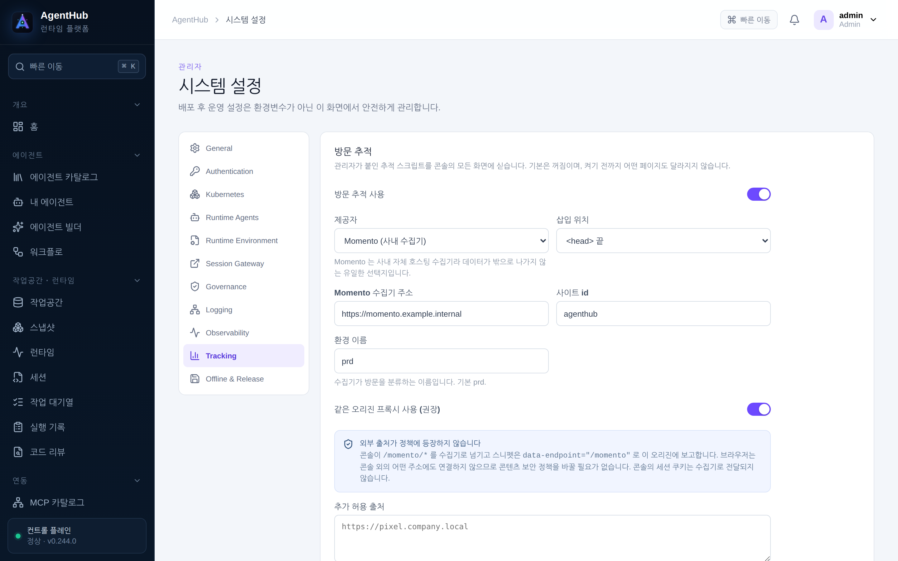
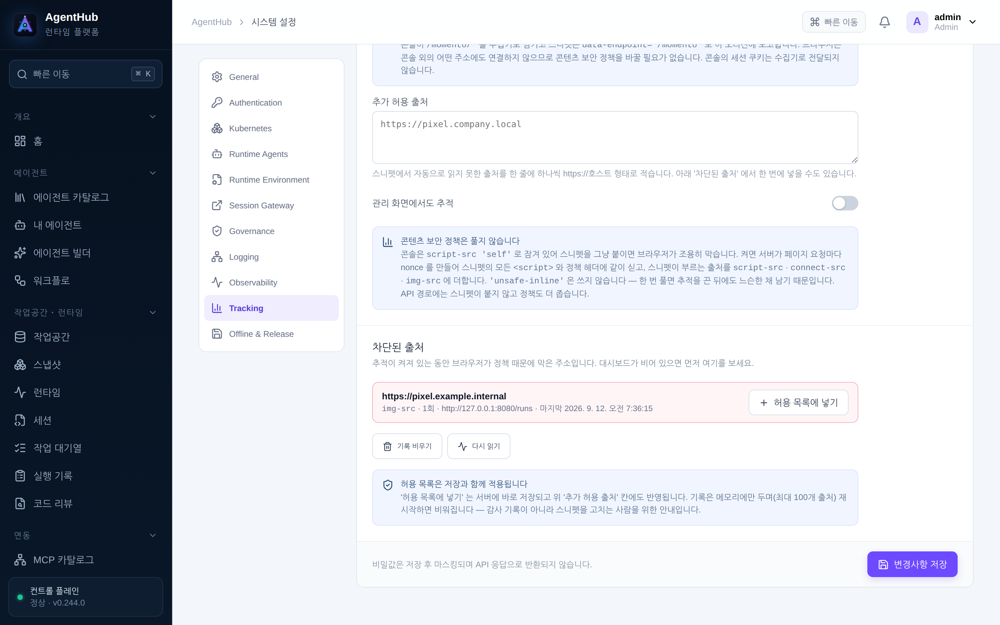

# AgentHub 관리자 가이드

이 문서는 AgentHub 를 **띄워 놓고 지키는 사람**을 위한 것입니다. 화면을 쓰는 방법은
[사용자 가이드](USER_GUIDE.md)에 있습니다. 화면 캡처는 모두 실제로 띄워 찍었고(v0.243.0,
방문 추적 두 장은 v0.244.0), 그 안의 이름·주소·값은 이 문서를 위해 만든 가짜입니다.

폐쇄망 설치의 전 과정(번들 내려받기, 서명·SBOM 검증, 매체 반입)은
[offline-install.md](offline-install.md) 에 있습니다. 여기서는 그 문서와 겹치지 않는
운영 관점만 다루고, 필요한 곳에서 링크합니다. 아키텍처는
[architecture.md](architecture.md) 를 보세요.

---

## 1. 구성 요소

| 구성 요소 | 무엇인가 | 없으면 |
| --- | --- | --- |
| `agenthub` (컨트롤 플레인) | REST API + 콘솔 정적 파일. 호스트 포트 **8080** | 아무것도 못 함 |
| `agenthub-worker` | 작업 대기열을 가져가 실행하는 워커 | 작업이 `대기 중` 에서 움직이지 않음 |
| `agenthub-operator` | 쿠버네티스에서 Runtime CR 을 Pod·Service·NetworkPolicy 로 만드는 컨트롤러 | 런타임이 `pending` 에서 멈춤 |
| PostgreSQL 17 | 유일한 상태 저장소. **컨테이너에 포함되지 않습니다** | 기동 실패 |
| Kubernetes 클러스터 | 에이전트 Pod·PVC·VolumeSnapshot 이 사는 곳 | 콘솔은 뜨지만 런타임을 못 만듦 |
| 모델 엔드포인트 | 관리자가 등록한 OpenAI 호환 게이트웨이 | 모델 호출이 필요한 모든 실행이 실패 |
| MCP 서버 | 에이전트가 쓰는 도구 | 도구 없이 글로만 하는 실행만 가능 |

주고받는 것: 콘솔·API 는 쿠키 세션 + `X-CSRF-Token` 으로 인증하고, 외부 도구는 API 키를
씁니다. 워커·컨트롤 플레인은 PostgreSQL 로만 상태를 주고받습니다. Pod 안의
`runtime-proxy` 는 `AGENTHUB_RUNTIME_PROXY_TOKEN` 으로 컨트롤 플레인에 자신을 밝히고,
모델 호출과 도구 호출을 그 자리에서 검사해 보고합니다.

---

## 2. 설치

전체 절차는 [offline-install.md](offline-install.md) 에 있습니다. 요약하면
**PostgreSQL 을 먼저 준비하고 → 릴리즈 번들을 검증해 반입하고 → `docker load` 후
compose 로 띄우고 → 첫 관리자 비밀번호를 바꾸는** 순서입니다.

```bash
export AGENTHUB_VERSION=v0.249.0

# 1) 반입한 아카이브를 적재한다 (helper 가 검증까지 함께 한다)
cd agenthub-offline
./agenthub-offline-linux-amd64 load \
  --manifest ../offline-bundle.json --input-dir . \
  --runtime opencode --runtime hermes

# 2) 예시 파일을 그대로 복사해 값만 채운다
install -m 0600 agenthub-offline.env.example .env
install -m 0644 agenthub-offline-compose.yaml compose.yaml

# 3) 띄우고, 뜬 것이 무엇인지 확인한다
docker compose config --quiet
docker compose up -d
docker compose exec agenthub /app/agenthub version --json
```

`.env` 에 채우는 값(전부 가짜 예시입니다):

```dotenv
AGENTHUB_POSTGRES_DSN=postgres://agenthub:<password>@postgres.example.internal:5432/agenthub?sslmode=verify-full
AGENTHUB_BOOTSTRAP_ADMIN=admin
AGENTHUB_BOOTSTRAP_ADMIN_PASSWORD=<12자 이상의 고유한 비밀번호>
AGENTHUB_ENCRYPTION_KEY=<base64 로 인코딩한 32바이트 키>
```

### 2.1 최초 관리자 계정

`AGENTHUB_BOOTSTRAP_ADMIN` / `_PASSWORD` 는 **관리자가 하나도 없을 때 한 번만** 읽혀
계정을 만듭니다. 이미 관리자가 있으면 값을 바꿔 다시 기동해도 아무 일도 일어나지
않습니다. 그 값은 배포 매니페스트에 적히고 매니페스트는 git 이력·CI 로그로 흘러가므로,
**설치 직후 프로필 메뉴 ▸ 비밀번호 바꾸기로 한 번 바꾸세요**(12자 이상, 바꾸면 다른
기기의 로그인이 모두 해제됩니다).

### 2.2 포트·볼륨·자원

| 항목 | 값 | 비고 |
| --- | --- | --- |
| 포털/API 포트 | `8080` (컨테이너) | 호스트 쪽 매핑만 바꾸세요 |
| PostgreSQL | 외부 운영 서비스 | 컨테이너·번들·SBOM 어디에도 포함되지 않습니다 |
| 컨트롤 플레인 파일시스템 | 읽기 전용 + `/tmp` tmpfs 64MB | `read_only: true`, `cap_drop: ALL` |
| 에이전트 작업공간 | 클러스터의 PVC | 사용자별 영속. 에이전트를 지워도 남습니다 |
| 스냅샷 | CSI VolumeSnapshot | 클러스터에 CRD 가 있어야 합니다 |

### 2.3 첫 로그인 뒤에 해야 할 것

1. **관리자 ▸ 모델 엔드포인트** 에 사내 모델 엔드포인트를 등록합니다(엔드포인트가 없으면 모델을
   부르는 모든 실행이 실패합니다).
2. **관리자 ▸ 런타임 이미지** 에서 쓸 런타임 유형의 이미지를 승인합니다. 승인된 이미지가
   없으면 `… 이미지가 승인돼 있지 않습니다. 승인된 이미지가 없으면 이 유형으로는 런타임이
   시작되지 않습니다.` 로 거절됩니다.
3. **관리자 ▸ 시스템 설정** 에서 Public URL·인증(Keycloak)·Kubernetes·Runtime 세션을 채웁니다.
4. **관리자 ▸ 정책 / 내용 검사** 로 무엇을 막을지 정합니다(§4).

---

## 3. 설정 — 환경 변수 전수표

컨테이너가 읽는 환경 변수는 아래가 전부입니다. 나머지 설정은 모두 콘솔의 관리자 화면에
있고 데이터베이스에 저장됩니다(비밀값은 봉투 암호화).

| 이름 | 기본값 | 필수 | 설명 |
| --- | --- | --- | --- |
| `AGENTHUB_POSTGRES_DSN` | — | **예** | 외부 PostgreSQL 접속 문자열. 없으면 기동이 실패합니다 |
| `AGENTHUB_BOOTSTRAP_ADMIN` | — | **예** | 최초 관리자 아이디 |
| `AGENTHUB_BOOTSTRAP_ADMIN_PASSWORD` | — | **예** | 최초 관리자 비밀번호. **12자 미만이면 기동 거절** |
| `AGENTHUB_ENCRYPTION_KEY` | — | **예** | 봉투 암호화 키. **정확히 32바이트**를 base64·16진수·평문 중 하나로 |
| `AGENTHUB_RUNTIME_PROXY_TOKEN` | — | 런타임 Pod 안에서 **예** | Pod 의 `runtime-proxy` 가 자신을 밝히는 토큰. 오퍼레이터가 Runtime 별 Secret 에서 주입하므로 사람이 직접 넣지 않습니다 |

컨트롤 플레인은 `:8080` 에 고정으로 listen 합니다(환경 변수로 바꾸지 않습니다 — 호스트
쪽 포트 매핑으로 조정하세요). `AGENTHUB_TEST_*` · `AGENTHUB_LIVE_*` 로 시작하는 변수는
저장소의 테스트 전용이며 제품 배포에서는 쓰지 않습니다.

**`AGENTHUB_ENCRYPTION_KEY` 는 기업 비밀 금고에 보관하세요.** 잃어버리거나 바꾸면
암호화된 설정과 개인 키링을 되살릴 수 없습니다.

---

## 4. 계정과 권한

계정은 **부트스트랩과 SSO 로그인 두 경로로만** 만들어집니다. 콘솔에 사용자를 손으로
추가하는 화면은 없습니다 — Keycloak 에서 사람을 추가하고, 그 사람이 한 번 로그인하면
목록에 나타납니다. 관리자는 그 뒤에 역할·상태·소속 부서·개인 할당량을 고칩니다.


| 역할(화면 표시) | 할 수 있는 일 |
| --- | --- |
| `user` · 사용자 | 자기 에이전트·작업공간·작업·워크플로·개인 시크릿·API 키. 남의 것은 보이지 않습니다 |
| `manager` · 팀장 | 사용자와 같고, 팀원의 검토 요청을 배정받을 수 있습니다(팀장 승인을 켠 배포) |
| `admin` · 관리자 | 위의 전부 + `/api/v1/admin/**` 전체(모델·MCP·정책·DLP·Quota·감사·실행 제어) |

역할·계정 상태(활성/비활성)·팀장은 목록의 관리 아이콘에서 바꿉니다. 사용자 프로필은
다음 SSO 로그인 때 Claim 기준으로 동기화되며 관리자 Role 은 보존됩니다.

**API 키로는 관리자 경로를 열 수 없습니다.** 개인 시크릿, API 키 관리, 개인 키 회전,
`/admin/**` 은 어떤 키로도 호출되지 않고 `api_key_forbidden` 으로 거절됩니다 — 스스로
새 키를 만들 수 있는 키는 권한 범위를 무의미하게 만들기 때문입니다.

### 4.1 정책 (Policy as Code)

규칙은 위에서부터 처음 맞는 것 하나가 답합니다. 규칙마다 **동작**(`task.create`,
`runtime.start`, `model.call`, `tool.call`, `flow.run`, `decision.export`,
`review.comment` 등), **대상**(역할·사람·에이전트·MCP 서버·도구·데이터 등급),
**효과**(`allow` · `deny` · `require_approval`), 그리고 **사유**를 적습니다.


- **사유는 필수입니다.** 거절당한 사람이 읽는 문장이 그 사유이고, 두 게시 경계
  (결정 기록 전송·리뷰 코멘트)와 Pod 게이트웨이의 거절문에 그대로 실립니다.
- **시뮬레이터**로 저장 전에 확인하세요. 동작·역할·에이전트·데이터 등급을 넣으면 어느
  규칙이 답하는지 보여 줍니다.
- 저장할 때 id 중복·빈 사유·모르는 동작을 거절합니다. 존재하지 않는 사람·에이전트·
  MCP 서버 이름은 경고로 알려 줍니다 — `이름이 틀렸다면 아무것도 차단되지 않습니다.`

### 4.2 내용 검사 (DLP)

데이터 등급별로 **기록만 · 가리고 전송 · 차단** 중 하나를 정합니다. 검사는 다섯 경계에서
같은 방식으로 돌고, 각각 이름을 달고 감사에 남습니다.


| 감사 동작 | 어디에서 |
| --- | --- |
| `dlp.model` | 모델 호출 |
| `dlp.tool` | Pod 안의 도구 호출 |
| `dlp.flow` | 흐름 실행 |
| `dlp.export` | 결정 기록을 외부 주소로 보낼 때 |
| `dlp.review` | 남의 PR 에 리뷰 코멘트를 남길 때 |

- 검사 결과는 `blocked` · `redacted` · `audited` · `unscanned` 로 남습니다.
  **`unscanned` 는 페이로드가 스캔 한도를 넘어 뒷부분을 못 봤다는 뜻**입니다 — 깨끗한
  결과와 구별하려고 따로 둡니다. 한도를 낮춘 배포에서 이 값이 늘면 한도를 다시 보세요.
- 감사에는 **값이 아니라 등급·건수·조치와 마스킹된 샘플만** 남습니다.
- `기록만` 은 차단을 시작하기 전에 자기 에이전트가 실제로 무엇을 다루는지 배우는
  단계입니다. 그 트레일을 읽고 `가리고 전송`·`차단` 으로 옮기세요.

### 4.3 할당량과 예산

플랫폼 기본 → 부서 → 개인 순으로 좁혀 적용합니다(0 은 상위 설정을 따른다는 뜻입니다).
Runtime 수·CPU·메모리·저장소와 함께 **토큰 예산과 금액**을 정할 수 있고, 작업 대기열과
워크플로에 **같은 합계**로 적용됩니다.


### 4.4 자동 로그인 (Silent SSO)

Keycloak 에 이미 로그인한 사람이 AgentHub 를 열면 **로그인 화면 없이** 바로 본 화면으로
들어가게 하는 설정입니다. **관리자 ▸ 시스템 설정 ▸ Authentication** 의 `자동 로그인
(Silent SSO)` 토글이며, **기본값은 꺼짐**입니다. 꺼진 배포에서는 아무것도 달라지지
않습니다.

| 설정 | 저장 키 | 기본값 | 뜻 |
| --- | --- | --- | --- |
| 자동 로그인 (Silent SSO) | `authentication.autoLogin` | 꺼짐 | 켜면 `GET /api/v1/auth/methods` 가 `autoLogin: true` 를 알리고, 콘솔이 첫 화면을 그리기 전에 Keycloak 에 한 번 조용히 묻습니다 |

**어떻게 동작하는가.** 세션이 없는 브라우저가 콘솔을 열면, 콘솔은 로그인 화면 대신
`GET /api/v1/auth/oidc/start?prompt=none&return_to=<원래 주소>` 로 **최상위 이동**합니다
(숨은 iframe 이 아닙니다 — 서드파티 쿠키가 막힌 브라우저에서도 동작하고, Keycloak 이
프레임을 허용하는지 신경 쓰지 않아도 됩니다). `prompt=none` 은 화면을 그리지 않고
"이미 있는 세션으로만 답하라" 고 요구하는 것이라 결과는 둘 중 하나입니다.

- Keycloak 세션이 있으면 인가 코드가 곧바로 돌아오고, 평소 로그인과 같은 절차(PKCE·state
  검증·ID Token 검증·사용자 동기화)를 거쳐 **원래 열려던 주소**로 돌아갑니다. 감사
  트레일의 `auth.oidc_login` 항목에 `silent: true` 가 남습니다.
- 세션이 없으면 `error=login_required` 로 돌아옵니다. 이것은 실패가 아니라 평범한
  대답이며, 콜백은 `/login?sso=none` 으로 보내 로그인 화면을 보여줍니다.

**무한 루프를 막는 세 겹.** 거절당했는데 다시 시도하면 브라우저가 Keycloak 과 AgentHub
사이를 끝없이 오가고 사용자는 화면이 깜빡이는 것만 봅니다. 그래서 콘솔은 (1) 한 탭
세션에 **한 번만** 시도하고(`sessionStorage`, 새 탭은 다시 시도하되 거절 뒤 새로고침은
하지 않음), (2) 사용자가 **스스로 로그아웃**했으면 다시 로그인할 때까지 시도하지 않으며,
(3) 콜백이 거절을 받으면 주소에 `?sso=none` 을 남겨 브라우저 저장소가 지워졌더라도
멈춥니다. 저장소를 읽지 못하는 사생활 보호 모드에서는 "이미 시도했다" 로 칩니다 —
막히는 쪽으로 실패합니다. 콜백·로그인·`/api/*`·`/mcp`·`/healthz`·`/readyz` 경로에서는
시도하지 않습니다.

**서버가 설정을 지킵니다.** 토글이 꺼져 있으면 누가 주소에 `?prompt=none` 을 붙여 열어도
서버가 조용히 평범한 로그인으로 바꿉니다 — 리다이렉트가 생기는 자리는 관리자 설정에만
묶입니다. `return_to` 는 `/` 로 시작하고 `//` 로 시작하지 않는 이 오리진의 경로만 받고,
그 밖의 값은 `/` 로 대체됩니다.

**확인하는 방법.** Keycloak 에 로그인한 브라우저에서 AgentHub 를 열면 로그인 화면 없이
본 화면이 떠야 하고, 로그인하지 않은 브라우저에서는 로그인 화면이 **깜빡이지 않고** 한
번에 떠야 하며(새로고침을 여러 번 해도 리다이렉트가 반복되지 않음), 로그아웃한 뒤 다시
열어도 자동으로 로그인되지 않아야 합니다. Keycloak 이 아닌 오류(클라이언트 설정 오류,
사용자의 취소)는 `/login?sso=error` 로 돌아와 로그인 화면에 안내문이 뜹니다.

### 4.5 MCP SSO (OAuth) — 키 없이 Keycloak 토큰으로 `/mcp` 열기

`/mcp` 는 개인 API 키로 들어옵니다. 이 설정은 **키 체계를 그대로 둔 채** Keycloak 액세스
토큰으로도 들어올 수 있게 합니다. MCP 인가 규격(2025-06-18 이후)은 OAuth 2.1 이라, MCP
클라이언트(Claude·Cursor 등)에 MCP URL 하나만 주면 클라이언트가 401 의 안내를 읽어 스스로
Keycloak 로그인 화면을 띄우고 토큰을 받아 옵니다. 이미 Keycloak 에 로그인한 사람은 화면을
거의 보지 않습니다. **관리자 ▸ 시스템 설정 ▸ MCP SSO** 카드이며, **기본값은 꺼짐**입니다.

**이 서버는 리소스 서버입니다.** 로그인은 Keycloak 이 하고, AgentHub 는 토큰을 받아 검사하는
쪽입니다. `/authorize`·`/token`·동적 클라이언트 등록은 만들지 않고, 토큰을 저장하거나 세션으로
바꾸지 않으며, 요청마다 검사합니다.

| 설정 | 저장 키 | 기본값 | 뜻 |
| --- | --- | --- | --- |
| Keycloak 토큰으로 MCP 열기 | `mcp.oauth.enabled` | 꺼짐 | 켜면 메타데이터가 서빙되고 `/mcp` 가 JWT 를 검사합니다 |
| 리소스 식별자 | `mcp.oauth.resource` | 빈 값 | 클라이언트가 실제로 접속하는 **공개 HTTPS 주소 + `/mcp`**. 비우면 General 의 Public URL 에 `/mcp` 를 붙입니다. 프록시 뒤의 내부 주소가 아닙니다 |
| 허용 대상 | `mcp.oauth.audience` | 빈 값 | 공백 구분. 토큰의 `aud` **또는 `azp`** 가 여기 있으면 통과. MCP 클라이언트 ID 를 적는 자리 |
| 범위 | `mcp.oauth.scopes` | `mcp:read` | 공백 구분. SSO 로 들어온 사람에게 주는 권한 범위의 **상한**. 값은 API 키와 같은 어휘(`api:read` `mcp:read` `runtime:manage` `agent:write`) |
| (재사용) Issuer URL | `authentication.issuerUrl` | 웹 로그인 설정 | 새로 만들지 않습니다. 토큰의 `iss` 와 서명 키(JWKS)는 이 Issuer 에서 읽습니다 |

켜지는 조건은 셋이 다 있을 때입니다 — Authentication 에서 Keycloak OIDC 가 켜져 있고 Issuer 가
있음, 리소스 식별자를 만들 수 있음(설정 또는 Public URL), 그리고 스위치. 저장 시점에 앞의
둘이 없으면 거절하고 이유를 보여 줍니다. 저장 뒤에 OIDC 를 끄면 스위치가 켜져 있어도 꺼진
것처럼 동작하고(메타데이터 404, 토큰 거절) 로그에 이유를 남깁니다 — 메타데이터가 있는데
토큰을 거부하면 클라이언트가 로그인 루프에 빠지기 때문입니다.

**무엇을 검사하는가.** 서명(Keycloak JWKS, RS/ES/PS 계열만 — `HS*`·`none` 거부) · `iss`(Issuer
URL 과 같음) · `exp`·`nbf` · `typ`(`ID` 면 거부 — ID 토큰은 로그인 증거지 API 자격이 아님) ·
`cnf`(있으면 거부 — 검증할 수 없는 소지자 증명이 묶인 토큰) · `sub`(비면 거부) · **대상**. 대상은
둘 중 하나가 맞아야 합니다: `aud` 에 리소스 식별자가 있거나(Audience 매퍼를 둔 정식 경로),
`aud` 또는 `azp` 가 허용 대상 목록에 있거나(매퍼 없이 쓰는 호환 경로). 실제 Keycloak 26 은
액세스 토큰의 `aud` 에 `account` 만 싣고 클라이언트 ID 는 `azp` 에 담으므로, MCP 클라이언트
ID 를 허용 대상에 적는 것이 가장 짧은 길입니다.

**계정은 만들지 않습니다.** 토큰의 `sub` 로 **이미 등록된 활성** 계정만 찾습니다 — 웹 로그인이
만든 연결과 같은 연결이며, username claim 으로 로컬 계정을 찾지는 않습니다. 없으면 "먼저
웹으로 한 번 로그인하세요" 로 거부합니다. 정지된 계정은 토큰이 유효해도 열리지 않고, 토큰의
role claim 으로 권한이 올라가지 않습니다. SSO 로 들어온 사람은 **그 사람이 키를 만들어
들어왔을 때와 같은 문**을 지나며 — 같은 범위 검사, 같은 도구 목록 — 범위는 토큰의 `scope`
가 아니라 위의 `mcp.oauth.scopes` 가 정합니다(토큰이 이 어휘를 싣고 오면 교집합). OAuth
토큰은 **`/mcp` 에서만** 받습니다. REST·관리 API 는 지금처럼 키와 세션만 받습니다.
어느 문으로 들어왔는지는 감사 트레일에 남습니다 — 성공한 도구 호출의 `mcp.tool_call` 항목
details 에 `auth`(`key` 또는 `oauth`)가 항상, SSO 토큰이면 그 토큰을 낸 클라이언트 ID(`azp`)가
`client` 로 실리므로, 어느 MCP 클라이언트가 무엇을 불렀는지 트레일에서 볼 수 있습니다.

**Keycloak 쪽 할 일.**

1. MCP 클라이언트용 **공개(public) 클라이언트** 를 만듭니다. Standard Flow 켬, PKCE `S256`,
   Direct Access Grants·Implicit·Service accounts 끔. 웹 로그인용 Confidential 클라이언트와
   **다른** 클라이언트입니다.
2. Valid Redirect URIs 에 쓰는 MCP 클라이언트의 콜백을 정확히 적습니다 — Claude 는
   `https://claude.ai/api/mcp/auth_callback`, 로컬 클라이언트는 `http://127.0.0.1:*/callback`
   류. `*` 하나로 다 여는 것은 금지입니다.
3. 정식 경로: 그 클라이언트(또는 전용 client scope)에 **Audience 매퍼** — Mapper type
   `Audience`, Included Custom Audience = 리소스 식별자(예 `https://agenthub.company.local/mcp`),
   Add to access token 켬, Add to ID token 끔. 호환 경로: 매퍼 없이 AgentHub 의 허용 대상에
   그 클라이언트 ID 를 적습니다.
4. 액세스 토큰 수명은 짧게(5분 안팎). AgentHub 는 introspection 을 하지 않으므로 Keycloak 에서
   로그아웃해도 이미 발급된 토큰은 만료까지 삽니다.

**확인하는 방법.**

```bash
# 켜져 있으면 맨 JSON(resource, authorization_servers, …), 꺼져 있으면 404
curl -s https://agenthub.company.local/.well-known/oauth-protected-resource/mcp
# /mcp 의 401 에 resource_metadata= 가 붙어 있어야 합니다
curl -si -X POST https://agenthub.company.local/mcp | grep -i www-authenticate
# Keycloak 에서 받은 액세스 토큰으로 tools/list
curl -s -X POST https://agenthub.company.local/mcp -H "Authorization: Bearer $TOKEN" \
  -H 'Content-Type: application/json' \
  -d '{"jsonrpc":"2.0","id":1,"method":"tools/list","params":{}}'
```

REST 401(`curl -si https://agenthub.company.local/api/v1/me`)에는 `WWW-Authenticate` 가 붙지
않아야 합니다. 실제 MCP 클라이언트에서는 MCP URL 만 넣고 연결해 보면 됩니다 — 로그인 창이
뜨고, 끝나면 도구 목록이 보입니다.

**거부 메시지별 조치.** 모두 `/mcp` 의 401 본문 `error.message` 에 옵니다.

| 메시지 | 뜻 | 조치 |
| --- | --- | --- |
| `API Key가 유효하지 않습니다.` (JWT 를 보냈는데) | MCP SSO 가 꺼져 있거나 OIDC 가 구성되지 않음 | 카드의 스위치와 Authentication 의 OIDC 를 확인 |
| `SSO 토큰이 이 서버를 위해 발급된 것이 아닙니다(aud=[…], azp="…")` | 대상 검사 실패. 메시지에 본 값과 고칠 값이 있음 | 허용 대상에 그 `azp` 를 더하거나 Keycloak 클라이언트에 Audience 매퍼로 리소스 식별자를 넣기 |
| `SSO 액세스 토큰이 유효하지 않습니다(서명·발급자·만료)` | 서명·`iss`·`exp` 검사 실패 | Issuer URL 이 토큰의 `iss` 와 정확히 같은지(realm 경로, 끝의 `/`), 토큰이 만료되지 않았는지 |
| `ID 토큰은 MCP 자격이 아닙니다` | 클라이언트가 액세스 토큰 대신 ID 토큰을 보냄 | 클라이언트 설정을 확인. 액세스 토큰을 보내야 함 |
| `소지자 증명(cnf)이 묶인 토큰은 받지 않습니다` | DPoP·mTLS 로 묶인 토큰 | 그 클라이언트에서 DPoP 를 끄거나 일반 Bearer 토큰을 쓰게 |
| `아직 유효하지 않습니다(nbf)` | 서버 시계가 Keycloak 보다 1분 넘게 늦음 | NTP 확인 |
| `이 SSO 계정은 AgentHub 에 등록되지 않았거나 비활성입니다` | `sub` 로 활성 계정을 찾지 못함 | 그 사람이 웹으로 한 번 로그인. 정지된 계정이면 사용자 관리에서 상태 확인 |
| `Keycloak 발급자 정보를 읽지 못해…` | AgentHub 가 Issuer 의 discovery 문서를 읽지 못함 | 컨트롤 플레인에서 Issuer URL 로의 네트워크·인증서 확인 |

---

## 5. 운영

### 5.1 상태 점검


| 확인할 것 | 어디서 |
| --- | --- |
| 전체 요약(실행·지출·사용자) | 콘솔 `관리자 ▸ 운영 현황`, `GET /api/v1/admin/overview?days=7` |
| 준비 상태(의존 구성 요소) | `POST /api/v1/admin/readiness` — 물어보는 동작이라 POST 입니다 |
| 쿠버네티스 연결 | 마지막 결과만 보려면 `GET /api/v1/admin/kubernetes/health`, 지금 다시 물어보려면 `POST /api/v1/admin/kubernetes/check` |
| 워커가 살아 있는지 | `GET /api/v1/admin/workers` |
| 모델 엔드포인트 응답 | `관리자 ▸ 모델 엔드포인트` 의 검사 버튼(마지막 결과와 시각이 행에 남습니다) |
| 빌드 버전 | `docker compose exec agenthub /app/agenthub version --json` |


### 5.2 로그와 감사


- 콘솔 `관리자 ▸ 로그 · 감사` 에서 동작·엔티티·결과로 거르고 CSV 로 내보냅니다
  (`GET /api/v1/admin/audit/export`). 기간이 넓어 잘리면 `… 기간을 나눠 다시 받으세요.`
  라고 알려 줍니다.
- 컨테이너 로그는 `docker compose logs -f agenthub` 로 봅니다. 한 줄이 JSON 이고
  `request_id` 가 콘솔의 요청과 이어집니다.
- 런타임 Pod 로그 조회는 전역 설정에서 끌 수 있습니다. 꺼 두면 사용자에게
  `관리자가 Runtime 로그 조회를 꺼 두었습니다. 시스템 설정 ▸ Logging에서 다시 켤 수 있습니다.`
  로 보입니다.

### 5.3 실행 제어


- **일시 정지**: 워커가 새 작업을 가져가지 않게 멈춥니다(사유를 적으면 화면에 표시됩니다).
- **재큐 · 회수**: 죽은 워커가 붙잡고 있던 작업을 회수하고, 실패한 작업을 다시 큐에 넣습니다.
- **보존 기간 · 정리**: 실행 기록과 이벤트를 며칠 두고 지울지 정하고 즉시 정리합니다.
- **이벤트 재전송**: 받는 쪽이 놓친 플랫폼 이벤트를 다시 보냅니다.

### 5.4 방문 추적 스크립트

`관리자 ▸ 시스템 설정 ▸ Tracking` 에서 방문 추적 도구를 콘솔 화면에 붙입니다. **기본은
꺼짐**이며, 새로 설치한 곳에서는 아무 페이지도 달라지지 않습니다. 설정은 데이터베이스에
저장되므로 재배포 없이 운영 중에 바꿀 수 있습니다.



| 설정 | 뜻 |
| --- | --- |
| 방문 추적 사용 | 켜야 붙습니다. 끄면 정책도 원래대로 좁아집니다 |
| 제공자 | `Momento` · GA4 · GTM · Matomo · 직접 붙여 넣기. **Momento 는 사내 자체 호스팅 수집기라 데이터가 밖으로 나가지 않는 유일한 선택지**입니다 |
| Momento 수집기 주소 · 사이트 id · 환경 이름 | 수집기가 준 값. 환경 이름 기본값은 `prd` |
| 같은 오리진 프록시 (권장) | 콘솔이 `/momento/*` 를 수집기로 넘기고 스니펫은 `data-endpoint="/momento"` 로 이 오리진에 보고합니다. 외부 출처가 정책에 아예 등장하지 않습니다. 콘솔의 세션 쿠키는 수집기로 전달되지 않습니다 |
| 추적 코드 (직접 붙여 넣기) | 도구가 준 `<script>` 블록 그대로. **8KB 를 넘으면 저장되지 않습니다** |
| 추가 허용 출처 | 스니펫에서 자동으로 읽지 못한 출처를 `https://호스트` 로 한 줄에 하나씩 |
| 관리 화면에서도 추적 | 기본 아니오. `/admin/*` 은 켰을 때만 붙습니다 |
| 삽입 위치 | `<head>` 끝 또는 `<body>` 끝 |

**콘텐츠 보안 정책(CSP)을 어떻게 다루는가.** 콘솔은 `default-src 'self'` 로 잠겨 있어
스니펫을 그냥 붙이면 브라우저가 조용히 막고, 관리자는 대시보드가 빈 이유를 알 수 없습니다.
그래서 켜면 서버가 다음을 합니다.

1. **페이지 요청마다 nonce 를 만들어** 스니펫의 모든 `<script>` 태그와 응답의
   `script-src` 에 같이 싣습니다. `'unsafe-inline'` 은 쓰지 않습니다 — 한 번 풀면 콘솔의
   모든 인라인 스크립트가 함께 허용되고 추적을 끈 뒤에도 느슨한 채 남기 때문입니다.
2. **스니펫이 부르는 출처를 정책에 더합니다.** 붙여 넣은 코드 안의 `http(s)` 주소를
   읽어 `script-src` · `connect-src` · `img-src` 에 넣고, 제공자를 고르면 그 제공자의
   주소를 넣습니다. Momento 를 프록시로 붙이면 더할 출처가 없습니다.
3. **추적이 켜져 있는 동안만** 정책에 `report-uri /api/v1/tracking/csp-report` 를 넣고,
   브라우저가 신고한 **막힌 출처와 지시어**를 기억합니다(메모리, 최대 100개 출처).
4. `/api/*` · `/mcp` · `/healthz` · `/readyz` 같은 비화면 경로에는 스니펫이 붙지 않고
   정책은 `default-src 'none'` 으로 오히려 더 좁습니다.

**대시보드가 비어 있으면** 같은 화면 아래 **차단된 출처** 를 보세요. 브라우저가 정책 때문에
막은 주소가 지시어·횟수·페이지와 함께 나오고, `허용 목록에 넣기` 한 번으로 추가 허용
출처에 들어갑니다(서버에 바로 저장되고 감사에 `settings.update` 로 남습니다).



| 확인할 것 | 어디서 |
| --- | --- |
| 막힌 출처 목록 | `GET /api/v1/admin/tracking/violations` |
| 목록 비우기(고친 뒤 다시 확인) | `DELETE /api/v1/admin/tracking/violations` |
| 출처 하나 허용 | `POST /api/v1/admin/tracking/violations/allow` `{"origin":"https://…"}` |
| 지금 나가는 정책 | `curl -sI https://포털주소/ \| grep -i content-security-policy` — 꺼져 있으면 `nonce-` 도 `report-uri` 도 없어야 합니다 |

### 5.5 백업과 복구

상태는 **전부 PostgreSQL 과 클러스터의 볼륨**에 있습니다. 컨테이너에는 보존할 상태가
없습니다(파일시스템이 읽기 전용입니다).

1. **데이터베이스** — 데이터베이스 플랫폼의 백업·복구 훈련을 그대로 씁니다.
2. **암호화 키** — `AGENTHUB_ENCRYPTION_KEY` 를 비밀 금고에. 이 키 없이 복구한
   데이터베이스는 암호화된 설정과 개인 키링을 열지 못합니다.
3. **작업공간** — `작업공간 ▸ 스냅샷`(CSI VolumeSnapshot). 스냅샷은 클러스터가 보관하며,
   플랫폼은 목록을 볼 때마다 클러스터에 실제로 있는지 다시 확인합니다.

### 5.6 업그레이드와 되돌리기

1. 새 릴리즈의 번들을 [offline-install.md](offline-install.md) 의 절차대로 검증해 반입하고
   `load` 합니다.
2. compose 의 이미지 태그를 새 버전으로 바꾸고 `docker compose up -d` 합니다. 스키마
   이행은 기동 시 자동으로 적용됩니다.
3. `agenthub version --json` 으로 실제로 올라간 버전을 확인합니다.
4. **되돌리기**: 이전 태그로 되돌려 다시 `up -d` 합니다. 데이터베이스를 되돌려야 하는
   경우에는 §5.5 의 백업에서 복구하세요 — 스키마가 앞으로 간 상태에서 옛 이미지를
   띄우기 전에 백업 복구 계획을 먼저 확인하세요.
5. **런타임 이미지는 별도입니다.** 에이전트는 만들어질 때의 이미지에 고정되므로,
   컨트롤 플레인을 올려도 돌던 에이전트가 조용히 옮겨가지 않습니다.
   `관리자 ▸ 런타임 이미지` 에서 새 버전을 승인해야 새 런타임이 그것을 씁니다.


### 5.7 메일 알림 (사내 SMTP 릴레이)

`관리자 ▸ 시스템 설정 ▸ Mail` 에서 사람이 기다리는 일을 사내 SMTP 릴레이로 보냅니다.
**기본은 꺼짐**이며, 새로 설치한 곳에서는 아무것도 나가지 않습니다. 콘솔의 종(알림)은 그대로
있고, 메일은 같은 알림 중 **오지 않으면 누군가 손해를 보거나 화면을 계속 새로고침하는 것**만
밖으로 내보내는 두 번째 길입니다. 설정 키 이름은 사내 표준(kanpic 과 같은 이름)을 그대로 씁니다.

| 키 | 기본값 | 뜻 |
| --- | --- | --- |
| `mail.enabled` | `false` | 꺼짐이 기본. 관리자가 켭니다 |
| `mail.smtp_host` | — | 사내 릴레이 주소. 폐쇄망에서는 사내 메일 서비스(`postra`)를 가리키면 알림이 밖으로 나가지 않습니다 |
| `mail.smtp_port` | `25` | 사내 릴레이는 대개 25. `465` 는 자동으로 `tls` 로 봅니다 |
| `mail.security` | `auto` | `auto` · `none` · `starttls` · `tls`. `auto` 는 서버가 STARTTLS 를 알리면 쓰고 아니면 평문 |
| `mail.skip_tls_verify` | `false` | 사내 인증서가 사설일 때만 |
| `mail.username` · `mail.password` | 빈 값 | 인증 없는 릴레이가 흔하므로 **선택 사항**. 비밀번호는 다른 비밀값처럼 `secret` 으로만 올라가고, 설정 API 는 `passwordConfigured: true` 만 돌려줍니다. 평문 연결에서는 PLAIN 인증을 하지 않으므로 인증이 필요한 릴레이는 `starttls`·`tls` 를 쓰세요 |
| `mail.from_address` · `mail.from_name` | — · `AgentHub` | 보내는 사람. 이름은 제목 앞의 `[AgentHub]` 이기도 합니다 |
| `mail.base_url` | — | 메일 속 링크가 가리킬 이 앱의 주소. 비우면 General 의 Public URL |
| `mail.timeout_seconds` | `10` | 연결·전송 시간 제한 |
| `mail.notify_approval` | `true` | 승인 요청(검토자에게)과 결정(요청자에게) |
| `mail.notify_handoff` | `true` | 런타임 인계 — 사람이 이어받아야 작업이 끝날 때, 소유자에게 |
| `mail.notify_task_failed` | `true` | 실패·재시도 소진·정책 차단·예산 초과로 멈춘 작업, 소유자에게 |
| `mail.notify_dependency` | `true` | 모델 엔드포인트·MCP 서버의 장애와 복구, 관리자에게 |

**어떻게 나가는가.** 이벤트는 `mail_deliveries` 에 한 줄을 남기고 바로 돌아옵니다 — 릴레이가
느리거나 죽어 있어도 승인·작업 처리는 평소처럼 끝납니다. 컨트롤 플레인(`agenthub`)이 15초마다
큐를 쓸어 보내며, 워커는 릴레이에 연결하지 않습니다. 같은 사람에게 같은 시각에 생긴 알림은
**한 통으로 묶고**, 자기가 한 일(내가 승인한 내 요청)은 자기에게 보내지 않으며, 완료된 작업은
메일하지 않습니다. 연결 실패는 1분 뒤 한 번 더 시도하고, 설정이 모자라면(호스트 없음 등)
시도하지 않고 그 이유를 기록에 남깁니다. 하루 안에 보내지 못한 것은 포기하고 그렇게 적습니다.

**시험 발송.** 같은 화면의 **시험 발송** 단추가 **저장한 설정**으로 실제 한 통을 보내고 결과를
그 자리에서 보여 줍니다(받는 사람을 비우면 내 계정 주소). 릴레이 설정은 한 번에 맞는 일이
드뭅니다 — 켠 뒤 반드시 한 번 보내 보세요. 시도는 감사에 `mail.test` 로, 발송 기록에 `test`
이벤트로 남습니다.

**발송 기록.** 화면 아래 **발송 기록**은 시도마다 한 줄입니다 — 언제, 어떤 이벤트로, 누구에게,
제목이 무엇이었고, 되었는지(보냄·실패·대기)와 실패 이유. **본문은 기록하지 않습니다** — 제목과
수신자면 "안 왔다" 는 문의에 답할 수 있고, 본문까지 남기면 기록 자체가 유출 경로가 됩니다.
기록은 알림과 같은 보관 기간(§5.3)으로 정리됩니다.

| 확인할 것 | 어디서 |
| --- | --- |
| 설정 읽기(비밀번호는 `passwordConfigured` 만) | `GET /api/v1/admin/settings` 의 `mail` |
| 설정 저장 | `PUT /api/v1/admin/settings/mail` `{"value":{"enabled":true,"smtp_host":"…",…},"secret":"<비밀번호>"}` |
| 시험 발송 | `POST /api/v1/admin/mail/test` `{"recipient":"me@company.local"}` |
| 발송 기록 | `GET /api/v1/admin/mail/deliveries?status=failed&limit=50` |
| 릴레이가 응답하는지 | 준비 상태(`POST /api/v1/admin/readiness`, §5.1)의 **메일 · SMTP 릴레이** 행 — 켜져 있을 때만 나타나고, 인사만 하고 보내지는 않습니다 |

---

## 6. 장애 대응

| 증상 | 확인할 곳 | 조치 |
| --- | --- | --- |
| 기동 직후 죽음, 로그에 `missing required environment variables: …` | `docker compose logs agenthub` | 이름이 찍힌 변수를 `.env` 에 채웁니다(§3) |
| `bootstrap administrator password must contain at least 12 characters` | 같은 로그 | 비밀번호를 12자 이상으로 |
| `AGENTHUB_ENCRYPTION_KEY: must be exactly 32 bytes …` | 같은 로그 | 32바이트 키를 base64·16진수·평문 중 하나로 |
| 작업이 `대기 중` 에서 안 움직임 | `GET /api/v1/admin/workers`, `관리자 ▸ 실행 제어` | 워커가 죽었거나 실행이 일시 정지 상태입니다. 정지를 풀고 회수·재큐 |
| 런타임이 `pending` 에서 멈춤 | `GET /api/v1/admin/kubernetes/health` | 오퍼레이터·클러스터 연결. `Kubernetes 연결 전까지 Runtime은 pending 상태로 유지됩니다.` |
| 작업은 끝나는데 런타임이 모두 `대기`, 실행 기록 타임라인에 `Kubernetes가 구성되지 않아 Runtime 없이 진행합니다.` | `관리자 ▸ 시스템 설정 ▸ Kubernetes`, `POST /api/v1/admin/kubernetes/check` | 클러스터 설정이 비어 있습니다. 워커는 모델과 글로만 실행을 이어가므로 파일 편집·명령이 필요한 작업은 전부 `런타임 인계` 로 멈춥니다. 클러스터를 연결하면 다음 작업부터 Pod 가 뜹니다 |
| 모든 작업이 `Runtime을 확보하지 못했습니다: Unauthorized` | 같은 곳 | 서비스 계정 토큰이 만료됐습니다. 새 토큰을 발급해 `관리자 ▸ 시스템 설정 ▸ Kubernetes` 에 저장 |
| 작업 실패에 `런타임 이미지를 가져오지 못했습니다 … ErrImagePull` | `관리자 ▸ 런타임 이미지`, Pod 상태 | 승인한 태그가 클러스터에 없습니다. 이미지를 적재하거나 승인 태그를 맞추세요 |
| 런타임 중지가 `409 runtime_busy` | 응답 본문에 무엇이 올라가 있는지 함께 옵니다 | 확인 후 진행하거나 `force` 를 실어 호출 |
| 모델 호출이 전부 실패 | `관리자 ▸ 모델 엔드포인트` 의 마지막 검사 결과 | 엔드포인트·자격·네트워크 정책 |
| 스냅샷 복원이 404 | 응답 문구 | 그 스냅샷이 없는 것과 클러스터가 스냅샷을 모르는 것을 구분해 답합니다. 후자면 CSI CRD 가 없는 클러스터입니다 |
| 값이 그대로 나간 것 같음 | `관리자 ▸ 로그 · 감사` 에서 `dlp.*` 동작 | 결과가 `unscanned` 면 한도를 넘겨 뒷부분을 못 본 것입니다(§4.2) |


---

## 7. 보안

### 7.1 설치 직후 바꿔야 하는 것

- **최초 관리자 비밀번호**(§2.1). 매니페스트에 적힌 값 그대로 두지 마세요.
- **`AGENTHUB_ENCRYPTION_KEY`** — 예시 값을 그대로 쓰지 말고, 금고에 넣으세요.
- **인증** — 로컬 계정만으로 운영하지 말고 Keycloak OIDC 를 연결하세요(PKCE·state 검증).
- **방문 추적을 붙이더라도 콘텐츠 보안 정책은 풀지 마세요.** 콘솔은 요청마다 nonce 를 붙여
  스니펫을 허용하므로 `'unsafe-inline'` 이 필요한 도구는 없습니다(§5.4).


### 7.2 외부에 열면 안 되는 것

| 열어도 되는 것 | 열면 안 되는 것 |
| --- | --- |
| 포털/API `8080` (리버스 프록시 뒤, TLS) | PostgreSQL — 컨트롤 플레인과 워커만 닿으면 됩니다 |
| Runtime Base Domain 의 wildcard(세션용) | 쿠버네티스 API 서버 |
| | 에이전트 Pod 로의 직접 접근 — 세션 게이트웨이의 1회용 티켓을 거치게 하세요 |

**리버스 프록시가 실제 접속 IP 를 넘겨주지 않으면 모든 사용자가 한 출처로 보입니다.**
로그인 시도 제한이 (출처, 계정) 조합으로 걸리므로, 프록시에 `X-Forwarded-For` 를
설정해 두세요.

### 7.3 에이전트 Pod 격리

Agent Runtime 은 **non-root, 권한 상승 차단, ServiceAccount Token 차단, RuntimeDefault
seccomp** 를 반드시 유지해야 합니다 — 보안 프로파일에서 이 항목들을 끄는 저장은
거절됩니다. 네트워크 프로파일로 나갈 수 있는 목적지를 좁히고, 클러스터가 NetworkPolicy 를
적용하지 않으면 화면이 그 사실을 알려 줍니다.

- `에이전트 실행`·`ACP 실행` 방식은 워커가 Pod 안에서 명령을 실행하므로 `pods/exec`
  권한이 필요합니다. 쓰지 않는 배포는 `deploy/kubernetes/rbac.yaml` 에서 그 규칙을 지워도
  되고, 그 경우 해당 방식의 작업은 권한 오류로 실패합니다.
- BrowserCode 런타임은 컨테이너 안에서 Chromium 자체 샌드박스를 켤 수 없어 끄고
  실행합니다. 격리는 Pod 가 담당하므로 신뢰할 수 없는 페이지를 여는 용도라면 그 런타임의
  네트워크 정책을 좁게 잡으세요.


플랫폼이 소유한 경로(`/etc/agenthub/**`)에 파일을 주입하려는 설정은 저장 시점에
거절됩니다. 사내 패키지 미러(`/etc/pip.conf`, `PIP_INDEX_URL` 등)를 넣는 것이 이 화면의
용도입니다.

### 7.4 도구와 외부 전송

- **MCP 서버마다 위험도와 승인 필요 여부**를 정합니다. 자격은 플랫폼 공용으로 두거나
  사용자별 키링에서 꺼내 쓰게 할 수 있습니다.
- **결정 기록 내보내기**(`관리자 ▸ 결정 기록`)와 **리뷰 코멘트**는 이 배포가 소유하지
  않은 기계에 텍스트를 남기는 두 경로입니다. 둘 다 내용 검사와 정책을 함께 통과해야
  나가고, 정책이 거절하면 `provenance.withheld` 로 남습니다.


