# AgentHub 관리자 가이드

이 문서는 AgentHub 를 **띄워 놓고 지키는 사람**을 위한 것입니다. 화면을 쓰는 방법은
[사용자 가이드](USER_GUIDE.md)에 있습니다. 화면 캡처는 모두 v0.242.0 을 실제로 띄워
찍었고, 그 안의 이름·주소·값은 이 문서를 위해 만든 가짜입니다.

폐쇄망 설치의 전 과정(번들 내려받기, 서명·SBOM 검증, 매체 반입)은
[offline-install.md](offline-install.md) 에 있습니다. 여기서는 그 문서와 겹치지 않는
운영 관점만 다루고, 필요한 곳에서 링크합니다. 아키텍처는
[architecture.md](architecture.md) 를 보세요.

---

## 1. 구성 요소

| 구성 요소 | 무엇인가 | 없으면 |
| --- | --- | --- |
| `agenthub` (컨트롤 플레인) | REST API + 콘솔 정적 파일. 호스트 포트 **8080** | 아무것도 못 함 |
| `agenthub-worker` | 작업 대기열을 가져가 실행하는 워커 | 작업이 `대기 중` 에서 움직이지 않음 |
| `agenthub-operator` | 쿠버네티스에서 Runtime CR 을 Pod·Service·NetworkPolicy 로 만드는 컨트롤러 | 런타임이 `pending` 에서 멈춤 |
| PostgreSQL 17 | 유일한 상태 저장소. **컨테이너에 포함되지 않습니다** | 기동 실패 |
| Kubernetes 클러스터 | 에이전트 Pod·PVC·VolumeSnapshot 이 사는 곳 | 콘솔은 뜨지만 런타임을 못 만듦 |
| 모델 엔드포인트 | 관리자가 등록한 OpenAI 호환 게이트웨이 | 모델 호출이 필요한 모든 실행이 실패 |
| MCP 서버 | 에이전트가 쓰는 도구 | 도구 없이 글로만 하는 실행만 가능 |

주고받는 것: 콘솔·API 는 쿠키 세션 + `X-CSRF-Token` 으로 인증하고, 외부 도구는 API 키를
씁니다. 워커·컨트롤 플레인은 PostgreSQL 로만 상태를 주고받습니다. Pod 안의
`runtime-proxy` 는 `AGENTHUB_RUNTIME_PROXY_TOKEN` 으로 컨트롤 플레인에 자신을 밝히고,
모델 호출과 도구 호출을 그 자리에서 검사해 보고합니다.

---

## 2. 설치

전체 절차는 [offline-install.md](offline-install.md) 에 있습니다. 요약하면
**PostgreSQL 을 먼저 준비하고 → 릴리즈 번들을 검증해 반입하고 → `docker load` 후
compose 로 띄우고 → 첫 관리자 비밀번호를 바꾸는** 순서입니다.

```bash
export AGENTHUB_VERSION=v0.242.0

# 1) 반입한 아카이브를 적재한다 (helper 가 검증까지 함께 한다)
cd agenthub-offline
./agenthub-offline-linux-amd64 load \
  --manifest ../offline-bundle.json --input-dir . \
  --runtime opencode --runtime hermes

# 2) 예시 파일을 그대로 복사해 값만 채운다
install -m 0600 agenthub-offline.env.example .env
install -m 0644 agenthub-offline-compose.yaml compose.yaml

# 3) 띄우고, 뜬 것이 무엇인지 확인한다
docker compose config --quiet
docker compose up -d
docker compose exec agenthub /app/agenthub version --json
```

`.env` 에 채우는 값(전부 가짜 예시입니다):

```dotenv
AGENTHUB_POSTGRES_DSN=postgres://agenthub:<password>@postgres.example.internal:5432/agenthub?sslmode=verify-full
AGENTHUB_BOOTSTRAP_ADMIN=admin
AGENTHUB_BOOTSTRAP_ADMIN_PASSWORD=<12자 이상의 고유한 비밀번호>
AGENTHUB_ENCRYPTION_KEY=<base64 로 인코딩한 32바이트 키>
```

### 2.1 최초 관리자 계정

`AGENTHUB_BOOTSTRAP_ADMIN` / `_PASSWORD` 는 **관리자가 하나도 없을 때 한 번만** 읽혀
계정을 만듭니다. 이미 관리자가 있으면 값을 바꿔 다시 기동해도 아무 일도 일어나지
않습니다. 그 값은 배포 매니페스트에 적히고 매니페스트는 git 이력·CI 로그로 흘러가므로,
**설치 직후 프로필 메뉴 ▸ 비밀번호 바꾸기로 한 번 바꾸세요**(12자 이상, 바꾸면 다른
기기의 로그인이 모두 해제됩니다).

### 2.2 포트·볼륨·자원

| 항목 | 값 | 비고 |
| --- | --- | --- |
| 포털/API 포트 | `8080` (컨테이너) | 호스트 쪽 매핑만 바꾸세요 |
| PostgreSQL | 외부 운영 서비스 | 컨테이너·번들·SBOM 어디에도 포함되지 않습니다 |
| 컨트롤 플레인 파일시스템 | 읽기 전용 + `/tmp` tmpfs 64MB | `read_only: true`, `cap_drop: ALL` |
| 에이전트 작업공간 | 클러스터의 PVC | 사용자별 영속. 에이전트를 지워도 남습니다 |
| 스냅샷 | CSI VolumeSnapshot | 클러스터에 CRD 가 있어야 합니다 |

### 2.3 첫 로그인 뒤에 해야 할 것

1. **관리자 ▸ 모델 엔드포인트** 에 사내 모델 엔드포인트를 등록합니다(엔드포인트가 없으면 모델을
   부르는 모든 실행이 실패합니다).
2. **관리자 ▸ 런타임 이미지** 에서 쓸 런타임 유형의 이미지를 승인합니다. 승인된 이미지가
   없으면 `… 이미지가 승인돼 있지 않습니다. 승인된 이미지가 없으면 이 유형으로는 런타임이
   시작되지 않습니다.` 로 거절됩니다.
3. **관리자 ▸ 시스템 설정** 에서 Public URL·인증(Keycloak)·Kubernetes·Runtime 세션을 채웁니다.
4. **관리자 ▸ 정책 / 내용 검사** 로 무엇을 막을지 정합니다(§4).

---

## 3. 설정 — 환경 변수 전수표

컨테이너가 읽는 환경 변수는 아래가 전부입니다. 나머지 설정은 모두 콘솔의 관리자 화면에
있고 데이터베이스에 저장됩니다(비밀값은 봉투 암호화).

| 이름 | 기본값 | 필수 | 설명 |
| --- | --- | --- | --- |
| `AGENTHUB_POSTGRES_DSN` | — | **예** | 외부 PostgreSQL 접속 문자열. 없으면 기동이 실패합니다 |
| `AGENTHUB_BOOTSTRAP_ADMIN` | — | **예** | 최초 관리자 아이디 |
| `AGENTHUB_BOOTSTRAP_ADMIN_PASSWORD` | — | **예** | 최초 관리자 비밀번호. **12자 미만이면 기동 거절** |
| `AGENTHUB_ENCRYPTION_KEY` | — | **예** | 봉투 암호화 키. **정확히 32바이트**를 base64·16진수·평문 중 하나로 |
| `AGENTHUB_RUNTIME_PROXY_TOKEN` | — | 런타임 Pod 안에서 **예** | Pod 의 `runtime-proxy` 가 자신을 밝히는 토큰. 오퍼레이터가 Runtime 별 Secret 에서 주입하므로 사람이 직접 넣지 않습니다 |

컨트롤 플레인은 `:8080` 에 고정으로 listen 합니다(환경 변수로 바꾸지 않습니다 — 호스트
쪽 포트 매핑으로 조정하세요). `AGENTHUB_TEST_*` · `AGENTHUB_LIVE_*` 로 시작하는 변수는
저장소의 테스트 전용이며 제품 배포에서는 쓰지 않습니다.

**`AGENTHUB_ENCRYPTION_KEY` 는 기업 비밀 금고에 보관하세요.** 잃어버리거나 바꾸면
암호화된 설정과 개인 키링을 되살릴 수 없습니다.

---

## 4. 계정과 권한

계정은 **부트스트랩과 SSO 로그인 두 경로로만** 만들어집니다. 콘솔에 사용자를 손으로
추가하는 화면은 없습니다 — Keycloak 에서 사람을 추가하고, 그 사람이 한 번 로그인하면
목록에 나타납니다. 관리자는 그 뒤에 역할·상태·소속 부서·개인 할당량을 고칩니다.

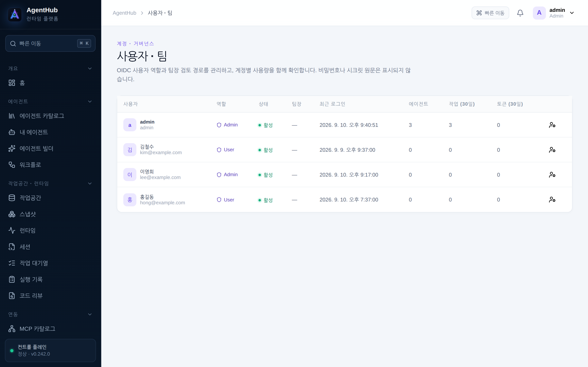

| 역할(화면 표시) | 할 수 있는 일 |
| --- | --- |
| `user` · 사용자 | 자기 에이전트·작업공간·작업·워크플로·개인 시크릿·API 키. 남의 것은 보이지 않습니다 |
| `manager` · 팀장 | 사용자와 같고, 팀원의 검토 요청을 배정받을 수 있습니다(팀장 승인을 켠 배포) |
| `admin` · 관리자 | 위의 전부 + `/api/v1/admin/**` 전체(모델·MCP·정책·DLP·Quota·감사·실행 제어) |

역할·계정 상태(활성/비활성)·팀장은 목록의 관리 아이콘에서 바꿉니다. 사용자 프로필은
다음 SSO 로그인 때 Claim 기준으로 동기화되며 관리자 Role 은 보존됩니다.

**API 키로는 관리자 경로를 열 수 없습니다.** 개인 시크릿, API 키 관리, 개인 키 회전,
`/admin/**` 은 어떤 키로도 호출되지 않고 `api_key_forbidden` 으로 거절됩니다 — 스스로
새 키를 만들 수 있는 키는 권한 범위를 무의미하게 만들기 때문입니다.

### 4.1 정책 (Policy as Code)

규칙은 위에서부터 처음 맞는 것 하나가 답합니다. 규칙마다 **동작**(`task.create`,
`runtime.start`, `model.call`, `tool.call`, `flow.run`, `decision.export`,
`review.comment` 등), **대상**(역할·사람·에이전트·MCP 서버·도구·데이터 등급),
**효과**(`allow` · `deny` · `require_approval`), 그리고 **사유**를 적습니다.

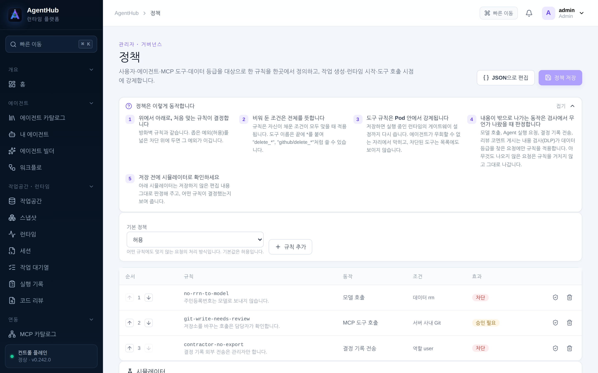

- **사유는 필수입니다.** 거절당한 사람이 읽는 문장이 그 사유이고, 두 게시 경계
  (결정 기록 전송·리뷰 코멘트)와 Pod 게이트웨이의 거절문에 그대로 실립니다.
- **시뮬레이터**로 저장 전에 확인하세요. 동작·역할·에이전트·데이터 등급을 넣으면 어느
  규칙이 답하는지 보여 줍니다.
- 저장할 때 id 중복·빈 사유·모르는 동작을 거절합니다. 존재하지 않는 사람·에이전트·
  MCP 서버 이름은 경고로 알려 줍니다 — `이름이 틀렸다면 아무것도 차단되지 않습니다.`

### 4.2 내용 검사 (DLP)

데이터 등급별로 **기록만 · 가리고 전송 · 차단** 중 하나를 정합니다. 검사는 다섯 경계에서
같은 방식으로 돌고, 각각 이름을 달고 감사에 남습니다.

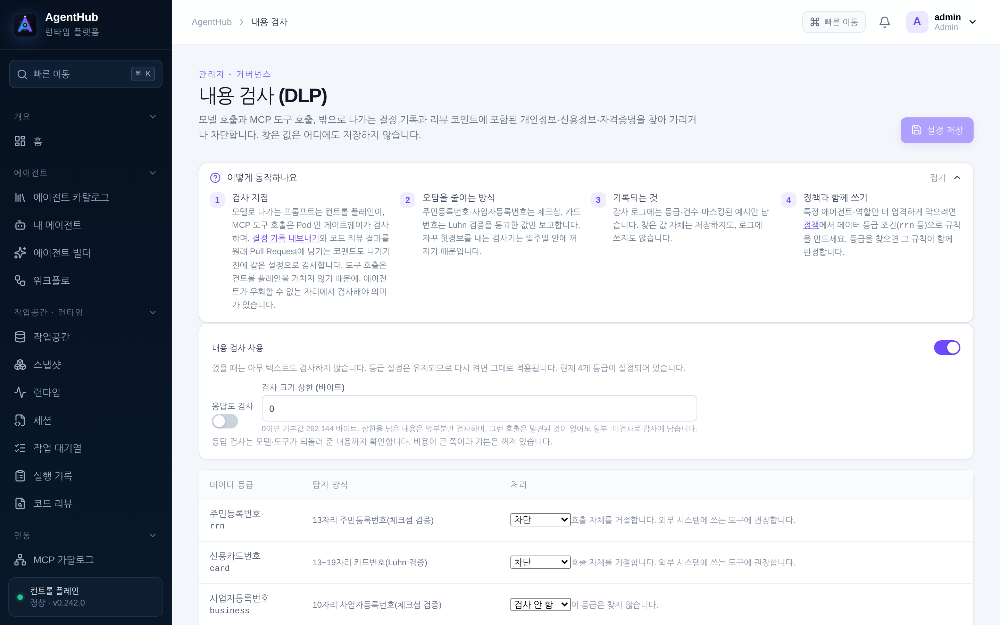

| 감사 동작 | 어디에서 |
| --- | --- |
| `dlp.model` | 모델 호출 |
| `dlp.tool` | Pod 안의 도구 호출 |
| `dlp.flow` | 흐름 실행 |
| `dlp.export` | 결정 기록을 외부 주소로 보낼 때 |
| `dlp.review` | 남의 PR 에 리뷰 코멘트를 남길 때 |

- 검사 결과는 `blocked` · `redacted` · `audited` · `unscanned` 로 남습니다.
  **`unscanned` 는 페이로드가 스캔 한도를 넘어 뒷부분을 못 봤다는 뜻**입니다 — 깨끗한
  결과와 구별하려고 따로 둡니다. 한도를 낮춘 배포에서 이 값이 늘면 한도를 다시 보세요.
- 감사에는 **값이 아니라 등급·건수·조치와 마스킹된 샘플만** 남습니다.
- `기록만` 은 차단을 시작하기 전에 자기 에이전트가 실제로 무엇을 다루는지 배우는
  단계입니다. 그 트레일을 읽고 `가리고 전송`·`차단` 으로 옮기세요.

### 4.3 할당량과 예산

플랫폼 기본 → 부서 → 개인 순으로 좁혀 적용합니다(0 은 상위 설정을 따른다는 뜻입니다).
Runtime 수·CPU·메모리·저장소와 함께 **토큰 예산과 금액**을 정할 수 있고, 작업 대기열과
워크플로에 **같은 합계**로 적용됩니다.

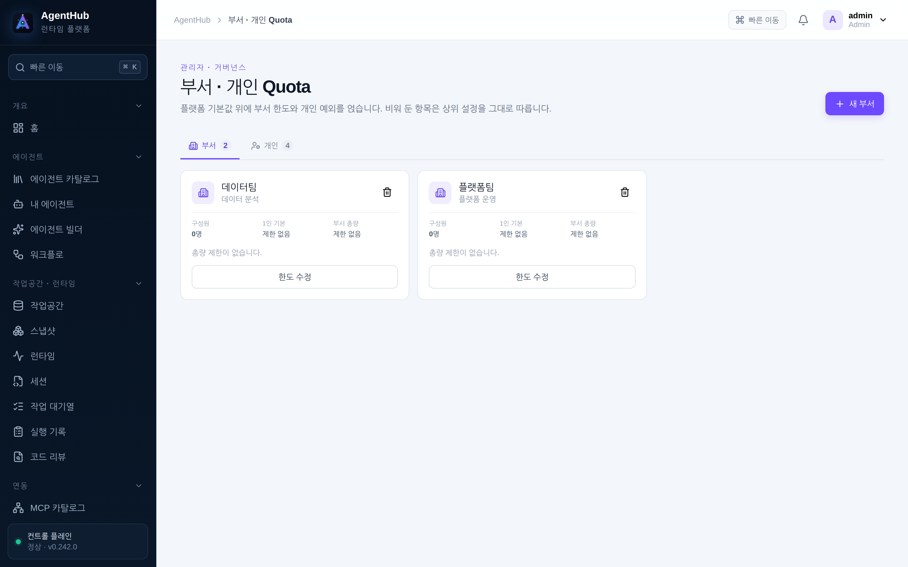

---

## 5. 운영

### 5.1 상태 점검

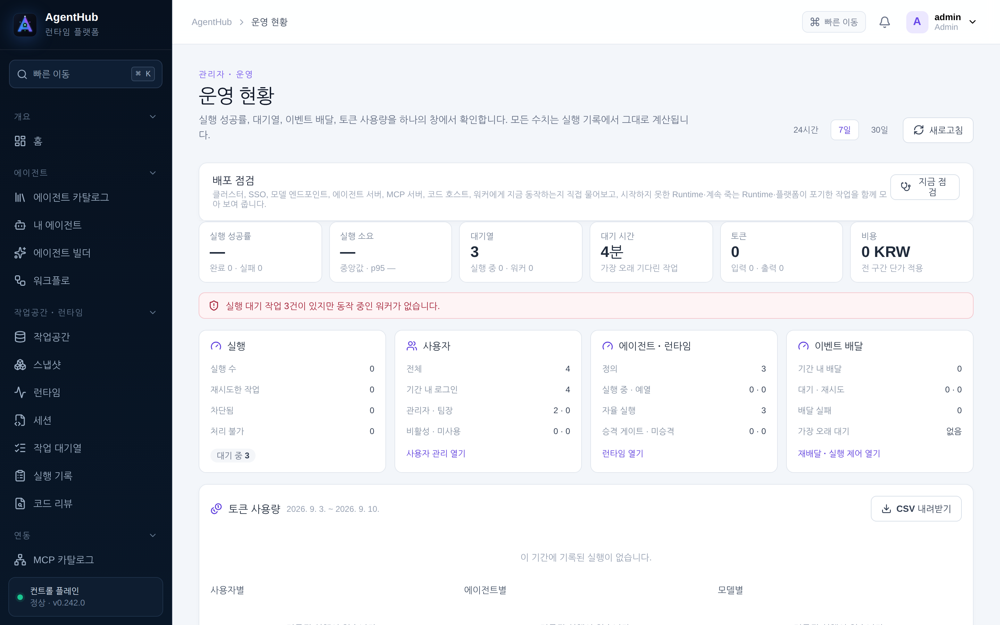

| 확인할 것 | 어디서 |
| --- | --- |
| 전체 요약(실행·지출·사용자) | 콘솔 `관리자 ▸ 운영 현황`, `GET /api/v1/admin/overview?days=7` |
| 준비 상태(의존 구성 요소) | `POST /api/v1/admin/readiness` — 물어보는 동작이라 POST 입니다 |
| 쿠버네티스 연결 | 마지막 결과만 보려면 `GET /api/v1/admin/kubernetes/health`, 지금 다시 물어보려면 `POST /api/v1/admin/kubernetes/check` |
| 워커가 살아 있는지 | `GET /api/v1/admin/workers` |
| 모델 엔드포인트 응답 | `관리자 ▸ 모델 엔드포인트` 의 검사 버튼(마지막 결과와 시각이 행에 남습니다) |
| 빌드 버전 | `docker compose exec agenthub /app/agenthub version --json` |

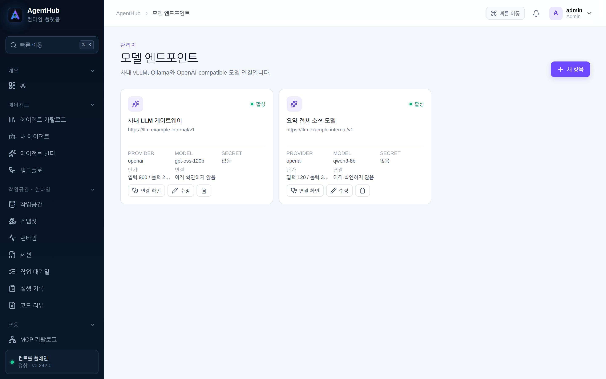

### 5.2 로그와 감사

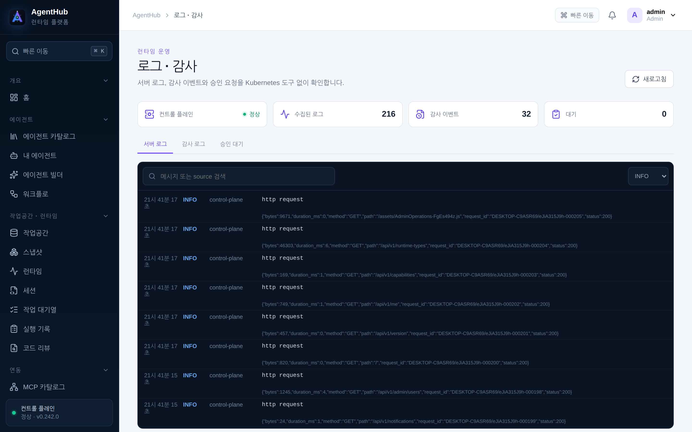

- 콘솔 `관리자 ▸ 로그 · 감사` 에서 동작·엔티티·결과로 거르고 CSV 로 내보냅니다
  (`GET /api/v1/admin/audit/export`). 기간이 넓어 잘리면 `… 기간을 나눠 다시 받으세요.`
  라고 알려 줍니다.
- 컨테이너 로그는 `docker compose logs -f agenthub` 로 봅니다. 한 줄이 JSON 이고
  `request_id` 가 콘솔의 요청과 이어집니다.
- 런타임 Pod 로그 조회는 전역 설정에서 끌 수 있습니다. 꺼 두면 사용자에게
  `관리자가 Runtime 로그 조회를 꺼 두었습니다. 시스템 설정 ▸ Logging에서 다시 켤 수 있습니다.`
  로 보입니다.

### 5.3 실행 제어

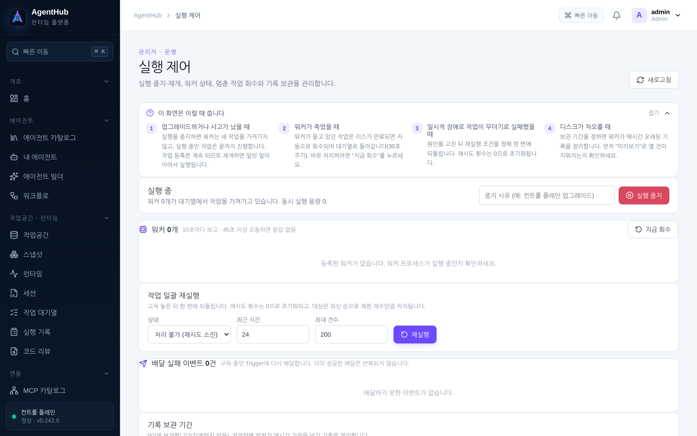

- **일시 정지**: 워커가 새 작업을 가져가지 않게 멈춥니다(사유를 적으면 화면에 표시됩니다).
- **재큐 · 회수**: 죽은 워커가 붙잡고 있던 작업을 회수하고, 실패한 작업을 다시 큐에 넣습니다.
- **보존 기간 · 정리**: 실행 기록과 이벤트를 며칠 두고 지울지 정하고 즉시 정리합니다.
- **이벤트 재전송**: 받는 쪽이 놓친 플랫폼 이벤트를 다시 보냅니다.

### 5.4 백업과 복구

상태는 **전부 PostgreSQL 과 클러스터의 볼륨**에 있습니다. 컨테이너에는 보존할 상태가
없습니다(파일시스템이 읽기 전용입니다).

1. **데이터베이스** — 데이터베이스 플랫폼의 백업·복구 훈련을 그대로 씁니다.
2. **암호화 키** — `AGENTHUB_ENCRYPTION_KEY` 를 비밀 금고에. 이 키 없이 복구한
   데이터베이스는 암호화된 설정과 개인 키링을 열지 못합니다.
3. **작업공간** — `작업공간 ▸ 스냅샷`(CSI VolumeSnapshot). 스냅샷은 클러스터가 보관하며,
   플랫폼은 목록을 볼 때마다 클러스터에 실제로 있는지 다시 확인합니다.

### 5.5 업그레이드와 되돌리기

1. 새 릴리즈의 번들을 [offline-install.md](offline-install.md) 의 절차대로 검증해 반입하고
   `load` 합니다.
2. compose 의 이미지 태그를 새 버전으로 바꾸고 `docker compose up -d` 합니다. 스키마
   이행은 기동 시 자동으로 적용됩니다.
3. `agenthub version --json` 으로 실제로 올라간 버전을 확인합니다.
4. **되돌리기**: 이전 태그로 되돌려 다시 `up -d` 합니다. 데이터베이스를 되돌려야 하는
   경우에는 §5.4 의 백업에서 복구하세요 — 스키마가 앞으로 간 상태에서 옛 이미지를
   띄우기 전에 백업 복구 계획을 먼저 확인하세요.
5. **런타임 이미지는 별도입니다.** 에이전트는 만들어질 때의 이미지에 고정되므로,
   컨트롤 플레인을 올려도 돌던 에이전트가 조용히 옮겨가지 않습니다.
   `관리자 ▸ 런타임 이미지` 에서 새 버전을 승인해야 새 런타임이 그것을 씁니다.

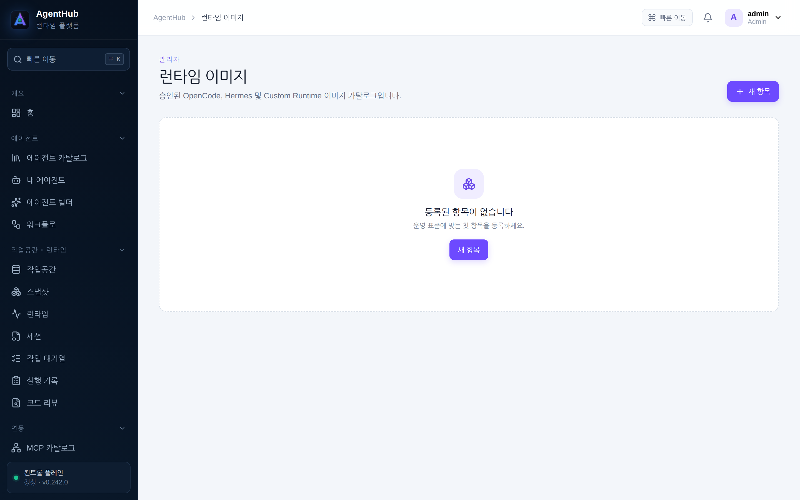

---

## 6. 장애 대응

| 증상 | 확인할 곳 | 조치 |
| --- | --- | --- |
| 기동 직후 죽음, 로그에 `missing required environment variables: …` | `docker compose logs agenthub` | 이름이 찍힌 변수를 `.env` 에 채웁니다(§3) |
| `bootstrap administrator password must contain at least 12 characters` | 같은 로그 | 비밀번호를 12자 이상으로 |
| `AGENTHUB_ENCRYPTION_KEY: must be exactly 32 bytes …` | 같은 로그 | 32바이트 키를 base64·16진수·평문 중 하나로 |
| 작업이 `대기 중` 에서 안 움직임 | `GET /api/v1/admin/workers`, `관리자 ▸ 실행 제어` | 워커가 죽었거나 실행이 일시 정지 상태입니다. 정지를 풀고 회수·재큐 |
| 런타임이 `pending` 에서 멈춤 | `GET /api/v1/admin/kubernetes/health` | 오퍼레이터·클러스터 연결. `Kubernetes 연결 전까지 Runtime은 pending 상태로 유지됩니다.` |
| 모든 작업이 `Runtime을 확보하지 못했습니다: Unauthorized` | 같은 곳 | 서비스 계정 토큰이 만료됐습니다. 새 토큰을 발급해 `관리자 ▸ 시스템 설정 ▸ Kubernetes` 에 저장 |
| 작업 실패에 `런타임 이미지를 가져오지 못했습니다 … ErrImagePull` | `관리자 ▸ 런타임 이미지`, Pod 상태 | 승인한 태그가 클러스터에 없습니다. 이미지를 적재하거나 승인 태그를 맞추세요 |
| 런타임 중지가 `409 runtime_busy` | 응답 본문에 무엇이 올라가 있는지 함께 옵니다 | 확인 후 진행하거나 `force` 를 실어 호출 |
| 모델 호출이 전부 실패 | `관리자 ▸ 모델 엔드포인트` 의 마지막 검사 결과 | 엔드포인트·자격·네트워크 정책 |
| 스냅샷 복원이 404 | 응답 문구 | 그 스냅샷이 없는 것과 클러스터가 스냅샷을 모르는 것을 구분해 답합니다. 후자면 CSI CRD 가 없는 클러스터입니다 |
| 값이 그대로 나간 것 같음 | `관리자 ▸ 로그 · 감사` 에서 `dlp.*` 동작 | 결과가 `unscanned` 면 한도를 넘겨 뒷부분을 못 본 것입니다(§4.2) |

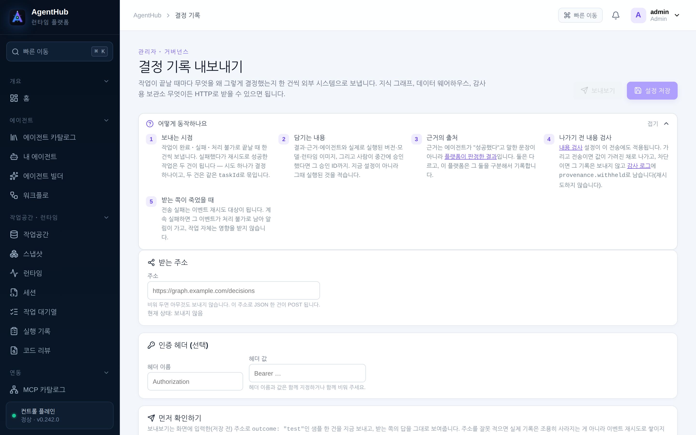

---

## 7. 보안

### 7.1 설치 직후 바꿔야 하는 것

- **최초 관리자 비밀번호**(§2.1). 매니페스트에 적힌 값 그대로 두지 마세요.
- **`AGENTHUB_ENCRYPTION_KEY`** — 예시 값을 그대로 쓰지 말고, 금고에 넣으세요.
- **인증** — 로컬 계정만으로 운영하지 말고 Keycloak OIDC 를 연결하세요(PKCE·state 검증).

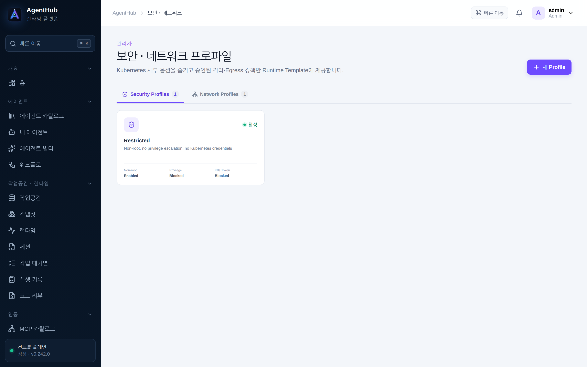

### 7.2 외부에 열면 안 되는 것

| 열어도 되는 것 | 열면 안 되는 것 |
| --- | --- |
| 포털/API `8080` (리버스 프록시 뒤, TLS) | PostgreSQL — 컨트롤 플레인과 워커만 닿으면 됩니다 |
| Runtime Base Domain 의 wildcard(세션용) | 쿠버네티스 API 서버 |
| | 에이전트 Pod 로의 직접 접근 — 세션 게이트웨이의 1회용 티켓을 거치게 하세요 |

**리버스 프록시가 실제 접속 IP 를 넘겨주지 않으면 모든 사용자가 한 출처로 보입니다.**
로그인 시도 제한이 (출처, 계정) 조합으로 걸리므로, 프록시에 `X-Forwarded-For` 를
설정해 두세요.

### 7.3 에이전트 Pod 격리

Agent Runtime 은 **non-root, 권한 상승 차단, ServiceAccount Token 차단, RuntimeDefault
seccomp** 를 반드시 유지해야 합니다 — 보안 프로파일에서 이 항목들을 끄는 저장은
거절됩니다. 네트워크 프로파일로 나갈 수 있는 목적지를 좁히고, 클러스터가 NetworkPolicy 를
적용하지 않으면 화면이 그 사실을 알려 줍니다.

- `에이전트 실행`·`ACP 실행` 방식은 워커가 Pod 안에서 명령을 실행하므로 `pods/exec`
  권한이 필요합니다. 쓰지 않는 배포는 `deploy/kubernetes/rbac.yaml` 에서 그 규칙을 지워도
  되고, 그 경우 해당 방식의 작업은 권한 오류로 실패합니다.
- BrowserCode 런타임은 컨테이너 안에서 Chromium 자체 샌드박스를 켤 수 없어 끄고
  실행합니다. 격리는 Pod 가 담당하므로 신뢰할 수 없는 페이지를 여는 용도라면 그 런타임의
  네트워크 정책을 좁게 잡으세요.

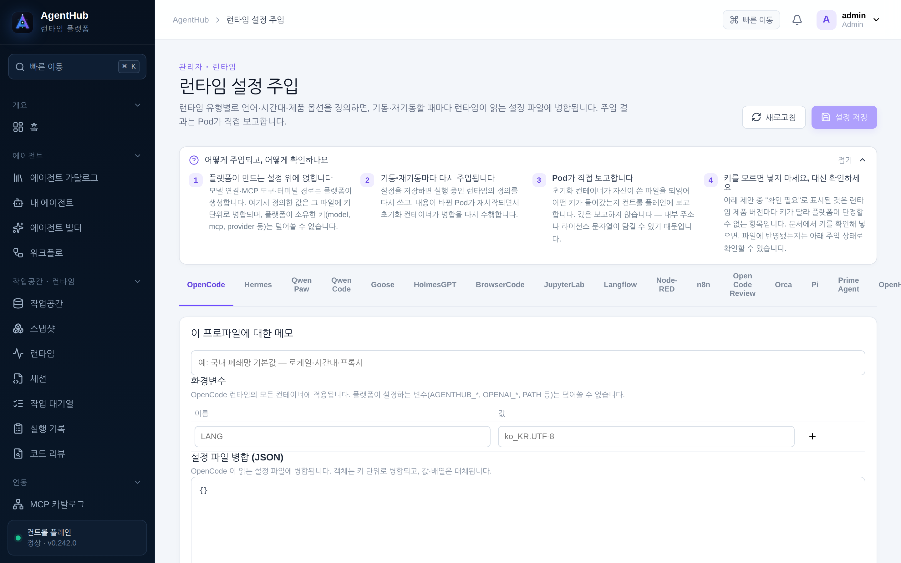

플랫폼이 소유한 경로(`/etc/agenthub/**`)에 파일을 주입하려는 설정은 저장 시점에
거절됩니다. 사내 패키지 미러(`/etc/pip.conf`, `PIP_INDEX_URL` 등)를 넣는 것이 이 화면의
용도입니다.

### 7.4 도구와 외부 전송

- **MCP 서버마다 위험도와 승인 필요 여부**를 정합니다. 자격은 플랫폼 공용으로 두거나
  사용자별 키링에서 꺼내 쓰게 할 수 있습니다.
- **결정 기록 내보내기**(`관리자 ▸ 결정 기록`)와 **리뷰 코멘트**는 이 배포가 소유하지
  않은 기계에 텍스트를 남기는 두 경로입니다. 둘 다 내용 검사와 정책을 함께 통과해야
  나가고, 정책이 거절하면 `provenance.withheld` 로 남습니다.

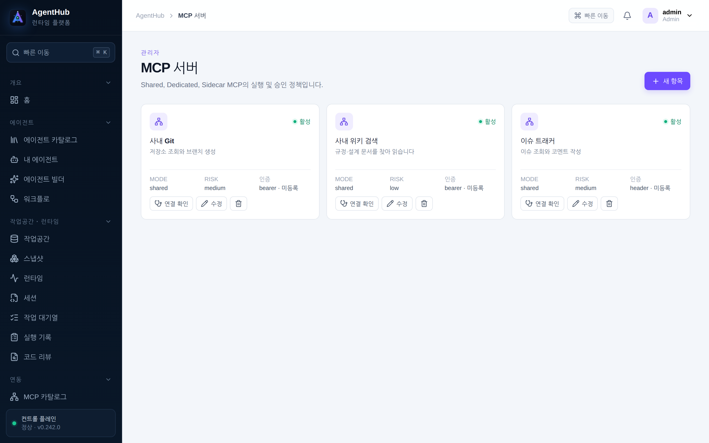
