# AgentHub 사용자 가이드

이 문서는 AgentHub 콘솔을 **쓰는 사람**을 위한 것입니다. 설치·운영·설정은
[관리자 가이드](ADMIN_GUIDE.md)에 있습니다. 화면 캡처는 모두 v0.242.0 을 실제로 띄워
찍었고, 그 안의 이름·주소·값은 이 문서를 위해 만든 가짜입니다.

---

## 1. 이 제품이 하는 일

AgentHub 는 **AI 에이전트를 사내 쿠버네티스 위에서 대신 일하게 하는 플랫폼**입니다.
에이전트마다 격리된 Pod 와 영속 작업공간(PVC)이 붙고, 그 안에서 코드를 고치거나
문서를 조사하거나 데이터를 정리합니다. 사람이 지켜보지 않아도 작업 대기열에 쌓인 일을
워커가 가져가 수행하고, 결과와 그 과정이 실행 기록으로 남습니다.

에이전트가 부르는 **모델과 도구(MCP)는 중앙에서 통제**됩니다. 어떤 모델 엔드포인트를
쓸 수 있는지, 어떤 MCP 서버를 붙일 수 있는지, 어떤 호출이 사람의 승인을 거쳐야 하는지는
관리자가 정하고, 에이전트는 그 안에서만 움직입니다. 폐쇄망을 전제로 설계되어 있어
모델·도구·이미지가 모두 사내에 있어도 동작합니다.

쓰는 사람은 셋입니다. **일을 맡기는 사람**은 에이전트를 만들고 작업 대기열에 일을
넣습니다. **직접 손대는 사람**은 세션으로 런타임의 편집기·터미널을 열어 에이전트가
쓰던 같은 작업공간에서 이어서 작업합니다. **확인하는 사람**은 승인 대기 목록에서
에이전트가 하려는 일을 보고 허락하거나 거절합니다.

---

## 2. 처음 5분

### 2.1 로그인

배포된 주소를 열면 로그인 화면이 나옵니다. 사내 계정(Keycloak OIDC SSO)을 쓰는 배포는
**SSO 로 로그인** 을, 로컬 계정을 쓰는 배포는 아이디와 비밀번호를 넣습니다.

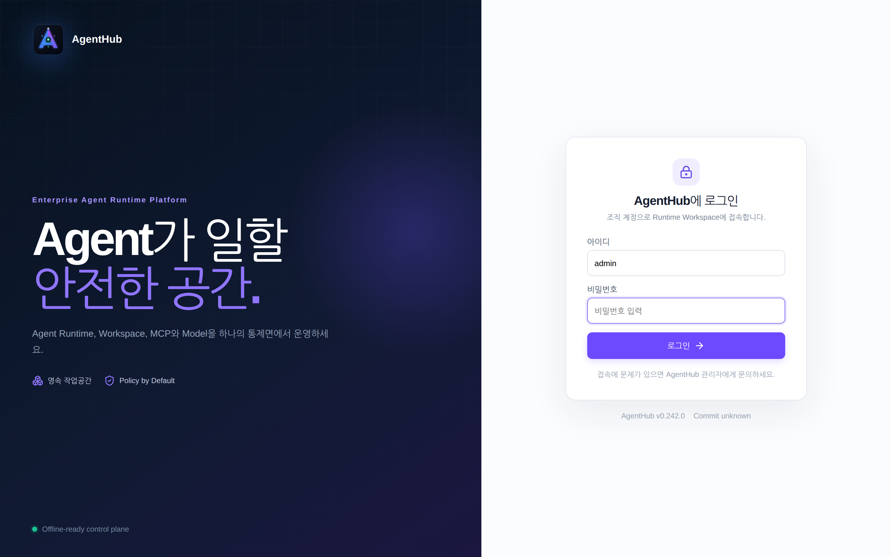

한 계정에 같은 곳에서 5회 틀리면 그 조합만 잠시 막히고 `몇 초 후에 다시 시도해 주세요`
가 함께 표시됩니다. 계정 자체가 잠기지는 않습니다.

### 2.2 첫 화면에서 무엇을 볼지

로그인하면 홈(대시보드)입니다. 내 에이전트 수, 지금 실행 중인 런타임, 작업공간,
그리고 **내 한도**(Runtime 수·CPU·메모리·저장소)가 한 화면에 있습니다.

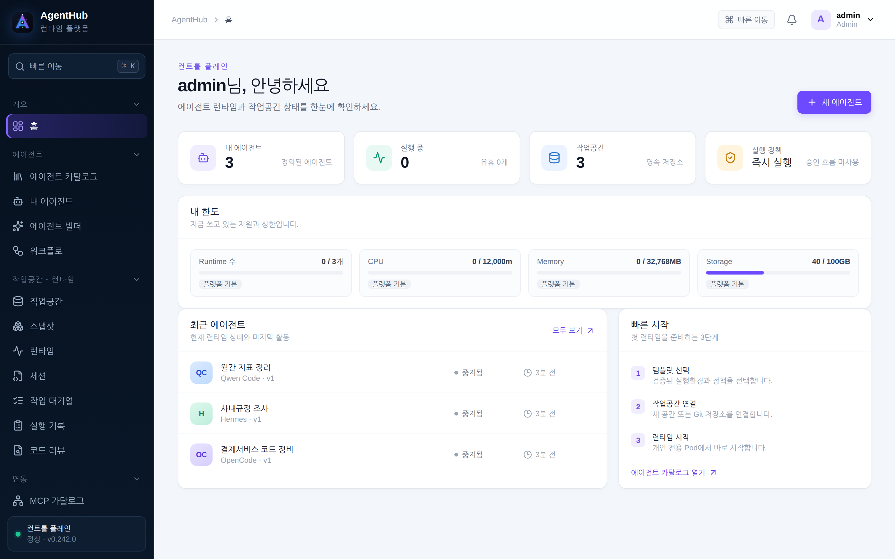

`⌘ K`(윈도우는 `Ctrl + K`) 또는 왼쪽 위 **빠른 이동** 으로 어느 화면에서나 메뉴와
에이전트를 검색해 이동할 수 있습니다.

### 2.3 에이전트 하나 만들어 일 맡기기

1. **에이전트 카탈로그** 에서 검증된 템플릿을 고릅니다. 무엇을 잘하는 런타임인지가
   카드에 적혀 있고, `런타임 유형 비교` 에서 각 런타임이 **하지 못하는 일**까지 볼 수 있습니다.
2. **에이전트 빌더** 에서 이름·지시문·런타임 프로파일·작업공간·모델·MCP 번들을 연결하고
   저장합니다.
3. **작업 대기열 ▸ 새 작업** 에서 그 에이전트에게 할 일을 적어 넣습니다.
4. 상태 칩(대기 중 · 실행 중 · 승인 대기 · 런타임 인계 · 완료 · 실패)으로 진행을 따라가고,
   **실행 기록** 에서 계획·단계별 수행 내역·산출물·토큰 사용량을 확인합니다.

---

## 3. 화면별 사용법

### 3.1 에이전트 카탈로그

사전 검증된 템플릿을 탐색하고 한 번에 내 에이전트로 만듭니다. 런타임 유형별 설명은
플랫폼이 직접 제공하므로 화면과 실제 배포가 어긋나지 않습니다.

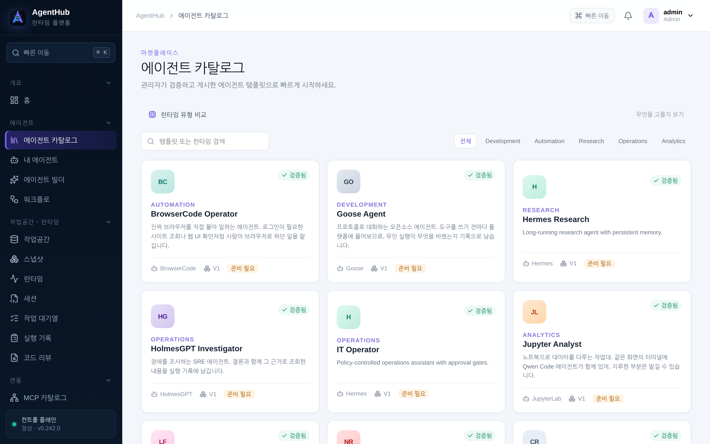

### 3.2 내 에이전트

등록한 에이전트의 런타임 상태를 보고, 시작·중지·설정 변경·버전 승격을 합니다.

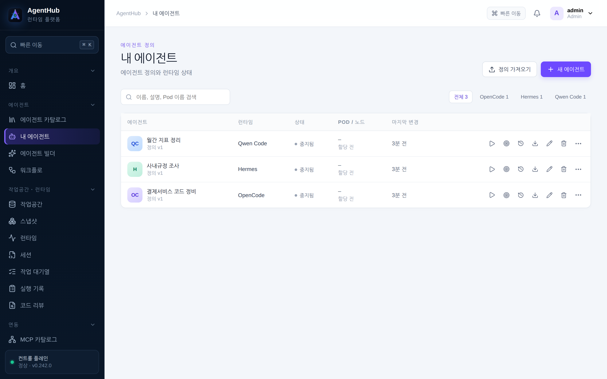

- **삭제는 정의만 지우지 않습니다.** 그 에이전트의 작업·실행 기록과 전사, 산출물, 기억,
  사전검증 결과, 정의 버전, Trigger 가 함께 사라집니다(되돌릴 수 없습니다). 작업공간
  볼륨은 보존됩니다.
- **진행 중인 작업이 있으면 삭제가 거절됩니다** — 몇 건이 걸려 있는지 알려 주므로,
  끝나기를 기다리거나 그 작업을 취소한 뒤 다시 지우면 됩니다.
- **정의 내보내기 / 가져오기(GitOps)**: 목록의 내려받기 아이콘으로 `<이름>.yaml` 을 받고,
  상단의 *정의 가져오기* 로 되돌립니다. 참조(프로파일·작업공간·모델·번들·런타임 이미지)는
  **이름**으로 오가므로, 가져오는 클러스터에 그 이름이 없으면
  `이 클러스터에 없는 항목을 참조합니다: …` 로 무엇이 없는지 알려 주고 멈춥니다.
- **실행 설정(목표)은 정의에 포함되지 않습니다.** 새로 만들어진 에이전트는 기본값
  (prose 실행기·기본 승인 모드·기본 한도)으로 시작하므로, 가져온 뒤 `목표` 화면을 확인하세요.

### 3.3 에이전트 빌더

템플릿을 바탕으로 이름·지시문·런타임 프로파일(CPU/메모리)·작업공간·모델 엔드포인트·
MCP 번들을 연결합니다.

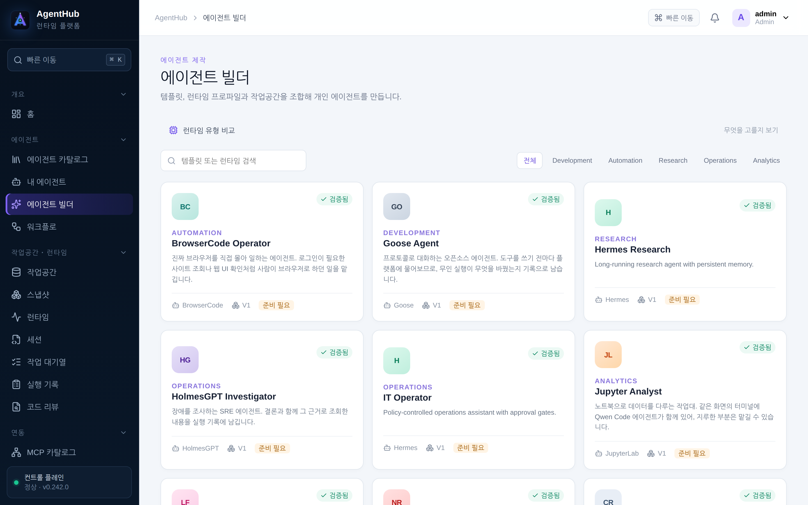

### 3.4 작업공간과 스냅샷

작업공간은 런타임 Pod 가 재시작되거나 삭제돼도 **파일이 남는 영속 볼륨**입니다.
빈 작업공간을 만들거나 사내 Git 저장소를 복제해 만듭니다.

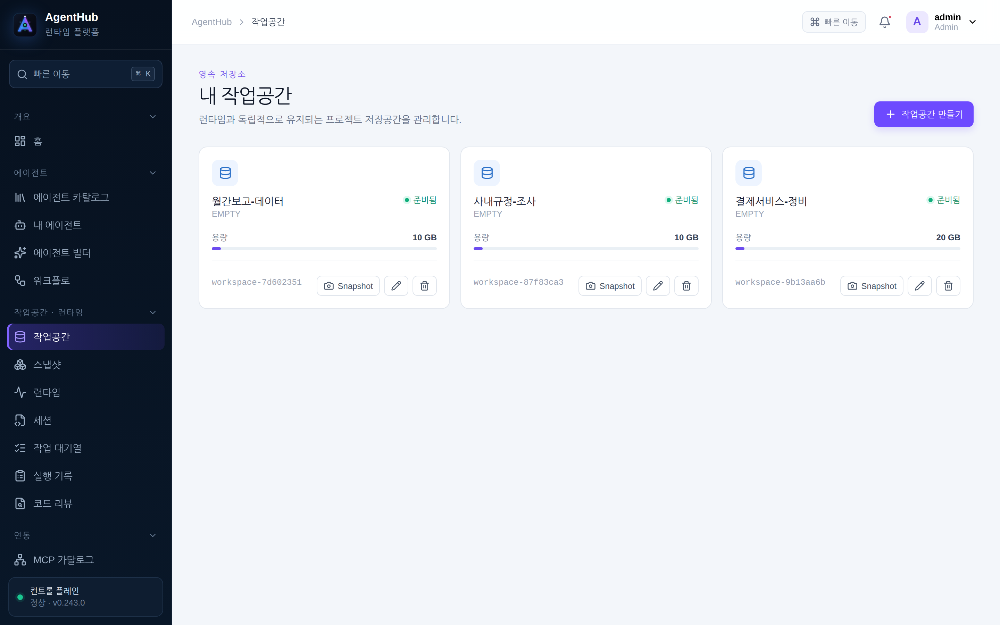

스냅샷은 특정 시점을 동결해 두었다가 새 작업공간으로 복원하는 CSI VolumeSnapshot 입니다.

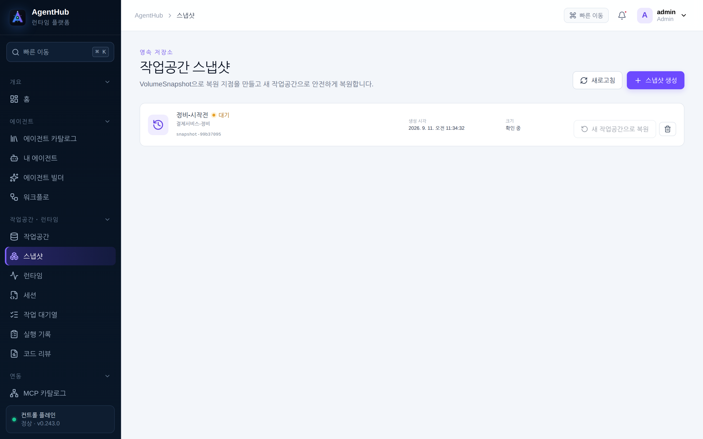

- **목록에 있다고 복원되는 것은 아닙니다.** 스냅샷 행은 *클러스터가 보관하는 것에 대한
  이 플랫폼의 기억* 이라, 목록을 볼 때마다 클러스터에 다시 확인하고 없어졌으면 **없음**
  으로 표시합니다.

### 3.5 런타임

에이전트 Pod 의 상태·자원 점유·헬스체크를 봅니다. 여기서 시작·중지·재시작합니다.

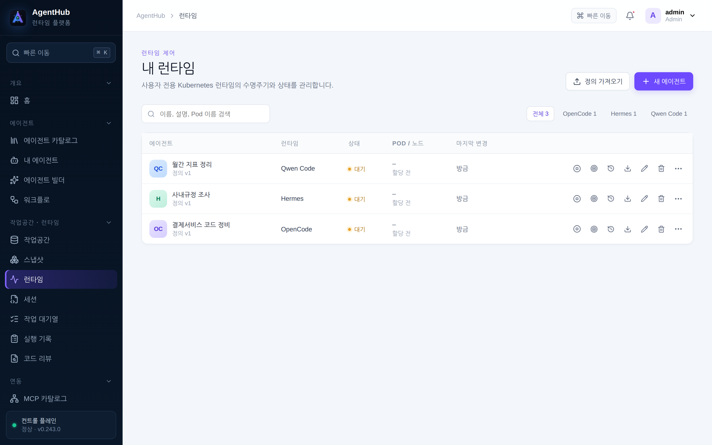

- 중지·재시작은 **그 위에 무엇이 올라가 있는지 먼저 알려 주고** 한 번 더 확인을 받습니다.
  확인하면 그대로 진행합니다 — 거부가 아니라 확인입니다.
- 확인하고 진행하면 감사 로그에 **무엇을 끝냈는지**가 함께 남습니다.

### 3.6 세션

런타임의 네이티브 편집기·터미널을 브라우저로 엽니다. 1회용 런치 티켓으로 열리므로
주소를 복사해 남에게 줄 수 없습니다.

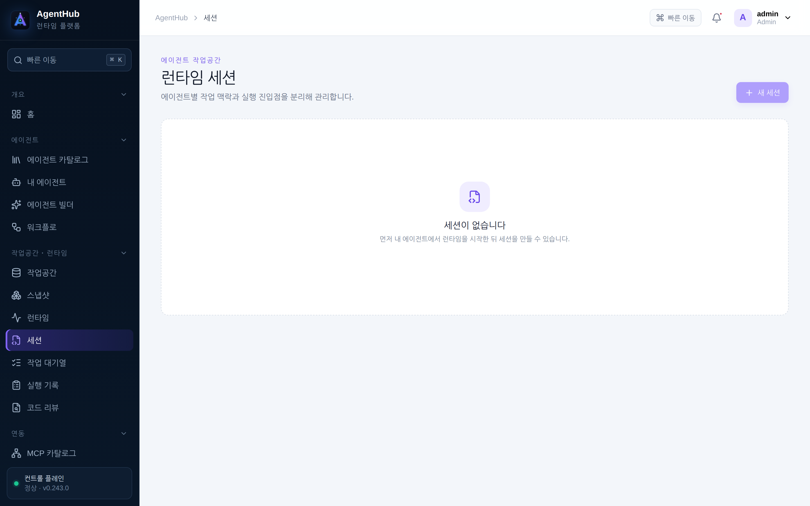

세션이 열리는 주소는 관리자 설정에 따라 두 가지입니다 — Runtime Base Domain 을 설정한
배포는 `https://<runtimeId>.agents.example.internal/`, 설정하지 않은 배포는
`https://<포털주소>/<runtimeId>/` 입니다. 티켓·만료·감사 로그는 어느 쪽이든 같습니다.

### 3.7 작업 대기열

에이전트에게 맡긴 일이 쌓이고, 워커가 가져가 수행한 결과가 남는 곳입니다.
화면 위쪽 **작업 대기열은 이렇게 사용합니다** 에 5단계가 요약돼 있습니다.

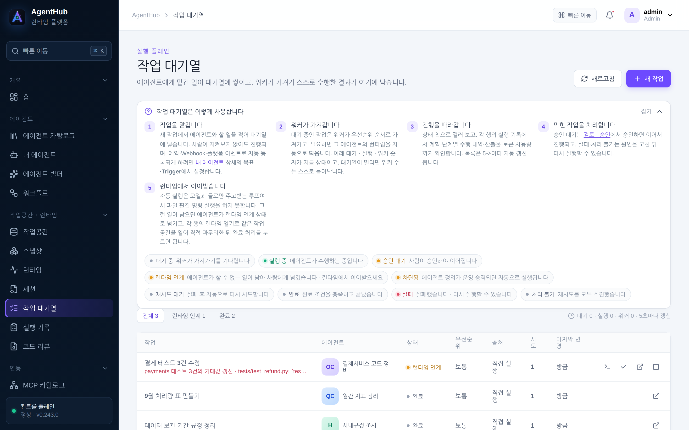

- 상태 칩으로 걸러 봅니다: **대기 중 · 실행 중 · 승인 대기 · 런타임 인계 · 차단됨 ·
  재시도 대기 · 완료 · 실패 · 처리 불가**.
- **런타임 인계** 는 실패가 아니라 대기입니다. 자동 실행은 모델과 글로만 주고받는
  루프여서 파일 편집·명령 실행을 하지 못하고, 그런 일이 남으면 에이전트가 사람에게
  넘깁니다. 행의 **런타임 열기**(터미널 아이콘)를 누르면 에이전트가 쓰던 **같은
  작업공간**이 열리고, 직접 마무리한 뒤 **완료 처리**(체크 아이콘)에서 기록을 남깁니다.
- **취소는 위임한 하위 작업까지 함께 멈춥니다.** 몇 건이 멈췄는지 화면에 알려 줍니다.

### 3.8 실행 기록

한 작업의 모든 시도를 한 화면에서 봅니다 — 계획, 단계별 수행 내역, 도구 호출과 승인,
산출물(캡처 이미지는 그림으로 바로 보입니다), 토큰 사용량과 금액.

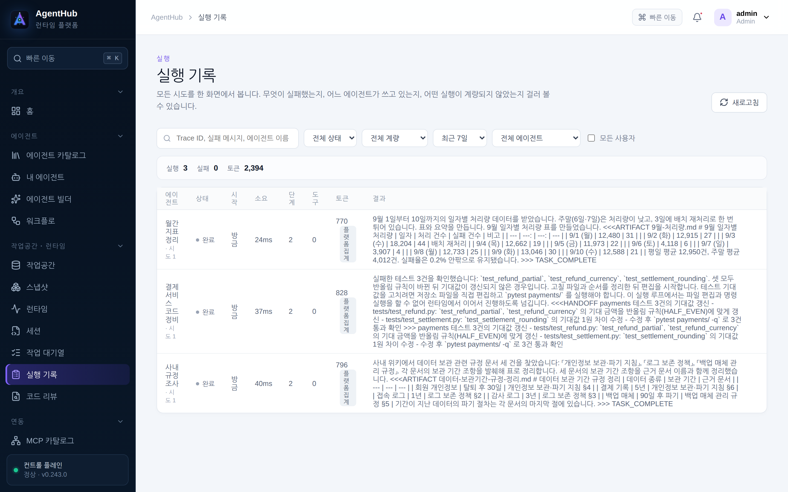

### 3.9 워크플로

여러 에이전트의 협업 그래프(DAG)를 만듭니다. 한 단계가 에이전트 하나이고, 각 단계는
그 에이전트의 지시문과 **연결된 모델**로 실행됩니다.

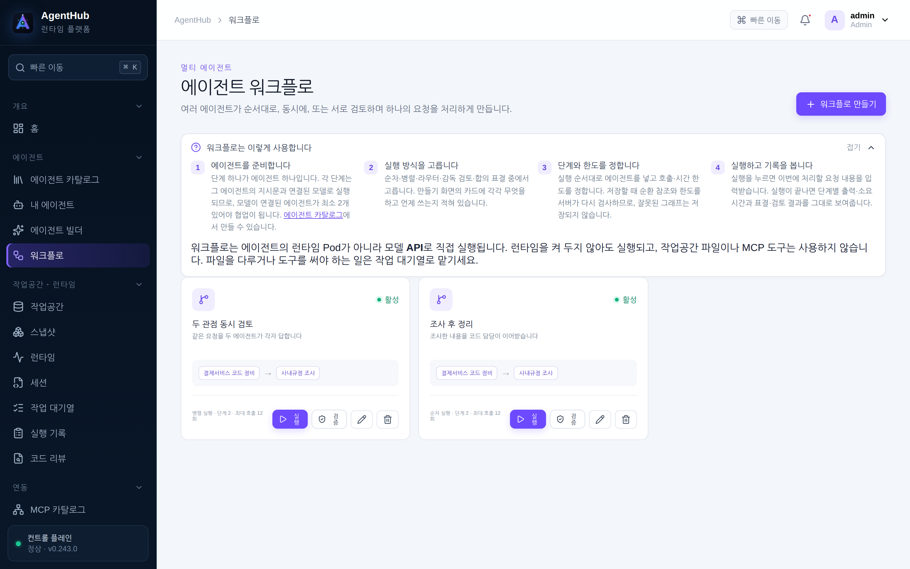

| 방식 | 하는 일 | 이럴 때 |
| --- | --- | --- |
| 순차 실행 (Sequential) | 앞 단계의 답을 다음 단계가 이어받고, 마지막 결과가 최종 답 | 조사 → 초안 → 검토처럼 순서가 있는 일 |
| 병렬 실행 (Parallel) | 모든 단계가 같은 요청을 받고 각자의 답을 모아 보여줌 | 같은 자료를 여러 관점에서 볼 때 |
| 라우터 (Router) | 첫 단계가 분기를 고르고, 선택되지 않은 분기는 건너뜀 | 요청 종류에 따라 담당이 갈릴 때 |
| 감독 검토 (Supervisor) | 마지막 단계가 결과를 검토해 승인하거나 보완 요청(최대 2회) | 품질을 한 번 걸러야 할 때 |
| 합의 표결 (Consensus) | 같은 질문을 각자 독립적으로 받고 `VOTE` 로 표결 | 판단이 갈리는 문제를 표로 정할 때 |

> 워크플로는 런타임 Pod 가 아니라 **각 에이전트에 연결된 모델 API 로 직접 실행**됩니다.
> 런타임을 켜 두지 않아도 되지만 작업공간 파일이나 MCP 도구는 쓰지 않습니다. 파일을
> 다루거나 도구가 필요한 일은 `작업 대기열` 로 맡기세요.

저장할 때 소유권·순환 참조·깊이·병렬 한도를 서버가 다시 검사하므로 잘못된 그래프는
저장되지 않습니다. 실행에는 작업 대기열과 **같은 규칙**(정책, 승격 게이트, 모델 연결,
소유자·부서 예산)이 적용됩니다.

### 3.10 MCP 카탈로그와 번들

에이전트가 쓸 수 있는 도구(MCP 서버)의 목록과, 역할별로 묶은 번들입니다. 번들을
에이전트에 붙이면 그 안의 서버가 한꺼번에 연결됩니다.

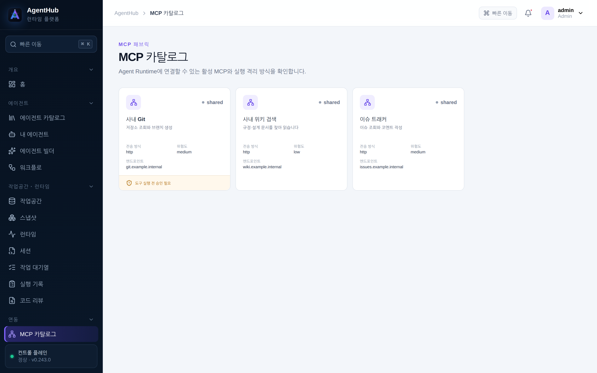

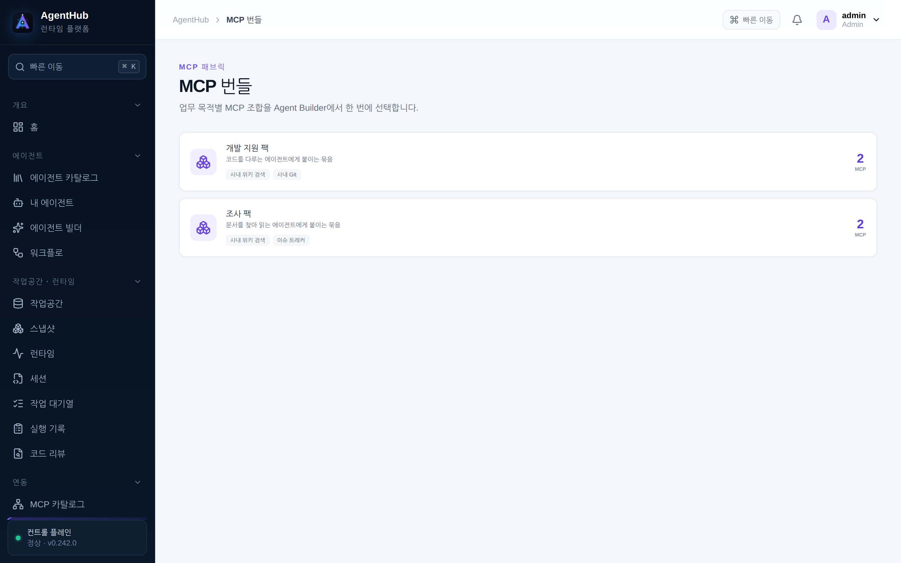

### 3.11 사전검증

에이전트가 운영에 나가기 전에 갖춰야 할 것(런타임·프로파일·작업공간·보안)을 검사 세트로
확인합니다. 결과는 **검사한 정의 버전에 붙습니다.**

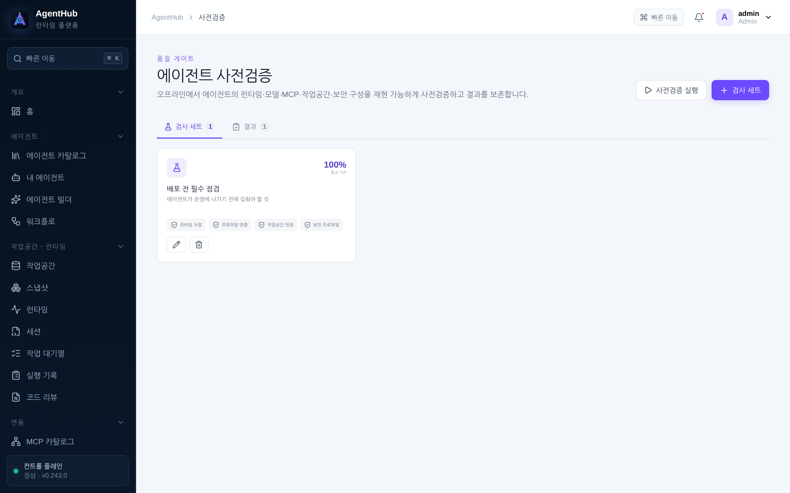

통과 결과가 없는 버전은 운영 승격이 거절됩니다. 관리자는 사유를 적어야 건너뛸 수 있고,
그 사유는 `검증 생략 승격: …` 으로 승격 기록과 감사 로그에 남습니다.

### 3.12 검토 · 승인

정책이나 목표 설정이 사람의 확인을 요구한 호출이 여기로 옵니다. 무엇을 하려는
호출인지 인자와 함께 보고 승인하거나 거절합니다.

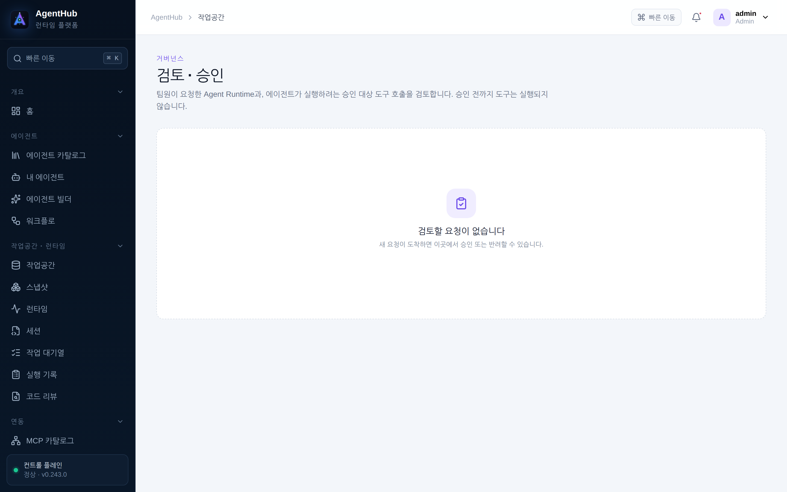

승인 요청에 실리는 인자는 내용 검사기를 **먼저 거친 뒤** 저장되므로, 관리자가 막아 둔
값이 승인 화면에 그대로 복사되지 않습니다. 목표의 최대 실행 시간 안에 아무도 답하지
않으면 거절로 처리됩니다.

### 3.13 시크릿 · API 키

개인 시크릿 보관함은 사용자별 봉투 암호화로 저장되고, 에이전트 정의에는 평문 대신
참조 ID 만 들어갑니다. API 키는 외부 도구(IDE 의 에이전트 등)가 이 플랫폼을 쓰게 할 때
발급합니다.

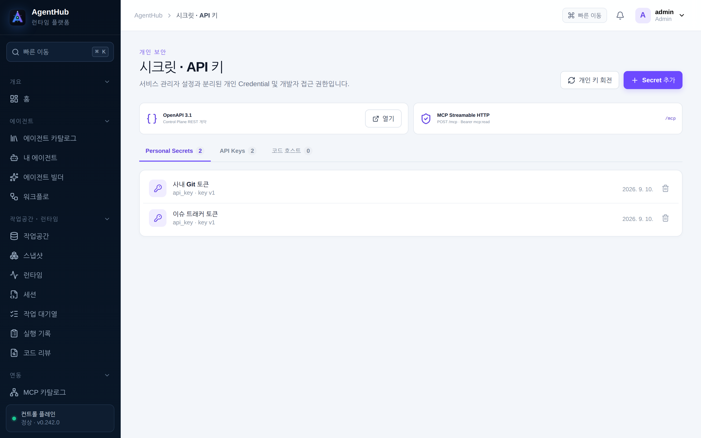

| 권한 범위 | 무엇이 열리나 |
| --- | --- |
| `api:read` | 모든 읽기. 새 키의 기본값 |
| `agent:write` | 에이전트·워크플로·작업·작업공간 생성과 수정 (조회 포함) |
| `runtime:manage` | 런타임 시작·중지·재시작과 세션 열기 (조회 포함) |
| `mcp:read` | MCP 엔드포인트(`/mcp`) 전용. REST 경로는 열리지 않음 |

개인 시크릿, API 키 관리, 개인 키 회전, `/admin/**` 은 **어떤 키로도 호출할 수
없습니다**(`api_key_forbidden`). 발급된 키 값은 **그 자리에서 한 번만** 보여 줍니다.

**AgentHub 자신도 MCP 서버입니다.** `mcp:read` 를 가진 키로 외부 에이전트가 접속하면
`agenthub_list_agents` · `agenthub_list_workspaces` · `agenthub_task_status` 를 쓸 수
있고, `agent:write` 가 있으면 `agenthub_queue_task` 로 일을 맡길 수 있습니다. 이렇게
들어온 작업에도 콘솔과 **똑같은 규칙**이 적용되고, 목록에서 출처가 **외부 에이전트 (MCP)**
로 표시됩니다.

---

## 4. 자주 하는 작업

### 4.1 에이전트에게 반복 작업을 맡기고 결과만 받아 보기

1. `내 에이전트 ▸ 상세 ▸ 목표` 에서 성공/실패 조건, 최대 단계 수, 완료 판정 방식
   (에이전트 선언 · 규칙 · 심판 모델 · 복합)을 정합니다.
2. 같은 화면의 **Trigger** 에서 예약·Webhook·플랫폼 이벤트로 작업이 자동 등록되게 합니다.
3. 결과는 `작업 대기열` 과 `실행 기록` 에서 확인합니다. 알림은 오른쪽 위 종 아이콘에 옵니다.

### 4.2 에이전트가 하다 만 일을 이어받기

`작업 대기열` 에서 **런타임 인계** 상태의 행을 찾아 **런타임 열기**(터미널 아이콘)를
누릅니다. 런타임이 꺼져 있으면 자동으로 시작합니다. 같은 작업공간에서 직접 마무리한 뒤
**완료 처리**(체크 아이콘)에서 완료/취소와 기록을 남기면, 그 기록이 작업의 마지막
설명이 되고 감사 로그(`task.resolve`)에도 남습니다.

### 4.3 개발 클러스터의 에이전트를 운영으로 옮기기

`내 에이전트` 에서 정의를 YAML 로 내보내고, 운영 콘솔에서 *정의 가져오기* 로 올립니다.
같은 이름이면 갱신, 다른 이름이면 새 에이전트입니다. 가져온 뒤 `목표` 화면에서 실행기·
승인 모드·한도를 다시 확인하세요 — 그 값들은 YAML 에 담기지 않습니다.

### 4.4 잘못 고친 정의를 되돌리기

`내 에이전트` 의 **버전 · 운영 승격**(시계 아이콘)에서 과거 버전을 골라 *이 정의로 복원*
합니다. 복원은 카운터를 되감지 않고 **새 버전**으로 다시 쓰므로, v4 로 남은 실행 기록은
계속 v4 를 가리킵니다. 실행 중인 Pod 는 복원 직후가 아니라 **재시작한 뒤** 새 정의로 뜹니다.

### 4.5 외부 도구(IDE)에서 이 플랫폼 쓰기

`시크릿 · API 키` 에서 필요한 범위만 골라 발급하고, 그 값을 외부 도구의 MCP 설정에
넣습니다. 전체 엔드포인트와 각 경로에 필요한 권한은 `GET /api/openapi.json` 에 있습니다.

---

## 5. 막혔을 때

| 화면에 나오는 말 | 무슨 뜻이고 무엇을 하면 되나 |
| --- | --- |
| `몇 초 후에 다시 시도해 주세요` | 같은 곳에서 한 계정에 5회 틀렸습니다. 계정은 잠기지 않았으니 잠시 뒤 다시 하세요. |
| `Agent에 Model Endpoint가 연결되어 있지 않습니다.` | 에이전트에 모델이 없어 실행할 수 없습니다. 빌더에서 모델 엔드포인트를 연결하세요. |
| `사용자 토큰 예산(10)을 모두 사용했습니다. 최근 사용량 11,490 토큰.` | 내 예산 또는 부서 예산을 다 썼습니다. 관리자에게 한도 조정을 요청하세요. |
| `이 클러스터에 없는 항목을 참조합니다: …` | 가져오려는 YAML 이 이 클러스터에 없는 프로파일·번들·이미지를 가리킵니다. 이름을 맞추거나 그 항목을 먼저 등록하세요(관리자). |
| `승격 대기` 로 멈춘 작업 | *승격된 정의만 실행* 게이트가 켜져 있고 현재 정의가 승격본과 다릅니다. 사전검증을 통과시켜 승격하거나 이전 버전을 복원하면 자동으로 큐에 돌아갑니다. |
| `409 runtime_busy` | 중지·재시작하려는 런타임 위에 작업이나 세션이 올라가 있습니다. 화면의 확인을 한 번 더 누르면 진행합니다. |
| `Runtime을 확보하지 못했습니다: …` | 클러스터가 Pod 를 주지 못했습니다. 관리자에게 넘기세요. |
| `런타임 이미지를 가져오지 못했습니다 … ErrImagePull` | 승인된 이미지 태그가 클러스터에 없습니다. 관리자에게 넘기세요. |
| `insufficient_scope` | API 키의 권한 범위가 모자랍니다. 필요한 범위로 새 키를 발급하세요. |
| `api_key_forbidden` | API 키로는 열 수 없는 경로입니다(개인 시크릿·키 관리·관리자 설정). 콘솔에서 하세요. |
| `관리자가 Runtime 로그 조회를 꺼 두었습니다.` | 배포 설정입니다. 필요하면 관리자에게 요청하세요. |

**차단됨 · 거절됨으로 끝난 호출**은 대개 내용 검사(DLP)나 정책 규칙이 답한 것입니다.
거절문에는 관리자가 규칙에 적어 둔 사유가 함께 실리므로, 그 문장을 그대로 관리자에게
전하면 어떤 규칙인지 바로 찾을 수 있습니다. 자세한 것은
[관리자 가이드](ADMIN_GUIDE.md#6-장애-대응)를 참고하세요.

---

## 6. 용어

| 화면에 나오는 말 | 뜻 |
| --- | --- |
| **에이전트** | 지시문·모델·도구·작업공간이 묶인 하나의 일꾼 정의 |
| **런타임** | 그 에이전트가 실제로 돌아가는 쿠버네티스 Pod |
| **작업공간** | 런타임이 사라져도 파일이 남는 영속 볼륨(PVC) |
| **스냅샷** | 작업공간의 한 시점을 동결한 CSI VolumeSnapshot |
| **작업 대기열** | 에이전트에게 맡긴 일이 쌓이고 워커가 가져가는 곳 |
| **런타임 인계** | 자동 실행이 할 수 없는 일이 남아 사람에게 넘어간 상태(실패 아님) |
| **워크플로** | 여러 에이전트의 협업 그래프(DAG) |
| **MCP 서버 · 번들** | 에이전트가 쓰는 도구, 그리고 그 도구들을 역할별로 묶은 것 |
| **사전검증 · 운영 승격** | 정의가 갖출 것을 검사하고, 통과한 버전을 운영으로 지정하는 것 |
| **세션** | 런타임의 편집기·터미널을 1회용 티켓으로 여는 브라우저 접속 |
| **공방 모드** | 같은 화면을 공방의 말로 읽는 보기 방식(내 작업대·일감 대기열·공구 카탈로그). 이름만 바뀌고 결과는 바뀌지 않습니다 |
