# Kkiit 관리자 가이드

이 문서는 Kkiit 를 **설치하고 지키는 사람** 을 위한 안내입니다. 화면을 쓰는 방법은
[사용자 가이드](USER_GUIDE.md)에 있습니다. 설계 배경은 [architecture.md](architecture.md),
API 계약은 [openapi.yaml](openapi.yaml), AI Agent 연동은 [mcp.md](mcp.md)를 봅니다.
기준 버전은 v0.2.0 이며, 화면 캡처는 가짜 데이터를 채운 실제 화면입니다.

## 1. 구성 요소

| 구성 요소 | 무엇 | 비고 |
|---|---|---|
| `kkiit` 컨테이너 | Go 단일 바이너리. REST API(`/api/v1`), MCP(`/mcp`), React UI, 이벤트 디스패처(Outbox → 알림함·웹훅), 위험 평가·정산 검토 워커가 한 프로세스 | 이미지 `kkiit:v0.2.0`, 포트 `8080`, 비루트(uid 10001), 읽기 전용 파일시스템 |
| PostgreSQL 16+ | 유일한 상태 저장소. 마이그레이션은 기동 시 advisory lock 안에서 자동 적용 | 운영 조직이 제공. `pgvector` 는 있으면 쓰고 없어도 핵심 기능 동작 |
| (선택) OIDC/OAuth2 제공자 | Google·Naver·Apple·Kakao·Keycloak 프리셋 | 관리자 화면 **인증 연동** 에서 켤 때만 호출 |
| (선택) OpenAI 호환 AI Gateway | 상품 초안·요구 분석·추천 | **AI 설정** 에서 켤 때만 호출. 꺼져 있으면 로컬 대체 로직 |
| (선택) 사용자 웹훅 대상 | 사용자가 등록한 주소로 서명된 `POST` | 기본은 내부망 주소 허용 |

컨테이너는 외부 CDN·폰트·스크립트를 부르지 않습니다. 파일 업로드는 기본적으로 PostgreSQL 에
저장되므로(`storage.policy.driver = database`) 별도 볼륨이 없습니다.

## 2. 설치

요구 자원: CPU 1 코어, 메모리 512MB 이상, PostgreSQL 16+ 데이터베이스 하나와 그 계정.

### 2.1 릴리즈 자산 반입과 이미지 적재

인터넷이 되는 곳에서 GitHub Release 의 `kkiit-v0.2.0.tar.gz` 를 받아 반입합니다. 조직 절차의
checksum 검증을 마친 뒤:

```bash
./scripts/load-offline.sh kkiit-v0.2.0.tar.gz     # gzip -dc | docker load
docker image ls kkiit                              # kkiit  v0.2.0
```

`scripts/load-offline.sh` 와 `compose.yaml` 은 저장소에 있습니다. 릴리즈 파일에는 이미지만 들어
있으므로 두 파일은 저장소에서 함께 가져갑니다.

### 2.2 데이터베이스 준비

```sql
CREATE ROLE kkiit LOGIN PASSWORD '<db-password>';
CREATE DATABASE kkiit OWNER kkiit;
```

스키마는 첫 기동 때 앱이 만듭니다. 별도 SQL 을 실행하지 않습니다.

### 2.3 환경 파일

`compose.yaml` 은 같은 디렉터리의 `.env` 를 읽습니다. `.env.example` 을 복사해 네 값을 채웁니다.

```bash
cp .env.example .env
openssl rand -base64 32     # ENCRYPTION_KEY 로 붙여 넣는다
```

```dotenv
POSTGRES_DSN=postgres://kkiit:<db-password>@postgres.internal:5432/kkiit?sslmode=require
BOOTSTRAP_ADMIN=admin@example.com
BOOTSTRAP_ADMIN_PASSWORD=<12자 이상, 첫 로그인 뒤 화면에서 교체>
ENCRYPTION_KEY=<openssl rand -base64 32 결과>
```

### 2.4 기동과 최초 관리자

```bash
docker compose up -d
docker compose logs -f kkiit          # "Kkiit started" 가 보이면 준비 완료
curl -s http://127.0.0.1:8080/health/ready   # {"status":"ready"}
```

브라우저에서 `http://<호스트>:8080/login` 을 열고 `BOOTSTRAP_ADMIN` 과
`BOOTSTRAP_ADMIN_PASSWORD` 로 로그인합니다. 이 계정은 `super_admin` 역할을 갖습니다. 헤더 오른쪽
관리자 아이콘(**서비스 관리자 열기**)이 운영 콘솔 입구입니다.

바로 할 일 세 가지:

1. 헤더 이름 → **개인화 페이지** → **로그인 보안** 에서 비밀번호를 바꿉니다. 재시작해도 환경 변수
   값으로 되돌아가지 않습니다.
2. 같은 화면에서 **MFA 설정** 으로 TOTP 를 등록합니다.
3. 운영 콘솔 **사용자** 에서 실제 운영 담당자 계정에 `operator` 등 역할을 부여합니다.

| 항목 | 값 |
|---|---|
| 포트 | `8080/tcp` (compose 기본 `8080:8080`) |
| 볼륨 | 없음. `/tmp` 는 64MB tmpfs |
| 상태 점검 | `GET /health/live`, `GET /health/ready` (컨테이너 HEALTHCHECK 가 30초마다 `ready` 를 호출) |
| 로그 | 표준 출력, JSON 한 줄 (`docker compose logs`) |

## 3. 설정

### 3.1 환경 변수

프로세스가 읽는 환경 변수는 아래 다섯 개가 전부입니다(`internal/config/config.go`, `cmd/kkiit/main.go`).
그 밖의 운영 정책은 모두 데이터베이스 `system_settings` 에 있고 운영 콘솔에서 바꿉니다.

| 이름 | 기본값 | 필수 | 설명 |
|---|---|---|---|
| `POSTGRES_DSN` | 없음 | 예 | PostgreSQL 연결 문자열. 예 `postgres://kkiit:pw@host:5432/kkiit?sslmode=require` |
| `BOOTSTRAP_ADMIN` | 없음 | 예 | 최초 Super Admin 의 아이디 또는 이메일. 기동마다 존재를 보장 |
| `BOOTSTRAP_ADMIN_PASSWORD` | 없음 | 예 | 최초 관리자 비밀번호, **12자 이상**. 화면에서 바꾼 뒤에는 덮어쓰지 않음 |
| `ENCRYPTION_KEY` | 없음 | 예 | DB 비밀값(클라이언트 시크릿, AI 토큰 등) 암호화 키. **정확히 32바이트** 를 Base64 또는 64자리 hex 로 |
| `SHUTDOWN_DRAIN_SECONDS` | `5` | 아니오 | `SIGTERM` 뒤 `/health/ready` 를 503 으로 두고 소켓을 열어 두는 초. 0~120, 범위 밖이면 기본값 |

값이 빠지면 기동 로그에 `configuration error` 와 함께
`POSTGRES_DSN, BOOTSTRAP_ADMIN, BOOTSTRAP_ADMIN_PASSWORD and ENCRYPTION_KEY are required` 가 찍히고
프로세스가 끝납니다.

### 3.2 운영 콘솔의 설정 화면

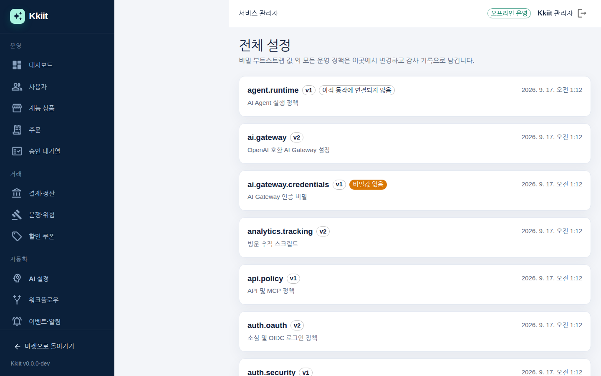

**전체 설정** 은 키마다 JSON 값과 버전을 보여 주고 변경은 감사 로그에 남습니다. 자주 만지는 키:

| 키 | 주요 값(기본) | 뜻 |
|---|---|---|
| `service.general` | `public_registration: true` | 신규 가입 허용 여부, 서비스 이름·시간대 |
| `auth.security` | `session_ttl_hours: 12`, `cookie_secure: false`, `mfa_admin_required: false`, `allow_local_login: true` | 세션 수명, HTTPS 전용 쿠키, 관리자 MFA 강제, 로컬 로그인 |
| `auth.oauth` | `auto_create_user: true`, `default_roles: ["buyer"]`, `callback_base_url: ""` | 소셜 로그인 가입 정책과 외부 주소 |
| `marketplace.policy` | `platform_fee_rate: 10`, `auto_accept_days: 0`, `max_revision_count: 10` | 수수료율(%), 납품 후 자동 구매확정 일수(0 은 끔), 수정 횟수 상한 |
| `settlement.policy` | `delay_days: 3`, `batch_enabled: false`, `hold_levels: ["HIGH","CRITICAL"]` | 정산 지연일, 자동 확정 여부, 보류 대상 위험 등급 |
| `risk.policy` | `high_threshold: 70`, `critical_threshold: 90`, `auto_hold_settlement: true` | 위험 등급 경계와 자동 보류 |
| `notification.dispatch` | `poll_seconds: 2`, `event_batch: 50`, `event_retry_limit: 10`, `retention_days: 90` | 디스패처 주기·배치·재시도·보존 |
| `notification.webhook` | `enabled: true`, `max_attempts: 6`, `timeout_seconds: 10`, `allow_private_targets: true` | 웹훅 전달과 내부망 대상 허용 |
| `api.policy` | `default_rate_limit_per_minute: 60`, `mcp_enabled: true`, `throttle_per_minute: {}` | API 키 기본 한도, MCP, 엔드포인트별 분당 한도 덮어쓰기 |
| `storage.policy` | `driver: database`, `max_upload_mb: 50` | 업로드 저장 위치와 크기 |
| `ai.gateway` | `enabled: false`, `base_url`, `models`, `monthly_budget` | AI Gateway 연결과 월 예산 |

특정 메뉴는 이 키의 일부를 전용 화면으로 보여 줍니다 — **AI 설정** 은 `ai.*`, **워크플로우** 는
`workflow.*`, **인증 연동** 은 제공자 목록, **기능 플래그** 는 `feature_flags` 테이블입니다.

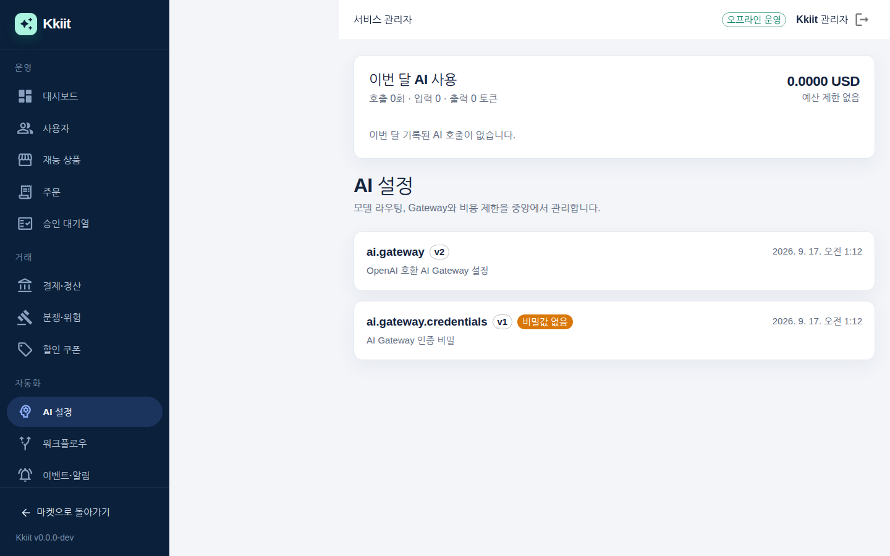

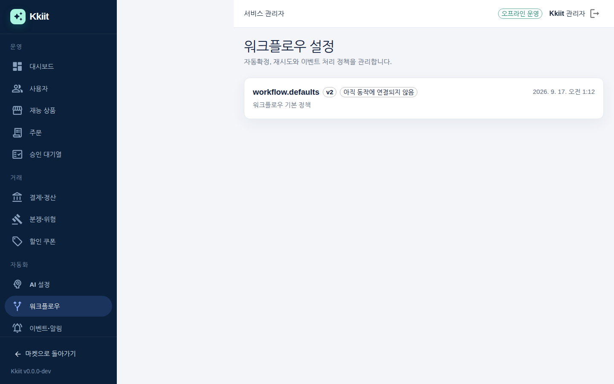

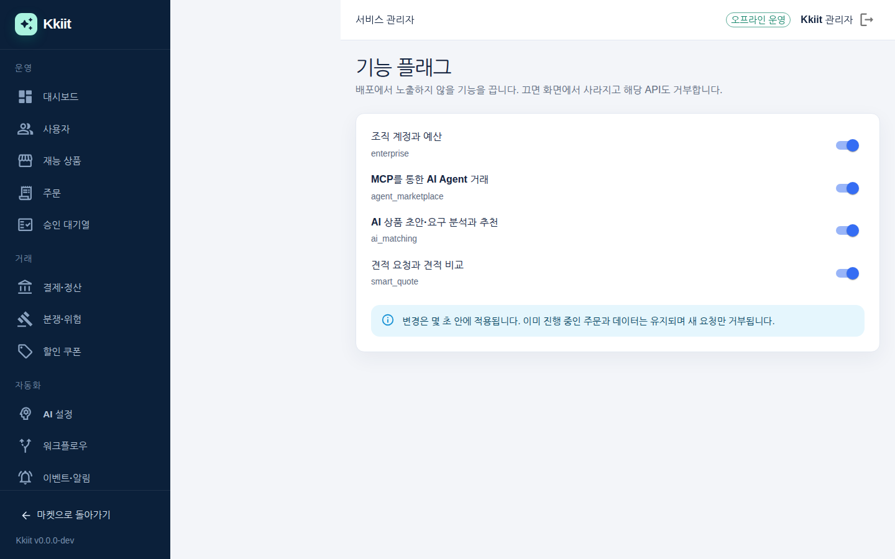

플래그를 끄면 메뉴가 사라질 뿐 아니라 해당 API 가 거부합니다. `enterprise` 를 끄면 조직 명의
주문도 거부됩니다.

### 3.3 인증 연동

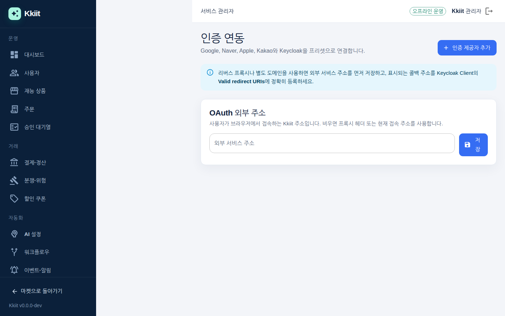

1. 리버스 프록시나 별도 도메인을 쓰면 **OAuth 외부 주소** 에 사용자가 접속하는 주소를 먼저
   저장합니다.
2. **인증 제공자 추가** 로 프리셋(Google, Naver, Apple, Kakao, Keycloak)을 고르고 클라이언트
   ID/시크릿을 넣습니다. 시크릿은 `ENCRYPTION_KEY` 로 암호화되어 저장됩니다.
3. 화면에 표시되는 콜백 주소(`/api/v1/auth/oauth/<slug>/callback`)를 제공자 쪽 허용 목록에 등록합니다.

**로그인 수단을 모두 없애는 변경은 서버가 거부합니다.** 활성 제공자가 없는데 로컬 로그인을 끄거나,
로컬 로그인이 꺼진 채 마지막 제공자를 끄면 막힙니다. 소셜 계정은 이메일이 같다는 이유만으로
기존 계정에 연결되지 않습니다.

## 4. 계정과 권한

### 4.1 역할

역할은 `internal/database/migrations/001_initial.sql` 에 정의되어 있고 **역할·권한** 화면에서 권한을
조정할 수 있습니다.

| 역할 | 기본 권한 | 할 수 있는 일 |
|---|---|---|
| `super_admin` | 전체 | 모든 것. 부트스트랩 관리자 |
| `operator` | `admin.access`, `approvals.manage`, `talents.review`, `orders.manage`, `risk.manage`, `coupons.manage`, `events.manage` | 상품 승인·반려, 주문·정산 조치, 분쟁·신고 처리, 쿠폰, 이벤트 재처리 |
| `finance_admin` | `admin.access`, `orders.manage` | 결제·정산 화면, 지급 완료·보류 |
| `security_admin` | `admin.access`, `audit.read`, `roles.manage`, `keys.manage.any`, `events.manage` | 감사 로그, 역할 권한 편집, 다른 계정의 API 키 폐기, 이벤트 재처리 |
| `buyer` | `orders.buy`, `keys.manage.self`, `webhooks.manage.self`, `mcp.use` | 주문·결제·구매확정, 개인 API 키·웹훅, MCP |
| `seller` | `talents.write`, `orders.sell`, `keys.manage.self`, `webhooks.manage.self`, `mcp.use` | 상품 등록·공개 요청, 납품, 정산 조회 |

권한 코드 전체: `admin.access`, `settings.read`, `settings.write`, `users.manage`, `roles.manage`,
`approvals.manage`, `audit.read`, `talents.write`, `talents.review`, `orders.buy`, `orders.sell`,
`orders.manage`, `keys.manage.self`, `keys.manage.any`, `mcp.use`, `risk.manage`, `coupons.manage`,
`events.manage`, `webhooks.manage.self`. 설정 변경(`settings.read` / `settings.write`)과 사용자 관리
(`users.manage`)는 기본으로 `super_admin` 에게만 있으므로, 위임하려면 역할 화면에서 붙여 줍니다.

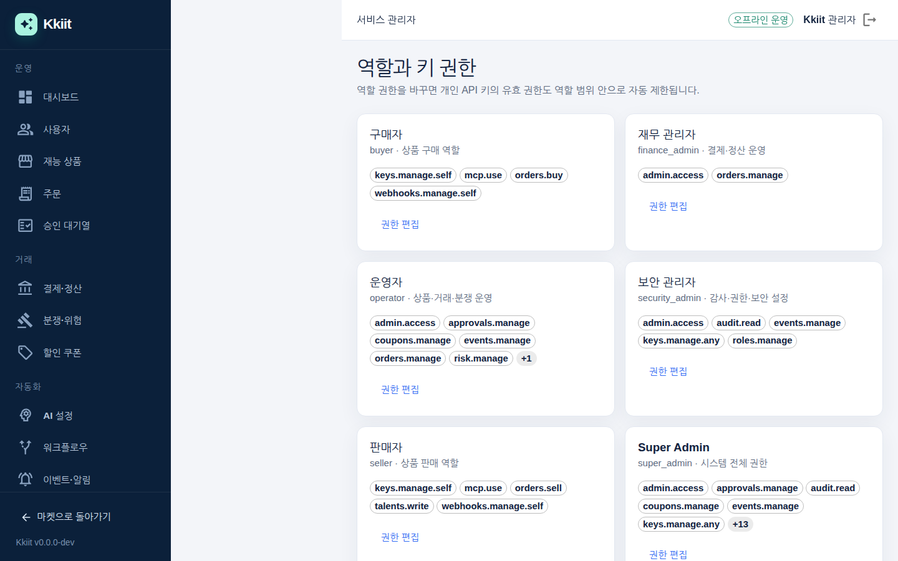

### 4.2 사용자 관리

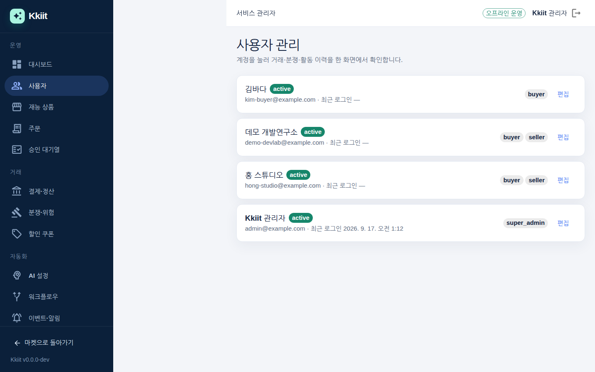

카드의 **편집** 에서 표시 이름·상태(활성/정지)·역할을 바꾸고 **MFA 초기화**, **API 키** 폐기를 합니다.
카드를 누르면 조사 화면이 열립니다.

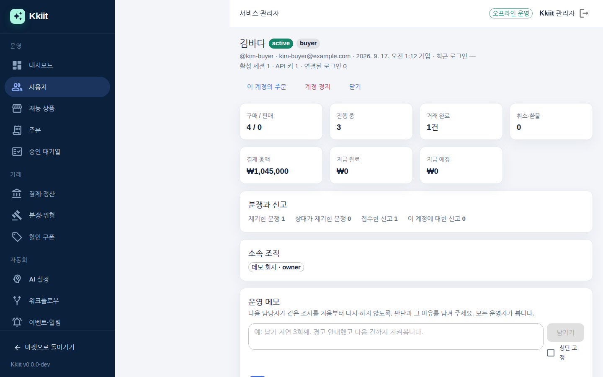

- **계정 정지** 는 로그인과 세션·API 키를 즉시 막고 그 판매자의 상품 노출·주문을 차단합니다.
  정지된 계정은 알림을 받을 수 없으므로 통보되지 않습니다.
- **MFA 초기화** 는 인증 앱을 잃은 사용자를 위한 경로입니다. 활성 세션이 모두 끊기고 당사자에게
  `AccountMFAReset` 알림이 갑니다.
- **운영 메모** 는 모든 운영자가 보고, 작성자만 지울 수 있으며 감사 로그에 남습니다.

관리자 MFA 강제(`auth.security.mfa_admin_required`)는 **모든 관리자 계정이 TOTP 를 등록한 뒤** 켭니다.
먼저 켜면 미등록 관리자의 로컬 로그인이 `mfa_enrollment_required` 로 막힙니다.

## 5. 운영

### 5.1 운영 대시보드와 대기열

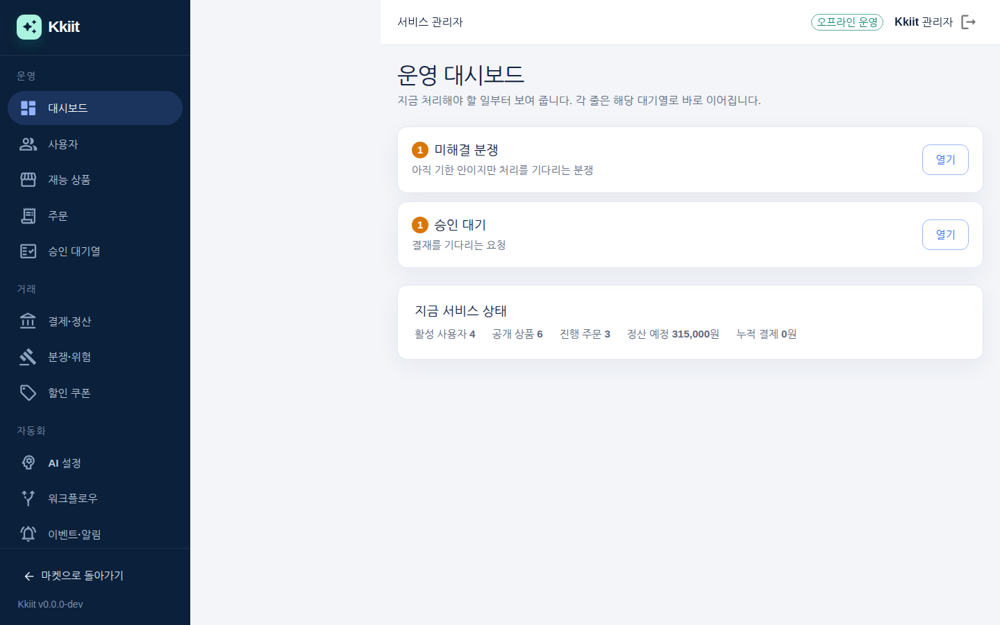

첫 화면은 처리 지연 분쟁, 미해결 분쟁, 검토 지연·승인 대기, 납기 초과 주문, 정산 보류, 위험 신호,
전달 실패 이벤트를 줄마다 세고 **열기** 로 그 항목만 걸러진 대기열로 보냅니다.

| 메뉴 | 하는 일 |
|---|---|
| **재능 상품** | 상품명·판매자·상태로 찾고 `published / paused / archived` 로 상태 변경 |
| **주문** | 주문 번호·상품명 검색, 상태·계정·납기 초과 필터. 카드를 누르면 주문 사건 화면(요구사항·이력·납품·대화·분쟁·금액) |
| **승인 대기열** | `talent_publish` 정책과 대기 중 요청. **내용 보기** 로 공개될 내용과 판매자 이력을 보고 **승인 / 반려** |
| **결제·정산** | 정산 원장. `scheduled / confirmed / hold / completed / cancelled` 상태와 **보류 / 보류 해제 / 지급 완료** 조치 |
| **분쟁·위험** | 분쟁 대기열(**분쟁 처리**: 전액 환불 / 부분 환불 / 판매자 지급), 신고 대기열(**신고 처리**: 기각 / 경고 / 상품 비공개 / 계정 정지), 위험 신호와 **지금 재평가** |
| **할인 쿠폰** | 코드·할인 방식·최소 주문 금액·사용 한도·기간 |
| **이벤트·알림** | 도메인 이벤트와 웹훅 전달 이력, 실패 건 **재처리**, 알림 템플릿 편집 |
| **감사 로그** | 행위자·작업 접두사·자원·결과로 검색 |

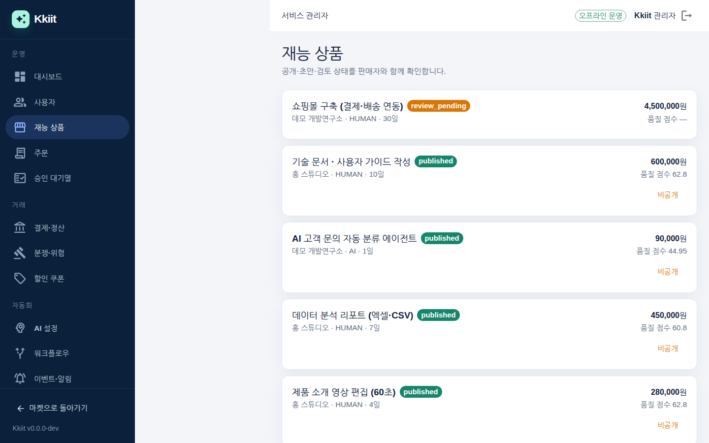

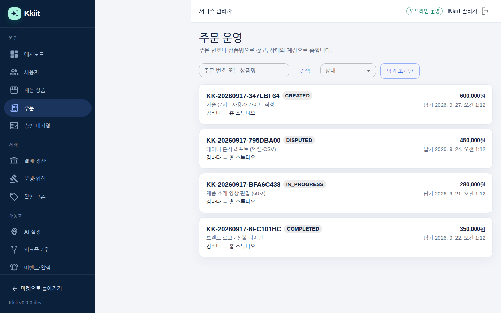

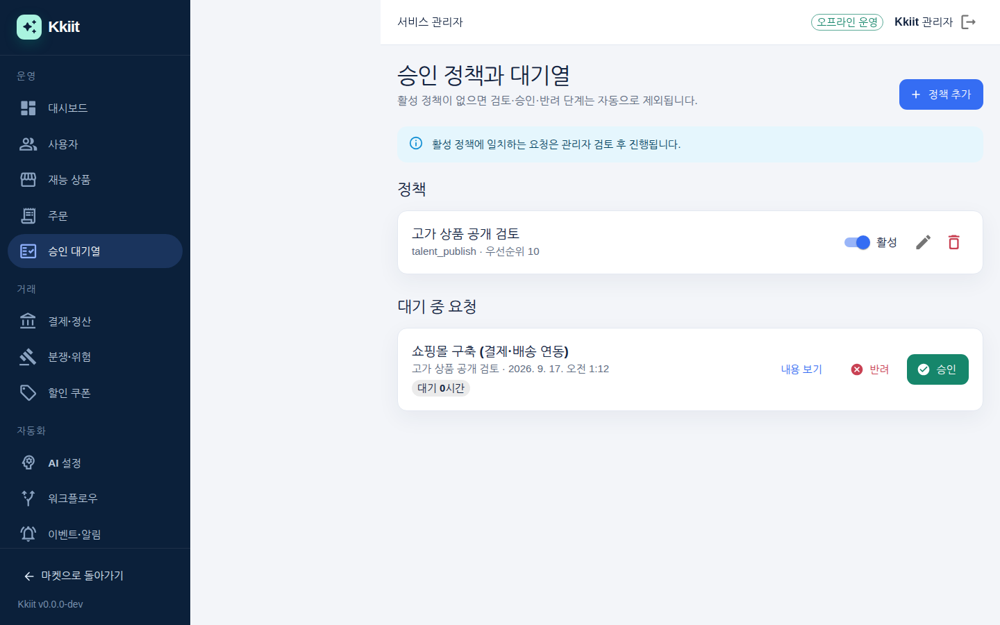

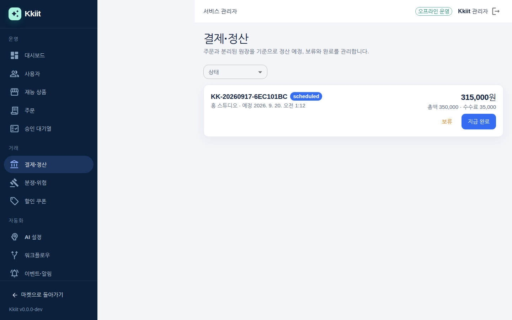

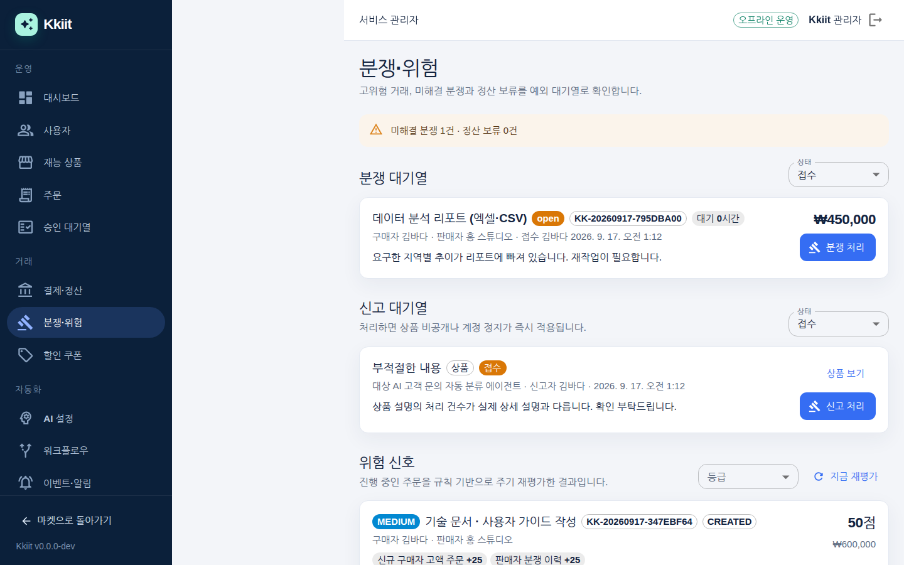

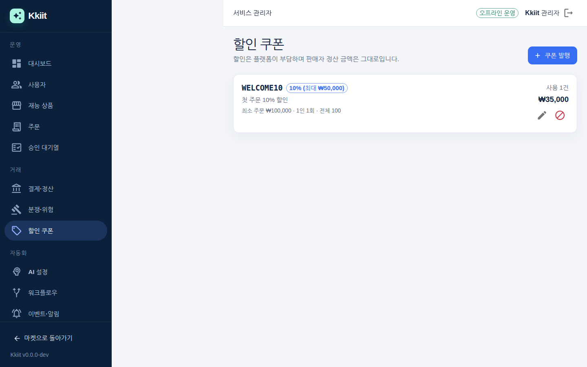

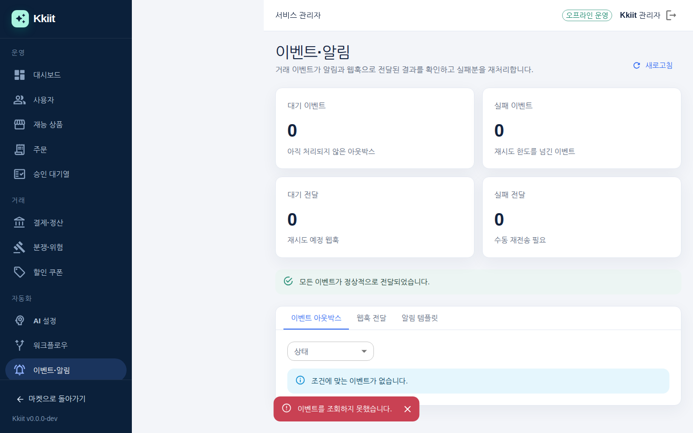

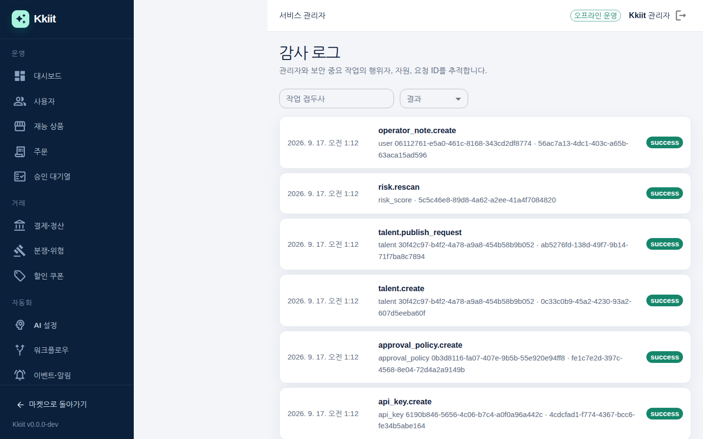

**지급 실행은 자동화하지 않습니다.** 실제 송금 뒤 **결제·정산** 에서 **지급 완료** 를 눌러야 원장이
닫힙니다. 위험 규칙이나 임계치를 바꾼 뒤에는 **지금 재평가** 로 결과를 바로 확인합니다.

### 5.2 백업과 복구

상태는 PostgreSQL 에만 있습니다(업로드 파일 포함, 기본 설정 기준).

```bash
# 백업
pg_dump --format=custom --file=kkiit-$(date +%F).dump "$POSTGRES_DSN"

# 복구 (빈 데이터베이스에)
pg_restore --no-owner --dbname="$POSTGRES_DSN" kkiit-2026-09-11.dump
docker compose up -d
```

`.env` 의 `ENCRYPTION_KEY` 도 백업과 함께 안전한 곳에 보관합니다. **키 없이 덤프만 있으면 인증
제공자 시크릿·AI 토큰 같은 암호화 컬럼을 복호화할 수 없습니다.** 키 교체는 모든 암호화 컬럼을
재암호화하는 별도 절차가 필요하며 현재 버전에 자동화된 경로는 없습니다.

### 5.3 로그와 상태 점검

- 로그는 표준 출력의 JSON 입니다. 요청 로그는 `msg: "http request"` 에 `method, path, status,
  bytes, request_id, duration_ms` 가 붙고, 5xx 는 `ERROR`, 4xx 는 `WARN`, API 성공은 `INFO`, 정적
  자산은 `DEBUG` 레벨입니다. 기본 레벨은 `INFO` 이므로 정적 자산 요청은 보이지 않습니다.
- `GET /health/live` — 프로세스 생존. 종료 중에도 200.
- `GET /health/ready` — DB 연결 포함 준비 상태. `SIGTERM` 뒤에는 즉시 `503 shutting_down`.
- `GET /api/v1/version` — 버전·커밋·빌드 시각·MCP 프로토콜 버전.

### 5.4 업그레이드와 되돌리기

```bash
./scripts/load-offline.sh kkiit-v0.2.1.tar.gz
sed -i 's/kkiit:v0.2.0/kkiit:v0.2.1/' compose.yaml
docker compose up -d                 # 새 컨테이너가 기동하며 마이그레이션 적용
docker compose logs -f kkiit         # "migration failed" 가 없고 "Kkiit started" 가 보이면 완료
```

- 마이그레이션은 advisory lock 안에서 한 인스턴스만 적용하므로 여러 인스턴스를 순서대로 올려도
  됩니다. 롤링 배포에서는 `SHUTDOWN_DRAIN_SECONDS` 로 앞단이 인스턴스를 뺄 시간을 줍니다.
- **되돌리기**: 업그레이드 직전 덤프를 복구한 뒤 `compose.yaml` 태그를 이전 버전으로 돌리고
  `docker compose up -d`. 마이그레이션은 앞으로만 적용되므로 스키마가 올라간 DB 에 이전 바이너리를
  붙이지 않습니다.

## 6. 장애 대응

| 증상 | 확인할 곳 | 조치 |
|---|---|---|
| 컨테이너가 바로 종료, 로그 `configuration error` | `.env` | 네 필수 변수 확인. `BOOTSTRAP_ADMIN_PASSWORD must be at least 12 characters`, `ENCRYPTION_KEY must be exactly 32 bytes encoded as base64 or 64 hexadecimal characters` 문구가 원인을 말해 줍니다 |
| 로그 `database unavailable` | PostgreSQL 연결·방화벽·`sslmode` | DSN 과 DB 기동 상태 확인. 컨테이너에서 `postgres.internal` 이 풀리는지 확인 |
| 로그 `migration failed` | 이전 버전으로 만든 스키마, DB 권한 | 오류 문구의 마이그레이션 번호를 보고 DB 계정이 DDL 권한을 갖는지 확인. 필요하면 덤프 복구 후 재시도 |
| 로그 `bootstrap admin failed` | `BOOTSTRAP_ADMIN` 값 | 아이디 또는 이메일 형식과 기존 계정 상태 확인 |
| 로그 `encryption initialization failed` | `ENCRYPTION_KEY` | 키가 바뀌었는지 확인. 다른 키로 저장된 비밀값은 복호화할 수 없습니다 |
| `/health/ready` 가 503 `shutting_down` | 종료 절차 | 정상. 드레인이 끝나면 프로세스가 내려갑니다 |
| 로그인 화면에서 `요청 출처를 확인할 수 없습니다.` / `교차 사이트 요청이 차단되었습니다.` | 리버스 프록시 | 서버는 `Origin` 호스트와 요청 `Host` 가 같아야 받습니다. 프록시가 원래 `Host` 헤더를 그대로 넘기게 합니다 |
| 소셜 로그인 뒤 `인증 요청이 만료되었거나 이미 사용되었습니다.` | **인증 연동 → OAuth 외부 주소**, 제공자 콜백 등록 | 외부 주소와 콜백 URL 이 일치하는지 확인. 한 번 쓴 인증 요청은 재사용되지 않습니다 |
| 관리자가 로그인 못 함 `mfa_enrollment_required` | `auth.security.mfa_admin_required` | 다른 관리자가 **전체 설정** 에서 잠시 끄거나, 해당 계정에 TOTP 를 먼저 등록 |
| 관리자가 인증 앱을 잃음 | **사용자 → 편집 → MFA 초기화** | 다른 관리자가 초기화. 단일 관리자라면 DB 에서 그 계정의 `mfa_factors` 행 삭제가 마지막 수단 |
| 알림·웹훅이 오지 않음 | **이벤트·알림**, 로그 `webhook delivery failed` | 실패 건을 **재처리**. `notification.webhook.allow_private_targets`, 대상 서버 응답 확인 |
| 로그 `event dispatcher did not stop in time` | 종료 시 | 진행 중이던 이벤트는 다음 기동의 지연 이벤트 회수(`stuck_after_minutes`)가 처리합니다 |
| WebSocket 이 몇 분 뒤 끊김 | 프록시 타임아웃 | 프록시의 idle timeout 을 늘리거나 WebSocket 업그레이드를 허용. 막힌 환경에서는 60초 폴링으로 자동 전환됩니다 |
| 특정 사용자가 `요청이 너무 잦습니다` | `api.policy.throttle_per_minute` | 기본 한도(로그인 10, 주문 생성 30, 메시지 60 …)를 키별로 올립니다 |
| 정산이 `hold` 에서 안 움직임 | **분쟁·위험** 위험 신호, **결제·정산** | 사유를 확인하고 **결제·정산** 에서 보류 해제 또는 분쟁 처리 |

## 7. 보안

- **기본값 중 바꿔야 하는 것**: `BOOTSTRAP_ADMIN_PASSWORD` (첫 로그인 뒤 화면에서 교체),
  `auth.security.cookie_secure` (HTTPS 종단이면 `true`), 필요 없으면 `service.general.public_registration`
  을 `false` 로.
- **외부에 열면 안 되는 것**: PostgreSQL 포트. Kkiit 의 `8080` 도 TLS 를 끝내는 프록시 뒤에 둡니다.
  프록시는 `Host` 헤더를 그대로 전달해야 합니다(CSRF 검사).
- **비밀값 저장**: 인증 제공자 시크릿·AI 토큰은 `ENCRYPTION_KEY` 로 AES-256-GCM 암호화, 개인 API 키와
  세션 토큰은 SHA-256 다이제스트만 저장합니다. 관리자 화면 어디에도 키 원문은 나오지 않습니다.
- **인증 정책**: 로그인 시도는 계정당 분당 10회, TOTP 코드는 1회용, 비밀번호 변경 시 다른 세션이
  모두 종료됩니다. 관리자 계정은 TOTP 등록 후 `mfa_admin_required` 를 켜는 순서로 강제합니다.
- **권한 최소화**: 운영 담당자에게 `super_admin` 대신 `operator`·`finance_admin`·`security_admin` 을
  나눠 줍니다. 아무 데서도 확인하지 않는 권한은 코드에 두지 않으므로 화면에 보이는 권한은 모두
  실제로 동작합니다.
- **컨테이너**: 비루트, 읽기 전용 루트 파일시스템, `no-new-privileges`, 모든 capability 제거가
  `compose.yaml` 기본값입니다. 바꾸지 않습니다.
- **웹훅 대상**: 단절망을 고려해 내부망 주소가 기본 허용(`allow_private_targets: true`)입니다.
  외부에 노출된 배포라면 `false` 로 바꿉니다.

## 부록. 화면 캡처 다시 찍기

이 문서와 사용자 가이드의 그림은 `scripts/guide-screenshots.mjs` 가 만듭니다. 버릴 수 있는
인스턴스를 띄운 뒤 실행합니다. 대상은 루프백 주소만 허용하고 자격 증명은 환경 변수로만 받습니다.

```bash
KKIIT_GUIDE_URL=http://127.0.0.1:8080 \
KKIIT_GUIDE_ADMIN=admin@example.com KKIIT_GUIDE_ADMIN_PASSWORD='<부트스트랩 비밀번호>' \
KKIIT_GUIDE_DEMO_PASSWORD='<데모 계정에 쓸 12자 이상 비밀번호>' \
  node scripts/guide-screenshots.mjs
```

PDF 는 `aidev/tools/guide/md2pdf.mjs` 공용 도구로 만듭니다.
