# Momento 관리자 가이드

- **문서 버전**: v0.34.39
- **대상**: Momento를 띄워 놓고 지키는 사람 — 시스템 관리자, Security/DevOps 엔지니어, 데이터 보안 담당자.
- **함께 볼 문서**: 화면 사용법은 [사용자 가이드](USER_GUIDE.md), 폐쇄망 반입 절차는 [오프라인 설치](OFFLINE.md), 구조는 [아키텍처](ARCHITECTURE.md)에 있습니다. 이 문서는 그 내용을 되풀이하지 않고 가리킵니다.

이 문서의 화면 캡처는 v0.34.39 를 실제로 띄우고 가짜 데이터(`데모 포털`, `hong@example.com`, `127.0.0.0/8`)를 채운 상태에서 찍은 것입니다.

---

## 목차

1. [구성 요소](#1-구성-요소)
2. [설치](#2-설치)
3. [설정](#3-설정)
4. [계정과 권한](#4-계정과-권한)
5. [운영](#5-운영)
6. [장애 대응](#6-장애-대응)
7. [보안](#7-보안)
8. [참고: 정책과 동작의 세부](#8-참고-정책과-동작의-세부)

---

## 1. 구성 요소

| 구성 요소 | 무엇 | 주고받는 것 |
| :--- | :--- | :--- |
| `momento` 컨테이너 | Go 단일 바이너리. HTTP API, Collector, 콘솔 정적 파일, 백그라운드 Worker(Inbox 처리)·Automation(정기 배달)·Maintenance(보존·재집계)를 한 프로세스에서 실행 | `:8080`으로 콘솔·API·`/collect/v1/events`·`/tracker.js`를 제공. PostgreSQL에만 연결 |
| PostgreSQL 15+ | 유일한 상태 저장소. Raw Event, 세션·방문자 파생 테이블, 일별 집계, 설정, 사용자, 감사 로그 | `MOMENTO_POSTGRES_DSN`으로 연결. 마이그레이션은 기동 시 자동 적용 |
| 측정 대상 서비스의 브라우저 | `tracker.js`를 실행해 `/collect/v1/events`로 배치 전송 | Tracking Key(`mom_track_`)와 허용 도메인으로 검증 |
| (선택) OIDC Provider | Keycloak 등. PKCE(S256) 표준 OIDC | `/api/v1/auth/oidc/login` → `/api/v1/auth/oidc/callback` |
| (선택) 배달 대상 | Webhook, Confluence, Mail HTTP Gateway, 사내 메시지 Gateway, AI Agent | Automation이 HTTP(S)로 호출. Allowlist에 있는 호스트만 |

컨테이너는 non-root, read-only 파일시스템, `cap_drop: ALL`로 실행됩니다. 디스크 상태가 없으므로 백업 대상은 PostgreSQL뿐입니다.

관리 화면은 `관리 센터`(`/admin`) 하나로 모입니다. 홈은 현재 사이트·환경의 7일 데이터 품질, 수신·대기·오류, 개인정보 요청과 재집계 작업을 운영 브리핑으로 보여주고, 운영 준비도 항목에서 미충족 설정 화면으로 바로 이동합니다.

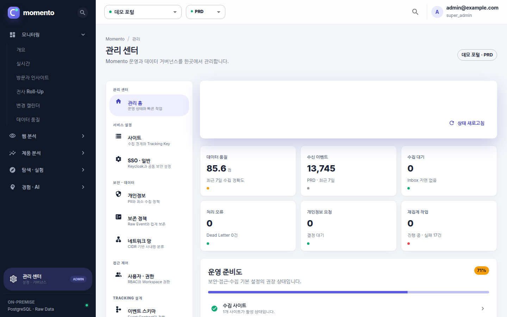

---

## 2. 설치

릴리즈 자산(`momento-v0.34.39.tar.gz`와 `.sha256`)으로 처음부터 끝까지 가는 절차입니다. 폐쇄망 반입과 PostgreSQL을 Docker로 돌릴 때의 `shm_size` 주의는 [OFFLINE.md](OFFLINE.md)에 있습니다.

### 2.1 요구 사항

| 항목 | 값 |
| :--- | :--- |
| Docker Engine | 컨테이너 실행. compose 사용 시 Docker Compose v2 |
| PostgreSQL | 15 이상. 접근 가능한 DSN 하나. `pg_trgm` 확장 생성 권한이 있으면 방문자 검색 인덱스를 만들고, 없으면 순차 검색으로 동작 |
| 포트 | `8080/tcp` (콘솔·API·Collector). 외부에는 TLS 종단 리버스 프록시 뒤에 두십시오 |
| 볼륨 | 컨테이너 자체는 없음(`read_only`, `/tmp` 64MB tmpfs). PostgreSQL 데이터 볼륨만 |
| 자원 | 컨테이너 자체는 수백 MB 메모리. PostgreSQL은 `shm_size: 1gb` 이상 권장(병렬 질의) |
| PostgreSQL 연결 수 | 기본 풀 20. `MOMENTO_POSTGRES_MAX_CONNS`로 조정 |

### 2.2 이미지 적재

```bash
sha256sum -c momento-v0.34.39.tar.gz.sha256
gzip -dc momento-v0.34.39.tar.gz | docker load
# Loaded image: momento:v0.34.39
```

아카이브는 한 단어(`momento-v0.34.39.tar.gz`), 이미지는 저장소와 태그(`momento:v0.34.39`)입니다. `docker load`가 출력한 이름이 아래에서 쓰는 이름입니다.

### 2.3 compose로 띄우기

저장소의 `compose.yml`은 PostgreSQL 17과 `momento:v0.34.39`를 함께 띄웁니다. 같은 디렉터리에 `.env`를 만듭니다(`.env.example`을 복사).

```bash
cp .env.example .env
# .env 를 편집한다 — 값은 예시이며 실제 값은 비밀 관리 체계에서 가져온다
#   MOMENTO_BOOTSTRAP_ADMIN=admin@example.com
#   MOMENTO_BOOTSTRAP_ADMIN_PASSWORD=<12자 이상 임의 문자열>
#   MOMENTO_ENCRYPTION_KEY=<openssl rand -base64 32 결과>
docker compose up -d --no-build
docker compose logs -f momento
```

`--no-build`는 방금 적재한 이미지를 그대로 쓰게 합니다(compose 파일에 `build:`가 있어 소스가 있으면 다시 빌드하려 합니다). 기동 로그에 다음 두 줄이 보이면 준비된 것입니다.

```
{"level":"INFO","msg":"secret encryption enabled","key_id":"…","previous_keys":0}
{"level":"INFO","msg":"Momento started","version":"0.34.39","address":":8080"}
```

외부 PostgreSQL을 쓰면 `.env`의 `MOMENTO_POSTGRES_DSN`을 그 DSN으로 바꾸고 compose의 `postgres` 서비스는 띄우지 않습니다. `docker run` 한 줄로 띄우는 예는 [OFFLINE.md](OFFLINE.md)에 있습니다.

### 2.4 확인

```bash
curl -s http://127.0.0.1:8080/health/ready     # {"status":"ready"}
curl -s http://127.0.0.1:8080/api/v1/version   # {"name":"Momento","version":"0.34.39",...}
```

### 2.5 최초 관리자 계정과 첫 사이트

최초 기동 시 `MOMENTO_BOOTSTRAP_ADMIN`으로 `super_admin` 계정이 만들어집니다. 같은 이메일이 이미 있으면 비밀번호를 덮어쓰지 않습니다. 브라우저로 `http://<host>:8080`에 접속해 로그인합니다.

1. `관리 센터 → 사이트`에서 **사이트 추가**. 이름, 서비스 이름, 허용 도메인(측정 대상 서비스의 호스트), 시간대를 넣습니다.
2. 생성 직후 표시되는 **Tracking Key**(`mom_track_`)와 **Server API Key**(`mom_server_`)를 보관합니다. `MOMENTO_ENCRYPTION_KEY`가 설정돼 있으면 뒤에 `키 보기`로 다시 볼 수 있고, 없으면 이 한 번만 표시됩니다.
3. 같은 행의 **SDK 설치**를 눌러 설치 코드와 CSP 스니펫을 개발자에게 전달합니다. **설치 진단** 탭이 수집 수신 여부와 허용 도메인·환경 일치를 서버 기준으로 알려줍니다.

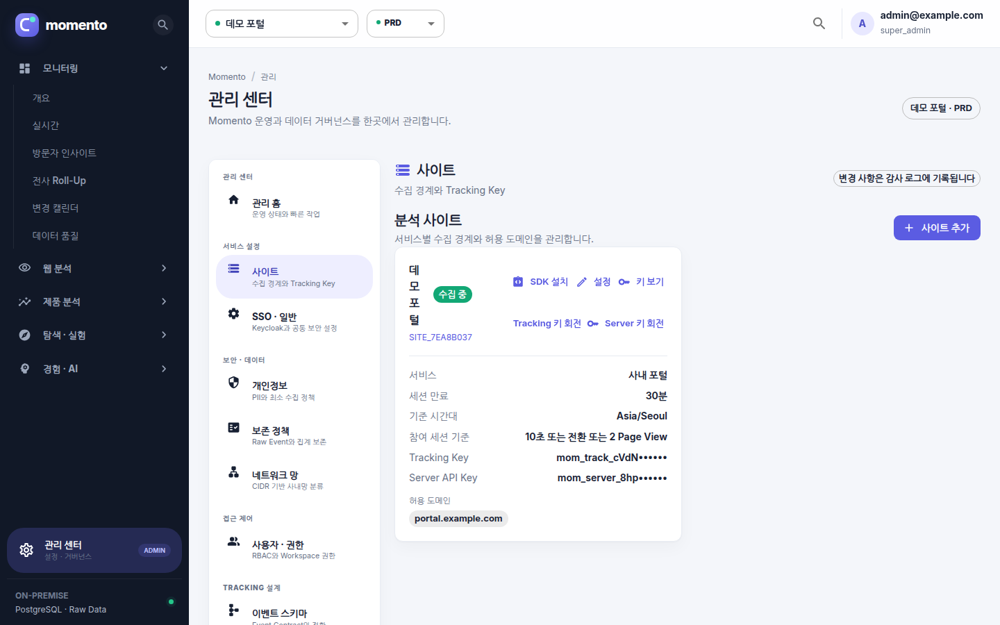

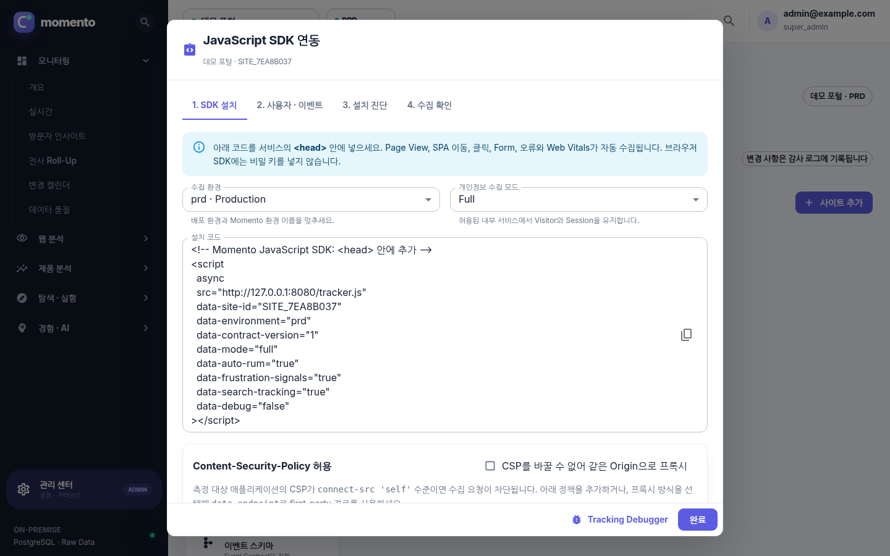

4. `관리 센터 → SSO · 일반`에서 **공개 URL**을 실제 외부 주소로 설정합니다. 설치 코드의 `src`와 OIDC Redirect URI가 이 값으로 만들어집니다.

---

## 3. 설정

### 3.1 환경 변수 (전수)

프로세스가 읽는 환경 변수는 아래가 전부입니다(`internal/config`, `internal/database`).

| 이름 | 기본값 | 필수 | 설명 |
| :--- | :--- | :---: | :--- |
| `MOMENTO_POSTGRES_DSN` | 없음 | 예 | PostgreSQL 연결 문자열. 예 `postgres://momento:<password>@db.internal:5432/momento?sslmode=require` |
| `MOMENTO_BOOTSTRAP_ADMIN` | 없음 | 예 | 최초 `super_admin` 이메일. 기존 계정이 있으면 건드리지 않음 |
| `MOMENTO_BOOTSTRAP_ADMIN_PASSWORD` | 없음 | 예 | 최초 관리자 비밀번호. **12자 미만이면 기동 거부** |
| `MOMENTO_ENCRYPTION_KEY` | 없음 | 권장 | 비밀값(API key, Tracking/Server Key, OIDC Client Secret, Delivery Header) AES-256-GCM 암호화 키. 32 byte base64/hex 또는 16자 이상 passphrase. 없으면 해시만 저장해 키를 다시 볼 수 없음 |
| `ENCRYPTION_KEY` | 없음 | 아니오 | `MOMENTO_ENCRYPTION_KEY`의 alias. 플랫폼이 공용으로 주입하는 경우용. Momento 접두 변수가 있으면 그것이 우선 |
| `MOMENTO_ENCRYPTION_KEY_PREVIOUS` | 없음 | 아니오 | 키 교체 중 이전 키(쉼표 구분). 재암호화 후 제거 |
| `ENCRYPTION_KEY_PREVIOUS` | 없음 | 아니오 | 위의 alias |
| `MOMENTO_POSTGRES_MAX_CONNS` | `20` | 아니오 | 연결 풀 최대 크기. 0 이하나 숫자가 아니면 기본값 |

HTTP 포트는 `:8080` 고정입니다. 바꾸려면 컨테이너 포트 매핑을 조정합니다.

### 3.2 DB에 저장되는 관리자 설정

그 밖의 설정은 모두 `관리 센터`에서 바꾸고 DB `settings` 테이블에 저장됩니다. API로는 `GET /api/v1/settings`, `PUT /api/v1/settings/{key}`(조직 관리자 이상)입니다.

| key | 화면 | 주요 항목과 기본값 |
| :--- | :--- | :--- |
| `general` | SSO · 일반 | `product_name` `Momento`, `public_url` 빈 값, `timezone` `Asia/Seoul` |
| `oidc` | SSO · 일반 | `enabled` `false`, `issuer_url`, `client_id`, `client_secret`(암호화 저장), `scopes` `["openid","profile","email"]`, `claim_email` `email`, `claim_name` `name`, `claim_department` `department`, `claim_organization` `organization` |
| `mcp.oauth` | SSO · 일반 | `enabled` `false`, `resource` 빈 값(비면 `public_url` + `/mcp`), `audience` 빈 값(공백 구분 aud/azp), `scopes` `analytics:read`. 3.5 참고 |
| `security` | SSO · 일반 | `collector_rate_limit_per_minute` `6000`, `max_payload_bytes` `262144`, `max_events_per_request` `100`(상한 1000), `trusted_proxy_cidrs` `[]` |
| `privacy` | 개인정보 | `ip_anonymization` `true`, `collect_user_agent` `true`, `strip_query_string` `false`, `masked_parameters` `["token","password","email"]`, `collect_user_id` `true`, `visitor_profiles` `true`, `do_not_track` `true`, `blocked_properties` `["email","phone","resident_number"]`, `pii_detection_mode` `mask` |
| `automation` | Report · Action | `enabled` `false`, `allowed_webhook_hosts` `[]`, `delivery_timeout_seconds` `10`, `max_entity_ids` `0` |

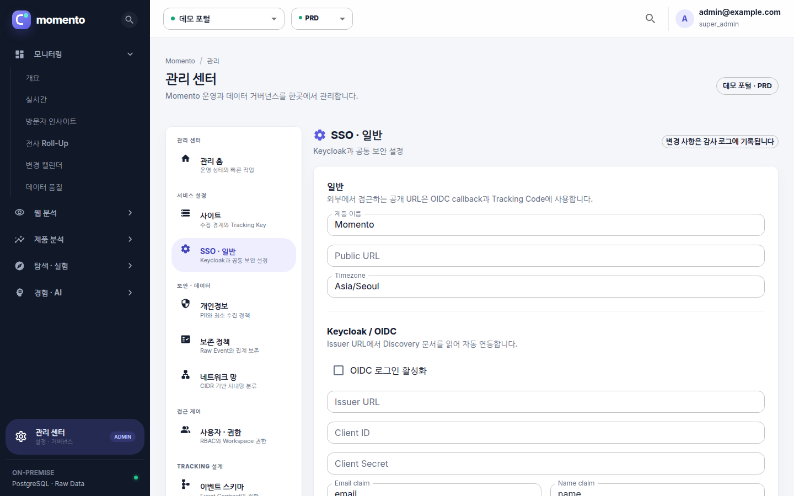

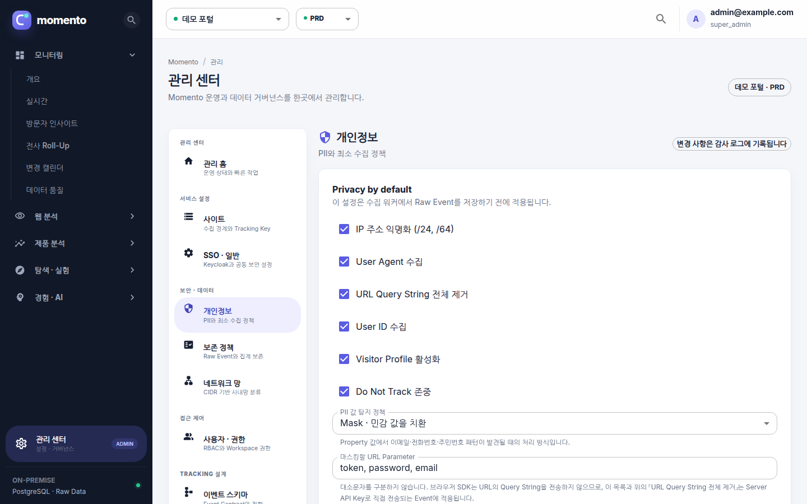

사이트 단위 설정은 `사이트 → 설정`(시간대, Session Timeout, 참여 기준 초, 허용 도메인), `보존 정책`, `Analytics Governance`(환경별 Contract 모드·Cardinality), `Analytics Engineering → Query Cost`(최대 정확 조회 기간 등)에 있습니다.

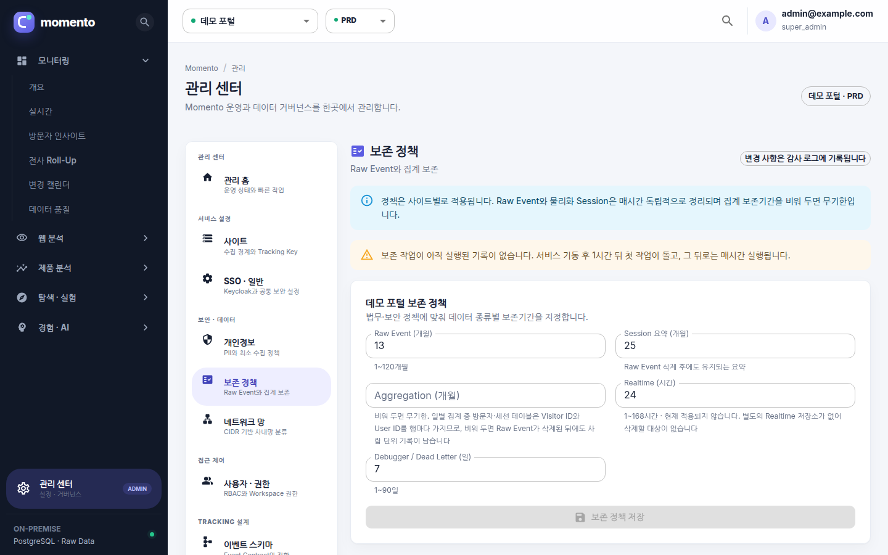

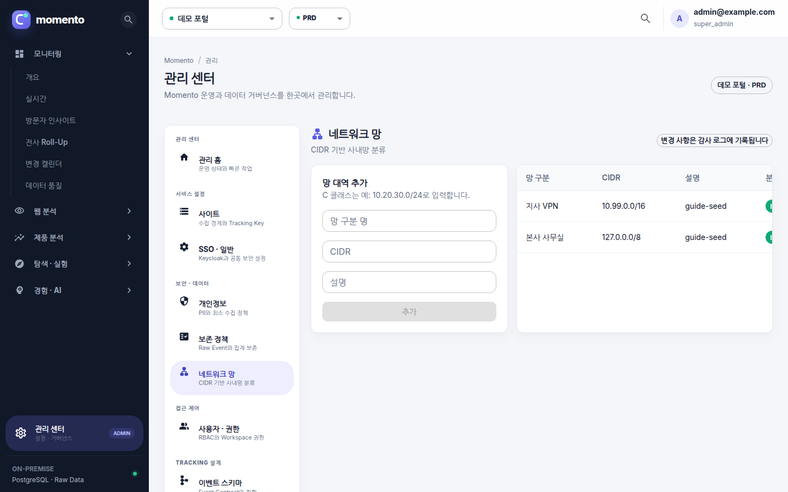

### 3.3 Keycloak OIDC 연동

1. Keycloak Admin Console에서 Client(예: `momento-web`)를 만듭니다. Client authentication 켜고, PKCE는 `S256`.
2. Valid Redirect URIs에 `<public_url>/api/v1/auth/oidc/callback`을 넣습니다. 예: `https://momento.internal/api/v1/auth/oidc/callback`.
3. 부서·조직을 쓰려면 Token에 `department`, `organization` claim을 넣는 Mapper를 추가합니다(이름은 `claim_department`, `claim_organization` 설정과 맞춥니다).
4. Momento `관리 센터 → SSO · 일반`의 OIDC에 Issuer URL, Client ID, Client Secret을 넣고 활성화합니다. Client Secret은 `MOMENTO_ENCRYPTION_KEY`로 암호화 저장됩니다.
5. 로그인 화면에 SSO 버튼이 나타나는지 확인합니다. `GET /api/v1/auth/options`가 현재 로그인 방식을 알려줍니다.

### 3.4 비밀값 암호화 키 교체

1. `MOMENTO_ENCRYPTION_KEY`에 새 키, `MOMENTO_ENCRYPTION_KEY_PREVIOUS`에 이전 키를 두고 재기동합니다.
2. `관리 센터 → SSO · 일반 → 비밀값 암호화`에서 재암호화를 실행합니다(`POST /api/v1/system/encryption/rekey`, 관리자 세션 필요).
3. `MOMENTO_ENCRYPTION_KEY_PREVIOUS`를 제거하고 재기동합니다.

암호화 이전에 발급된 키는 한 번 회전해야 재조회 대상이 됩니다. 키 값을 잃으면 암호화 저장된 비밀값은 복구할 수 없고 회전해야 합니다.

### 3.5 MCP SSO(OAuth) — 개인 키 없이 Keycloak 토큰으로 `/mcp` 열기

MCP 인가 규격(2025-06-18 이후)은 OAuth 2.1입니다. 이 기능을 켜면 MCP 클라이언트(Claude, Cursor 등)에 `/mcp` 주소 하나만 주면 클라이언트가 스스로 Keycloak 로그인 화면을 띄우고 액세스 토큰을 받아 옵니다. **개인 API 키(`mom_key_`)는 그대로 동작합니다** — 폐쇄망·자동화 스크립트처럼 로그인 화면을 띄울 수 없는 곳은 계속 키를 씁니다.

Momento는 **리소스 서버**입니다. 로그인은 Keycloak이 하고, Momento는 토큰을 받아 검사만 합니다. `/authorize`·`/token`·동적 클라이언트 등록은 Momento에 없고 Keycloak의 몫입니다. 토큰은 저장하지도, 세션으로 바꾸지도 않고 요청마다 검사합니다.

**동작 규칙**

- 같은 `Authorization: Bearer` 헤더에서 가릅니다. `mom_key_`로 시작하면 키, 점 두 개가 있는 JWT 모양이면 SSO 토큰, 둘 다 아니면 지금과 같은 "invalid session" 거부입니다.
- SSO 토큰은 **`/mcp`에서만** 받습니다. REST·관리 API는 지금처럼 키와 세션만 받습니다. 유효한 토큰으로 REST를 부르면 401입니다(통합 테스트가 라우터를 순회하며 모든 `/api/v1` 경로에서 확인합니다).
- **계정을 만들지 않습니다.** 토큰의 `sub`(웹 로그인이 저장한 `oidc_subject`), 없으면 `oidc.claim_email` 클레임으로 **이미 등록된 활성** 계정을 찾습니다. 없으면 "sign in to the web console once first"로 거부합니다. 정지된 계정은 토큰으로 되살아나지 않고, 토큰의 role 클레임은 Momento 역할이 되지 않습니다.
- SSO 주체는 **키와 같은 문**을 지납니다. 관리 기능과 대화형 쓰기는 인증 종류로 거부되므로 계정이 최고 관리자여도 MCP 도구(모두 조회)만 쓸 수 있습니다. `mcp.oauth.scopes`는 메타데이터의 `scopes_supported`로 광고되고 주체에 기록되지만, 키의 `scopes`와 마찬가지로 경계는 이 값이 아니라 인증 계층이 강제합니다(8.7.1).
- 켜져 있지 않으면 새로 설치한 곳과 아무것도 다르지 않습니다. 메타데이터는 404, `/mcp`의 401에는 아무 헤더도 붙지 않고, 토큰을 내밀어도 키 전용 때와 같은 거부입니다.

**설정** (`관리 센터 → SSO · 일반 → MCP SSO (OAuth)` 카드, `PUT /api/v1/settings/mcp.oauth`)

| 키 | 기본값 | 뜻 |
| :--- | :--- | :--- |
| `mcp.oauth.enabled` | `false` | 켜기. `oidc.issuer_url`이 비어 있거나, `general.public_url`과 `mcp.oauth.resource`가 모두 비어 있으면 저장이 400으로 거부됩니다 |
| `mcp.oauth.resource` | 빈 값 | 리소스 식별자(RFC 8707). 비면 `general.public_url` + `/mcp`. 둘 다 비면 요청 Host로 만들지 않고 SSO 토큰을 받지 않습니다(Host 헤더는 보내는 쪽이 정하므로 `aud` 검사의 기준이 될 수 없습니다). `/mcp`로 끝나는 절대 URL만 받습니다 |
| `mcp.oauth.audience` | 빈 값 | 공백 구분 허용 대상. 토큰의 `aud` 또는 `azp`와 비교합니다. Audience 매퍼 없이 쓰는 호환 경로입니다 |
| `mcp.oauth.scopes` | `analytics:read` | 공백 구분. SSO 주체에게 기록되는 범위. 토큰의 `scope`는 보지 않습니다 |
| (재사용) `oidc.issuer_url` · `oidc.claim_email` | 웹 로그인 설정 | 발급자와 계정 대조 클레임. 새로 만들지 않습니다 |

카드는 MCP URL과 메타데이터 URL을 복사할 수 있게 보여 줍니다. 켜 두고도 동작하지 않을 상태(발급자 없음, 주소 없음)는 카드가 경고로 알립니다.

**Keycloak 쪽 할 일**

1. MCP 클라이언트용 **공개(public) 클라이언트**를 만듭니다(예: `claude-mcp`). Standard Flow 켬, PKCE `S256`, Direct Access Grants·Implicit·Service accounts 끔. 웹 로그인 클라이언트(`momento-web`)와 **다른** 클라이언트입니다.
2. Valid Redirect URIs에 쓰는 클라이언트의 콜백을 정확히 적습니다. Claude는 `https://claude.ai/api/mcp/auth_callback`, 로컬 클라이언트는 `http://127.0.0.1:*/callback` 류. `*` 하나로 다 여는 것은 금지입니다.
3. 대상(audience)을 잇습니다. 둘 중 하나면 됩니다.
   - 정식 경로: 그 클라이언트(또는 전용 client scope)에 **Audience 매퍼** — Included Custom Audience = 리소스 식별자(`https://<public_url>/mcp`), Add to access token 켬, Add to ID token 끔.
   - 호환 경로: 매퍼 없이 Momento의 `mcp.oauth.audience`에 클라이언트 ID(`claude-mcp`)를 적습니다. 실제 Keycloak 26은 `aud`에 `account`만 싣고 클라이언트 ID는 `azp`에 담으므로 이 경로가 가장 빠릅니다.
4. 액세스 토큰 수명은 짧게(5분 안팎). Momento는 introspection을 하지 않으므로 **Keycloak에서 로그아웃해도 이미 발급된 토큰은 만료까지 삽니다.** 계정을 즉시 끊으려면 Momento에서 계정을 비활성화하세요 — 토큰 검사가 활성 계정만 통과시킵니다.

**확인**

```bash
# 1) 메타데이터 — 인증 없이 맨 JSON. 꺼져 있으면 404
curl -s https://momento.internal/.well-known/oauth-protected-resource/mcp
# {"resource":"https://momento.internal/mcp","authorization_servers":["https://keycloak.internal/realms/company"],
#  "bearer_methods_supported":["header"],"scopes_supported":["analytics:read"],"resource_name":"Momento Analytics MCP"}

# 2) 401 이 길을 가리키는지 — MCP 경로에만 붙습니다
curl -si -X POST https://momento.internal/mcp -H 'Content-Type: application/json' \
  -d '{"jsonrpc":"2.0","id":1,"method":"tools/list","params":{}}' | grep -i www-authenticate
# WWW-Authenticate: Bearer realm="Momento", resource_metadata="https://momento.internal/.well-known/oauth-protected-resource/mcp"

# 3) 토큰으로 열리는지
curl -s -X POST https://momento.internal/mcp -H "Authorization: Bearer $ACCESS_TOKEN" \
  -H 'Content-Type: application/json' -d '{"jsonrpc":"2.0","id":1,"method":"tools/list","params":{}}'
```

**거부 메시지별 조치** (`/mcp`의 401 본문 `error.message`; 하위 원인은 서버 로그 `mcp sso token refused`에 남습니다)

| 메시지 | 뜻 | 조치 |
| :--- | :--- | :--- |
| `invalid session` (WWW-Authenticate 없음) | SSO 토큰이 꺼져 있거나 `oidc.issuer_url`이 비어 있음 | 카드에서 켜고 Issuer URL을 채웁니다. 켜져 있는데 발급자가 비면 로그에 `mcp sso is switched on but oidc.issuer_url is empty` |
| `the SSO issuer could not be read …` | Keycloak Discovery 실패 | Momento 컨테이너에서 Issuer URL에 닿는지, 인증서를 신뢰하는지 확인. 로그에 `discovery at <issuer>: …` |
| `… not valid (signature, issuer, expiry or not-before)` | 서명·`iss`·`exp`·`nbf` 중 하나가 틀림 | 로그의 `token rejected: …`가 어느 것인지 말합니다. 다른 realm의 토큰이거나 만료된 토큰이면 클라이언트에서 다시 로그인 |
| `an ID token is not an MCP credential` | ID 토큰을 보냄 | 클라이언트가 access_token을 쓰게 합니다 |
| `a sender-constrained token (cnf) …` | DPoP·mTLS 묶인 토큰 | 그 클라이언트에 소지자 증명을 끕니다 |
| `… was not issued for this server (aud [account], azp "claude-mcp"); add "claude-mcp" to the accepted audiences …` | 대상 불일치 | 메시지에 적힌 값을 `mcp.oauth.audience`에 넣거나, Audience 매퍼에 메시지의 리소스 식별자를 넣습니다 |
| `this SSO account is not registered in Momento or is inactive; sign in to the web console once first` | 계정 없음 또는 비활성 | 그 사람이 웹으로 한 번 로그인하거나(계정 생성), 관리자가 계정을 활성화합니다 |

---

## 4. 계정과 권한

`관리 센터 → 사용자 · 권한`에서 계정을 만들고 역할을 줍니다. 로컬 계정은 이메일·표시 이름·부서·조직·역할·비밀번호를 넣고, OIDC 사용자는 첫 로그인 때 만들어집니다. 변경은 감사 로그에 기록됩니다.

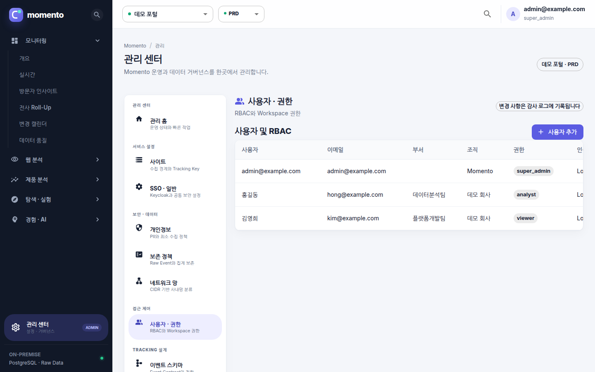

### 4.1 역할

역할은 다섯 가지이며 등급 순서가 있습니다: `viewer` < `analyst` < `workspace_admin` < `organization_admin` < `super_admin`.

| 할 수 있는 일 | viewer | analyst | workspace_admin | organization_admin / super_admin |
| :--- | :---: | :---: | :---: | :---: |
| 분석 화면 조회, 표 CSV 내보내기 | ✅ | ✅ | ✅ | ✅ |
| Segment·Exploration·Business Journey 저장 | ✅ | ✅ | ✅ | ✅ |
| 개인 API Key 발급 | ✅ | ✅ | ✅ | ✅ |
| 사이트 생성·설정·키 회전·삭제 | ❌ | ❌ | 소속 Workspace 사이트만 | ✅ |
| 보존 정책, 이벤트 스키마, 차원, Governance, Report · Action, Privacy Requests | ❌ | ❌ | ✅ | ✅ |
| Tracking Debugger, 감사 로그 조회 | ❌ | ❌ | ✅ | ✅ |
| 설정(`general`·`oidc`·`security`·`privacy`·`automation`) 변경 | ❌ | ❌ | ❌ | ✅ |
| 네트워크 망 추가·삭제 | ❌ | ❌ | ❌ | ✅ |
| 사용자 생성·역할 변경 | ❌ | ❌ | ❌ | ✅ |

라우터 기준으로 "관리자"는 `workspace_admin` 이상(`admin` 미들웨어), "조직 관리자"는 `organization_admin` 이상(`orgAdmin` 미들웨어)입니다. 설정·네트워크·사용자는 배포 전체에 적용되므로 조직 관리자 이상만 바꿉니다(v0.33.1).

### 4.2 규칙

- **자기 역할은 바꿀 수 없고, 자기보다 높은 역할은 부여할 수 없습니다.** 최고 관리자도 스스로를 강등할 수 없습니다 — 배포에 관리자가 하나도 남지 않는 상태를 막기 위해서입니다. 같은 이유로 **자기보다 높은 역할의 계정은 편집할 수 없습니다**(`ROLE_ABOVE_CALLER`, 403) — `organization_admin`은 `super_admin`의 역할·활성 상태·비밀번호를 바꾸지 못합니다.
- **비밀번호는 12자 이상, 72바이트(한글 24자) 이하**입니다. 72바이트는 bcrypt 의 한계라 더 긴 값은 저장 전에 거부됩니다(`WEAK_PASSWORD`, 400).
- **비밀번호를 잊은 로컬 계정은 관리자가 재설정합니다.** `사용자 · 권한 → 사용자 편집`의 "비밀번호 재설정"에 새 비밀번호를 넣고 저장하면 그 사용자의 로그인 세션이 모두 끝나고 새 비밀번호로만 들어올 수 있습니다. 감사 로그 `user.update`에 `password_reset: true`로 남습니다. 자기 자신은 이 경로로 바꿀 수 없고(현재 비밀번호를 묻는 프로필에서 바꿉니다), OIDC 계정에는 이 항목이 보이지 않습니다.
- Analyst는 자기 Workspace의 사이트만 봅니다. 다른 조직의 사이트에는 404를 받고(존재를 확인해 주지 않기 위해 403이 아닙니다) 목록에도 나타나지 않습니다.
- 개인 API Key는 소유자 권한을 따르되 **관리자 기능과 대화형 쓰기는 항상 거부**합니다(8.7.1).
- `visitor_profiles`를 끄면 `super_admin`에게도 방문자 목록·식별 사용자 목록·개인 타임라인이 차단됩니다. 권한 등급이 아니라 개인정보 정책이기 때문입니다.
- 로그인은 IP 기준으로 분당 10회로 제한되며 초과하면 `RATE_LIMITED`(429)입니다.

---

## 5. 운영

### 5.1 상태 점검 엔드포인트

| 메서드 · 경로 | 응답 | 용도 |
| :--- | :--- | :--- |
| `GET /health/live` | `{"status":"ok"}` | 프로세스 생존. 요청 로그에 남지 않음 |
| `GET /health/ready` | `{"status":"ready"}` / 503 `DATABASE_UNAVAILABLE` | DB ping 포함. 로드밸런서 readiness |
| `GET /api/v1/version` | `{"name","version","commit","build_time"}` | 배포된 버전 확인 |

### 5.2 로그

컨테이너 stdout에 JSON 한 줄씩(`slog`) 남깁니다. `docker compose logs -f momento` 또는 `docker logs momento`. 요청 로그는 `/health/live`를 제외한 모든 요청을 기록합니다. 로그 수집기가 없는 폐쇄망에서는 보존 작업 결과를 `관리 센터 → 보존 정책` 상단(직전 보존 작업), 정기 배달 결과를 `Report · Action`의 Delivery Run, 수집 오류를 `Tracking Debugger`와 `데이터 품질`에서 화면으로 확인합니다.

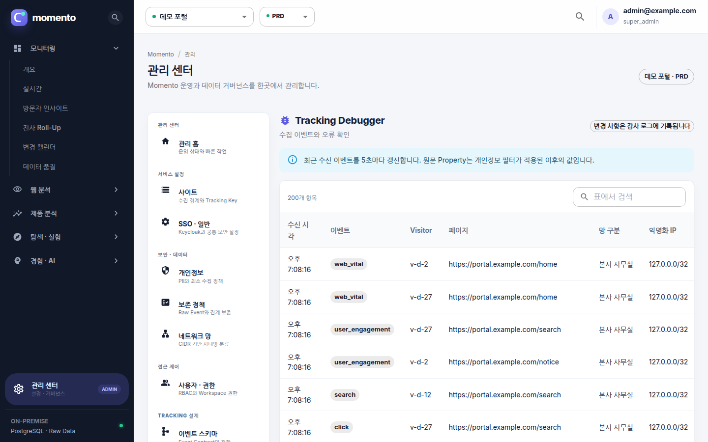

### 5.3 백업과 복구

백업 대상은 PostgreSQL뿐입니다.

```bash
pg_dump -Fc -h db.internal -U momento momento > momento-$(date +%F).dump
# 복구
pg_restore -h db.internal -U momento -d momento --clean --if-exists momento-2026-09-11.dump
```

`MOMENTO_ENCRYPTION_KEY`는 DB 백업에 들어 있지 않습니다. 백업과 **같은 키**를 비밀 관리 체계에 따로 보관해야 복구 뒤 저장된 비밀값을 읽을 수 있습니다.

### 5.4 업그레이드와 되돌리기

1. `pg_dump`로 백업합니다.
2. 새 이미지를 적재하고(`docker load`) `compose.yml`의 `image:` 태그를 새 버전으로 바꾼 뒤 `docker compose up -d --no-build`로 컨테이너를 교체합니다.
3. 로그에 `Momento started`와 `/api/v1/version`의 버전을 확인합니다.

마이그레이션은 기동 시 전진 적용되며 Raw Event를 삭제하지 않습니다. `013_analytical_indexes.sql`처럼 인덱스를 만드는 마이그레이션은 세션 수가 많은 설치에서 최초 기동에 수 분 걸릴 수 있습니다 — `/health/ready`가 503을 반환하는 동안 기다립니다.

**되돌리기**: 마이그레이션은 역방향이 없습니다. 이전 이미지로 돌아가려면 1번의 백업을 `pg_restore`로 복구한 뒤 이전 태그로 컨테이너를 교체합니다. 업그레이드 이후 수집된 이벤트는 그 백업에 없으므로, 되돌리기 전에 SDK 트래픽을 프록시에서 잠시 차단하거나 손실을 감수할지 정합니다.

### 5.5 정기 작업의 주기

| 작업 | 주기 | 확인하는 곳 |
| :--- | :--- | :--- |
| Inbox → Raw Event 처리(Worker) | 100ms 폴링 | `관리 센터` 홈의 수신·대기·오류, `데이터 품질` |
| 보존 정책 적용·재집계(Maintenance) | 15초 폴링, 보존은 매시간 | `보존 정책` 상단, `Analytics Engineering → Aggregate` |
| 정기 배달(Automation) | 30초 폴링 | `Report · Action`의 Delivery Run |

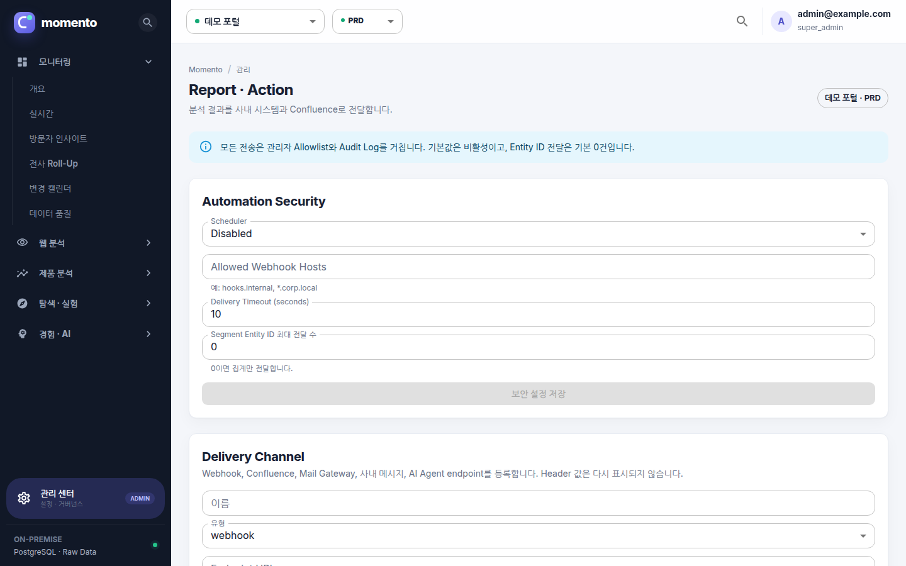

### 5.6 감사 로그

`관리 센터 → 감사 로그`(`GET /api/v1/audit`)에서 사이트 생성, 설정 변경, 키 발급·회전·조회, 개인정보 요청 승인, 방문자 개인 조회를 봅니다. 추가 전용이며 애플리케이션은 지우지 않습니다. DB 운영자는 별도의 DB 권한 통제·백업·보존 정책으로 무결성을 보호해야 합니다.

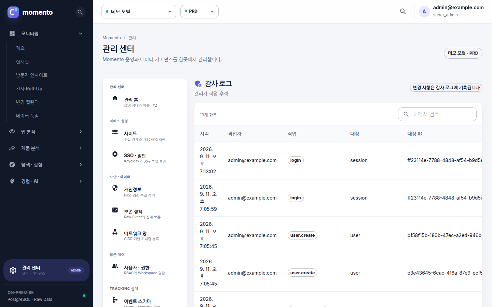

### 5.7 개인정보 요청

`관리 센터 → Privacy Requests`에서 삭제 또는 Export 요청을 만들고, **별도의 승인 동작**으로 실행합니다. User ID 삭제는 Identity Graph에 연결된 Visitor까지 포함하며 파생 테이블을 재구축합니다. 승인 실행과 영향 건수는 감사 로그에 남습니다. 승인된 Export는 NDJSON으로 스트리밍되며, 중간에 끊기면 마지막 줄이 그 사실을 말합니다 — 완전하거나 거부되거나 둘 중 하나입니다.

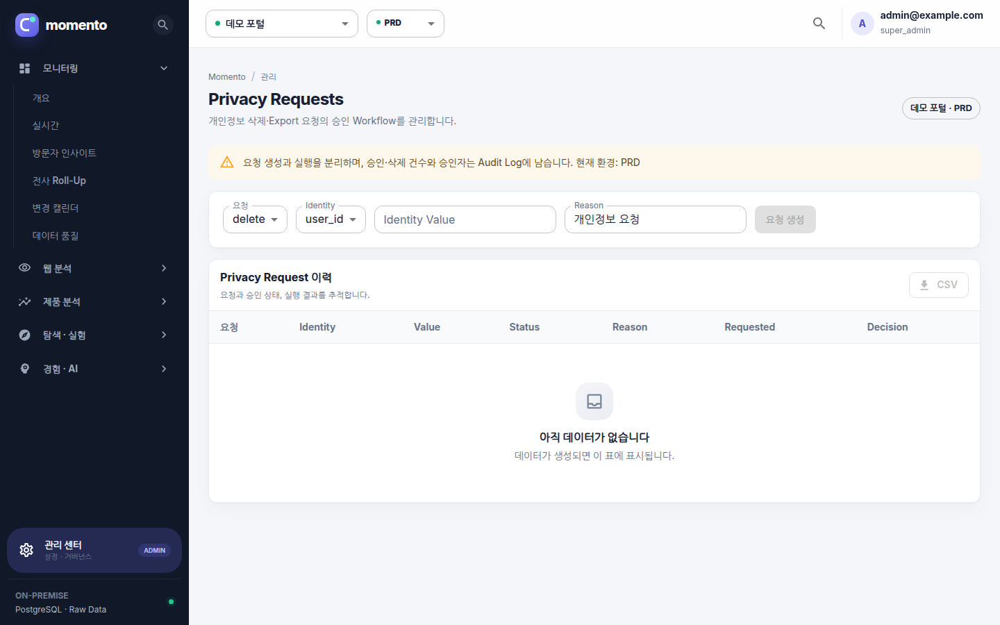

---

## 6. 장애 대응

증상 → 확인할 곳 → 조치. 로그 문구는 실제로 찍히는 `msg` 값입니다.

| 증상 | 로그·화면에 보이는 것 | 조치 |
| :--- | :--- | :--- |
| 컨테이너가 바로 종료 | `configuration rejected` `MOMENTO_POSTGRES_DSN, MOMENTO_BOOTSTRAP_ADMIN and MOMENTO_BOOTSTRAP_ADMIN_PASSWORD are required` | 필수 변수 세 개를 넣습니다. |
| 컨테이너가 바로 종료 | `configuration rejected` `MOMENTO_BOOTSTRAP_ADMIN_PASSWORD must be at least 12 characters` | 12자 이상으로 바꿉니다. |
| 컨테이너가 바로 종료 | `database unavailable` | DSN·네트워크·인증서(`sslmode`)를 확인합니다. |
| 컨테이너가 바로 종료 | `migration failed` | DB 사용자에게 DDL 권한이 있는지, 디스크가 찼는지 확인합니다. 마이그레이션 이름이 함께 찍힙니다. |
| 컨테이너가 바로 종료 | `encryption key rejected` | `MOMENTO_ENCRYPTION_KEY` 형식(32 byte base64/hex 또는 16자 이상)을 확인합니다. |
| 컨테이너가 바로 종료 | `bootstrap failed` | `users` 테이블 제약 위반 등. 이메일 형식을 확인합니다. |
| 재기동 뒤 API 키·Tracking Key를 다시 볼 수 없음 | `secret encryption disabled: set MOMENTO_ENCRYPTION_KEY so API keys stay readable after a restart` | 키를 설정하고 기존 키를 한 번 회전합니다. |
| `/health/ready`가 503 | `DATABASE_UNAVAILABLE` | DB 연결 또는 마이그레이션 진행 중. 로그의 `Momento started`를 기다립니다. |
| 콘솔은 뜨는데 수집 0건 | `데이터 품질`의 Reject·Dead Letter, `Tracking Debugger` | 원인별: `origin is not allowed` → 사이트 허용 도메인에 측정 대상 호스트 추가. `invalid tracking key` → SDK의 사이트 키와 Tracking Key 회전 여부. `unknown or inactive environment` → `data-environment` 값이 Governance에 등록·활성인지. `server API key is required for server-side events` → Origin 없는 요청은 Server API Key만. 브라우저 콘솔의 `Refused to connect ... Content Security Policy` → 사용자 가이드 7.1.2. |
| 수집은 되는데 사내망이 `External / Unclassified` | `사내 사용 현황`의 망 | `네트워크 망`에 CIDR이 없거나, 리버스 프록시 뒤라 클라이언트 IP가 프록시 IP로 보임. `security.trusted_proxy_cidrs`에 프록시 대역을 넣어 `X-Forwarded-For`를 신뢰하게 합니다. |
| 리포트가 500, DB 로그에 `could not resize shared memory segment ... No space left on device` | PostgreSQL 컨테이너의 `/dev/shm` 부족 | PostgreSQL 컨테이너에 `shm_size: 1gb`. [OFFLINE.md](OFFLINE.md) |
| 화면에 `조회가 25초 제한을 넘었습니다` | `504 QUERY_TIMEOUT` | 정상 보호 동작. 반복되면 `Analytics Engineering → Aggregate`에서 재집계가 밀렸는지, DB 인덱스(`013_analytical_indexes.sql`)가 만들어졌는지 확인합니다. |
| 이상 감지가 느림 | `Aggregate` 탭에 대기·실패 작업 | 평가 대상 날짜의 Rollup이 없으면 Raw Event를 읽습니다. 재집계를 요청합니다. |
| `aggregate maintenance failed` `deadlock detected (SQLSTATE 40P01)` | 재집계 작업이 `failed` | 대량 과거 이벤트 반입 직후 Worker와 재집계가 같은 날짜를 갱신할 때 발생할 수 있습니다. 다음 주기에 다시 시도되며, 남은 `failed` 작업은 `Aggregate` 탭에서 해당 기간을 다시 요청합니다. |
| 정기 배달이 나가지 않음 | `scheduled delivery failed`, Delivery Run의 오류 | `automation.enabled`와 `allowed_webhook_hosts`를 확인합니다. 빈 Allowlist에서는 어떤 Endpoint도 호출하지 않습니다. 보낼 상태가 없어 `skipped`인 것은 오류가 아닙니다. |
| 보존 정책이 도는지 알 수 없음 | `보존 정책` 상단의 직전 보존 작업 | "완료 · 0행"은 삭제 대상이 없었다는 뜻입니다. 실패했다면 원인이 같은 자리에 표시됩니다(8.2). |
| 로그인 시 `too many login attempts` | `RATE_LIMITED` 429 | IP당 분당 10회. 1분 뒤 재시도. 프록시 뒤에서 모든 사용자가 한 IP로 보이면 `trusted_proxy_cidrs`를 설정합니다. |
| OIDC 로그인 실패 | `OIDC_ERROR`, `OIDC_EXCHANGE_FAILED` | Redirect URI가 `<public_url>/api/v1/auth/oidc/callback`과 정확히 같은지, Issuer URL에 컨테이너가 접근 가능한지 확인합니다. |
| 요청 처리 중 예외 | `panic` | 요청 경로와 함께 찍힙니다. 재현 경로를 포함해 이슈로 보고합니다. |

---

## 7. 보안

**설치 직후 바꿔야 하는 것**

- `MOMENTO_BOOTSTRAP_ADMIN_PASSWORD`는 최초 계정 생성에만 쓰입니다. 로그인 뒤 프로필에서 비밀번호를 바꾸고, 가능하면 OIDC를 켜서 로컬 비밀번호 로그인을 줄입니다.
- `general.public_url`을 실제 외부 주소로 설정합니다. 비어 있으면 요청 Host로 추정합니다.
- `privacy.pii_detection_mode`의 기본 `mask`를 조직 정책에 맞춰 검토합니다(`detect`·`warn`·`mask`·`reject`).
- `privacy.strip_query_string`은 기본 `false`입니다. SDK가 이미 Query String을 보내지 않지만, 서버 사이드 수집이 있다면 켜는 것을 검토합니다.
- 관리자를 두 명 이상 둡니다. `관리 센터` 홈의 운영 준비도가 관리자 이중화를 점검합니다.

**외부에 열면 안 되는 것**

- PostgreSQL 포트. Momento 컨테이너만 접근합니다.
- `:8080`을 직접 인터넷에 열지 않습니다. TLS 종단 리버스 프록시 뒤에 두고, 측정 대상 서비스가 외부에 있다면 `/collect/v1/events`와 `/tracker.js`만 노출하는 것을 검토합니다. 프록시 대역은 `security.trusted_proxy_cidrs`에 등록합니다.
- 컨테이너는 `read_only`, `no-new-privileges`, `cap_drop: ALL`로 실행합니다. `compose.yml`이 그렇게 설정돼 있습니다.

**키와 비밀값**

- Tracking Key(`mom_track_`)는 페이지 HTML에 노출되는 값입니다. 그래서 Origin 없는 서버 간 요청은 Server API Key(`mom_server_`)만 받습니다.
- 개인 API Key는 관리자 기능과 대화형 쓰기를 항상 거부합니다. 스크립트에 오래 남는 자격 증명이 배포 설정을 바꿀 수 있어서는 안 됩니다.
- MCP SSO 토큰(3.5)은 같은 거부를 받고, 그 위에 `/mcp` 밖에서는 아예 인증되지 않습니다. 이 두 게이트는 "세션이 아닌 주체"라는 하나의 판정(`Principal.Programmatic`)을 공유하므로 새 자격 종류가 관리자 게이트를 지나치는 일이 없습니다.
- Delivery Channel의 인증 Header 값은 암호화 저장되고 API로 다시 노출되지 않습니다.
- `MOMENTO_ENCRYPTION_KEY`를 잃으면 암호화 저장된 비밀값은 복구할 수 없습니다. 백업과 함께 보관합니다.

**정기 배달**

- `automation.allowed_webhook_hosts`에 있는 호스트만 호출합니다. HTTP(S)만 허용하고 URL 내 Credential과 Redirect는 거부합니다.
- Segment 배달은 기본적으로 집계만 보내고 `max_entity_ids=0`입니다. 개인 ID를 밖으로 내보내려면 명시적으로 올려야 합니다.

**개인정보**

- Visitor Profile을 끄면 개인 단위 화면·API가 모든 역할에 대해 차단됩니다.
- 방문자 개인 조회, 키 재조회, 개인정보 요청 승인은 감사 로그에 남습니다.
- 개인정보 삭제는 Inbox·Dead Letter 원본까지 정리한 뒤 파생 데이터를 재생성하므로 Worker 재시도로 복원되지 않습니다(8.10).

---

## 8. 참고: 정책과 동작의 세부

아래는 운영 중 판단이 필요할 때 보는 세부 규칙입니다. 버전이 적힌 항목은 그 버전에서 동작이 바뀐 것입니다.

### 8.1 릴리즈 자산이 누락되지 않는지

오프라인 설치는 릴리즈 자산(`momento-vX.Y.Z.tar.gz`와 체크섬)에 의존합니다. 태그를 밀면 릴리즈 워크플로가 실행되지만, 그 트리거는 한 번뿐이라 플랫폼 장애 시 유실될 수 있습니다.

`Release reconciliation` 워크플로가 매시간 최근 7일 태그와 릴리즈를 대조해, 릴리즈가 없거나 자산이 두 개가 아니면 릴리즈 워크플로를 다시 실행합니다. 수동으로 실행할 수도 있습니다.

### 8.2 보존 정책이 실제로 적용되는 범위

| 항목 | 적용 |
| :--- | :--- |
| Raw Event (월) | 적용 — 기간이 지난 Raw Event 삭제 |
| Session (월) | 적용 — Session 요약과 Visitor↔Session 색인(`visitor_sessions`) 둘 다 |
| 신원 (Visitor ID ↔ User ID) | 적용 — v0.32.4부터 남은 이벤트·세션이 없는 방문자의 매핑과 per-visitor 집계 삭제 |
| 집계 (월) | **적용** — 일별 집계 3종에서 기간이 지난 날짜 삭제. 비우면 무기한 보관 |
| Debugger / Dead Letter (일) | 적용 |
| Realtime (시간) | **적용되지 않음** — 별도의 Realtime 저장소가 없어 삭제 대상이 없습니다. API 호환을 위해 값은 계속 저장됩니다 |

집계 보존은 v0.29.0부터 적용됩니다. 이전에는 값을 저장만 하고 읽지 않아, 기간을 설정해도 일별 집계가 무기한 보관됐습니다.

일별 집계 중 방문자·세션 테이블은 하루에 방문자 한 명당 한 행이고 행마다 Visitor ID와 User ID가 있습니다. 집계 기간을 비워 두면 Raw Event가 삭제된 뒤에도 사람 단위 기록이 남습니다.

Visitor↔Session 색인은 v0.34.35부터 Session 보존기간을 따릅니다. 그 이전에는 **어떤 보존 작업도 이 테이블에서 행을 지운 적이 없어**, Raw Event와 Session이 사라진 뒤에도 Visitor ID·Session ID·User ID와 최초/최근 시각이 무기한 남았습니다. 개인 단위 삭제(개인정보 요청)는 파생 테이블을 재구축하므로 영향이 없었고, 기간 기반 보존만 이 테이블을 지나쳤습니다.

`관리 ➔ 보존 정책` 화면 상단이 **직전 보존 작업**을 보고합니다 — 실행 시각, 소요 시간, 테이블별 삭제 행 수, 그리고 실패했다면 그 원인. 이 기록은 v0.32.6부터 남습니다. 이전에는 정책과 수정 시각만 보였고 실패는 stderr 로그 한 줄로 끝났으므로, 로그 수집이 없는 폐쇄망에서는 **한 달째 실패하는 작업과 삭제 대상이 없는 작업을 구분할 방법이 없었습니다.** 삭제 대상이 없었던 회차도 "완료 · 0행"으로 보고되므로, 화면이 조용한 것과 작업이 멈춘 것이 구분됩니다. 기록은 최근 200회만 유지됩니다.

보존 작업은 매시간 무인으로 돌며, 테이블마다 2만 행씩 나눠 삭제하고 각 배치를 즉시 커밋합니다. 정책을 크게 줄인 직후처럼 삭제 대상이 많을 때도 진행한 만큼은 남으므로, 재기동이나 statement timeout으로 중단되어도 다음 시간에 이어서 수렴합니다. 한 번에 삭제하던 v0.32.4까지는 완료 전에 중단되면 아무 진행도 남지 않았습니다.

### 8.3 삭제와 보존의 검증 범위

개인정보 삭제는 규정 준수 약속이므로 통합 테스트로 확인합니다. `user_id` 모드 삭제 후 `raw_events`, `sessions`, `visitors`, `visitor_sessions`, `visitor_identities`, `identified_users`, `daily_site_visitors`, `daily_site_sessions` 여덟 개 테이블에 잔존 행이 없고, 같은 사이트의 다른 사람 데이터는 남아 있는지 확인합니다. `visitor`, `period`, `property` 모드도 각각 경계 밖 데이터 보존과 property만 제거되는지 확인합니다.

Retention은 사이트별 정책을 적용해 정책 밖 데이터가 삭제되고 정책 안 데이터가 유지되는지, Aggregate 재집계는 큐가 비고 실패 작업이 없는지 확인합니다.

### 8.4 분석 쿼리 보호

`최대 정확 조회 기간`은 쿼리 빌더뿐 아니라 **모든 분석 리포트 화면에 적용됩니다.** v0.28.0 이전에는 쿼리 빌더 한 곳에서만 확인해, 한도를 낮춰도 무거운 리포트 화면은 제한 없이 조회되고 있었습니다. 콘솔의 기간 선택지도 이 한도를 반영하므로 거절될 기간은 애초에 제시되지 않습니다.

대화형 분석 조회(방문자 인사이트, 이상 감지, 기여도, 방문자 검색·추적, Funnel)는 **25초 제한** 아래에서 실행됩니다. 초과하면 연결을 붙잡아 두지 않고 `504 QUERY_TIMEOUT`으로 즉시 끝나며, 기간 축소·Segment 적용·Scheduled Report 사용을 안내합니다. 요청이 취소되면 데이터베이스 쿼리도 함께 취소됩니다.

방문자 인사이트 보고서는 서로 독립적인 8개 조회를 **동시 실행 4개 상한**으로 병렬 수행합니다. 연결 풀(20)을 한 요청이 소진하지 않도록 상한을 두었고, 하나가 실패하면 나머지를 취소해 부분 결과를 완성된 보고서로 표시하지 않습니다.

이상 감지 기준선은 일별 Rollup(`daily_site_metrics`, `daily_site_visitors`, `daily_site_sessions`)에서 계산합니다. 평가 대상 날짜의 Rollup이 아직 없으면 그때만 Raw Event를 읽습니다. 따라서 Aggregate가 밀려 있으면 이상 감지가 느려질 수 있으며, 관리 → Aggregate Manager에서 재집계 상태를 확인하십시오.

`013_analytical_indexes.sql`은 `sessions` 인덱스와 방문자 검색용 `pg_trgm` 인덱스를 만듭니다. 세션 수가 많은 기존 설치에서는 이 마이그레이션이 최초 기동 시 수 초에서 수 분 걸릴 수 있습니다. `pg_trgm` 확장을 만들 권한이 없으면 인덱스 생성을 건너뛰고 순차 검색으로 동작합니다.


### 8.5 개인정보 (PII) 필터 & URL 마스킹

수집기(Durable Collector)는 Inbox에 저장하기 전 개인정보 정책을 적용합니다. 기본 정책은 개인정보로 지정된 Property key를 중첩 객체와 Item 배열까지 제거하며, URL Query String과 Fragment를 제거합니다. Query String 수집을 명시적으로 활성화한 경우에만 관리자 목록의 Parameter를 마스킹합니다.

- **기본 차단 Property**: `email`, `phone`, `resident_number`
- **기본 URL 정책**: Query String 및 Fragment 제거
- **Query 수집 활성화 시 기본 마스킹 Parameter**: `token`, `password`, `email`
- **IP 익명화**: IPv4 `/24`, IPv6 `/64`
- **선택 정책**: User ID·User Agent 수집, Query String 제거, DNT, Visitor Profile

> **관리자 제어**: 관리자 콘솔 `관리 ➔ 개인정보` 메뉴에서 차단 key와 URL Parameter를 변경할 수 있습니다. SDK는 자동 DOM text 수집을 기본 비활성화하고 흔한 이메일·전화번호·주민번호 형태의 Error Message를 치환하지만, Custom Property 값까지 판별하지는 않으므로 연동 단계에서도 PII를 보내지 않아야 합니다.


### 8.6 CIDR 서브넷 망대역 매핑

사내 C-Class 및 CIDR IP 서브넷 대역을 특정 물리적 오피스 또는 사업장 이름으로 매핑합니다.

```json
[
  { "cidr": "10.10.0.0/16", "name": "본사 판교 R&D 센터" },
  { "cidr": "10.20.0.0/16", "name": "서초 디지털 오피스" },
  { "cidr": "192.168.100.0/24", "name": "사내 SSL-VPN 접속망" }
]
```


### 8.7 API 키 관리와 감사 로그

#### 8.7.1 API 키가 할 수 있는 일

개인 API 키(`mom_key_`)는 **분석 데이터를 읽기 위한 것**입니다. 스크립트나 BI 도구에서 사용합니다.

- **관리 작업은 어떤 것도 할 수 없습니다.** 키 소유자가 최고 관리자여도 마찬가지입니다 — 인증 종류로 거부하므로 역할과 무관합니다
- **변경 작업 전체가 막혀 있습니다.** 57개 변경 경로 중 51개가 키를 즉시 거부하고, 나머지 6개는 질의문이 길어 POST를 쓰는 **조회**입니다: 쿼리 빌더(`/query`), 퍼널(`/funnel`), 자연어 질의, 여정 분석 2종, 이벤트 계약 검증. 이 6개는 아무것도 쓰지 않습니다
- 이 경계는 통합 테스트가 라우터를 순회하며 매번 확인합니다. 변경 경로가 새로 추가되면서 이 보호가 빠지면 CI에서 경로 이름과 함께 실패합니다
- 키는 **소유자가 볼 수 있는 모든 사이트**를 읽습니다. 특정 사이트로 좁히는 기능은 없습니다. 응답의 `scopes` 필드는 현재 모든 키가 동일한 값(`analytics:read`)을 가지며, 위 제한은 이 필드가 아니라 인증 계층이 강제합니다
- 서버 사이드 수집에는 개인 키가 아니라 **사이트별 Server API Key**(`mom_server_`)를 사용합니다

#### 8.7.2 API 키 발급 및 회전
- API 키는 발급 시 단 1회만 원문이 표시되며, DB에는 SHA-256 해시값으로만 보관됩니다.
- 개인 키 회전 시 기존 키는 즉시 폐기되고 새 키가 1회 표시됩니다. 무중단 교체가 필요하면 새 키를 별도로 발급한 후 클라이언트를 전환하고 기존 키를 폐기하십시오.

#### 8.7.3 감사 로그
- 사이트 생성, 개인정보 설정 변경, Keycloak 설정 수정, API 키 발급/폐기 등의 작업은 애플리케이션 API를 통해 추가 전용 감사 로그로 기록됩니다. DB 운영자는 별도의 DB 권한 통제·백업·보존 정책으로 로그 무결성을 보호해야 합니다.


### 8.8 사이트별 보존정책과 Dimension Registry

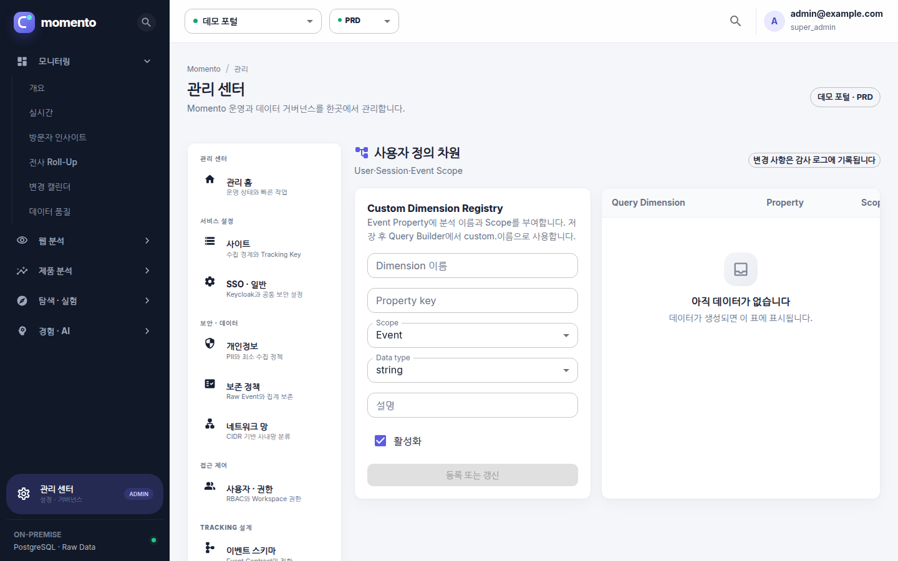

- `관리 ➔ 보존 정책`에서 Raw Event, Session 요약, Aggregation, Realtime, Debug/Dead Letter 보존기간을 사이트별로 지정합니다.
- Raw Event와 Session 정리는 매시간 실행되며, Session은 Raw Event보다 오래 보존할 수 있도록 별도 요약 테이블에 저장됩니다.
- `관리 ➔ 사용자 정의 차원`에서 User, Session, Event, Item Scope와 데이터 타입을 등록합니다. 활성 User/Session/Event 차원은 `custom.<name>`으로 Query와 Segment에서 사용할 수 있습니다.

### 8.9 사이트 Timezone과 참여 세션 기준

- `관리 ➔ 사이트 ➔ 설정`에서 IANA Timezone(예: `Asia/Seoul`)과 참여 기준 시간(기본 10초)을 지정합니다.
- Event Timestamp는 UTC로 저장되지만 날짜 범위, 일별 Trend, Query, Funnel, Export와 MCP는 Site Timezone의 자정 경계를 사용합니다.
- 참여 세션은 `지속시간 ≥ 기준`, `Conversion 1회 이상`, `Page View 2회 이상`, `Active Engagement ≥ 기준` 중 하나를 충족하면 됩니다.
- 기준 시간을 바꾸면 기존 Session 요약의 `engaged` 값도 같은 트랜잭션에서 즉시 다시 계산됩니다.

### 8.10 개인정보 삭제 일관성

Visitor, User ID, 기간 또는 Site 삭제는 PostgreSQL Inbox와 Dead Letter 원본 payload를 먼저 정리하고 Raw Event를 삭제한 뒤 남은 Raw Event에서 Session, Visitor, Identity Graph와 일별 집계를 재생성합니다. User ID 삭제 시 Identity Graph에 연결된 로그인 전 익명 Visitor와 다른 기기의 Raw Event도 함께 삭제합니다. Event Property 삭제도 처리 대기/Debug payload와 Raw Event에 함께 적용됩니다. 따라서 삭제된 데이터가 Worker 재시도로 복원되거나 파생 보고서에 잔존하지 않습니다.

### 8.11 Identity Graph와 파생 집계 운영

- `visitor_identities`는 `(site_id, visitor_id) → user_id`의 결정적 연결을 보관합니다.
- `identified_users`는 연결된 모든 Visitor에서 가장 이른 최초 활동과 최신 User Property를 유지합니다.
- `visitors`, `visitor_sessions`, `daily_site_metrics`, `daily_site_visitors`, `daily_site_sessions`는 Worker가 Raw Event와 같은 transaction에서 증분 갱신합니다.
- Overview의 Site-local 일별 Trend는 일별 집계를 사용하고, 임의 시각 범위는 Raw Event로 정확히 fallback합니다.
- Site Timezone을 바꾸면 Raw Timestamp는 그대로 두고 일별 집계만 새 Calendar 경계로 즉시 재생성합니다.
- 장애 복구와 개인정보 삭제에서는 Raw Event를 Single Source of Truth로 파생 데이터를 재생성합니다.

### 8.12 Environment와 Event Contract

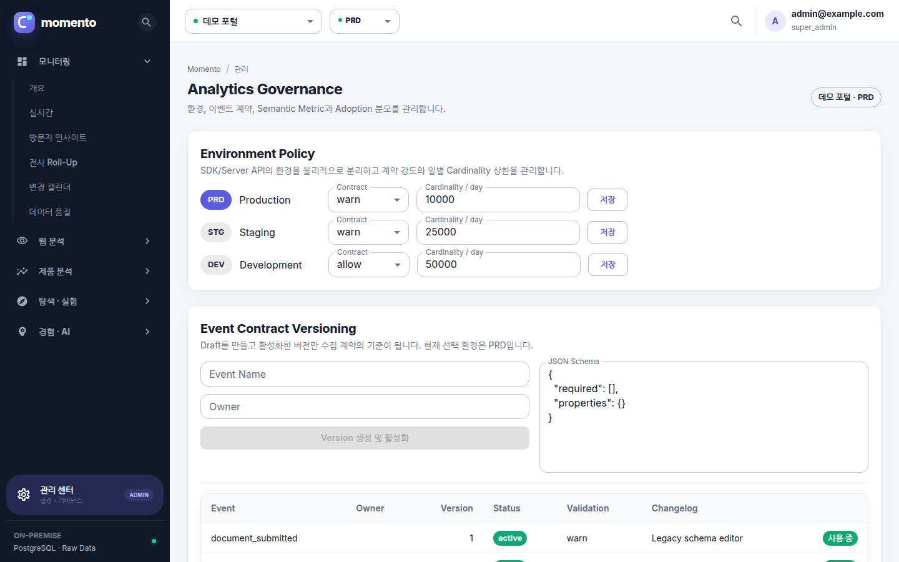

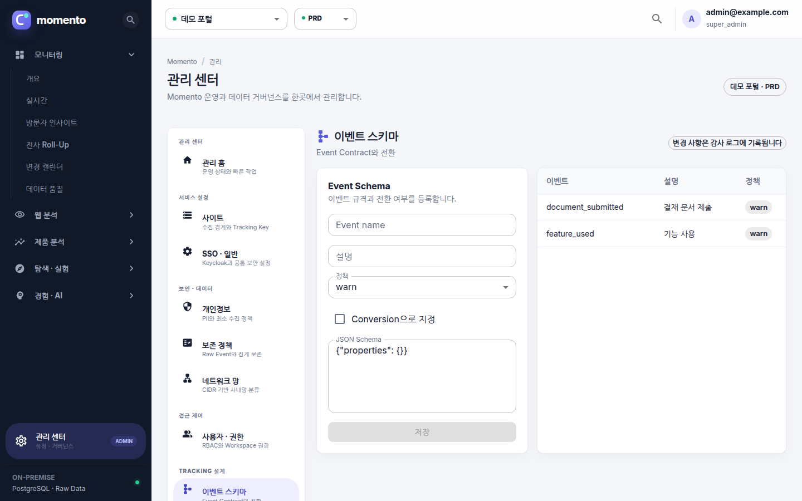

- `Analytics Governance`에서 Site별 DEV/STG/PRD와 사용자 정의 Environment를 관리합니다.
- 각 Environment는 Event Contract 정책 `allow`, `warn`, `reject`와 일별 Cardinality Limit를 가집니다.
- Event Contract는 Version마다 JSON Schema, Validation Mode, Changelog, 작성자와 활성시각을 보관합니다.
- Draft는 수집에 사용할 수 없습니다. Active Version을 바꾸면 이전 Active는 Deprecated가 되지만 Retry 호환을 위해 계속 검증할 수 있습니다.
- `max_events_per_request`는 실제로 적용됩니다. 한도와 같은 크기의 배치는 수락되고 한도를 넘으면 거부되며, 거부 메시지에 현재 한도가 담기는지 통합 테스트로 확인합니다.
- 트래픽 분류(`known_bot`·`monitoring`·`suspicious`·`normal`)는 **User-Agent만으로** 결정됩니다. 사내망 여부는 이 값을 덮어쓰지 않고 `traffic.internal`이 따로 답합니다 — 사내망 크롤러는 `known_bot`이면서 내부입니다. 어느 쪽도 **리포트에서 자동으로 제외되지 않으며**, 제외는 Segment(`traffic.class`, `traffic.internal`)로 수행합니다. 분류 자체와 Segment 필터가 동작하는지 통합 테스트로 확인합니다.
- 서버 사이드 수집 규칙도 통합 테스트로 확인합니다. Origin 헤더가 없는 요청은 서버 간 호출로 보아 **Server API Key만** 허용하고 Tracking Key는 거부합니다. Tracking Key는 페이지 HTML에 노출되므로, 그것으로 서버 사이드 이벤트를 주입할 수 있어서는 안 됩니다. Origin이 있는 요청은 두 Key 모두 허용하되 허용 도메인 목록을 통과해야 합니다.
- 로그인은 IP 기준으로 제한됩니다. 잘못된 비밀번호를 반복하면 `RATE_LIMITED`(429)를 반환하는지 통합 테스트로 확인합니다.
- 접근 제어도 통합 테스트로 확인합니다. Analyst는 자기 Workspace의 사이트만 조회할 수 있고 다른 조직의 사이트에는 404를 받으며(사이트 존재를 확인해 주지 않기 위해 403이 아닙니다), 사이트 목록에도 나타나지 않습니다. 관리자 전용 엔드포인트는 403을 반환합니다. `user_workspace_roles`에 권한을 부여하면 같은 요청이 성공하고 회수하면 다시 거부되는 것까지 확인합니다.
- `visitor_profiles`를 끄면 super_admin에게도 방문자 목록·식별 사용자 목록·개인 타임라인이 차단됩니다. 권한 등급이 아니라 개인정보 정책이기 때문입니다. 사람을 지목하지 않는 리포트는 계속 동작합니다.
- Environment 격리는 통합 테스트로 확인합니다. `stg` 환경에 전용 Event 이름과 페이지를 시드한 뒤, `prd` 리포트에 그것이 나타나지 않고 `stg` 리포트에는 나타나는지, 그리고 무거운 리포트들이 두 환경에 대해 서로 다른 문서를 반환하는지 검사합니다.
- tracker가 스스로 보내는 Event(`page_view`, `click`, `outbound_click`, `file_download`, `scroll`, `form_start`, `form_submit`, `user_engagement`, `error`, `resource_error`, `web_vital`, `rage_click`, `dead_click`, `rapid_back`, `form_retry`, `repeated_search`, `error_after_click`, `slow_interaction`, `search`, `search_click`, `search_refine`)는 제품 구성 요소이므로 `reject` 모드에서도 미등록으로 거부되지 않습니다. 직접 등록하면 그 Site의 Schema와 Validation Mode가 그대로 적용됩니다. 이 예외가 없으면 `reject`를 켜는 순간 내장 Event가 섞인 모든 배치가 거부되고, 새 자동 신호가 추가될 때마다 기존 Site가 깨집니다.
- PRD를 비활성화할 수 없으며 SDK와 Server API가 Environment를 생략하면 PRD가 적용됩니다.

### 8.13 Semantic Metric과 Data Quality

- Semantic Metric은 관리자 정의 SQL을 받지 않고 허용된 JSON AST만 저장합니다.
- 수정 시 Version이 증가하고 REST/Query/MCP가 동일한 정의를 사용합니다.
- Session Scope Filter는 SDK/HTTP Event 발생 시점의 `session_properties`를 사용하며 Raw Event 전체 재빌드에서도 최신 Event 값 우선으로 복원됩니다.
- Data Quality는 Received, Accepted, Duplicate, Late, Reject, Contract Warning, Missing User/Feature, Unknown Network, PII Blocked, Dead Letter, Cardinality를 표시합니다.
- Cardinality 원문은 저장하지 않으며 SHA-256 digest로 Daily Distinct만 계산합니다.

### 8.14 Report / Action 보안

Scheduled Report를 사용하려면 먼저 관리자 설정 `automation`에서 기능을 활성화하고 `allowed_webhook_hosts`를 지정해야 합니다. 빈 Allowlist에서는 어떤 Endpoint도 호출하지 않습니다.

- 지원 Channel: Webhook, Confluence, Mail HTTP Gateway, Internal Message HTTP Gateway, AI Agent
- HTTP(S)만 허용하며 URL 내 Credential과 Redirect는 허용하지 않습니다.
- Channel Header 값은 저장 후 API에서 다시 노출하지 않습니다.
- Segment Delivery는 기본적으로 Aggregate만 전송하고 `max_entity_ids=0`입니다.
- 실행 결과는 Delivery Run과 Audit Log에서 확인합니다.

### 8.15 Analytics Engineering

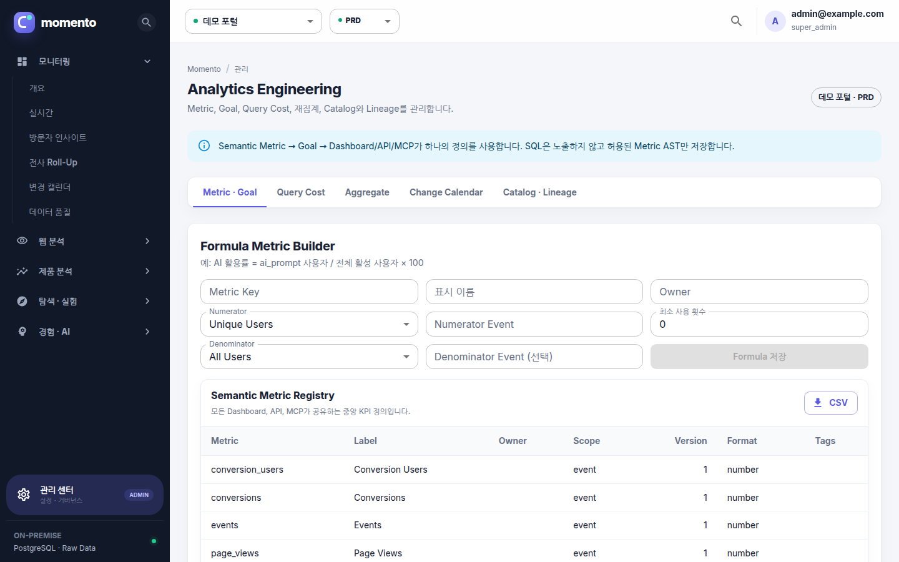

- Formula Metric Builder는 Numerator/Denominator, 집계, Event, 최소 사용 횟수를 허용된 AST로 저장합니다. Metric마다 Owner, Entity Scope와 Tag를 지정하십시오.
- Goal Framework는 Metric, 목표값, `gte/lte`, 일/주/월/분기, Environment, 조직·부서 범위를 관리합니다.
- Query Policy는 Exact 최대 기간, Complexity 상한, Guarded 실행 기준과 Fast/Preview 표본 비율을 Site별로 제한합니다.
- Event Contract CI endpoint는 배포 전 미등록 Event, Version, Required Property, Deprecated 계약을 검사합니다.
- Event Catalog와 Lineage는 Event → Metric → Goal 사용 관계, Owner, First/Last Seen과 Volume을 표시합니다.

### 8.16 Aggregate와 Late Event 운영

Event가 수신 시각보다 한 시간 이상 과거이면 Momento는 Site Timezone의 해당 날짜에 `late_event` 재집계 Job을 한 건만 생성합니다. Maintenance Worker는 Raw Event를 기준으로 Site/Visitor/Session 일별 집계를 다시 계산합니다. 관리자는 Analytics Engineering에서 367일 이하 Date Range 또는 Full Rebuild를 요청할 수 있습니다.

### 8.17 값 기반 PII와 Privacy Request

- `privacy.pii_detection_mode`는 `detect`, `warn`, `mask`, `reject` 중 하나입니다. 기본값은 `mask`입니다.
- Email, 한국 전화번호, 주민번호 형태, Luhn 검증 카드번호, Bearer/JWT Credential을 Inbox commit 전에 검사합니다.
- Data Quality Issue에는 Detector 종류만 기록하고 일치한 원문은 저장하지 않습니다.
- Privacy Request는 요청과 승인을 분리합니다. 승인 실행과 영향 건수는 Audit Log에 남습니다.
- 승인된 Export는 임의 행 제한 없이 NDJSON을 streaming하며 사용자·세션 속성도 포함합니다.

### 8.18 Workspace와 Experiment 운영

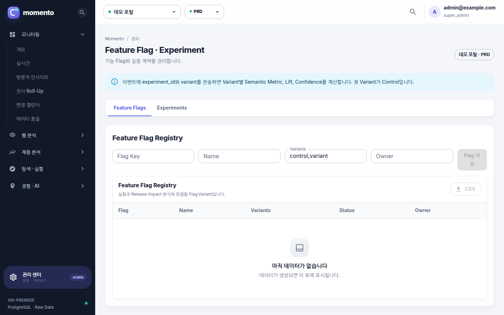

- Workspace Roll-Up과 Cross-Site Journey는 SSO User ID만 Site 간 결합합니다. 익명 ID는 Site 범위를 벗어나 결합하지 않습니다.
- Feature Flag는 2~20개 Variant를 등록할 수 있습니다.
- Experiment에는 `experiment_id`, `variant`, Primary Semantic Metric을 지정합니다. 첫 Variant가 Control이며 Lift와 두 비율 정규 근사 Confidence를 제공합니다.
- Change Calendar에 Release, Deployment, Incident, Campaign, Training, Feature Flag와 조직 변경을 기록하면 분석 시점의 원인 후보를 보존할 수 있습니다.

### 8.19 관리 센터 운영 UX

- `관리 센터` 홈은 현재 Site·Environment의 7일 데이터 품질, 수신·대기·오류, Privacy Request와 Aggregate Job을 운영 브리핑으로 제공합니다.
- 운영 준비도는 활성 Site, Origin 제한, URL Query 제거, PII 값 정책, 관리자 이중화, OIDC 상태를 점검하며 각 미충족 항목에서 설정 화면으로 바로 이동할 수 있습니다.
- 조치 필요 목록은 수집 오류·Dead Letter·재집계 실패를 Critical로, 개인정보 승인 대기·품질 저하·보안 권고를 Warning/Info로 분류합니다.
- 개인정보 화면에서 PII 값 탐지 정책을 `detect`, `warn`, `mask`, `reject`로 변경할 수 있으며 허용되지 않은 값은 서버가 거부합니다.
- `관리 센터`는 서비스 설정, 보안·데이터, 접근 제어, Tracking 설계, 운영 도구를 업무 단위로 구분합니다.
- 각 설정은 `/admin?section=...` 형태의 URL을 가지므로 담당자에게 정확한 관리 화면을 공유하거나 Bookmark할 수 있습니다.
- `Ctrl+K` 또는 `Cmd+K` 명령 팔레트에서 사이트, 개인정보, 사용자·권한, Event Schema, Tracking Debugger 등으로 바로 이동할 수 있습니다. 명령은 현재 RBAC 권한에 맞게 노출됩니다.
- Analytics Engineering은 Metric·Goal, Query Cost, Aggregate, Change Calendar, Catalog·Lineage 탭으로 분리되고 Product Lab은 Feature Flag와 Experiment 탭으로 분리됩니다. `?panel=aggregate`, `?panel=experiments`처럼 탭 URL도 공유할 수 있습니다.
- Full Aggregate Rebuild와 개인정보 삭제 승인은 실행 전 환경과 영향 범위를 다시 확인하는 Dialog를 표시합니다. Privacy Request의 요청·승인 분리와 Audit 기록 원칙은 그대로 유지됩니다.
- 공통 관리 표는 검색, 페이지네이션, CSV 내보내기를 제공하며 빈 결과, Loading Skeleton, 오류와 재시도 상태를 일관되게 표시합니다.
