# Momento 사용자 가이드

- **문서 버전**: v0.34.39
- **대상**: 콘솔에서 분석 화면을 보는 사람 — 서비스 기획자(PO), 데이터 분석가, 운영 담당자. 마지막 절 [7. 개발자: SDK 연동](#7-개발자-sdk-연동)은 측정 대상 서비스를 만드는 개발자용입니다.
- **함께 볼 문서**: 설치·설정·권한·백업은 [관리자 가이드](ADMIN_GUIDE.md)에 있습니다. 이 문서는 그 내용을 되풀이하지 않습니다.

이 문서의 화면 캡처는 v0.34.39 를 실제로 띄우고 가짜 데이터(`데모 포털`, `EMP0001`, `hong@example.com`)를 채운 상태에서 찍은 것입니다.

---

## 목차

1. [이 제품이 하는 일](#1-이-제품이-하는-일)
2. [처음 5분](#2-처음-5분)
3. [화면별 사용법](#3-화면별-사용법)
4. [자주 하는 작업](#4-자주-하는-작업)
5. [막혔을 때](#5-막혔을-때)
6. [용어](#6-용어)
7. [개발자: SDK 연동](#7-개발자-sdk-연동)

---

## 1. 이 제품이 하는 일

Momento는 사내 애플리케이션과 인트라넷에서 일어나는 행동 이벤트를 외부 SaaS로 보내지 않고 **사내 PostgreSQL에 원시 이벤트(Raw Event) 그대로 저장해 분석하는 온프레미스 플랫폼**입니다. 페이지 조회, 클릭, 기능 사용, 검색, 결재 제출 같은 행동이 "누가(부서·조직), 어디서(사내망·기기), 무엇을" 했는지로 남습니다.

화면을 보는 사람은 세 가지를 얻습니다. **지금 봐야 할 것**(이상 감지와 미달 전망 Goal), **누가 다른지**(부서·기기·Segment별 전환·Retention·경험 비교), 그리고 **직접 파보기**(쿼리 빌더, 퍼널, 경로, 방문자 한 사람의 타임라인). 발견한 것은 Markdown·CSV로 가져가거나 정기 배달로 받을 수 있습니다.

개인정보는 설계에서 다룹니다. fingerprint나 확률 결합을 쓰지 않고, 관리자가 정한 PII 정책이 저장 전에 적용되며, 방문자 개인을 조회한 사실은 Audit Log에 남습니다.

---

## 2. 처음 5분

로그인부터 방문자 한 사람의 타임라인까지 한 번에 따라가는 길입니다. 관리자가 사이트를 만들고 SDK를 설치해 데이터가 들어오고 있다는 전제입니다(관리자 가이드 [2. 설치](ADMIN_GUIDE.md#2-설치)).

### 2.1 로그인

브라우저로 Momento 주소(예: `https://momento.internal`)를 엽니다. 관리자에게 받은 이메일과 비밀번호를 넣고 **로그인**을 누릅니다. SSO가 연동된 배포에서는 SSO 로그인 버튼이 함께 나타납니다.

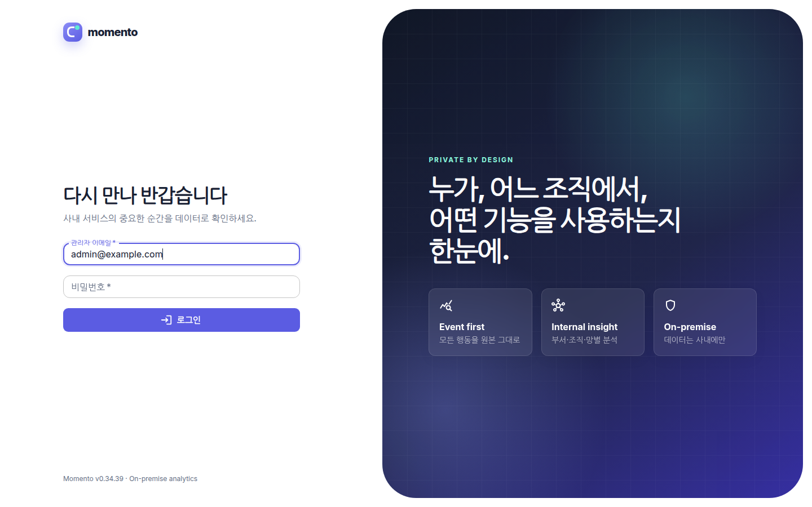

### 2.2 사이트와 환경 고르기

상단 왼쪽의 두 선택 상자가 **지금 보고 있는 범위**입니다. 왼쪽이 사이트(측정 대상 서비스), 오른쪽이 환경(`PRD`·`STG`·`DEV`)입니다. 모든 화면의 숫자는 이 두 값에 따릅니다. 오른쪽 위 `데모 포털 · PRD` 칩으로도 현재 범위를 확인할 수 있습니다.

### 2.3 개요에서 오늘 확인할 것 보기

로그인하면 `모니터링 → 개요`가 열립니다. 상단 **지금 봐야 할 것**이 이상 감지 결과와 미달 전망 Goal을 심각도 순으로 보여주고, 아래 카드가 최근 30일 사용자·세션·페이지뷰·이벤트·전환을 이전 동일 기간과 비교합니다.

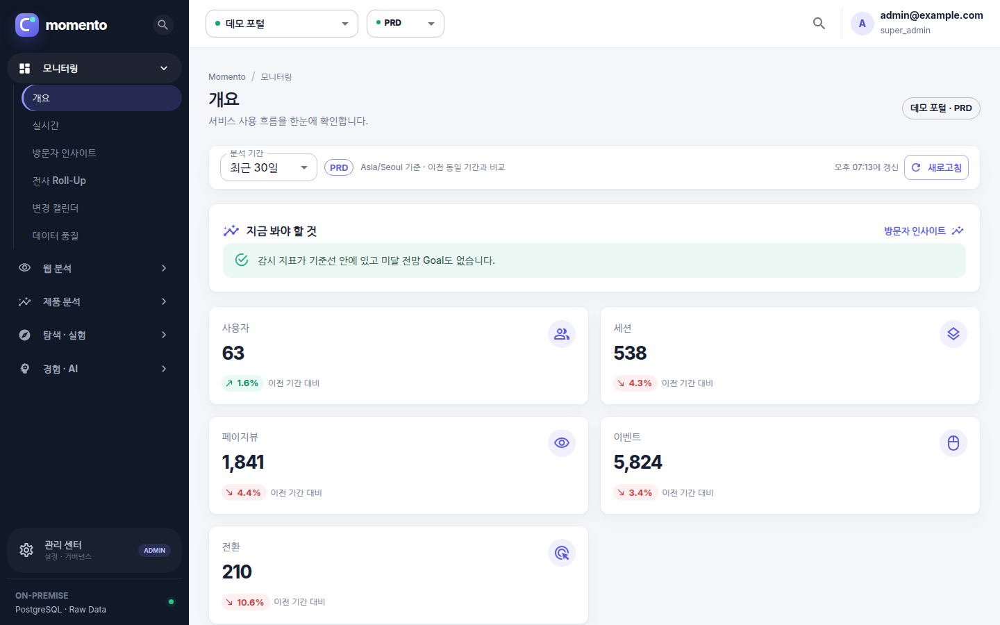

### 2.4 방문자 인사이트에서 원인 후보 읽기

`모니터링 → 방문자 인사이트`를 엽니다. 맨 위 한 줄 요약(방문자 수·신규·참여율·전환율)과 이상 감지 표, 그 아래로 핵심 인사이트·유입 채널·진입 페이지·실행 대상이 이어집니다. 우측 상단 **요약 복사**를 누르면 결론과 근거가 Markdown으로 클립보드에 들어갑니다.

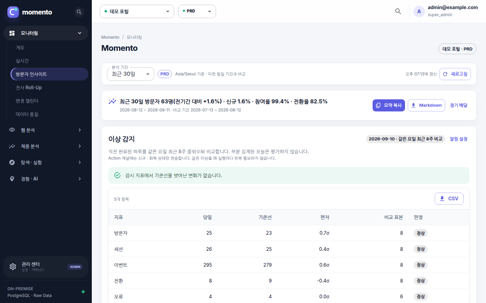

### 2.5 사람 한 명 따라가기

`웹 분석 → User Explorer`에서 검색어 상자에 사용자 ID(예: `EMP0001`)를 넣고 **검색**을 누릅니다. 결과 행의 **추적**을 누르면 그 사람의 모든 기기 활동이 세션별 타임라인으로 합쳐집니다.

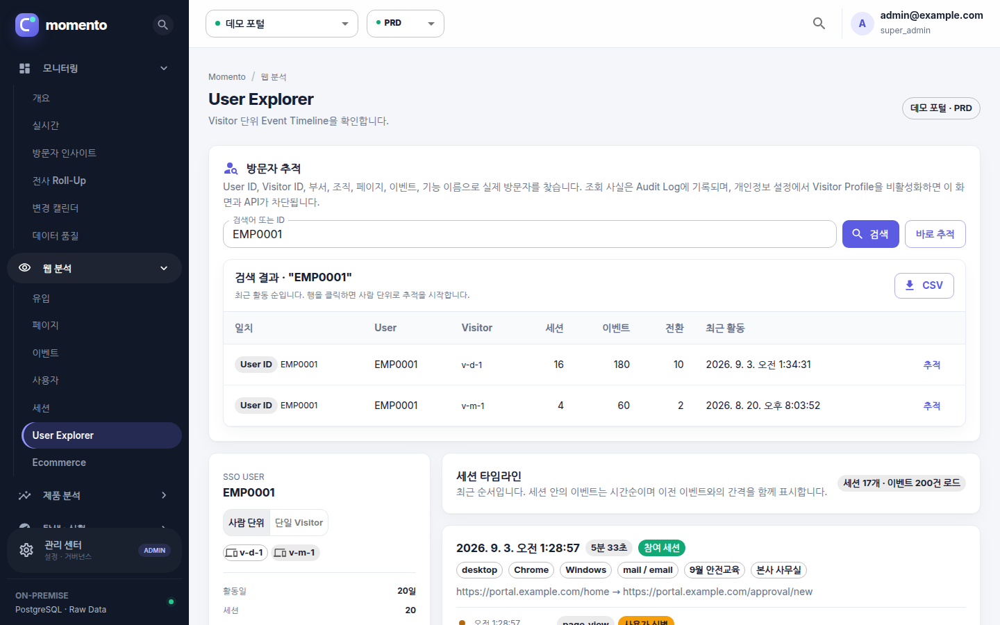

여기까지가 5분입니다. 이 흐름(개요 → 인사이트 → 개인 추적)이 대부분의 질문에 답하는 순서입니다.

---

## 3. 화면별 사용법

좌측 메뉴는 **모니터링, 웹 분석, 제품 분석, 탐색 · 실험, 경험 · AI** 다섯 묶음이고, 현재 화면이 속한 묶음만 펼쳐집니다. `Ctrl+K`(macOS `Cmd+K`)로 화면 이름을 검색해 바로 이동할 수 있습니다.

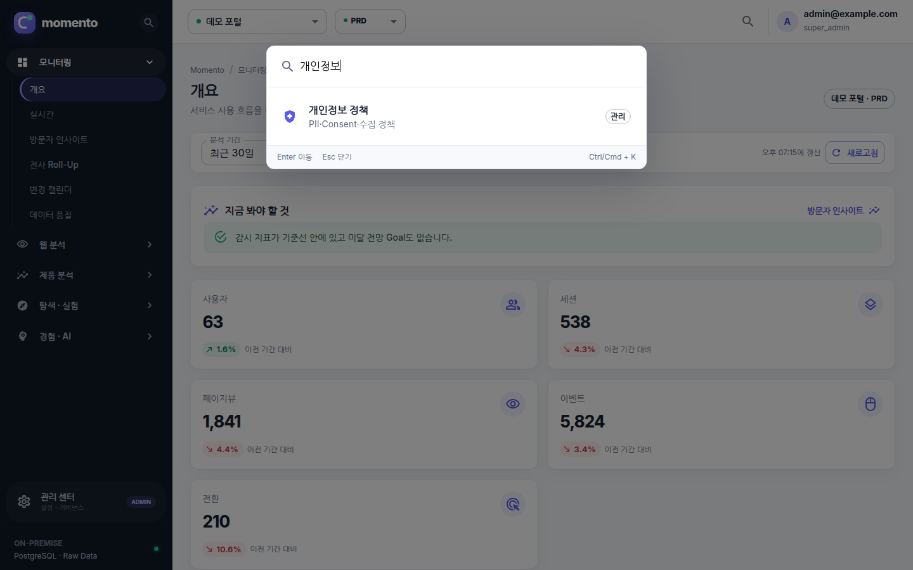

날짜는 관리자가 설정한 사이트 시간대(예: `Asia/Seoul`) 기준이고, 저장 Timestamp 자체는 UTC입니다. Overview의 `conversion_rate`는 호환성을 위해 사용자 전환율을 뜻하며, API는 `conversion_users`, `conversion_sessions`, `user_conversion_rate`, `session_conversion_rate`를 모두 제공합니다.

### 3.1 모니터링 → 개요

`개요` 상단은 총계보다 먼저 **오늘 확인할 것**을 보여줍니다.

- 이상 감지 결과(심각·주의·긍정 변화)와 **미달 전망 Goal**을 심각도 순으로 통합합니다. 같은 심각도면 방금 발생한 변화인 이상을 표준 목표인 Goal보다 앞에 둡니다.
- 각 항목은 근거와 다음 행동을 함께 제시하고 `확인` 버튼으로 상세 화면(방문자 인사이트 / Goal)으로 이동합니다.
- 알림 상태가 있으면 `신규`, `지속 N일`을 제목에 표시합니다.
- **달성했거나 순항하는 Goal, 정상·데이터 부족 판정 이상은 넣지 않습니다.** 모든 것을 넣은 목록은 아무 것도 알려주지 않기 때문입니다. 이상이 없으면 그 사실을 명확히 표시합니다.
- 이 화면은 일별 Rollup 기반 이상 감지와 Metric Registry만 조회하므로 첫 화면 응답 속도에 영향을 주지 않습니다.

아래로 내리면 일별 추이 차트와 상위 페이지·이벤트가 이어집니다.

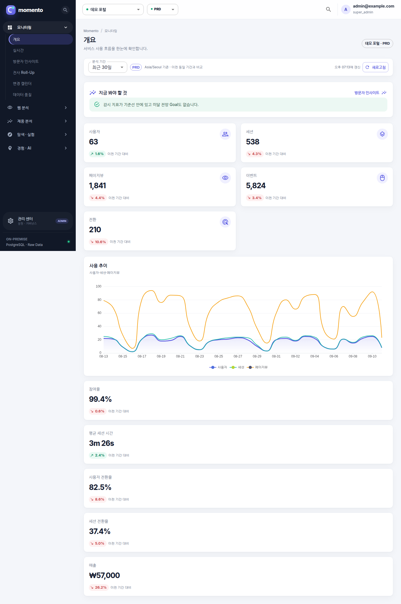

### 3.2 모니터링 → 방문자 인사이트

여러 화면을 순회하지 않고 방문자 상황과 다음 행동을 한 화면에서 확인하는 요약 보고서입니다. 모든 지표는 **이전 동일 기간과 자동 비교**됩니다.

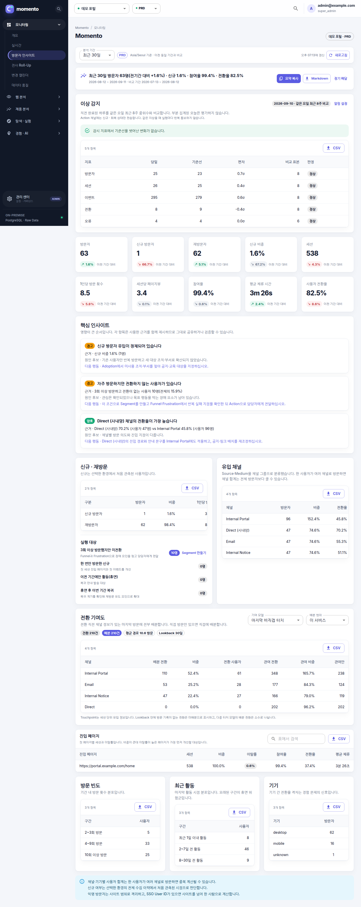

- **핵심 인사이트**: 영향이 큰 순서로 정렬되며 각 항목이 `근거 → 원인 후보 → 다음 행동`을 함께 제시합니다. 방문자 급증·급감(주도 채널 지목), 신규·재방문 전환율 격차, 참여율 하락, 이탈률 높은 진입 페이지, 기기 간 전환율 격차, 채널 전환율 편차, 반복 방문 미전환, 휴면 전환을 감지합니다.
- **지표**: 방문자, 신규·재방문, 신규 비중, 세션, 1인당 방문 횟수, 세션당 페이지뷰, 참여율, 평균 체류 시간, 사용자 전환율. 신규 비중처럼 방향이 모호한 지표는 증감을 성과 색으로 표시하지 않습니다.
- **유입 채널**: Source·Medium을 Direct, Organic Search, Paid Search, Email, Social, Referral, Internal Portal, Internal Notice, Internal Message, Display, Other로 분류합니다. 사내망에서 유입 정보가 없는 방문은 `Direct (사내망)`으로 구분합니다.
- **진입 페이지**: 세션 비중과 이탈률, 참여율, 전환율, 평균 체류를 함께 제공해 비중이 큰데 이탈률이 높은 페이지를 먼저 찾습니다.
- **방문 빈도·최근 활동**: 1회 / 2~3회 / 4~9회 / 10회 이상, 그리고 최근 1일 / 2~7일 / 8~30일 / 31일 이상 미활동으로 나눠 충성도와 휴면 위험을 봅니다.
- **실행 대상**: `3회 이상 방문했지만 미전환`, `한 번만 방문한 신규`, `이전 기간에만 활동(휴면)`, `휴면 후 복귀` 인원과 권장 조치를 제시합니다. 같은 조건으로 Segment를 만들어 Action으로 연결할 수 있습니다.

**바로 가져가기**: 우측 상단 `요약 복사`는 결론·근거·표를 포함한 Markdown을 클립보드에 넣고, `Markdown`은 같은 내용을 파일로 내려받습니다. 각 표는 CSV로 내보낼 수 있습니다. `정기 배달`은 같은 보고서를 Webhook·Mail·Confluence·사내 메시지·AI Agent로 정기 배달하는 화면을 종류가 선택된 채로 엽니다. MCP 도구 `get_visitor_insights`로 AI Agent가 직접 가져갈 수도 있습니다.

채널·기기별 사용자 합계는 한 사용자가 여러 채널로 방문하면 중복될 수 있고, 신규 판정은 선택한 환경의 전체 수집 이력을 기준으로 합니다.

#### 이상 감지

방문자 인사이트 상단에서 직전 완료된 하루를 **같은 요일 최근 8주의 중위수**와 비교합니다. 사내 서비스는 요일 주기가 강해 단순 전주 대비나 7일 평균은 오탐이 많고, 부분 집계된 오늘을 평가하면 매일 아침 급감으로 보입니다. 그래서 완료된 하루만, 같은 요일끼리 비교합니다.

- 중위수와 MAD(중위 절대편차)를 사용해 하루의 장애가 기준선을 끌고 가지 않습니다.
- 편차 2.5σ 이상은 경고, 3.5σ 이상은 심각, 좋은 방향의 큰 변화는 긍정 변화로 구분합니다.
- 같은 요일 표본이 3개 미만이면 최근 28일로 대체하고, 그것도 부족하면 `데이터 부족`으로 판정을 보류합니다. 대체 기준선이 쓰이면 근거 문장이 `최근 N일 기준선(같은 요일 표본 부족, 요일 혼합)`이라고 말합니다.
- 감시 지표: 방문자, 세션, 이벤트, 전환, 오류(오류는 증가가 나쁨).
- 감지 결과는 **알림 상태**로 관리됩니다. 처음 감지되면 `신규`, 이전에 이미 알린 이상이 계속되면 `지속 N일`, 기준선 범위로 돌아오면 `회복`입니다.
- `알림 설정`을 누르면 `anomaly` 종류의 정기 배달을 만드는 화면이 열립니다. 기본적으로 **`신규`와 `회복`만** 전송하므로 매시간 실행해도 같은 이상을 반복 통보하지 않습니다. 보낼 상태가 없으면 전송 이력에 `skipped`로 남습니다.
- 화면 조회는 알림 이력을 바꾸지 않습니다. 상태 저장은 배달 경로에서만 일어납니다.

#### 전환 기여도

SDK는 세션 단위로 유입 정보를 기록하므로 방문(세션)이 Touchpoint입니다. `방문자 인사이트 → 전환 기여도`에서 모델을 바꿔 비교합니다.

| 모델 | 배분 기준 | 종류 |
| :--- | :--- | :--- |
| `last_non_direct` | 전환 직전, 채널 정보가 있는 마지막 방문 (기본값) | 단일 |
| `first_touch` | Lookback 안의 첫 방문 | 단일 |
| `last_touch` | 전환 직전 방문 그대로 | 단일 |
| `linear` | 경로의 모든 방문에 같은 비중 | 다중 |
| `time_decay` | 전환에 가까운 방문에 더 많이. 반감기 1·3·7·14·30일 선택 | 다중 |
| `position_based` | 첫 방문 40%, 마지막 방문 40%, 중간 방문들이 20%를 균등 분할 | 다중 |

다중 터치 모델은 하나의 전환을 여러 방문에 나눠 배분하므로 채널별 `배분 전환`이 소수로 표시됩니다. 어떤 모델이든 한 전환의 가중치 합은 정확히 1입니다. `배분 전환`과 함께 `관여 전환`, `관여 비중`, `관여만`, `평균 경로 방문 수`를 제공하고, Lookback(기본 30일) 안에 방문 기록이 없는 전환은 `미배분`으로 분리 표기합니다.

**배분 범위**를 `전사 서비스`로 바꾸면 같은 Workspace의 다른 서비스 방문도 Touchpoint로 인정합니다. SSO로 식별된 사용자에게만 적용되고, 범위는 조회자가 이미 접근할 수 있는 서비스로만 확장됩니다.

#### 봇과 모니터링 트래픽

Collector는 User-Agent로 모든 Event를 분류해 저장합니다.

| 분류 | 판정 기준 |
| :--- | :--- |
| `known_bot` | `bot`, `crawler`, `spider`, `slurp`, `bingpreview`, `headlesschrome` |
| `monitoring` | `uptime`, `pingdom`, `healthcheck`, `monitoring`, `prometheus` |
| `suspicious` | User-Agent가 비어 있음 |
| `normal` | 위에 해당하지 않음 |

`traffic.class`는 **어떤 클라이언트가 보냈는지**만 말합니다. **어느 네트워크에서 왔는지**는 별도 필드 `traffic.internal`이 답합니다. 사내망에서 도는 크롤러는 `known_bot`이면서 `traffic.internal = true`입니다.

**리포트는 이 분류로 걸러내지 않습니다.** 1분마다 페이지를 확인하는 Uptime 감시는 하루 1,440건의 페이지뷰를 더합니다. 제외하려면 Segment 조건 `traffic.class = normal`을 사용하세요 — 사내 사용자는 그대로 남습니다. 저장한 Segment는 Query·Funnel·Retention·경험 비교에 그대로 넣을 수 있습니다.

#### 같은 이름의 숫자가 뜻하는 것

- **사용자**는 사람 단위입니다. 같은 SSO User로 연결된 여러 브라우저는 한 명으로 셉니다. 첫 화면, 방문자 인사이트, 전사 Roll-Up, 쿼리 빌더의 `users`가 모두 같은 정의를 씁니다.
- **Visitor**는 브라우저 단위입니다. `사용자` 목록은 Visitor 단위이므로, 한 사람이 두 기기를 쓰면 두 줄로 나타납니다. 사용자 수보다 줄 수가 많은 것은 오류가 아닙니다.
- **매출**은 `purchase` Event의 `value` 또는 `revenue` Property에서 읽습니다. 첫 화면·Ecommerce·쿼리 빌더·MCP가 같은 정의를 사용합니다.
- **Session**은 **시작 시각 기준**으로 셉니다. 자정을 넘긴 Session은 시작한 날에만 속하므로 연속된 기간의 합이 맞습니다.
- 쿼리 빌더에는 Session 지표가 두 개 있습니다. `sessions`는 **이 기간에 활동이 있었던** Session이고, `sessions_started`는 **이 기간에 시작된** Session입니다(첫 화면과 같은 값).
- **전환율**은 사용자 기준과 Session 기준을 구분합니다. 이름이 `전환율`인 값은 사용자 기준이며, Session 기준은 `Session 전환율`로 표기합니다.

### 3.3 모니터링 → 실시간 · 전사 Roll-Up · 변경 캘린더 · 데이터 품질

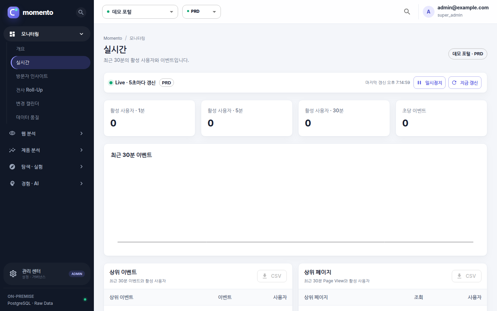

- **실시간**은 최근 30분의 이벤트·Page View와 활성 사용자를 보여주는 운영 화면입니다.
- **전사 Roll-Up**은 같은 Workspace의 Site를 합쳐 서비스별 사용자·Event·Session·Service Score를 비교합니다. 같은 SSO `user_id`는 Site를 넘어 한 명으로 계산하고 익명 Visitor는 Site별로 격리합니다.

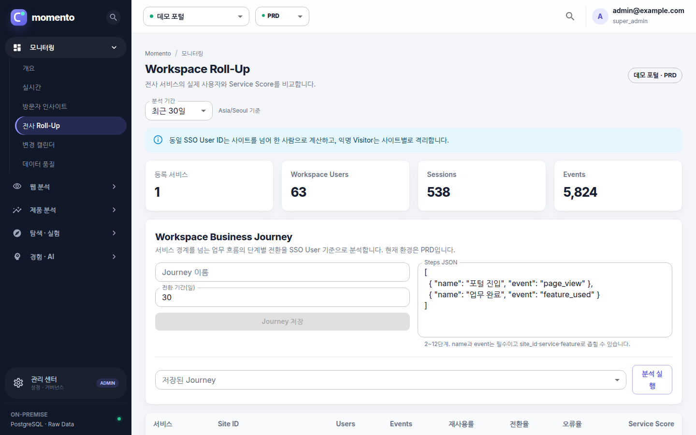

- **변경 캘린더**는 배포, Release, 장애, 캠페인, 교육, Feature Flag와 조직 변경을 분석 기간에 함께 표시합니다. 숫자가 움직인 날에 무엇이 있었는지 확인하는 곳입니다.

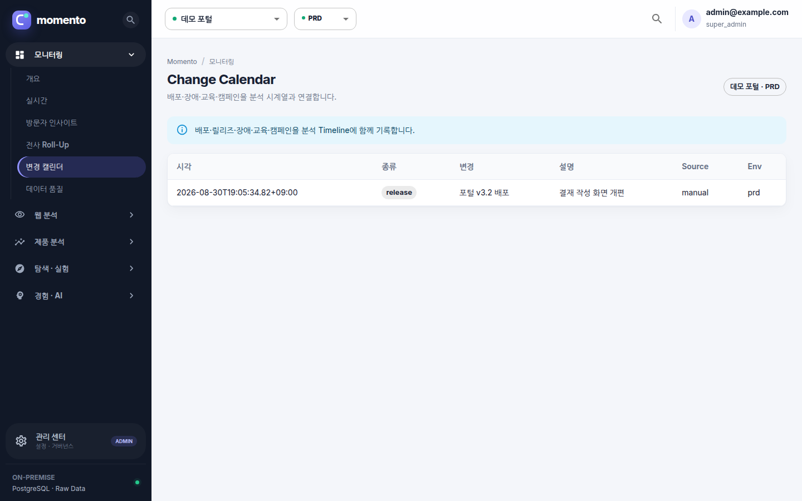

- **데이터 품질**은 Received, Accepted, Duplicate, Late, Reject, Contract Warning, Missing User/Feature, Unknown Network, PII Blocked, Dead Letter, Cardinality를 최근 7일 고정으로 표시합니다. `(미지정)`이 많다면 데이터가 없는 것이 아니라 그 속성을 보내지 않고 있는 것입니다.

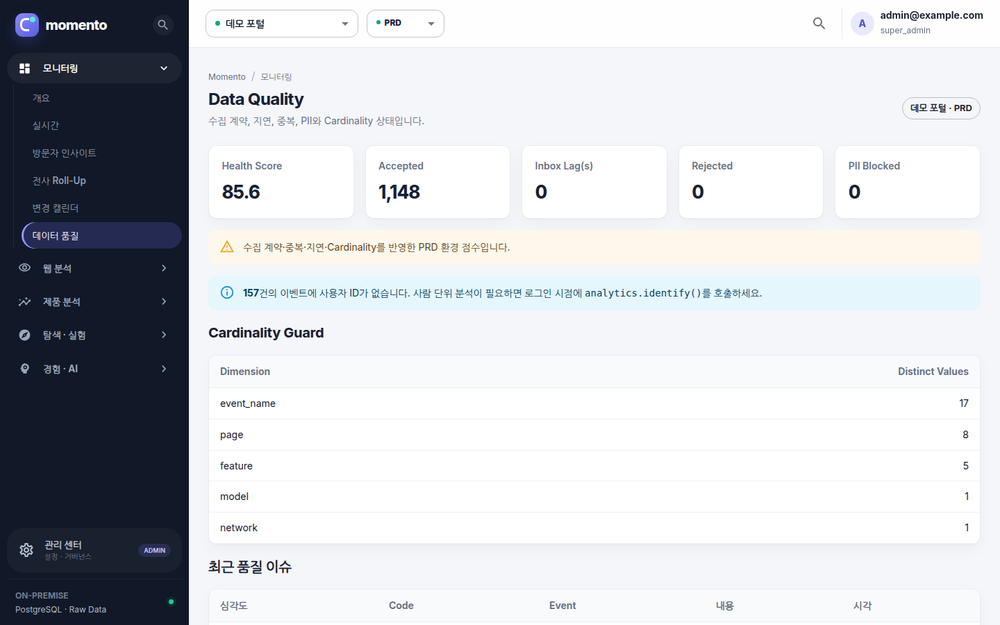

### 3.4 웹 분석 → 유입 · 페이지 · 이벤트 · 사용자 · 세션

네 개의 리포트 화면은 같은 구조입니다: 분석 기간 선택 → 지표 카드 → 표. 표는 행 검색, 페이지당 행 수 변경, CSV 내보내기를 공통으로 지원하며 CSV는 현재 검색 결과를 UTF-8 BOM으로 저장합니다.

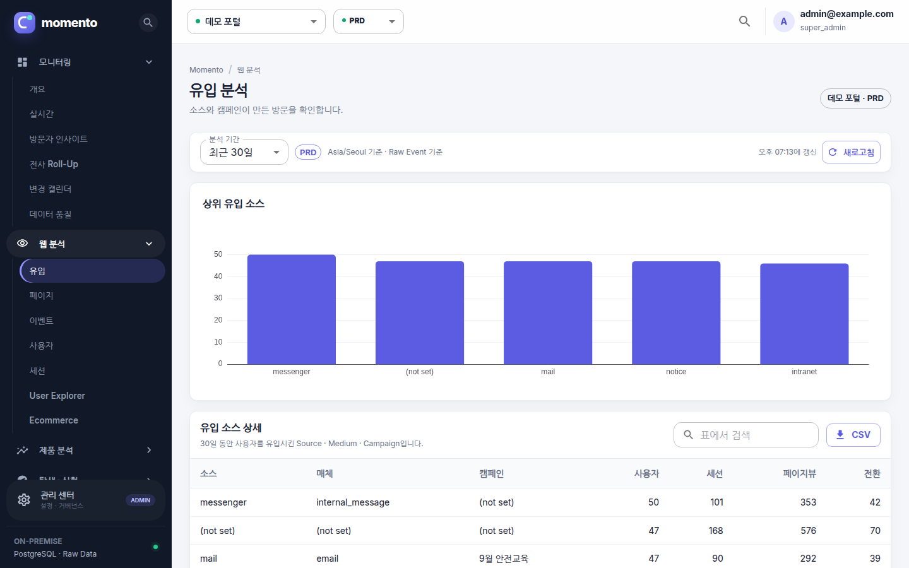

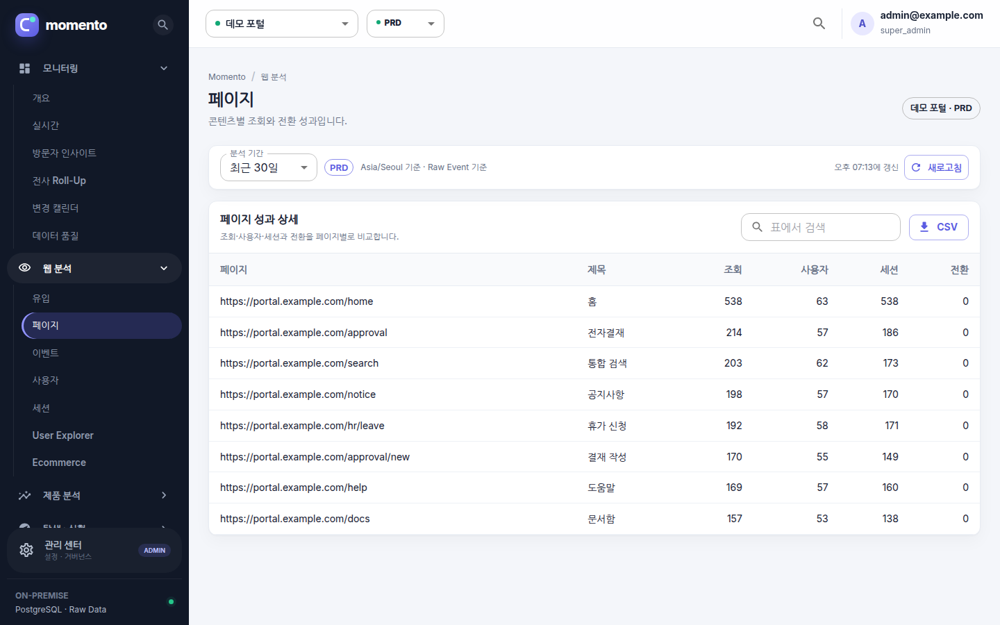

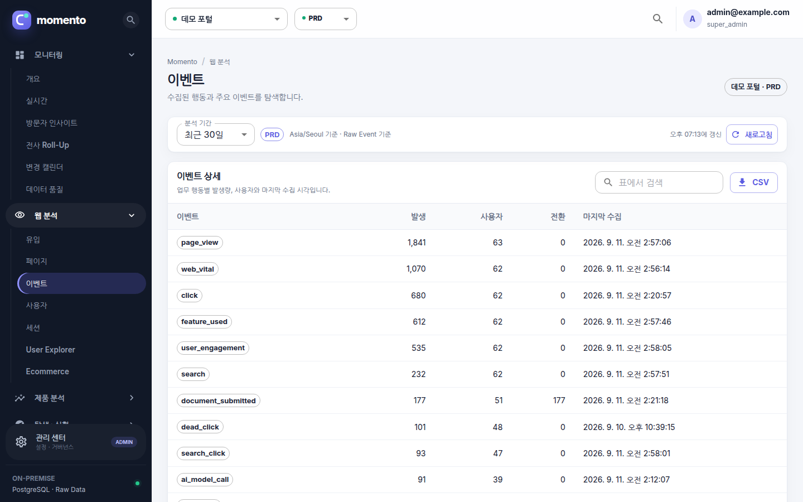

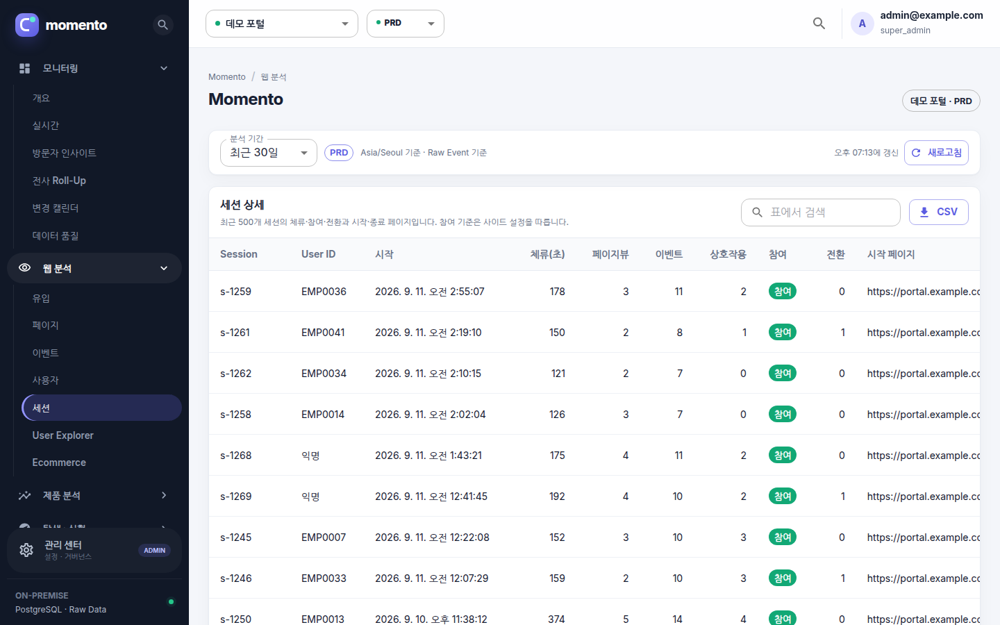

세션·사용자 리포트의 `추적` 버튼은 그 방문자로 User Explorer를 엽니다.

### 3.5 웹 분석 → User Explorer

실제 방문자 한 사람을 추적합니다. 개인정보 설정에서 Visitor Profile을 비활성화하면 화면과 API가 모두 차단되고, 조회 사실은 Audit Log에 기록됩니다.

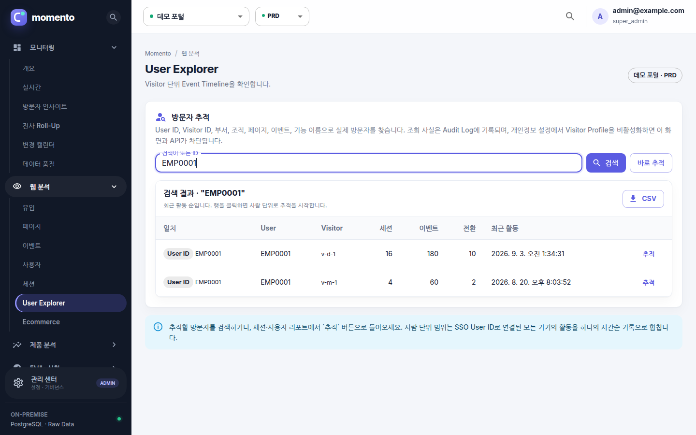

- **찾기**: User ID, Visitor ID 일부, 부서, 조직, 페이지 URL, 이벤트 이름, 기능 이름으로 검색합니다. `바로 추적`은 정확한 ID를 알 때 검색을 건너뜁니다.
- **사람 단위 vs 단일 Visitor**: 기본은 사람 단위입니다. SSO User ID로 연결된 데스크톱·모바일 등 모든 Visitor의 활동을 하나의 시간순 기록으로 합칩니다. 아직 identify되지 않은 방문자는 기기 단위로만 추적됩니다.
- **세션 그룹 타임라인**: 방문(세션)별로 시작 시각, 체류 시간, 참여 여부, 전환, 기기·브라우저·OS, 유입 채널, 사내망 이름, 진입 → 종료 페이지를 헤더로 보여주고, 그 안의 이벤트를 시간순으로 나열합니다. 각 이벤트에는 **이전 이벤트와의 간격**이 표시되어 어디서 멈췄는지 보입니다.
- **식별 시점**: 익명 활동이 특정 사용자로 연결된 이벤트에 `사용자 식별` 표시가 붙습니다. `식별 연결` 카드는 각 기기가 언제 이 사람으로 연결됐는지 보여줍니다.
- **과거 탐색**: `이전 기록 더 보기`가 커서로 이전 구간을 이어서 불러옵니다. 한 페이지에 일부만 로드된 세션은 `부분 로드`로 표시합니다.
- **교차 서비스**: 같은 SSO User가 Workspace의 다른 서비스에서 활동했다면 함께 표시합니다.
- **가져가기**: `추적 기록 복사`는 사람 단위 맥락과 세션 흐름을 Markdown으로 복사해 장애 티켓이나 개인정보 요청 답변에 바로 붙일 수 있습니다.

### 3.6 웹 분석 → Ecommerce

`view_item`, `add_to_cart`, `begin_checkout`, `purchase`, `refund`와 `items` 배열을 기준으로 매출·거래·상품 성과와 네 단계 구매 퍼널을 계산합니다.

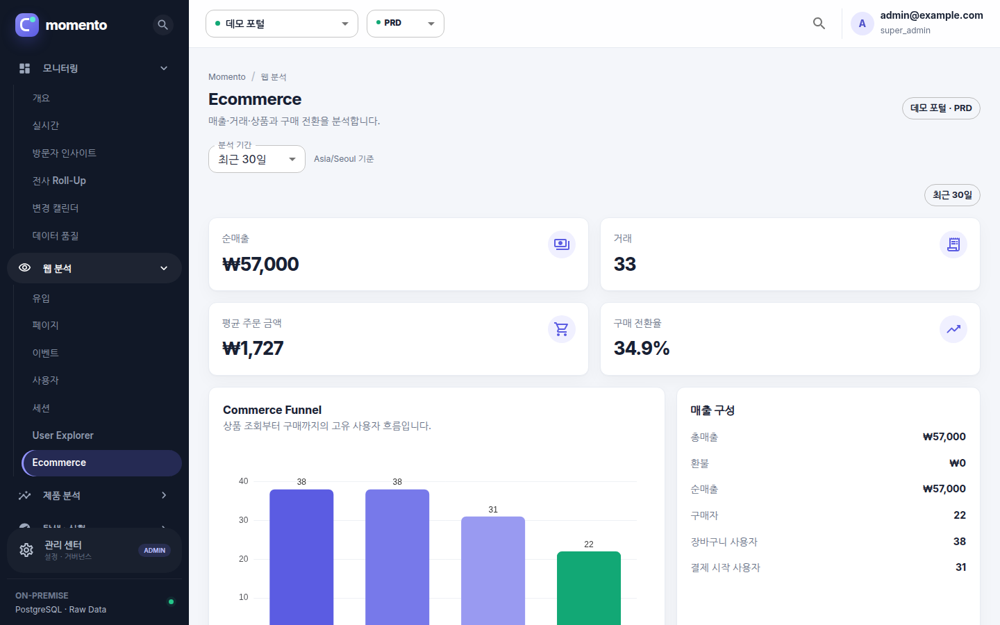

### 3.7 제품 분석 → 사내 사용 현황

내부 서비스에서 "누가 쓰고 있는가"는 조직 단위로 묻는 질문입니다. 같은 기간을 여섯 가지로 나눠 보여줍니다.

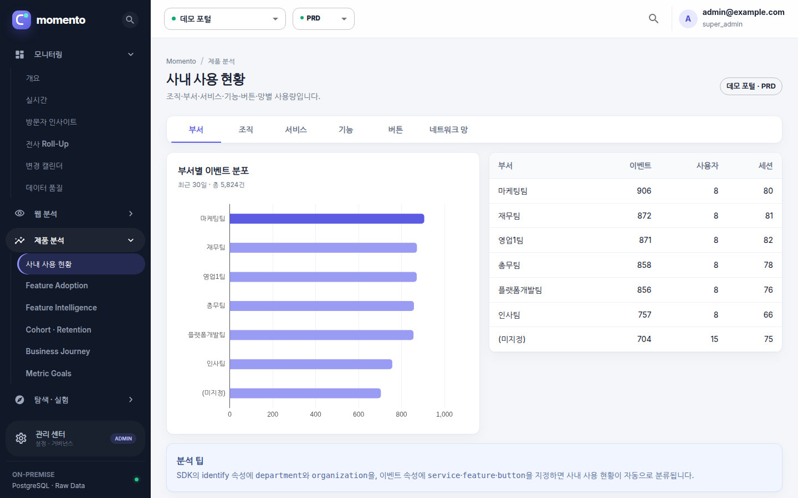

| 기준 | 어디서 오는가 |
| :--- | :--- |
| 망 | Collector가 IP를 관리자 → 네트워크 망 설정과 대조해 분류합니다. 어디에도 맞지 않으면 `External / Unclassified`입니다. |
| 부서 · 조직 | `analytics.identify`가 보낸 사용자 속성입니다(7.3 참고). 보내지 않으면 `(미지정)`으로 모입니다. |
| 서비스 | Event의 `service` Property이며, 없으면 Site의 Service Name을 씁니다. |
| 기능 | Event의 `feature` Property입니다. |
| 버튼 | `click` Event의 `button`·`element_text`·`element_id` 중 먼저 있는 것입니다. |

각 기준은 Event 수·사용자 수·Session 수를 함께 보여주므로, "많이 눌렀다"와 "많은 사람이 눌렀다"를 구분할 수 있습니다. 상위 20개까지 표시합니다.

### 3.8 제품 분석 → Feature Adoption · Feature Intelligence

- **Feature Adoption**은 관리자가 등록한 대상자(조직·부서·기능·인원)와 Event의 `feature`를 연결해 사용률, 재사용률, 최근 활성·비활성 사용자를 제공합니다.

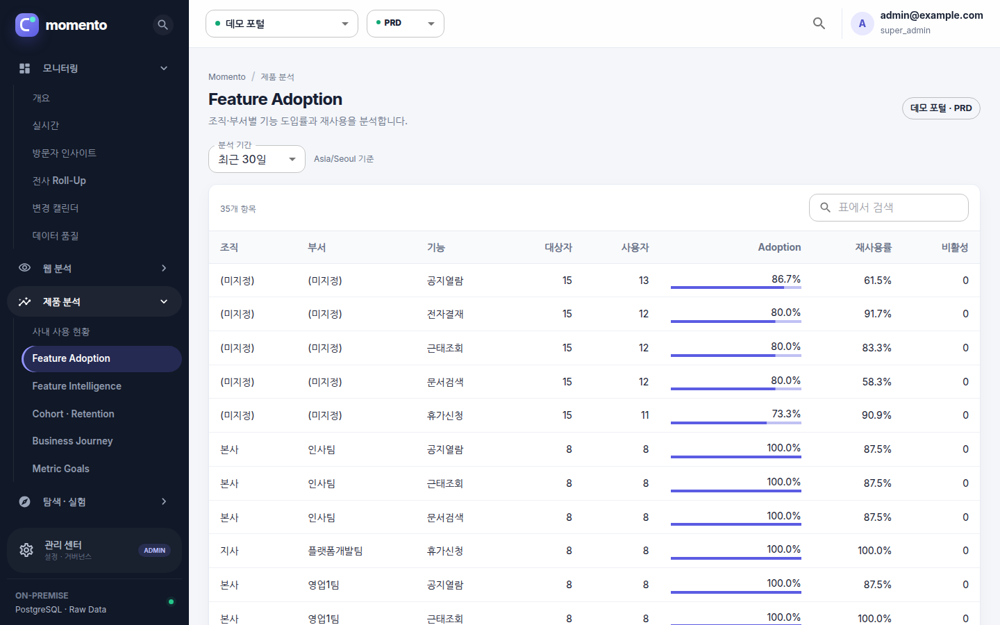

- **Feature Intelligence**는 `feature` Property를 기준으로 Adoption, Repeat, Conversion, Error, 기간 추세와 Dead Feature 후보를 계산합니다. 분석 기간은 30·60·90일입니다.

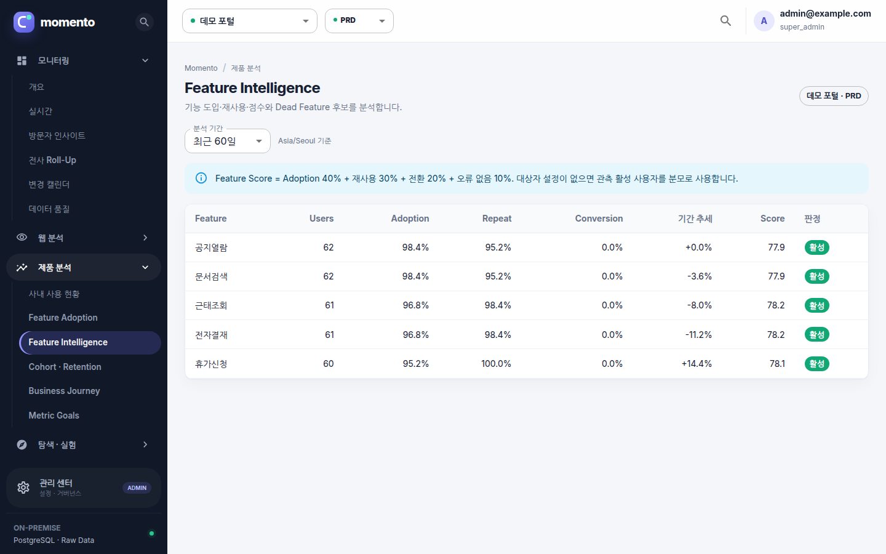

### 3.9 제품 분석 → Cohort · Retention

최초 Event/가입/구매 등 Cohort Event와 Return Event를 분리해 Day/Week/Month Retention을 계산합니다. 분석 기간은 90·180·365일입니다.

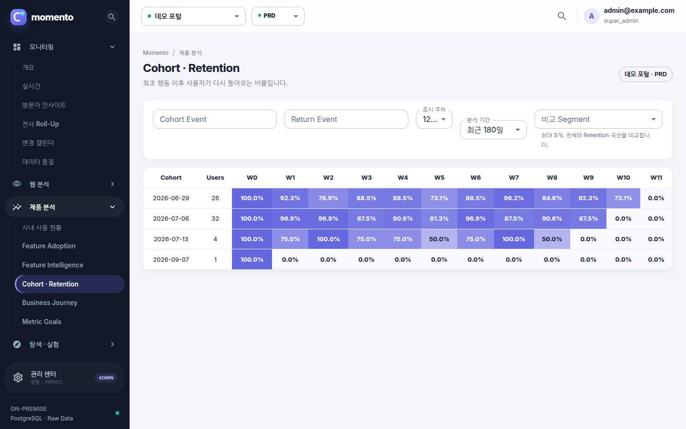

**비교 Segment**에서 최대 3개를 선택하면 전체와 Retention 곡선을 비교합니다.

- 곡선은 **Cohort 크기로 가중한 평균**입니다. 비율의 단순 평균은 3명 Cohort가 1000명 Cohort와 같은 무게를 갖게 만듭니다.
- **아직 해당 주차에 도달하지 못한 Cohort는 분모에서 제외**합니다.
- Segment마다 첫 재방문(1주차) 격차와 **격차가 가장 큰 주차**를 제시합니다.
- Cohort 인원 20명 미만은 `표본 부족`으로 표시하고 우열을 판정하지 않습니다.

### 3.10 제품 분석 → Business Journey · Metric Goals

- **Business Journey**는 2~12개의 Event·Service·Feature 조건을 실제 도달 순서와 Conversion Window로 연결합니다.
- **Metric Goals**는 일/주/월/분기 Metric 목표의 현재값, 진행률과 달성 여부를 사이트 시간대 기준으로 표시합니다. 기간 진행률과 **착지 예상치**가 함께 나옵니다. 누적 지표는 현재 속도를 기간 끝까지 연장하고, 비율 지표는 현재 관측값을 그대로 씁니다. 누적 지표에는 목표까지 남은 양과 `필요 일일 속도`를 제공하며, 기간 진행률이 10% 미만이면 추정을 보류합니다.

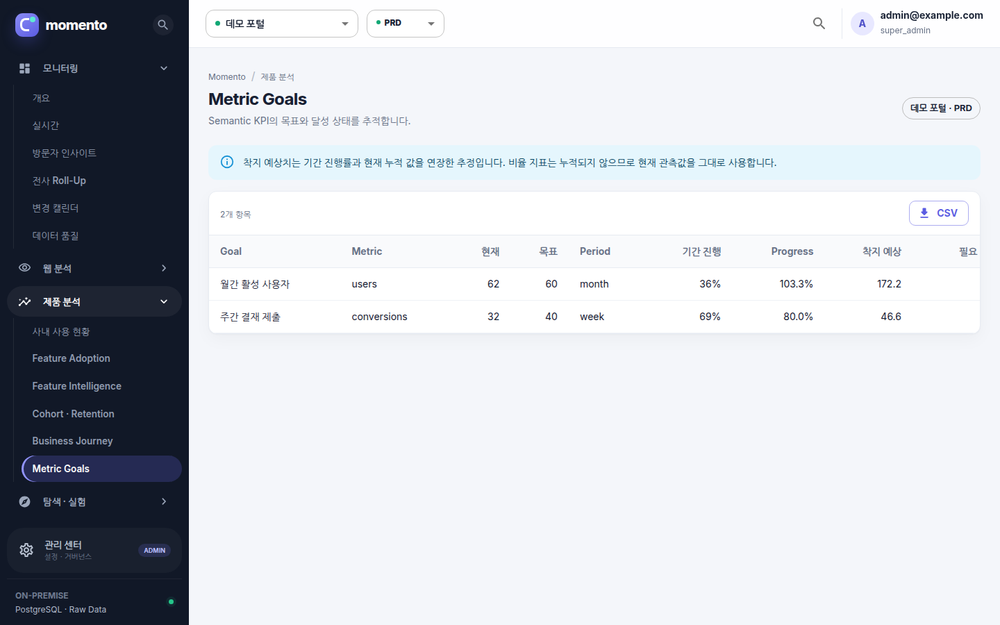

### 3.11 탐색 · 실험 → 자유 분석 (쿼리 빌더)

Dimension과 Metric을 조합해 표를 만듭니다.

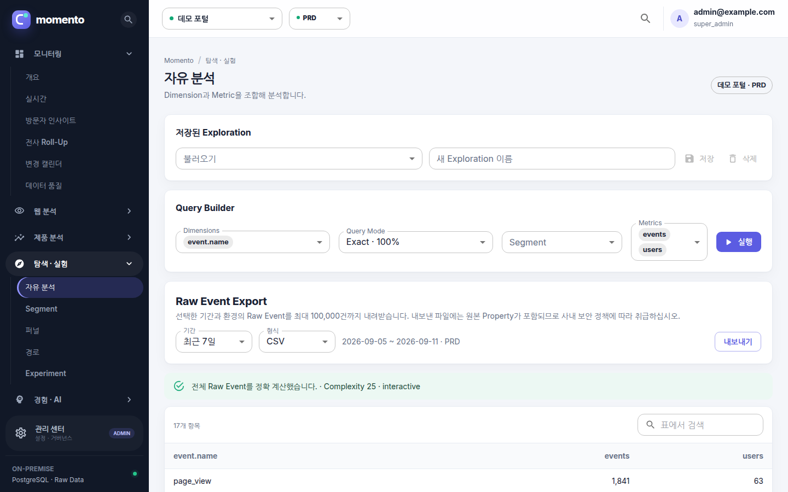

1. **Dimensions**에서 `event.name`, `department`, `browser` 같은 축을 고릅니다. 관리자가 등록한 사용자 정의 차원은 `custom.<name>`으로 나타납니다.
2. **Query Mode**: `Exact`는 Raw Event 100%를 계산하고, 관리자가 정한 최대 기간과 Complexity를 넘으면 실행 전에 거부됩니다. `Fast`와 `Preview`는 Event ID의 결정적 Hash로 관리자 설정 비율을 표본화합니다 — 같은 입력은 같은 표본을 씁니다.
3. **Segment**로 대상을 좁히고 **Metrics**를 고른 뒤 **실행**을 누릅니다.
4. 결과 위에 Query Mode, Complexity Score, Sample Percent, 실행 분류와 예상 오차 안내가 표시됩니다.
5. 자주 쓰는 조합은 **저장된 Exploration**에 이름을 붙여 저장합니다.

같은 화면의 **Raw Event Export**는 선택한 기간과 환경의 Raw Event를 CSV 또는 NDJSON으로 최대 100,000건까지 내려받습니다(4.4 참고).

### 3.12 탐색 · 실험 → Segment

최대 5단계의 중첩 `AND`/`OR` 조건과 14개 연산자를 조합합니다. `event.has = purchase`를 사용하면 조회 행의 Event 종류와 무관하게 구매 경험이 있는 사용자를 선택합니다.

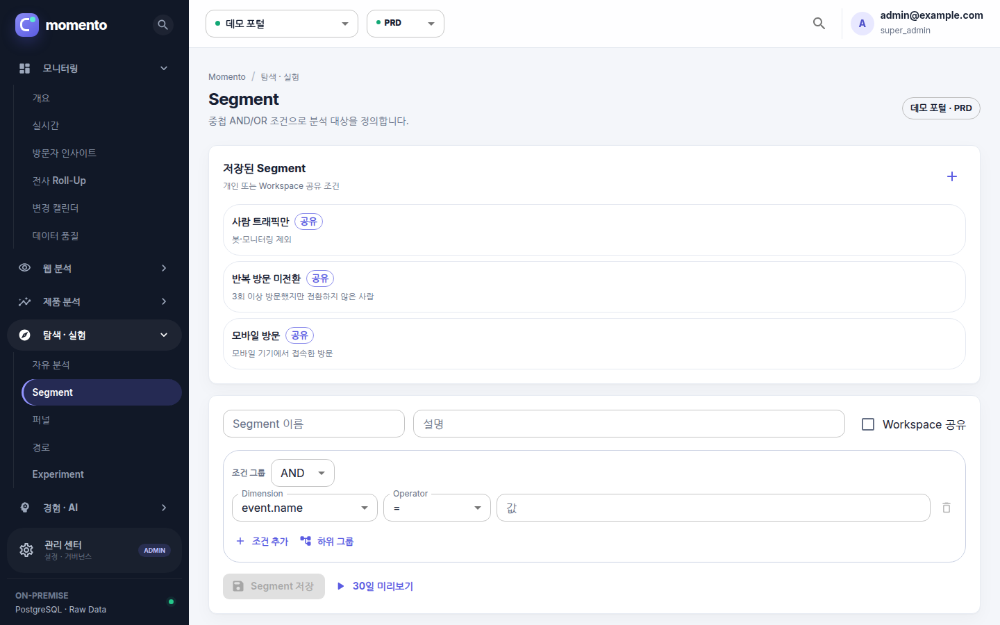

사람의 전체 이력을 기준으로 하는 **행동 기반 필드**를 쓸 수 있습니다.

- `entity.sessions`, `entity.events`, `entity.conversions`
- `entity.days_since_last_seen`, `entity.days_since_first_seen`
- `entity.frustration_signals`, `entity.frustration_sessions` — tracker가 자동 감지한 막힘 신호를 겪은 횟수와 방문 수
- `entity.searches`, `entity.zero_result_searches`, `entity.search_clicks`
- `traffic.class`, `traffic.internal` — 봇·모니터링·사내망 트래픽 포함 여부

이 필드들은 숫자 비교(`>=`, `<=`, `=` 등)만 지원합니다. `entity.sessions >= 3` AND `entity.conversions = 0`은 "세 번 이상 방문했지만 전환하지 않은 사람"입니다. 방문자 인사이트·Frustration·Search Analytics의 `실행 대상`에서 `Segment 만들기`를 누르면 서버가 세어 준 정의가 그대로 저장됩니다.

저장된 Segment는 자유 분석, 퍼널, Cohort, Web Vitals 비교와 정기 배달의 `Segment 집계`에서 재사용됩니다.

### 3.13 탐색 · 실험 → 퍼널

단계를 2~10개 정의하고 **분석**을 누르면 단계별 전환율과 이탈이 그려집니다. 기본값으로 `페이지 조회 → 클릭 → 전환` 세 단계가 채워져 있습니다.

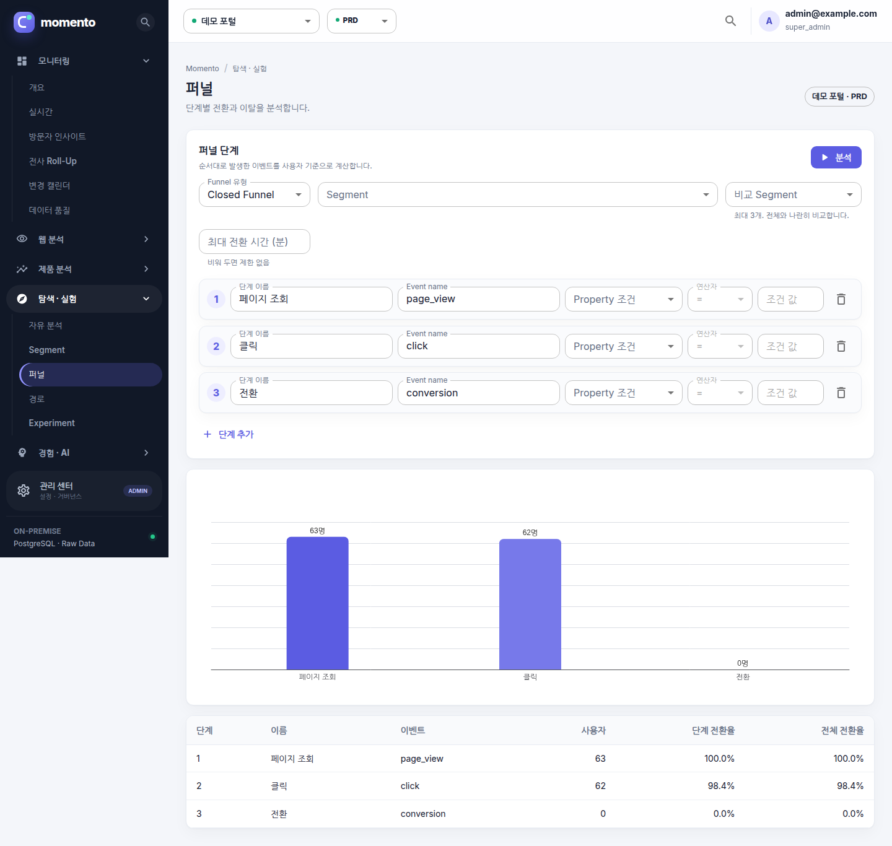

**비교 Segment**에서 최대 3개를 선택하면 전체와 나란히 같은 퍼널을 평가합니다.

- 비교 시 차트는 사용자 수 대신 **완주율(%)** 로 그립니다. 규모가 다른 조직을 나란히 놓으면 절대 수치가 형태를 가리기 때문입니다.
- 각 Segment마다 전체 대비 완주율 격차(pp)와 상대 격차(%), 그리고 **격차가 가장 크게 벌어지는 단계**를 함께 제시합니다.
- 진입 20명 미만 Segment는 `표본 부족`으로 표시하고 우열을 판정하지 않습니다.

### 3.14 탐색 · 실험 → 경로

동일 Session에서 연속으로 발생한 Page·Event 이동을 시작/도착 두 계층 Sankey 다이어그램으로 분석합니다. 왕복 이동도 안전하게 표시하며 현재 환경의 최근 30일 전환 수와 이동 횟수를 함께 제공합니다. `시스템 이벤트 포함`을 끄면 `web_vital` 같은 자동 이벤트를 제외합니다.

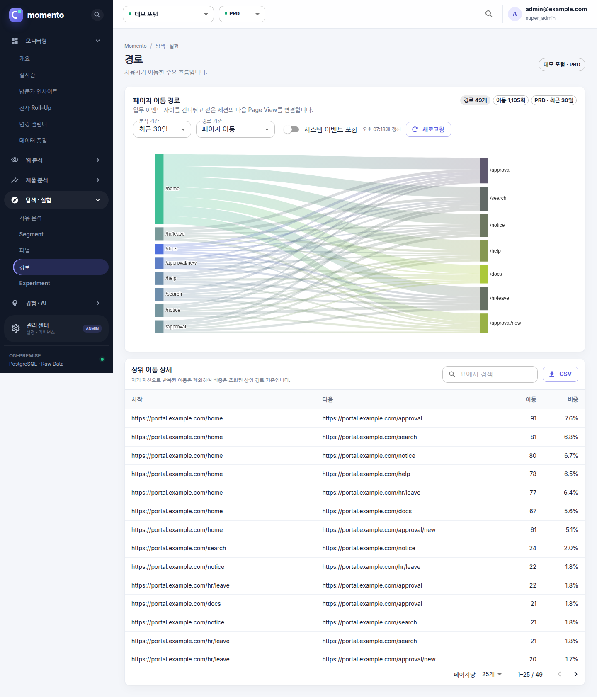

### 3.15 탐색 · 실험 → Experiment

Experiment Event에는 `experiment_id`와 `variant` Property를 함께 전송합니다. 등록한 Semantic Metric을 Variant별로 계산하고 첫 Variant를 Control로 사용해 Lift와 Confidence를 제공합니다. Experiment 등록은 관리자의 `Feature Flag · Lab`에서 합니다.

### 3.16 경험 · AI → Web Vitals · 오류

SDK의 자동 RUM은 LCP, INP, CLS, FCP, TTFB, Load와 Resource Error를 `web_vital`, `resource_error` Event로 전송합니다. 화면은 오류가 발생한 사용자와 정상 사용자의 전환율을 비교합니다.

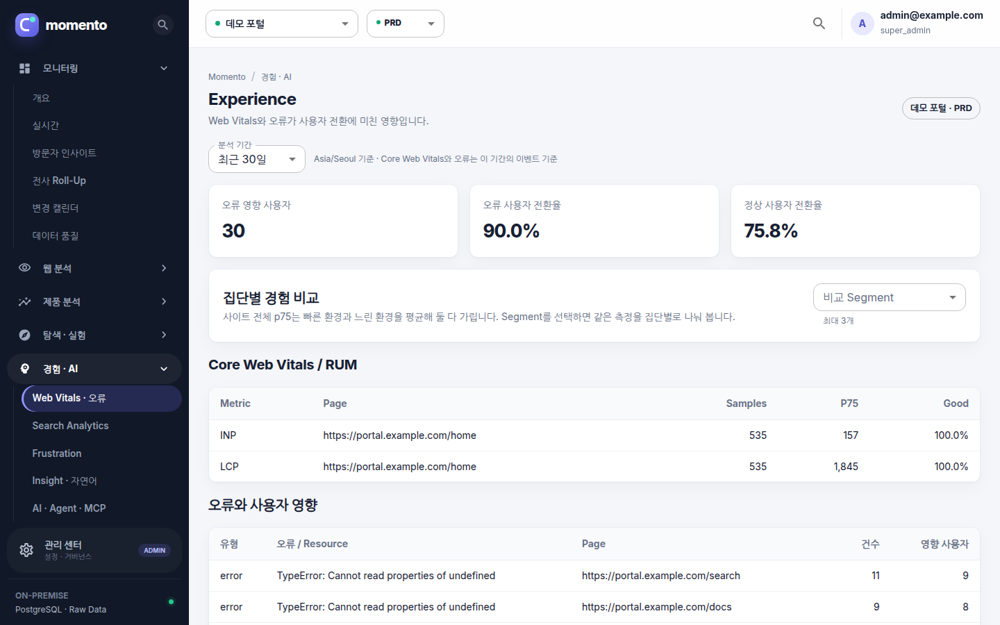

**비교 Segment**에서 최대 3개를 선택하면 같은 측정을 집단별로 나눠 봅니다. 사이트 전체 p75는 빠른 환경과 느린 환경을 평균해 둘 다 가립니다.

- 전체보다 **30% 이상 느린** 지표만 보고합니다.
- 전체는 권장 기준 안에 있는데 해당 집단만 초과하면 `심각`으로 구분합니다. 권장 기준은 LCP 2500ms, INP 200ms, CLS 0.1, FCP 1800ms, TTFB 800ms입니다.
- 오류 경험 비율이 전체보다 5pp 이상 높으면 보고하고, 15pp 이상은 `심각`입니다.
- 표본 20건 미만은 판정하지 않습니다.

### 3.17 경험 · AI → Search Analytics

`search`, `search_result`, `search_click`, `search_no_result`, `search_refine`, `search_exit`, `search_success` 표준 Event를 사용합니다. `search`, `search_click`, `search_refine`은 tracker가 자동 전송하므로 별도 계측 없이 검색 횟수, CTR, 재검색을 볼 수 있습니다.

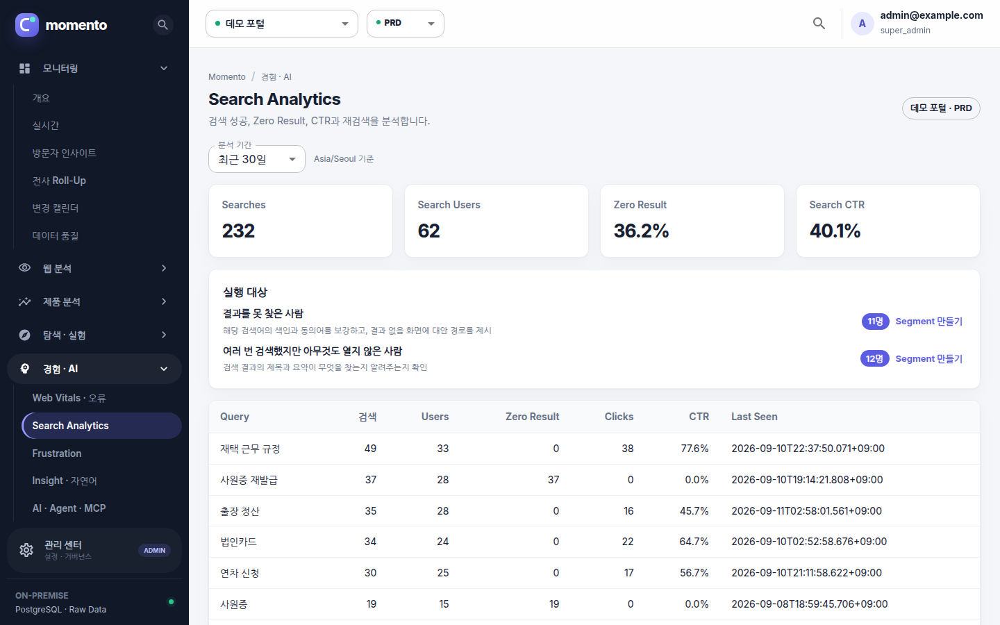

검색 횟수는 있는데 검색어가 모두 `(not set)`이면 `data-collect-search-terms` 안내를 표시하고, 결과 0건이 한 건도 없으면 `data-momento-search-results` 계측이 빠졌을 가능성을 알립니다. `실행 대상`은 `결과를 못 찾은 사람`, `여러 번 검색했지만 아무것도 열지 않은 사람`을 Segment로 저장하게 합니다.

### 3.18 경험 · AI → Frustration

Replay를 저장하지 않고 `rage_click`, `dead_click`, `rapid_back`, `form_retry`, `repeated_search`, `error_after_click`, `slow_interaction`과 오류 Event만으로 막힘을 추정합니다. 모두 tracker가 자동 감지합니다.

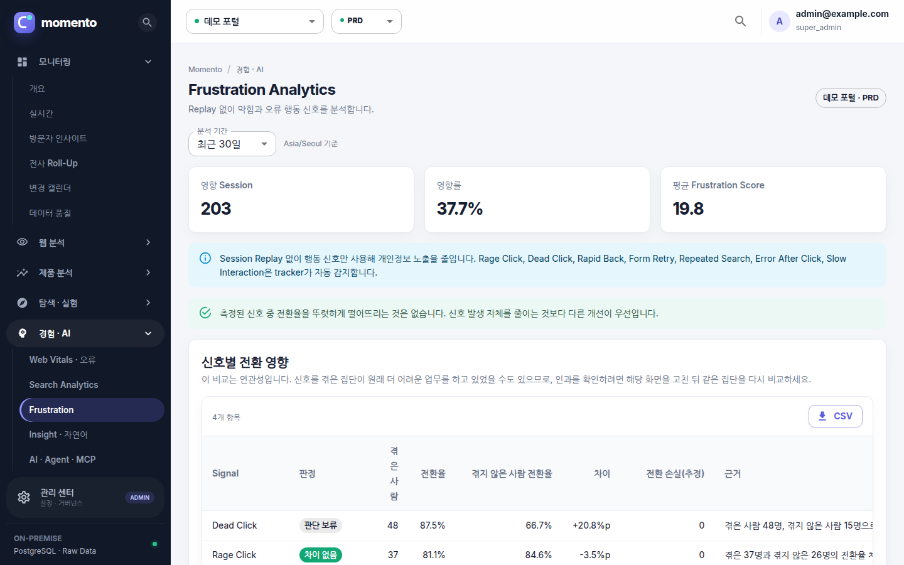

- 표가 비어 있을 때 "문제가 없다"와 "측정되지 않는다"를 구분합니다. Session은 있는데 신호가 0건이면 스니펫 버전과 `data-frustration-signals` 설정을 확인하라고 표시합니다.
- 각 신호의 뜻과 확인할 것을 함께 보여주고, `겪은 사람 찾기`를 누르면 User Explorer가 그 신호로 검색된 상태로 열립니다.
- **신호별 전환 영향**은 각 신호를 겪은 사람과 겪지 않은 사람의 전환율을 비교해 `전환 손실`, `차이 없음`, `전환과 함께 발생`, `판단 보류`로 판정하고, 차이가 전환 몇 건에 해당하는지 추정합니다. 목록은 **전환 손실 추정치 순**입니다.
- 양쪽 집단이 각각 20명 미만이면 판단을 보류합니다. 이 비교는 **연관성이며 인과가 아닙니다** — 화면이 그 사실을 항상 함께 표시합니다.
- `실행 대상`은 `막힘을 겪고 전환하지 않은 사람`, `두 번 이상의 방문에서 막힌 사람`을 Segment로 저장하게 합니다.

### 3.19 경험 · AI → Insight · 자연어, AI · Agent · MCP

- **Insight · 자연어**는 최근 7일 고정으로 자동 발견한 인사이트를 보여주고, 질문을 문장으로 넣어 분석 결과를 받습니다.

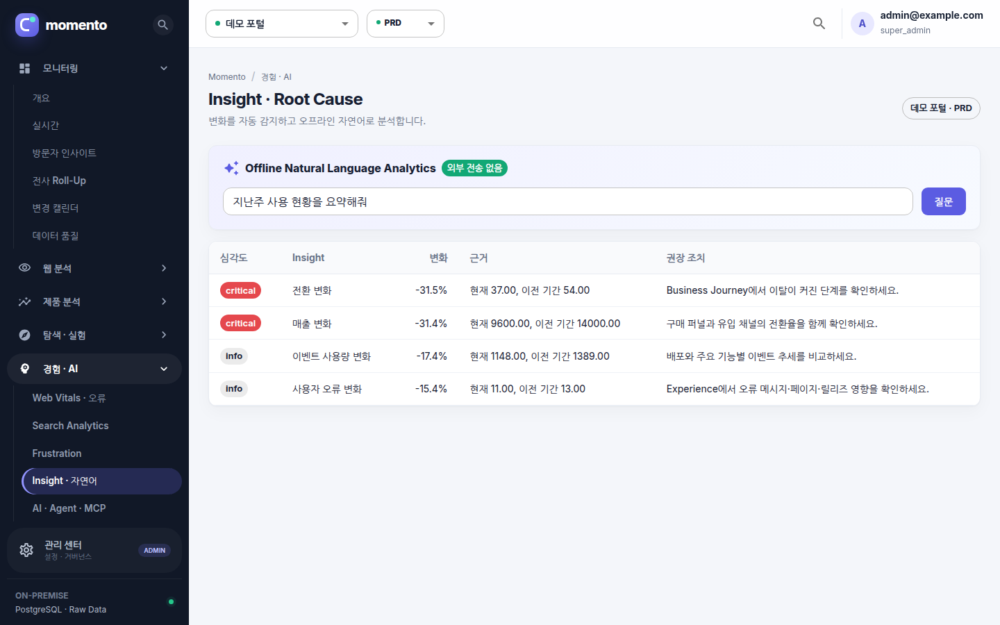

- **AI · Agent · MCP**는 `ai_prompt`, `ai_response`, `ai_model_call`, `ai_tool_call`, `ai_agent_run`, `ai_mcp_call` Event와 `model`, `provider`, `agent`, `mcp_server`, `tool`, `success`, `latency_ms`, `input_tokens`, `output_tokens`, `cost`, `fallback_model` Property로 AI 사용량·성공률·비용을 봅니다. Prompt/Response 원문은 기본 규격에 넣지 않는 것을 권장합니다.

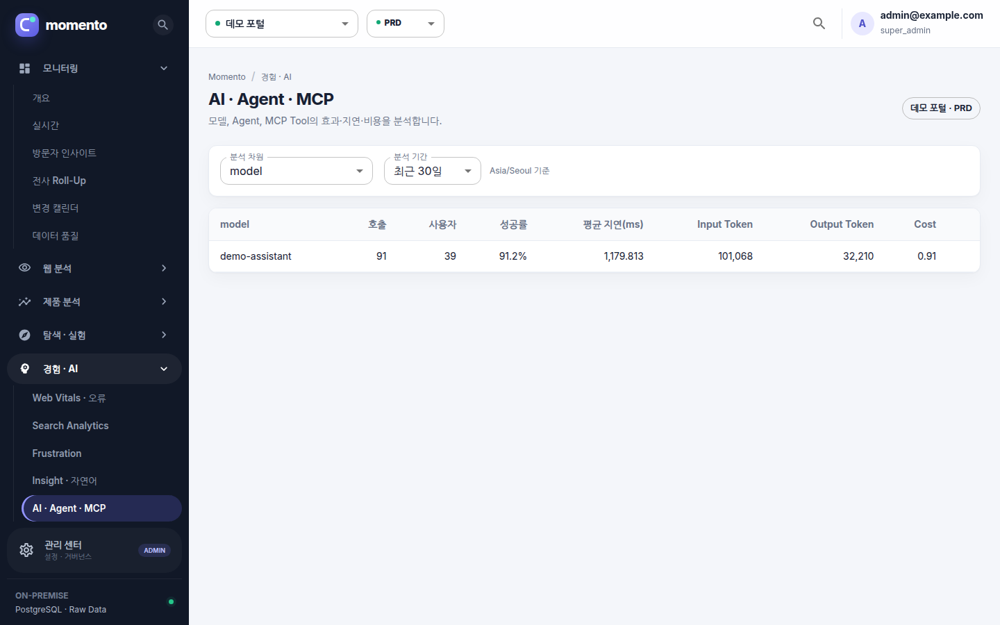

### 3.20 프로필

오른쪽 위 이메일을 누르면 프로필이 열립니다. 표시 이름·비밀번호 변경과 **개인 API 키** 발급·회전·폐기를 여기서 합니다. 키 원문은 발급 시 한 번 표시되며, 관리자가 `MOMENTO_ENCRYPTION_KEY`를 설정한 배포에서는 `저장된 키 보기`로 다시 볼 수 있습니다(조회는 Audit Log에 남습니다).

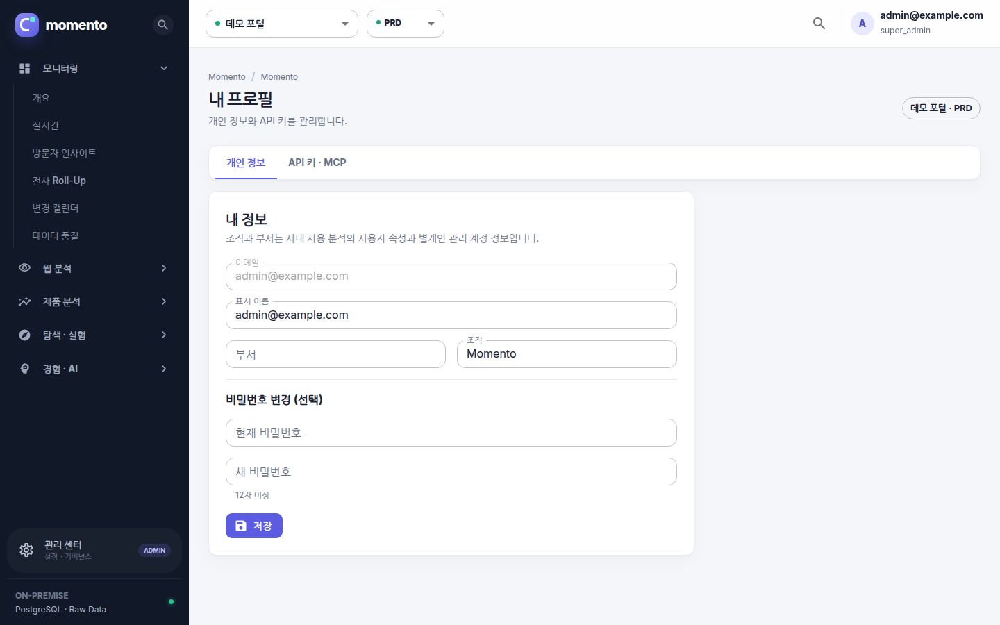

---

## 4. 자주 하는 작업

### 4.1 주간 보고서에 붙일 요약 만들기

1. `모니터링 → 방문자 인사이트`에서 분석 기간을 `최근 7일`로 바꿉니다.
2. 우측 상단 **요약 복사**를 누릅니다. 결론·근거·표가 Markdown으로 클립보드에 들어갑니다.
3. 보고서 도구에 붙입니다. 파일이 필요하면 **Markdown**을 누르고, 표 하나만 필요하면 그 표의 **CSV**를 누릅니다.

### 4.2 "막힌 집단이 실제로 덜 전환하는가" 확인하기

1. `경험 · AI → Frustration`의 `실행 대상`에서 `막힘을 겪고 전환하지 않은 사람` 옆 **Segment 만들기**를 누릅니다.
2. `탐색 · 실험 → 퍼널`을 열고 **비교 Segment**에 방금 만든 Segment를 고른 뒤 **분석**을 누릅니다.
3. 전체 대비 완주율 격차와 **격차가 가장 크게 벌어지는 단계**를 읽습니다. 그 단계가 먼저 고칠 화면입니다.

같은 Segment를 `Cohort · Retention`과 `Web Vitals · 오류`의 비교 Segment에 넣으면 재방문과 성능 격차까지 이어서 볼 수 있습니다.

### 4.3 봇·모니터링 트래픽을 뺀 숫자 보기

1. `탐색 · 실험 → Segment`에서 조건 `traffic.class = normal` 하나짜리 Segment를 저장합니다(사내망만 빼려면 `traffic.internal = false`).
2. 자유 분석·퍼널·Cohort·Web Vitals에서 그 Segment를 선택합니다.

### 4.4 Raw Event 내보내서 BI 도구로 가져가기

1. `탐색 · 실험 → 자유 분석` 아래 **Raw Event Export**에서 기간과 형식(CSV/NDJSON)을 고르고 **내보내기**를 누릅니다. 한 번에 최대 100,000건입니다.
2. NDJSON은 Pandas에서 바로 읽힙니다.

```python
import pandas as pd

df = pd.read_json("momento_events_20260911.ndjson", lines=True)
dept_stats = df.groupby("department")["event_name"].value_counts()
print(dept_stats)
```

스크립트에서 반복적으로 가져가려면 프로필에서 개인 API Key(`mom_key_`)를 발급해 `Authorization: Bearer`로 보냅니다. Key는 **소유자의 권한을 그대로 따르되, 두 가지는 항상 거부됩니다.**

- **관리자 기능**: 사용자·설정·감사 로그 등은 소유자가 super_admin이어도 Key로 접근할 수 없습니다.
- **대화형 쓰기**: Segment 저장처럼 콘솔에서 수행하는 작업은 `SESSION_REQUIRED`로 거부됩니다.

Key를 폐기하거나 만료시키면, 그리고 소유자 계정을 비활성화하면 즉시 401을 받습니다. Key는 조회 범위를 따로 제한하지 않으므로 특정 사이트만 허용하려면 관리자에게 Workspace 권한 조정을 요청합니다.

### 4.5 발견한 것을 정기적으로 받기

정기 배달은 관리자 화면(`관리 센터 → Report · Action`)에서 만듭니다. 분석 화면의 `정기 배달`(방문자 인사이트)과 `알림 설정`(이상 감지)은 종류가 미리 선택된 채로 그 화면을 엽니다. Delivery Channel은 관리자가 먼저 등록해야 합니다.

- **보낼 내용**을 고르면(개요 요약, 인사이트 요약, 방문자 인사이트 전체, 이상 감지 알림, 기능 도입 현황, 경험·오류, AI 사용량, Segment 집계) 그 종류가 쓰는 입력만 표시됩니다.
- 이상 감지 알림은 기간 대신 **전송할 상태**(신규·지속·회복)와 `이상이 없어도 매번 전송`을 고릅니다.
- 저장 전에 "매주 방문자 인사이트 전체 · PRD · 최근 30일" 같은 한 줄 요약으로 무엇이 언제 전송되는지 확인할 수 있습니다.
- 정기 배달은 화면과 **같은 기간**을 씁니다. `days: 7`이면 사이트 시간대의 최근 7일이며 로컬 자정에 끝나므로, 배달된 숫자와 화면의 숫자가 일치합니다. payload에 `from`과 `to`가 함께 담깁니다.

관리자 권한이 없으면 배달 종류·기간·채널을 정해 관리자에게 요청합니다.

### 4.6 개인정보 요청(삭제·Export)에 답하기

개인정보 요청은 관리자가 `Privacy Requests`에서 요청을 만들고 별도 승인으로 실행합니다. 화면을 쓰는 사람이 할 일은 두 가지입니다.

1. `User Explorer`에서 대상자의 **추적 기록 복사**로 어떤 기기·세션이 연결돼 있는지 확인해 요청에 첨부합니다.
2. 삭제 완료 뒤 같은 검색이 비어 있는지 확인합니다. User ID 삭제는 Identity Graph에 연결된 모든 Visitor를 포함합니다.

---

## 5. 막혔을 때

화면에 실제로 나오는 문구와 그때 할 일입니다. **관리자에게**라고 적힌 것은 사용자 화면에서 해결할 수 없습니다.

| 화면 문구 | 뜻 | 할 일 |
| :--- | :--- | :--- |
| `email or password is incorrect` | 로그인 정보가 틀림 | 다시 입력합니다. 비밀번호를 잊었으면 **관리자에게** 재설정을 요청합니다. |
| `too many login attempts` | 같은 IP에서 로그인 실패가 반복돼 잠시 차단됨(`RATE_LIMITED`, 429) | 1분 뒤 다시 시도합니다. |
| `조회가 25초 제한을 넘었습니다` | 대화형 분석 조회의 25초 제한 초과(`QUERY_TIMEOUT`) | 화면이 제시하는 버튼을 누릅니다: **기간 줄이기**, **Segment로 대상 좁히기**, **쿼리 빌더에서 Fast 모드로 실행**, **정기 배달로 받기**. 기간을 바꿀 수 없는 화면에서는 기간 줄이기가 나타나지 않습니다. |
| `이 기간은 사이트 정책이 허용하지 않습니다` | 요청한 기간이 사이트의 최대 정확 조회 기간(기본 180일)을 넘음(`RANGE_EXCEEDS_POLICY`) | 더 짧은 기간을 고르거나 **정기 배달로 받기**를 누릅니다. 이 범위가 정기적으로 필요하면 **관리자에게** `분석 쿼리 보호`의 한도 조정을 요청합니다. User Explorer 타임라인은 365일을 요청하므로, 기본 정책 그대로인 사이트에서는 이 문구가 나옵니다. |
| `방문자 프로필이 꺼져 있습니다` | 개인정보 정책에서 Visitor Profile이 비활성(`VISITOR_PROFILES_DISABLED`) | 권한 등급과 무관한 개인정보 정책입니다. 사람을 지목하지 않는 리포트는 계속 동작합니다. 필요하면 **관리자에게** 정책 변경을 요청합니다. |
| `administrator permission required` | 관리자 전용 기능(`FORBIDDEN`, 403) | 화면은 버튼을 만들지 않고 무엇을 요청해야 하는지 알려줍니다. **관리자에게** 역할 부여를 요청합니다. |
| `this operation requires an interactive session` | 개인 API Key로 콘솔 전용 쓰기 작업을 호출함(`SESSION_REQUIRED`) | 브라우저에서 로그인해 수행합니다. |
| `비교할 수 있는 Segment는 3개까지입니다` | 비교 Segment 초과 | 3개 이하로 줄입니다. |
| `사이트를 찾을 수 없습니다` | 선택한 사이트에 접근 권한이 없거나 삭제됨 | 상단 사이트 선택 상자에서 다른 사이트를 고릅니다. 보여야 할 사이트가 없으면 **관리자에게** Workspace 권한을 요청합니다. |
| 표에 `표본 부족` | 진입 20명(건) 미만 | 판정을 내리지 않은 것입니다. 기간을 넓히거나 Segment를 넓힙니다. |
| 이상 감지에 `데이터 부족` | 같은 요일 표본이 3개 미만이고 최근 28일도 부족 | 데이터가 더 쌓일 때까지 기다립니다. 배포 3주 이내에는 정상입니다. |
| 사내 사용 현황의 부서·조직이 `(미지정)` | `analytics.identify`가 부서·조직을 보내지 않음 | 개발자에게 [7.3](#73-사용자-및-부서-식별-analyticsidentify)을 전달합니다. |
| Frustration에 "Session은 있는데 신호가 0건" | 스니펫이 오래됐거나 `data-frustration-signals="false"` | 개발자에게 SDK 스니펫 갱신을 요청합니다. |

조회가 8초를 넘기면 대기 화면이 상황을 알리고, 20초를 넘기면 제한에 가까워지고 있음을 알려 완료 전에 대응할 수 있게 합니다. 분석 기간 선택지는 사이트 정책을 반영하므로 정책이 허용하지 않는 기간은 목록에 나타나지 않습니다.

---

## 6. 용어

| 용어 | 뜻 |
| :--- | :--- |
| 사이트 | 측정 대상 서비스 하나. `SITE_XXXXXXXX` 키를 가지며 SDK의 `data-site-id`가 이 값입니다. |
| 환경 | 같은 사이트의 `dev`·`stg`·`prd`. SDK가 생략하면 `prd`입니다. |
| Visitor | 브라우저(기기) 단위 식별자. |
| 사용자 | `analytics.identify` 또는 SSO로 연결된 사람 단위. 여러 Visitor가 한 사용자로 합쳐집니다. |
| Session | 한 번의 방문. 사이트 설정의 Session Timeout(기본 30분) 동안 활동이 없으면 끝납니다. |
| 참여 세션 | `지속시간 ≥ 기준(기본 10초)`, `전환 1회 이상`, `Page View 2회 이상`, `Active Engagement ≥ 기준` 중 하나를 충족한 세션. |
| 전환 | `conversion`·`purchase` Event, 또는 관리자가 이벤트 스키마에서 전환으로 표시한 Event. |
| Segment | 저장된 사용자 조건. 자유 분석·퍼널·Cohort·Web Vitals·정기 배달에서 재사용합니다. |
| 실행 대상 | 인사이트 화면이 제시하는, 바로 Segment로 저장할 수 있는 집단. |
| Query Mode | `Exact`(전량) / `Fast` / `Preview`(표본). |
| Frustration 신호 | tracker가 자동 감지하는 막힘 신호(rage_click, dead_click, rapid_back, form_retry, repeated_search, error_after_click, slow_interaction). |
| traffic.class / traffic.internal | 어떤 클라이언트가 보냈는지(봇·모니터링·정상) / 사내망에서 왔는지. |
| 정기 배달 | Scheduled Report. 관리자가 만든 Delivery Channel로 보고서를 주기적으로 전송. |
| Workspace | 사이트를 묶는 단위. 전사 Roll-Up과 교차 서비스 기여도의 범위. |

---

## 7. 개발자: SDK 연동

측정 대상 서비스에 tracker를 넣는 사람을 위한 절입니다. 설치 코드와 CSP 스니펫은 관리자 화면 `관리 센터 → 사이트 → SDK 설치`에서 사이트에 맞게 생성된 것을 복사할 수 있습니다.

### 7.1 스크립트 비동기 설치

웹 애플리케이션의 `<head>` 영역에 아래 스크립트를 비동기로 삽입합니다.

```html
<!-- Momento JavaScript Tracker SDK -->
<script
  async
  src="https://momento.internal/tracker.js"
  data-site-id="SITE_CORPORATE_001"
  data-environment="prd"
  data-contract-version="1"
  data-mode="full"
  data-debug="false"
></script>
```

| 속성 (Attribute) | 타입 | 필수 여부 | 설명 |
| :--- | :--- | :--- | :--- |
| `data-site-id` | String | **필수** | 관리자 콘솔에서 생성한 사이트 고유 식별 키 |
| `data-environment` | String | 선택 | `dev`, `stg`, `prd` 등 관리자에게 등록한 환경. 기본 `prd` |
| `data-contract-version` | Number | 선택 | 전송 Event Contract version. 기본 `1` |
| `data-mode` | String | 선택 | `full`, `consent-required`, `cookieless`, `disabled` 중 선택 |
| `data-debug` | Boolean | 선택 | `true`이면 브라우저 콘솔에 SDK 진단 로그 출력 |
| `data-collect-element-text` | Boolean | 선택 | 버튼 문구 수집. 개인정보 최소화를 위해 기본값은 `false` |
| `data-auto-rum` | Boolean | 선택 | Core Web Vitals와 Resource Error 자동 수집. 기본 `true` |
| `data-session-timeout` | Number | 선택 | Session 구분 기준(분). 관리 콘솔의 사이트 Session Timeout 설정이 이 속성으로 전달됩니다. 기본 `30` |
| `data-frustration-signals` | Boolean | 선택 | Rage Click, Dead Click, Rapid Back, Form Retry, Error After Click, Slow Interaction 자동 감지. 기본 `true` |
| `data-search-tracking` | Boolean | 선택 | 결과 페이지의 질의 문자열로 사이트 검색 자동 인식. 기본 `true` |
| `data-collect-search-terms` | Boolean | 선택 | 검색어 원문 수집. 개인정보 최소화를 위해 기본값은 `false` |
| `data-search-params` | String | 선택 | 검색어 질의 문자열 이름 추가 지정(쉼표 구분). 기본값은 `q,query,search,searchword,keyword,kwd,term,s` |
| `data-release-version` | String | 선택 | Release Impact 비교용 애플리케이션 릴리스 |
| `data-git-sha` | String | 선택 | 배포 소스 revision |
| `data-endpoint` | String | 선택 | Collector 주소 override. 절대 URL 또는 같은 Origin의 프록시 경로(`/momento`) |

Collector endpoint는 `tracker.js`를 제공한 Origin의 `/collect/v1/events`로 자동 설정됩니다. Page View, SPA History 변경, 클릭, 스크롤, Form, Download, Outbound Link, Error, Heartbeat, LCP/INP/CLS/FCP/TTFB와 Resource Error는 기본 자동 수집됩니다.

각 이벤트에는 `track()` 호출 순간의 URL, 제목, Referrer, Device와 최초 UTM Context가 snapshot으로 저장됩니다. 따라서 1초 배치 전송을 기다리는 동안 SPA Route가 바뀌어도 이전 페이지의 Click이 새 페이지로 잘못 분류되지 않습니다. SDK가 자동 수집하는 URL에서는 Query String과 Fragment를 제거합니다.

### 7.1.1 자동 감지되는 Frustration 신호와 사이트 검색

별도 계측 없이 다음을 감지합니다. 감지 기준은 화면의 신호 설명과 동일합니다.

| Event | 감지 기준 |
| :--- | :--- |
| `rage_click` | 같은 요소를 1초 안에 3번 이상 클릭. 실제 클릭 수를 `clicks`로 전달 |
| `dead_click` | 클릭 가능해 보이는 요소를 눌렀지만 1.2초 동안 DOM 변화, 이동, 스크롤, 포커스 이동, 텍스트 선택이 모두 없음 |
| `rapid_back` | 도착 후 3초 안에 뒤로 이동. 머문 시간을 `dwell_ms`로 전달 |
| `form_retry` | 같은 Form 재제출(`reason=resubmit`) 또는 입력 검증 실패(`reason=validation`) |
| `repeated_search` | 같은 검색어를 2분 안에 재검색 |
| `error_after_click` | 클릭 후 2초 안에 오류 발생. 원인 요소를 함께 전달 |
| `slow_interaction` | 입력 응답이 500ms 초과(INP `poor` 구간) |
| `search` | 결과 페이지 질의 문자열에서 검색 인식. `query_length`, `query_words`, `result_count` 전달 |
| `search_click` | 검색 결과 링크 클릭. 순위를 `position`으로 전달 |
| `search_refine` | 검색어를 좁히거나 넓혀 재검색. 방향을 `direction`으로 전달 |
| `collection_dropped` | 오프라인 큐가 저장 한도(200건)를 넘겨 오래된 이벤트를 버렸습니다. 잃어버린 건수를 `events_dropped`로 전달 |

`collection_dropped`가 보이면 **해당 구간의 수치는 실제보다 낮습니다.**

브라우저가 오프라인일 때 페이지를 벗어나면 `sendBeacon`은 페이로드를 접수하지만 전달을 보장하지 않으므로, 그 배치는 전송하지 않고 큐에 남겨 다음 페이지 로드에서 보냅니다. 온라인 상태에서 브라우저가 강제 종료된 경우의 손실은 페이지가 관측할 수 없어 막지 못합니다. 한 페이지에서 보고하는 신호 수는 20건으로 제한되어, 렌더 루프에 빠진 화면이 수천 건의 Event로 번지지 않습니다.

정확도를 높이는 선택 계측은 세 가지입니다. 없어도 검색 횟수와 Frustration 신호는 수집되지만, 결과 0건 비율과 클릭된 결과 순위는 페이지가 알려줘야만 알 수 있습니다.

```html
<div data-momento-search-results="12">
  <a href="/doc/1" data-momento-search-position="1">첫 번째 결과</a>
</div>

<!-- 정상 동작하는 위젯이 Dead Click으로 잡히면 제외 -->
<div data-momento-ignore-dead-click>...</div>
```

URL이 바뀌지 않는 검색은 직접 알려줍니다.

```js
analytics.trackSearch(query, results.length);
```

검색어 원문은 사람이 입력한 자유 텍스트이므로 기본적으로 보내지 않습니다. `data-collect-search-terms="true"`를 켜면 공백 정리와 소문자 정규화 후 100자까지 전송하며, 이메일·주민등록번호·휴대전화 번호는 브라우저에서 먼저 제거하고 서버의 PII 정책이 한 번 더 검사합니다.

### 7.1.2 Content-Security-Policy 허용

측정 대상 애플리케이션이 CSP를 사용하면 `tracker.js` 로드와 수집 요청을 명시적으로 허용해야 합니다. 예를 들어 `connect-src 'self' ws: wss:`만 허용된 페이지에서는 브라우저가 `/collect/v1/events` 요청을 차단하고 콘솔에 `Refused to connect ... violates the document's Content Security Policy`를 남깁니다.

```
Content-Security-Policy: script-src 'self' https://momento.internal; connect-src 'self' https://momento.internal
```

CSP를 변경할 수 없는 애플리케이션은 Collector를 같은 Origin으로 프록시하고 `data-endpoint`로 그 경로를 지정하면 `connect-src 'self'`만으로 동작합니다.

```nginx
location /momento/ {
  proxy_pass https://momento.internal/;
  proxy_set_header Host $host;
  proxy_set_header X-Forwarded-For $proxy_add_x_forwarded_for;
  proxy_set_header X-Forwarded-Proto $scheme;
}
```

```html
<script async src="https://momento.internal/tracker.js"
  data-site-id="SITE_CORPORATE_001" data-endpoint="/momento"></script>
```

관리 센터 → 사이트 → SDK 설치 화면의 **CSP 허용** 항목에서 위 정책과 프록시 설정을 복사할 수 있고, **설치 진단** 탭에서 수집 수신 여부와 허용 도메인, 환경 일치, 적재 파이프라인 상태를 서버 기준으로 확인할 수 있습니다. SDK도 CSP 위반을 감지하면 브라우저 콘솔에 필요한 정책을 안내합니다.

### 7.2 Consent와 Cookieless

| 모드 | 동의 전 | Visitor 저장 | 용도 |
| :--- | :--- | :--- | :--- |
| `disabled` | Event 없음 | 없음 | 추적 중지 |
| `consent-required` | Event 없음 | 동의 후에만 저장 | 분석 동의가 필수인 환경 |
| `cookieless` | Event 수집 | 영속 저장 없음 | 익명 분석 |
| `full` | Event 수집 | 영속 Visitor/Session | 허용된 내부 분석 |

`consent-required`는 `localStorage`가 차단된 브라우저에서도 안전하게 수집을 중지합니다. `analytics.consent.grant()`는 저장소가 없어도 현재 Page에서 유효하며, 동의를 기다리는 동안에도 최초 UTM은 유지합니다. `deny()`와 `revoke()`는 대기열·영속 식별자·Offline Queue를 정리합니다.

### 7.3 사용자 및 부서 식별 (`analytics.identify`)

로그인한 사용자의 사내 식별자와 부서/조직 체계 정보를 수집기에 전달합니다.

```javascript
// 사용자 로그인 시 호출
analytics.identify("EMP_2026_9012", {
  department: "Digital Platform Team",
  organization: "R&D Center",
  role: "Senior Architect",
  location: "HQ_Seoul"
});
```

> ⚠️ **보안 수칙**: 이메일 주소, 전화번호, 주민등록번호, 카드번호 등 개인식별정보(PII)는 `user_id` 또는 속성으로 전달하지 마십시오. 수집기는 관리자가 지정한 Property key 제거와 URL 정책에 더해 값 기반 PII 탐지·마스킹을 Inbox 저장 전에 수행하지만, 애플리케이션의 최소 수집 책임을 대신하지는 않습니다.

### 7.4 커스텀 이벤트 트래킹 (`analytics.track`)

```javascript
// 서식 제출 이벤트
analytics.track("document_submitted", {
  document_id: "DOC_2026_0808",
  category: "Approval",
  amount: 1500000,
  approval_step: "Final"
});

// 파일 다운로드 이벤트
analytics.track("file_downloaded", {
  file_name: "Q2_Financial_Report.pdf",
  file_size_mb: 14.2,
  download_source: "Intranet_Notice"
});
```

세션 동안 유지할 로그인 상태나 업무 흐름은 Event Property와 구분해 설정할 수 있습니다. 값은 각 Event 발생 시점에 snapshot되므로 배치 전송이나 Raw Event 재집계 후에도 Session Scope Dimension이 동일합니다.

```javascript
analytics.setSessionProperties({
  login_status: "authenticated",
  workflow: "approval"
});
```

기능 단위 분석(사내 사용 현황, Feature Adoption, Feature Intelligence)은 Event의 `feature` Property를 읽습니다. 서비스 구분은 `service` Property이며, 없으면 사이트의 Service Name을 씁니다.

### 7.5 SPA 라우트 변경 추적

History API 변경은 자동 수집됩니다. 라우터가 History를 쓰지 않는 경우에만 수동으로 보냅니다.

```javascript
router.on('routeChangeComplete', () => {
  analytics.track("page_view");
});
```

### 7.6 오프라인 큐 & Beacon 재전송

- **Beacon API**: 브라우저 닫힘 또는 페이지 이동 시 이벤트 손실 방지를 위해 `navigator.sendBeacon`을 이용합니다.
- **Offline Queue**: 네트워크 유실 시 최근 이벤트를 `localStorage`에 보관하며(최대 200건), 네트워크 복구 시 자동으로 배치 재전송합니다.

### 7.7 서버 사이드 수집

서버에서 직접 보낼 때는 `POST /collect/v1/events`에 사이트별 **Server API Key**(`mom_server_`)를 `tracking_key`로 넣습니다. Origin 헤더가 없는 요청은 서버 간 호출로 보아 Server API Key만 허용하고 Tracking Key(`mom_track_`)는 거부합니다 — 페이지 HTML에 노출되는 키로 서버 사이드 이벤트를 주입할 수 없게 하기 위해서입니다. 한 요청의 이벤트 수는 관리자 설정 `max_events_per_request`(기본 100)를 넘을 수 없습니다. 페이로드 형식은 [OpenAPI](openapi.yaml)를 참고하십시오.
