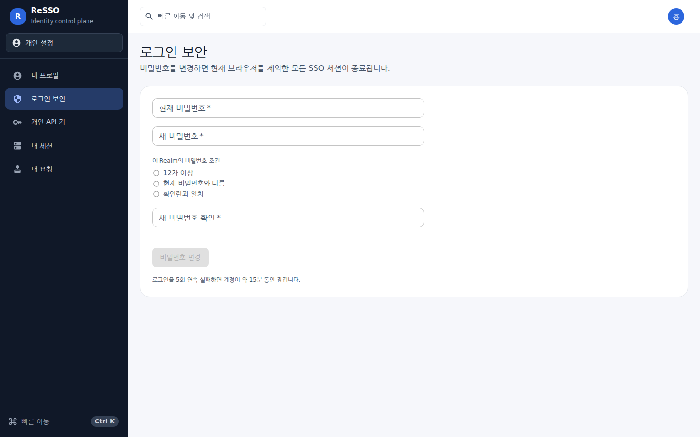
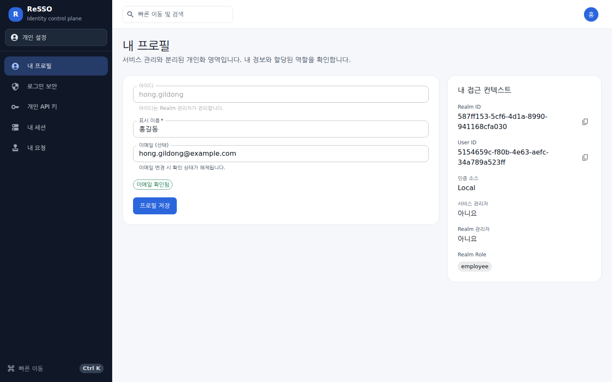
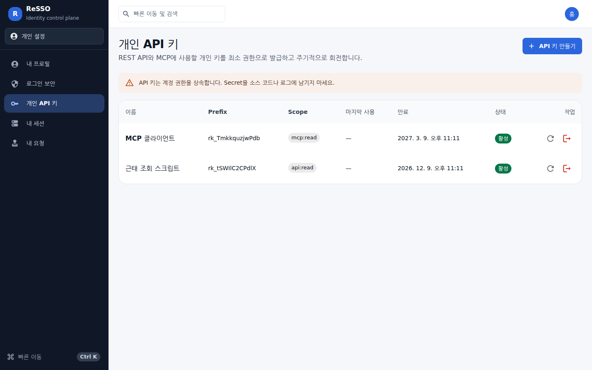
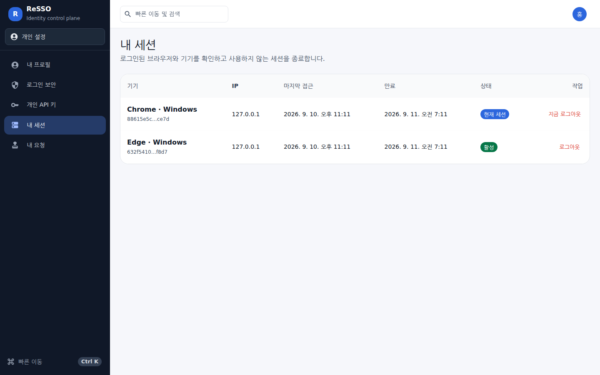
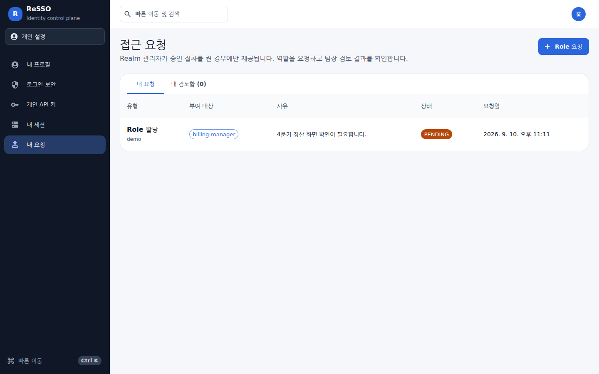

# ReSSO 사용자 가이드

이 문서는 ReSSO 화면을 **쓰는 사람**을 위한 것입니다. ReSSO를 설치하고 지키는 사람은
[관리자 가이드](ADMIN_GUIDE.md)를 보세요.

- 대상 버전: v0.9.77
- 화면 캡처는 모두 v0.9.77을 실제로 띄워 찍었으며, 등장하는 이름·이메일·주소는 모두 가짜입니다.

## 1. ReSSO가 하는 일

ReSSO는 회사가 쓰는 여러 애플리케이션이 **각자 아이디와 비밀번호를 따로 묻지 않게** 해 주는
서비스입니다. 포털에 로그인하든 근태 앱에 로그인하든 실제로 비밀번호를 받는 곳은 ReSSO 한
곳이고, 애플리케이션은 "이 사람이 누구인지" 만 ReSSO에게 확인받습니다. 그래서 한 번 로그인하면
같은 브라우저에서 다른 애플리케이션으로 넘어갈 때 다시 묻지 않습니다(SSO, Single Sign-On).

여러분이 ReSSO 화면을 직접 여는 경우는 많지 않습니다. 대부분은 애플리케이션이 여러분을 이
로그인 화면으로 보내고, 로그인이 끝나면 원래 있던 애플리케이션으로 되돌려 보냅니다. 직접
들어오는 것은 **내 계정을 관리할 때**입니다 — 비밀번호를 바꾸거나, 내가 어디에 로그인해 두었는지
확인해 그 세션을 끊거나, 자동화·AI 도구에 쓸 개인 API 키를 만들 때입니다.

이 문서가 설명하는 화면은 **개인 설정** 영역입니다. Realm·사용자·Client를 다루는 **서비스 관리**
영역은 관리자에게만 보이며, 그쪽은 [관리자 가이드](ADMIN_GUIDE.md)에서 다룹니다.

## 2. 처음 5분

### 2-1. 로그인

애플리케이션에서 "로그인"을 누르면 아래 화면이 나옵니다.


| 칸 | 무엇을 넣나 |
|---|---|
| **Realm** | 여러분의 계정이 속한 영역 이름입니다. 애플리케이션에서 넘어왔다면 이 칸은 보이지 않습니다 — 그 애플리케이션이 이미 정해서 보냈기 때문입니다. 직접 들어와서 무엇을 넣을지 모르겠다면 관리자에게 물어보세요. 관리자 계정의 기본값은 `master`입니다. |
| **아이디** | 관리자가 만들어 준 계정 아이디입니다. 이메일 주소가 아닙니다. |
| **비밀번호** | 오른쪽 눈 모양 아이콘으로 입력한 값을 확인할 수 있습니다. |

애플리케이션에서 넘어온 경우 제목 아래에 `사내 포털에서 데모 회사 계정 인증을 요청했습니다.`
처럼 **어느 서비스가 요청했는지** 적힙니다. 이 문장이 여러분이 기대한 서비스와 다르면 로그인하지
말고 관리자에게 알리세요.

로그인이 끝나면 애플리케이션으로 자동으로 돌아갑니다. 직접 들어온 경우에는 **내 프로필**
화면으로 들어갑니다.

### 2-2. 첫 로그인 뒤에 할 일 — 비밀번호 바꾸기

관리자가 알려 준 임시 비밀번호로 처음 로그인했다면 **로그인 보안**에서 바로 바꾸세요.
왼쪽 메뉴 → `로그인 보안` → 현재 비밀번호와 새 비밀번호를 넣고 `비밀번호 변경`입니다.



`이 Realm의 비밀번호 조건`은 관리자가 정한 값이라 회사마다 다릅니다. 조건을 모두 만족해야
`비밀번호 변경` 버튼이 눌립니다.

> **비밀번호를 바꾸면 지금 쓰고 있는 브라우저를 제외한 모든 로그인이 끊깁니다.** 다른 PC나
> 휴대폰에서는 새 비밀번호로 다시 로그인해야 합니다. 비밀번호가 샜을 것 같을 때 이 동작이
> 가장 빠른 대응입니다.

## 3. 화면별 사용법

왼쪽 메뉴의 다섯 화면이 개인 설정 영역의 전부입니다. 맨 위 `빠른 이동 및 검색` 칸(단축키
`Ctrl K`)으로도 화면을 옮겨 다닐 수 있습니다.

### 3-1. 내 프로필



여기서 할 수 있는 일:

- **표시 이름**과 **이메일**을 바꾸고 `프로필 저장`을 누릅니다.
- **아이디는 바꿀 수 없습니다.** 아이디는 Realm 관리자가 관리합니다.
- 이메일을 바꾸면 기존 `이메일 확인됨` 표시가 해제됩니다.

오른쪽 `내 접근 컨텍스트` 카드는 문의할 때 그대로 전달하면 좋은 정보입니다.

| 항목 | 뜻 |
|---|---|
| Realm ID · User ID | 내 계정을 가리키는 식별자. 옆의 복사 버튼으로 복사해 관리자에게 전달합니다. |
| 인증 소스 | `Local`이면 ReSSO가 직접 비밀번호를 보관합니다. `LDAP Federation`이면 회사 디렉터리(AD 등)의 계정입니다. |
| 서비스 관리자 · Realm 관리자 | `예`이면 왼쪽 메뉴에 서비스 관리 영역이 함께 보입니다. |
| Realm Role | 지금 내가 가진 역할입니다. 애플리케이션은 이 역할을 보고 무엇을 보여줄지 정합니다. |

> **LDAP 연동 계정**이면 화면 위에 안내가 뜹니다. 정책이 `READ_ONLY`면 이름·이메일을 여기서
> 바꿀 수 없고 원본 디렉터리에서 바꿔야 합니다.

### 3-2. 로그인 보안

비밀번호를 바꾸는 화면입니다. 위 [2-2](#2-2-첫-로그인-뒤에-할-일--비밀번호-바꾸기)를 보세요.
화면 맨 아래에는 이 Realm의 잠금 정책이 그대로 적혀 있습니다 — 예: `로그인을 5회 연속 실패하면
계정이 약 15분 동안 잠깁니다.`

LDAP 연동 계정은 공급자 설정이 `WRITABLE`일 때만 여기서 비밀번호를 바꿀 수 있습니다.

### 3-3. 개인 API 키



스크립트나 AI 도구(MCP 클라이언트)가 **여러분 대신** ReSSO를 읽게 할 때 쓰는 키입니다.
비밀번호와 달리 범위와 만료를 좁게 정할 수 있습니다.

`API 키 만들기`를 누르면 세 가지를 정합니다.

| 항목 | 설명 |
|---|---|
| 키 이름 | 나중에 어디에 쓴 키인지 알아볼 이름. 예: `로컬 MCP 클라이언트` |
| 만료 일수 | 1~365일. 짧을수록 안전합니다. |
| 권한 범위 | `api:read` — 개인 REST 조회 API / `mcp:read` — MCP 도구로 서비스 상태 조회 / `admin:read` — 관리자 계정에만 보이며, 권한 범위 안의 관리 조회 API를 함께 허용 |

만들면 **Secret이 딱 한 번만** 표시됩니다(`Secret을 지금 복사하세요` 창). 그 창을 닫으면 다시
볼 수 없으므로 그 자리에서 복사해 안전한 곳에 넣으세요. 잃어버렸다면 그 키를 **회전**하면
새 값이 나옵니다.

목록 오른쪽 두 버튼:

- **키 회전**(↻) — 같은 이름·같은 범위로 값만 새로 만듭니다. 예전 값은 즉시 못 쓰게 됩니다.
- **키 폐기**(→]) — 그 키를 즉시 못 쓰게 합니다. 되돌릴 수 없습니다.

> API 키는 **계정 권한을 그대로 물려받습니다.** 소스 코드나 로그에 남기지 마세요.
> 모든 키는 읽기 전용입니다 — 설정을 바꾸는 API는 브라우저 로그인 상태에서만 동작합니다.

### 3-4. 내 세션



내 계정으로 로그인되어 있는 브라우저 목록입니다. `현재 세션`이 지금 보고 있는 브라우저입니다.

- 모르는 기기나 더 이상 쓰지 않는 기기는 `로그아웃`으로 끊으세요.
- `지금 로그아웃`은 지금 이 브라우저를 끊습니다 — 누르면 곧바로 로그인 화면으로 돌아갑니다.
- Realm에 유휴 만료가 설정되어 있으면 화면 위에 `이 Realm은 약 N분 동안 사용되지 않은 세션을
  자동으로 만료합니다.`가 표시됩니다.

기기 이름(`Chrome · Windows`)은 브라우저가 스스로 밝힌 정보로 만든 것이라 정확한 기기 이름은
아닙니다. 어느 줄이 내 것인지는 `IP`와 `마지막 접근` 시각을 함께 보고 판단하세요.

### 3-5. 접근 요청



**관리자가 이 Realm에 승인 절차를 켠 경우에만** 왼쪽 메뉴에 `내 요청`이 보입니다.

- `Role 요청`을 누르고 필요한 Role과 사유를 적어 보냅니다.
- 검토자는 내 계정에 등록된 **팀장**입니다. 팀장이 등록되어 있지 않으면 Realm 관리자가 검토합니다.
- 상태는 `PENDING`(대기) → `APPROVED`(승인) 또는 `REJECTED`(반려)로 바뀝니다. 승인되면 Role이
  즉시 부여됩니다.
- 내가 다른 사람의 팀장이면 `내 검토함` 탭에 검토할 요청이 쌓이고, 각 줄에서 `승인`·`반려`를
  결정합니다. 남긴 검토 의견은 감사 기록에 함께 남습니다.

## 4. 자주 하는 작업

### 비밀번호가 샌 것 같을 때

`로그인 보안`에서 비밀번호를 바꾸세요. 그것만으로 **현재 브라우저를 제외한 모든 세션이
종료됩니다.** 이어서 `개인 API 키`에서 쓰지 않는 키를 폐기하고, 필요한 키는 회전하세요.

### 새 노트북을 받았을 때 / 옛 PC를 반납할 때

`내 세션`에서 그 기기의 줄을 찾아 `로그아웃`을 누릅니다. 어느 줄인지 확신이 없으면 `현재 세션`
이 아닌 줄을 모두 끊어도 됩니다 — 필요한 기기에서 다시 로그인하면 됩니다.

### AI 도구(MCP)에 ReSSO를 연결할 때

1. `개인 API 키` → `API 키 만들기` → 범위에 `mcp:read`를 체크하고 만듭니다.
2. 표시된 Secret을 복사합니다(다시 볼 수 없습니다).
3. 도구의 설정 파일에 넣습니다. 서버 주소는 관리자에게 확인하세요.

```json
{
  "mcpServers": {
    "resso": {
      "url": "https://sso.example.com/mcp",
      "headers": { "Authorization": "Bearer rk_xxxxx.yyyyy" }
    }
  }
}
```

`mcp:read`만 있는 키는 서비스 상태만 읽습니다. Client·User 목록을 다루는 도구는 관리자 계정에
`admin:read`가 함께 있어야 목록에 나타납니다.

### 애플리케이션에서 로그아웃해도 다시 자동으로 로그인될 때

애플리케이션에서 로그아웃해도 ReSSO의 SSO 세션이 남아 있으면 다시 눌렀을 때 묻지 않고 들어갑니다.
완전히 끊으려면 `내 세션`에서 해당 세션을 종료하세요.

## 5. 막혔을 때

화면에 그대로 뜨는 문구를 기준으로 찾으세요.

| 화면에 뜬 말 | 무슨 뜻인가 | 무엇을 하면 되나 |
|---|---|---|
| `아이디 또는 비밀번호가 올바르지 않습니다.` | 자격 증명이 맞지 않습니다. Realm 칸이 틀려도 같은 답이 나옵니다. | 아이디·비밀번호와 **Realm**을 다시 확인합니다. |
| `여러 번 실패했습니다. 반복 실패하면 계정이 일정 시간 잠기며…` | 세 번 연속 거절되었습니다. 아직 잠기지는 않았습니다. | 비밀번호가 확실하지 않으면 **잠기기 전에** 관리자에게 문의하세요. |
| `연속된 로그인 실패로 계정이 잠겼습니다. 약 N분 후에…` | 잠금 상태입니다. 이 동안에는 **올바른 비밀번호로도** 로그인되지 않습니다. | 표시된 시간을 기다리거나 관리자에게 잠금 해제를 요청합니다. |
| `로그인 시도가 제한되었습니다. 약 N분 후에 다시 시도할 수 있습니다.` | 같은 네트워크에서 시도가 너무 많았습니다. | 표시된 시간만큼 기다립니다. |
| `로그인 요청이 만료되었습니다. 연결한 서비스에서 다시 시작하세요.` | 애플리케이션이 보낸 로그인 요청이 쓰였거나 시간이 지났습니다. | **애플리케이션으로 돌아가** 로그인을 다시 시작합니다. |
| `로그인 요청을 확인하지 못했습니다. 요청은 그대로 남아 있으니 연결한 서비스에서 다시 시작하지 말고, 잠시 후 다시 시도하세요.` | ReSSO 쪽 일시적인 문제입니다. 여러분의 로그인 요청은 그대로 있습니다. | 화면의 `다시 시도`를 누릅니다. 계속되면 함께 표시된 `trace:` 값을 관리자에게 전달하세요. |
| `이 애플리케이션은 이전에 사용하던 계정으로 다시 로그인하도록 요청했습니다. 방금 로그인한 계정은 그 계정이 아닙니다. 요청한 계정으로 로그인하세요.` | 비밀번호는 맞았고 로그인 자체는 성공했지만, 애플리케이션이 **다른 계정**을 지목했습니다. | 노란 알림 아래에 적힌 대로, 이 화면에서 그 계정으로 다시 로그인하면 그대로 이어집니다. 애플리케이션으로 돌아가지 마세요. |
| `계정이 비활성화되어 있습니다. 관리자에게 문의하세요.` | 비밀번호는 맞지만 계정이 꺼져 있습니다. | 관리자에게 계정 활성화를 요청합니다. |
| `로그인을 처리하지 못했습니다.` | ReSSO 쪽에서 로그인 시도를 끝내지 못했습니다. 계정에는 아무것도 기록되지 않았습니다. | 잠시 후 이 화면에서 그대로 다시 시도합니다. 계속되면 관리자에게 알리세요. |
| `세션이 만료되어 로그아웃되었습니다. 다시 로그인하세요.` | 세션 수명이 끝났거나 유휴 시간이 지났습니다. | 다시 로그인합니다. |
| `요청 검증 토큰이 올바르지 않습니다.` | 브라우저 탭을 오래 열어 둔 뒤 저장을 눌렀을 때 나옵니다. | 페이지를 새로 고친 뒤 다시 시도합니다. |
| `이 Realm에는 승인 절차가 설정되어 있지 않습니다.` | 이 Realm에서 접근 요청 기능이 꺼져 있습니다. | 관리자에게 권한 부여를 직접 요청하세요. |

관리자에게 문의할 때는 다음 세 가지를 함께 전달하면 훨씬 빨리 해결됩니다.

1. 화면에 뜬 문구 그대로
2. `trace:` 로 시작하는 값이 보였다면 그 값
3. `내 프로필` → `내 접근 컨텍스트`의 **User ID**

## 6. 용어

| 화면에 나오는 말 | 뜻 |
|---|---|
| **Realm** | 계정·역할·애플리케이션이 함께 묶인 영역. 다른 Realm과는 완전히 분리됩니다. |
| **SSO 세션** | 한 브라우저의 로그인 상태. 이것이 살아 있는 동안에는 애플리케이션이 다시 묻지 않습니다. |
| **Role(역할)** | 계정에 붙는 권한 이름. 애플리케이션이 이 값을 보고 화면을 정합니다. |
| **Client** | ReSSO에 연결된 애플리케이션. 로그인 화면 위에 이름이 표시됩니다. |
| **Scope(권한 범위)** | API 키가 할 수 있는 일의 범위. `api:read`, `mcp:read`, `admin:read`. |
| **Prefix** | API 키 앞부분(`rk_`로 시작). 어느 키인지 구분하는 데만 쓰이며 이것만으로는 인증되지 않습니다. |
| **MCP** | AI 도구가 외부 서비스를 읽는 표준 방식. ReSSO는 읽기 전용으로 지원합니다. |
| **Trace ID** | 요청 하나에 붙는 추적 번호. 관리자가 서버 로그에서 그 요청만 골라 볼 수 있습니다. |
| **LDAP Federation** | 회사 디렉터리(AD 등)의 계정을 그대로 쓰는 연동. `인증 소스`가 이렇게 표시됩니다. |
