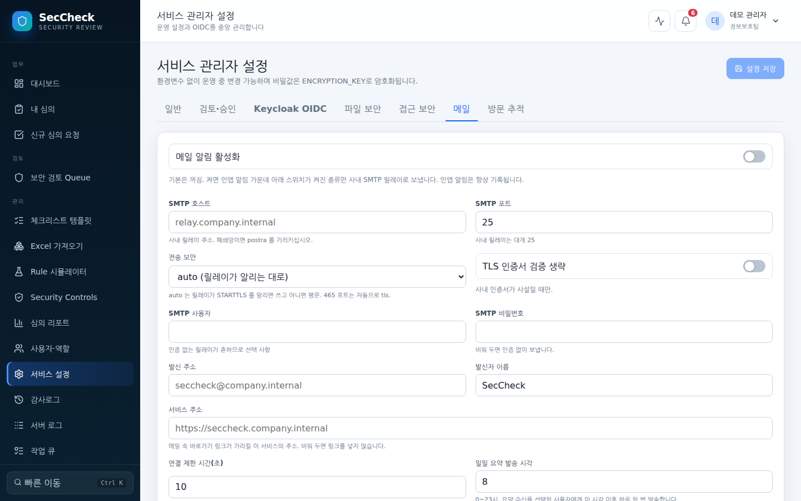

# SecCheck 관리자 가이드

이 문서는 SecCheck 를 **띄워 놓고 지키는 사람**을 위한 안내입니다. 설치, 설정, 계정과 권한, 백업·복구·업그레이드, 장애 대응, 보안 기본값을 다룹니다. 화면을 쓰는 방법은 [사용자 가이드](USER_GUIDE.md)에 있으며 여기서는 반복하지 않습니다. API 와 MCP 연계는 [api-guide.md](api-guide.md), Prometheus 지표 전체 목록은 [operations.md](operations.md)를 보십시오.

화면 캡처는 모두 데모 데이터(`데모 회사`, `hong@example.com`)를 채운 실제 화면입니다.

---

## 1. 구성 요소

| 구성 요소 | 무엇 | 주고받는 것 |
| :--- | :--- | :--- |
| `seccheck` 컨테이너 | Go 단일 바이너리. HTTP 서버, 정적 UI, Rule Engine, 증적 암호화, 감사로그 해시 체인, 알림·증적 검사 백그라운드 워커, 매시간 정기 점검 | `:8080` 으로 HTTP 수신. PostgreSQL 에 연결. `/app/data` 에 암호화된 증적 저장 |
| PostgreSQL 17 | 심의·템플릿·감사로그·설정·작업 큐·서버 로그의 유일한 저장소 | `POSTGRES_DSN` 으로 연결. 마이그레이션은 기동 시 자동 적용 |
| 증적 볼륨 (`/app/data`) | AES-256-GCM 으로 암호화된 증적 파일. UUID 파일명 | 데이터베이스와 **같은 시점**으로 백업해야 함 |
| Reverse Proxy (권장) | TLS 종단, 접근 허용 목록 | `X-Forwarded-For` 를 `trusted_proxies` 에 등록해야 접속 IP 가 올바르게 기록됨 |
| Keycloak / OIDC IdP (선택) | 사내 SSO | Authorization Code + PKCE. Callback `https://<host>/api/v1/auth/oidc/callback` |
| SMTP 릴레이 (선택) | 메일 알림 | 서비스 설정 > 메일. 사내 릴레이(포트 25·인증 없음·TLS 없음)가 기본이며 폐쇄망은 `postra` 를 권장. 없으면 인앱 알림만 남음 |
| ClamAV `clamd` (선택) | 증적 악성코드 검사 | 서비스 설정 > 파일 보안. 없으면 검사를 건너뜀(`검사 안 함`) |

Redis, 외부 CDN, 인터넷 연결은 필요하지 않습니다. UI, 한글 PDF 글꼴, 기본 체크리스트 workbook, 마이그레이션이 모두 이미지에 들어 있습니다.

---

## 2. 설치

릴리즈 자산 하나(`seccheck-v1.0.145.tar.gz`)로 처음부터 끝까지 올리는 순서입니다. 아래 명령은 그대로 붙여 넣을 수 있으며, 값은 예시이므로 실제 값으로 바꾸십시오.

### 2-1. 요구 사항

| 항목 | 값 |
| :--- | :--- |
| 포트 | 컨테이너 `8080/tcp` 하나. 외부에는 Reverse Proxy 의 443 만 엽니다 |
| 볼륨 | `seccheck-data` → `/app/data` (증적). 컨테이너 루트 파일시스템은 읽기 전용, `/tmp` 는 128 MB tmpfs |
| 데이터베이스 | PostgreSQL 16 이상(릴리즈 검증은 16·17). 전용 데이터베이스와 전용 계정. `pg_trgm` 확장을 만들 수 있으면 검색이 인덱스를 탑니다 |
| 자원 | 소규모 조직 기준 CPU 1, 메모리 512 MB 로 시작. DB 연결 풀은 CPU 수에 맞추되 최소 10 |
| 시간대 | 컨테이너는 UTC 로 동작하고 표시 시간대는 서비스 설정에서 정합니다(기본 `Asia/Seoul`) |

### 2-2. 이미지 적재

```bash
sha256sum seccheck-v1.0.145.tar.gz   # 릴리즈 노트에 적힌 sha256 과 대조
docker load -i seccheck-v1.0.145.tar.gz
docker image inspect seccheck:v1.0.145 --format '{{index .Config.Labels "org.opencontainers.image.version"}}'
```

### 2-3. 데이터베이스 준비

```sql
CREATE ROLE seccheck LOGIN PASSWORD '<db-password>';
CREATE DATABASE seccheck OWNER seccheck;
\c seccheck
CREATE EXTENSION IF NOT EXISTS pg_trgm;   -- 선택. 없으면 경고만 남기고 순차 스캔으로 동작
```

### 2-4. compose 로 기동

릴리즈 자산은 이미지 tar 하나뿐이므로 폐쇄망에서는 저장소의 `compose.yaml` 을 받을 수 없습니다. 아래가 그 파일의 전문입니다 — 이 가이드는 저장소의 `compose.yaml` 과 한 글자도 다르지 않게 유지됩니다(테스트가 대조합니다). 기동할 디렉터리에 `compose.yaml` 이라는 이름으로 그대로 저장하십시오. `image:` 의 태그는 2-2 절에서 적재한 태그와 같아야 합니다.

```yaml
services:
  seccheck:
    image: seccheck:v1.0.145
    container_name: seccheck
    restart: unless-stopped
    stop_grace_period: 25s
    pids_limit: 256
    ports:
      - "8080:8080"
    environment:
      POSTGRES_DSN: ${POSTGRES_DSN:?required}
      BOOTSTRAP_ADMIN: ${BOOTSTRAP_ADMIN:?required}
      BOOTSTRAP_ADMIN_PASSWORD: ${BOOTSTRAP_ADMIN_PASSWORD:?required}
      ENCRYPTION_KEY: ${ENCRYPTION_KEY:?required}
    volumes:
      - seccheck-data:/app/data
    read_only: true
    tmpfs:
      - /tmp:size=128m,noexec,nosuid,nodev
    security_opt:
      - no-new-privileges:true
    cap_drop:
      - ALL
    healthcheck:
      test: ["CMD", "/app/seccheck", "healthcheck"]
      interval: 30s
      timeout: 5s
      retries: 3
      start_period: 20s

volumes:
  seccheck-data:
```

`ports` 의 앞 숫자(호스트 포트)와 Reverse Proxy 뒤에서만 받을 때의 `127.0.0.1:8080:8080` 같은 바인딩 외에는 바꾸지 않는 것을 권장합니다. `read_only`·`cap_drop`·`no-new-privileges` 는 7 절의 보안 기본값이고, `:?required` 는 네 변수 중 하나라도 비어 있으면 compose 가 기동 전에 멈추게 합니다.

네 개의 환경 변수는 같은 디렉터리의 `.env` 파일에 두고, 그 파일은 저장소에 넣지 마십시오.

```bash
cat > .env <<'EOF'
POSTGRES_DSN=postgres://seccheck:<db-password>@db.internal:5432/seccheck?sslmode=verify-full
BOOTSTRAP_ADMIN=admin
BOOTSTRAP_ADMIN_PASSWORD=<12자 이상, 설치 직후 바꿀 값>
ENCRYPTION_KEY=<32바이트 원문 또는 base64 32바이트>
EOF
chmod 600 .env
openssl rand -base64 32     # ENCRYPTION_KEY 만들기
docker compose up -d
docker compose logs -f seccheck   # "SecCheck started" 가 보이면 기동 완료
curl -fsS http://127.0.0.1:8080/ready
```

`ENCRYPTION_KEY` 는 증적과 비밀 설정을 감싸는 마스터 키입니다. **데이터베이스·볼륨 백업과 따로 보관**하고 이중 통제하십시오. 잃어버리면 증적을 되돌릴 방법이 없습니다.

### 2-5. 최초 관리자 계정

`BOOTSTRAP_ADMIN` 계정은 **첫 기동에만** 만들어지며 그때 7개 역할 중 6개(시스템 관리자·체크리스트 관리자·보안 담당자·승인자·심의 요청자·감사자)를 받습니다. 이후 재기동은 `SYSTEM_ADMIN` 만 보장하고, 이미 있는 계정의 비밀번호는 덮어쓰지 않습니다.

1. `https://<host>/login` 에서 부트스트랩 계정으로 로그인합니다.
2. 개인 프로필에서 비밀번호를 바꿉니다.
3. `사용자·역할` 에서 실제 운영자 계정을 만들고 역할을 부여합니다(4 절).
4. SSO 를 쓰는 조직은 서비스 설정 > `Keycloak OIDC` 를 구성한 뒤(3-3 절), SSO 관리자가 로그인되는 것을 확인하고 부트스트랩 계정을 비활성화합니다.
5. `시스템 정보` 에서 버전·스키마·한글 글꼴·저장 공간을 확인합니다.

부트스트랩 계정을 잃어버렸을 때는 컨테이너 안에서 복구합니다.

```bash
docker compose exec seccheck /app/seccheck admin-recover --username admin --password '<새 비밀번호>' --unlock --clear-totp --grant-admin
```

### 2-6. 배포 자체 점검

```bash
SECCHECK_SELFTEST_PASSWORD='<관리자 비밀번호>' docker compose exec seccheck \
  /app/seccheck selftest --base-url http://127.0.0.1:8080 --username admin
```

준비 상태, 로그인, OpenAPI, 게시 템플릿, 감사 체인을 확인합니다. `--full` 을 붙이면 심의 생성과 Excel·PDF·ZIP 내보내기, 취소까지 수행하므로 **검증 환경에서만** 쓰십시오. 한글 글꼴 누락 같은 이미지 결함은 이 단계에서만 드러납니다. 실패하면 종료 코드 1 입니다.

---

## 3. 설정

### 3-1. 환경 변수

런타임이 읽는 환경 변수는 아래가 전부입니다(`internal/app/config.go`). 그 외 정책은 모두 서비스 설정 화면에서 바꾸고 저장 즉시 적용됩니다.

| 이름 | 기본값 | 필수 | 설명 |
| :--- | :--- | :---: | :--- |
| `POSTGRES_DSN` | (없음) | 필수 | PostgreSQL 연결 문자열. `sslmode=verify-full` 권장. `pool_max_conns`·`pool_min_conns` 를 주면 그대로 씁니다. 예: `postgres://seccheck:<db-password>@db.internal:5432/seccheck?sslmode=verify-full` |
| `BOOTSTRAP_ADMIN` | (없음) | 필수 | 최초 기동 때 만들 로컬 관리자 아이디 |
| `BOOTSTRAP_ADMIN_PASSWORD` | (없음) | 필수 | 그 계정의 비밀번호. **12자 미만이면 기동을 거부**합니다. 이미 있는 계정에는 적용되지 않습니다 |
| `ENCRYPTION_KEY` | (없음) | 필수 | 32바이트 원문 또는 base64 로 인코딩한 32바이트. 저장된 데이터 키와 맞지 않으면 기동을 거부합니다(`ENCRYPTION_KEY does not match this database`) |
| `SECCHECK_SELFTEST_PASSWORD` | (없음) | 선택 | `seccheck selftest` 명령이 `--password` 대신 읽는 값. 서버 런타임은 읽지 않습니다 |

수신 주소(`:8080`), 증적 경로(`/app/data`), 정적 UI 경로는 바이너리에 고정되어 있습니다. 포트를 바꾸려면 compose 의 포트 매핑을 바꾸십시오.

### 3-2. 서비스 설정 화면

`서비스 설정` 은 일곱 탭입니다. 아래 키 이름은 `PUT /api/v1/admin/settings/{key}` 로도 같은 값을 다룰 때 쓰는 이름입니다.


**일반 (`general`)**

| 화면 이름 | 키 | 기본값 | 설명 |
| :--- | :--- | :--- | :--- |
| 서비스명 | `service_name` | `SecCheck` | 로그인 화면과 메일에 표시. 화면에서는 고정값으로 보이며 바꿀 수 없습니다 |
| 표시 시간대 | `timezone` | `Asia/Seoul` | 화면·내보내기·기한 판정·요약 메일·심의번호 연도에 모두 적용. IANA 이름 |
| 세션 시간(분) | `session_minutes` | `480` | 15~10080 |
| 보존 기간(일) | `retention_days` | `1825` | 서버 로그와 인앱 알림 보존. 감사로그는 삭제하지 않음 |


**검토·승인 (`workflow`)**

| 화면 이름 | 키 | 기본값 | 설명 |
| :--- | :--- | :--- | :--- |
| 팀장/승인자 최종 승인 프로세스 | `approval_enabled` | `false` | 켜면 검토 완료 후 `승인 대기` 를 거쳐 승인자가 결재. 승인자가 지정되지 않은 심의는 제출되지 않음 |
| 검토자 배정 필수 | `require_reviewer_assignment` | `false` | 심의 생성 시 보안 담당자 지정을 요구 |
| 본인이 신청한 심의를 본인이 검토·승인 허용 | `allow_self_review` | `false` | 1인 운영용 예외. 켜면 `SELF_REVIEW_FORBIDDEN`·`SELF_APPROVAL_FORBIDDEN` 이 풀림 |


**Keycloak OIDC (`oidc`)** — 연동 절차는 3-3 절.

| 화면 이름 | 키 | 기본값 | 설명 |
| :--- | :--- | :--- | :--- |
| Keycloak / OIDC SSO 활성화 | `enabled` | `false` | 켜면 로그인 화면에 `사내 SSO로 로그인` 이 생김. `issuer`·`client_id`·`redirect_url` 이 비어 있으면 저장이 거부됨(`OIDC 활성화 시 issuer, client_id, redirect_url이 필요합니다.`) |
| Issuer URL | `issuer` | (비어 있음) | Realm 주소. `Discovery 연결 테스트` 가 여기의 `.well-known/openid-configuration` 을 읽음 |
| Client ID | `client_id` | (비어 있음) | |
| Client Secret | `client_secret` | (비어 있음) | 마스터 키로 암호화 저장되며 다시 표시되지 않음 |
| Callback URL | `redirect_url` | (비어 있음) | `https://<seccheck-host>/api/v1/auth/oidc/callback`. Keycloak 의 Valid Redirect URIs 와 같아야 함 |
| (화면에 없음) | `scopes` | `openid profile email` | 인가 요청의 `scope`. API 로만 바꿀 수 있음 |
| 사용자명 Claim | `username_claim` | `preferred_username` | 토큰에서 아이디로 쓸 claim |
| 그룹 Claim | `groups_claim` | (비어 있음) | 비우면 `groups` |
| 신규 사용자 기본 역할 | `default_role` | `REQUESTER` | 그룹 매핑에 해당하지 않는 사용자에게 부여. `REQUESTER`·`CONTRIBUTOR`·`AUDITOR` 중 하나 |
| 그룹 → 역할 매핑 | `role_mappings` | (비어 있음) | `[{"group": "...", "role": "..."}]`. 하나라도 있으면 로그인마다 역할을 다시 맞춤. `SYSTEM_ADMIN` 은 매핑 불가 |
| IdP 세션이 있으면 자동 로그인 | `auto_login` | `false` | 켜면 Keycloak 에 이미 로그인한 사람은 로그인 화면 없이 바로 들어옴(`prompt=none`, 3-3 절의 "자동 로그인"). SSO 가 꺼져 있으면 효과 없음 |


**파일 보안 (`upload`)**

| 화면 이름 | 키 | 기본값 | 설명 |
| :--- | :--- | :--- | :--- |
| 최대 파일 크기(MB) | `max_size_mb` | `25` | 증적 한 파일의 상한. 화면은 전송 전에 거절 |
| 허용 확장자 | `allowed_extensions` | `pdf png jpg jpeg xlsx xls docx zip txt json` | 확장자와 파일 내용(Magic/MIME)을 교차 검증 |
| ClamAV 악성코드 검사 | `clamav_enabled` | `false` | 켜면 업로드 후 비동기 검사. 검사 전에는 내려받기·제출 제한 |
| ClamAV 주소 | `clamav_address` | (비어 있음) | `clamav:3310` 형식. 옆의 `연결 테스트` 가 clamd 에 `PING` 을 보냅니다. **켜기 전에 반드시 확인** — 주소가 틀리면 모든 증적이 `검사 중` 에 머물러 제출이 막힙니다 |
| 삭제 증적 보관(일) | `deleted_evidence_retention_days` | `90` | 논리 삭제된 증적 파일을 볼륨에서 실제로 지우기까지의 기간. 메타데이터와 감사 기록은 남음 |


**접근 보안 (`security`)**

| 화면 이름 | 키 | 기본값 | 설명 |
| :--- | :--- | :--- | :--- |
| HTTPS 전용 Secure Cookie | `cookie_secure` | `false` | TLS 뒤에 두면 **반드시 켭니다** |
| CORS 허용 Origin | `cors_origins` | (비어 있음) | 브라우저에서 API 를 직접 호출하는 다른 Origin |
| 분당 요청 제한 | `rate_limit_per_minute` | `120` | IP 별 전체 요청. 30~10000 |
| 분당 로그인 실패 제한 | `login_rate_limit_per_minute` | `30` | IP 별 로그인 **실패** 횟수. 성공은 세지 않음 |
| 계정 잠금 실패 횟수 | `max_login_failures` | `5` | 연속 실패 시 잠금. `0` 이면 잠금 없음 |
| 계정 잠금 시간(분) | `lockout_minutes` | `15` | 자동 해제까지의 시간 |
| 유휴 세션 만료(분) | `idle_timeout_minutes` | `0` | `0` 이면 세션 시간까지 유지. 값이 있으면 만료 2분 전에 `계속 사용` 을 묻습니다 |
| 장기 미접속 관리자 잠금(일) | `inactive_admin_lock_days` | `90` | 관리자·체크리스트 관리자·보안 담당자·승인자 계정이 이 기간 로그인하지 않았으면 다음 로그인 시도에서 **비활성화**하고 시스템 관리자에게 `권한 계정 자동 잠금` 알림을 보냅니다. `사용자·역할` 의 필터로 대상 계정을 미리 볼 수 있습니다 |
| API 키 최대 유효기간(일) | `api_key_max_days` | `365` | 만료일 없이 발급하면 이 기간 적용. `0` 이면 제한 없음 |
| 신뢰 Reverse Proxy | `trusted_proxies` | (비어 있음) | `X-Forwarded-For` 를 신뢰할 Proxy IP/CIDR. **Proxy 뒤에서는 필수** — 비우면 모든 요청이 Proxy IP 하나로 집계됩니다 |
| 관리자·검토자·승인자 계정에 일회용 코드(TOTP) 필수 | `require_totp_for_admins` | `false` | 대상 계정은 등록 전까지 계정 보안 화면 외 API 가 403 |
| /metrics를 인증 없이 공개 | `metrics_public` | `true` | 끄면 읽기 범위 API 키로만 수집 |



**메일 (`mail`)** — 키 이름은 사내 메일 알림 표준과 같습니다(`mail.enabled`, `mail.smtp_host`, …). 다른 서비스에서 릴레이를 붙여 본 운영자는 여기서도 같은 이름을 만납니다. 동작은 3-5 에 있습니다.

| 화면 이름 | 키 | 기본값 | 설명 |
| :--- | :--- | :--- | :--- |
| 메일 알림 활성화 | `enabled` | `false` | 꺼짐이 기본. 새로 설치한 곳은 켜기 전까지 아무것도 보내지 않음 |
| SMTP 호스트 / 포트 | `smtp_host` / `smtp_port` | (비어 있음) / `25` | 사내 릴레이 주소. 폐쇄망은 `postra` |
| 전송 보안 | `security` | `auto` | `auto` 는 릴레이가 STARTTLS 를 알리면 쓰고 아니면 평문. `none` 평문 고정, `starttls` 필수, `tls` implicit TLS. 465 포트는 `auto` 가 `tls` 로 동작 |
| TLS 인증서 검증 생략 | `skip_tls_verify` | `false` | 사내 인증서가 사설일 때만 |
| SMTP 사용자 / 비밀번호 | `username` / `password` | (비어 있음) | 인증 없는 릴레이가 흔하므로 선택 사항. 비밀번호는 마스터 키로 암호화 저장되며 설정 API 가 돌려주지 않음 — 화면에는 `설정됨` 만 보이고 바꿀 때만 새 값을 받음. 로그·감사로그에도 남지 않음 |
| 발신 주소 / 발신자 이름 | `from_address` / `from_name` | (비어 있음) / `SecCheck` | |
| 서비스 주소 | `base_url` | (비어 있음) | 메일 속 바로가기 링크가 가리킬 이 서비스의 주소. 비우면 링크 없이 발송 |
| 연결 제한 시간(초) | `timeout_seconds` | `10` | 릴레이 연결·응답 대기 |
| 일일 요약 발송 시각 | `digest_hour` | `8` | 0~23. 요약 수신자에게 하루 한 번 |
| 내 차례 | `notify_turn` | `true` | 이벤트 스위치. 3-5 의 표 |
| 결과 | `notify_decision` | `true` | 이벤트 스위치 |
| 기한 | `notify_deadline` | `true` | 이벤트 스위치 |
| 장애 | `notify_failure` | `true` | 이벤트 스위치 |

`테스트 메일 보내기` 는 저장된 설정으로 본인 프로필의 이메일 주소에 1통을 보내고 결과를 그 자리에서, 그리고 아래 `메일 발송 기록` 에 남깁니다. 릴레이 설정은 한 번에 맞는 일이 드물므로 운영 전에 반드시 한 번 확인하십시오.

**방문 추적 (`analytics`)** — 설정 절차와 콘텐츠 보안 정책은 3-4 절.

| 화면 이름 | 키 | 기본값 | 설명 |
| :--- | :--- | :--- | :--- |
| 방문 추적 스크립트 삽입 | `enabled` | `false` | 켜야 스크립트가 삽입되고 정책에 nonce 와 출처가 더해집니다. 새로 설치한 곳은 꺼져 있어 아무것도 달라지지 않음 |
| 추적 도구 | `provider` | `none` | `none` · `momento` · `ga4` · `gtm` · `matomo` · `custom`. 켜져 있는데 `none` 이면 저장이 거부됨 |
| Momento 수집기 주소 / 사이트 ID | `momento_url` / `momento_site_id` | (비어 있음) | 사내 수집기 주소(`https://…`)와 이 서비스의 사이트 ID. `momento` 일 때 둘 다 필요 |
| 같은 오리진 프록시(/momento/*)로 수집 | `momento_proxy` | `true` | 켜 두면 브라우저는 이 서버의 `/momento/` 로만 보내고 서버가 수집기로 넘깁니다. 정책에 외부 출처가 등장하지 않음 |
| GA4 측정 ID / GTM 컨테이너 ID | `measurement_id` | (비어 있음) | `G-…` 또는 `GTM-…`. `ga4`·`gtm` 일 때 필요 |
| Matomo 주소 / 사이트 ID | `matomo_url` / `matomo_site_id` | (비어 있음) | `matomo` 일 때 둘 다 필요 |
| 직접 입력 추적 코드 | `custom_snippet` | (비어 있음) | `<script>` 태그를 포함한 HTML. **8KB(8192바이트) 초과는 저장되지 않음**. 코드 안의 http(s) 주소는 자동으로 정책 출처가 됨 |
| 추가 허용 출처 | `allowed_hosts` | (비어 있음) | 스니펫에서 읽어 내지 못한 출처. `https://host` 형식, 쉼표로 구분. 차단 목록의 `허용` 버튼이 여기에 더함 |
| 관리 화면에서도 추적 | `include_admin` | `false` | 꺼져 있으면 `/admin` 으로 시작하는 화면으로 들어온 요청에는 넣지 않음 |
| 삽입 위치 | `placement` | `head` | `head` 또는 `body` |

### 3-3. Keycloak OIDC 연동

1. Keycloak 에서 Client 를 만듭니다: Client Type `OpenID Connect`, Client Authentication `ON`, Standard Flow `ON`, Valid Redirect URIs `https://<seccheck-host>/api/v1/auth/oidc/callback`.
2. 그룹으로 역할을 주려면 Client 에 **group membership mapper** 를 추가해 토큰에 `groups` claim 이 들어가게 합니다.
3. `서비스 설정 > Keycloak OIDC`:
   - `Keycloak / OIDC SSO 활성화` ON
   - `Issuer URL` `https://keycloak.example.com/realms/enterprise`
   - `Client ID`, `Client Secret`(암호화 저장)
   - `Callback URL` `https://seccheck.example.com/api/v1/auth/oidc/callback`
   - `사용자명 Claim` `preferred_username`, `그룹 Claim` `groups`
   - `신규 사용자 기본 역할` `REQUESTER`(매핑에 해당하지 않는 사용자에게 부여)
   - `그룹 → 역할 매핑`
   - `IdP 세션이 있으면 자동 로그인`(선택, 아래 "자동 로그인")
4. `Discovery 연결 테스트` 로 Issuer 에 닿는지 확인한 뒤 저장합니다.

**자동 로그인(silent SSO).** 스무 개가 넘는 사내 앱을 오가며 같은 로그인 화면을 번번이 지나는 것은 SSO 가 있으나 마나 한 일입니다. `IdP 세션이 있으면 자동 로그인` 을 켜면, 로그인하지 않은 브라우저가 서비스를 열었을 때 화면은 로그인 화면을 그리기 전에 먼저 `/api/v1/auth/oidc/start?prompt=none` 으로 한 번 이동합니다. `prompt=none` 은 Keycloak 에 "이미 있는 세션으로만 답하라" 고 요구하는 것이라 **Keycloak 화면은 절대 뜨지 않습니다** — 세션이 있으면 인가 코드가 곧바로 돌아와 평소처럼 로그인되고 원래 가려던 주소로 돌아가며, 세션이 없으면 `error=login_required` 로 돌아옵니다. 후자는 실패가 아니라 평범한 대답이며, 서버는 그 브라우저를 `/login?sso=none` 으로 보내 로그인 화면을 보여 줍니다. 숨은 iframe 이 아니라 최상위 이동이므로 서드파티 쿠키를 막은 브라우저에서도 동작하고 Keycloak 의 프레임 허용 여부와 무관합니다.

이 기능의 전부는 **무한 루프를 막는 것**입니다. 거절당한 뒤 다시 시도하면 브라우저가 Keycloak 과 서비스 사이를 끝없이 오가고 사용자는 화면이 깜빡이는 것만 보게 됩니다. 브라우저는 세 겹으로 막습니다 — (1) 탭 세션마다 한 번만 시도하고 그 표시를 `sessionStorage` 에 남깁니다(새 탭에서는 다시 시도하고, 거절당한 뒤 새로고침하면 시도하지 않음), (2) 스스로 로그아웃했거나 세션이 만료되어 로그인 화면으로 돌아온 뒤에는 시도하지 않습니다(다시 로그인하면 풀림), (3) 주소에 `sso=none` 또는 `error=` 가 붙어 있으면 시도하지 않습니다(브라우저 저장소가 지워졌어도 남는 표시). 저장소를 읽지 못하는 사생활 보호 모드에서는 "이미 시도했다" 로 칩니다. 로그인·콜백 경로와 `/api`·`/mcp`·`/health`·`/ready`·`/metrics`·`/momento` 에서는 시도하지 않습니다. 서버 쪽에서는 이 설정이 꺼져 있으면 누가 주소에 `?prompt=none` 을 붙여 와도 조용히 평범한 로그인으로 바꾸므로, 리다이렉트가 생기는 자리는 관리자 설정에만 묶여 있습니다. `return_to` 는 `/` 로 시작하고 `//` 로 시작하지 않는 경로만 받고 나머지는 `/` 로 바꿉니다. 기본값은 꺼짐이며, 꺼진 설치에서는 아무것도 달라지지 않습니다.

켠 뒤 확인할 것: Keycloak 에 로그인한 상태로 서비스를 열면 로그인 화면 없이 대시보드가 뜨는지, 로그인하지 않은 상태로 열면 로그인 화면이 뜨고 새로고침을 여러 번 해도 깜빡이지 않는지, 로그아웃한 뒤 다시 열어도 자동으로 로그인되지 않는지.

그룹 매핑을 하나라도 지정하면 **로그인할 때마다** IdP 그룹 기준으로 역할을 다시 맞춥니다. 그룹에서 빠지면 다음 로그인에 역할을 잃습니다. 매핑을 쓰지 않으면 최초 로그인에 기본 역할만 주고 이후에는 손대지 않으므로 퇴사자 권한 회수를 사람이 해야 합니다. `SYSTEM_ADMIN` 은 그룹으로 부여할 수 없습니다 — 디렉터리 그룹을 편집할 수 있는 사람이 감사 시스템의 관리자가 되는 경로를 만들지 않기 위해서입니다. 역할이 실제로 바뀐 로그인은 `디렉터리 역할 동기화` 감사 이벤트로, 토큰에서 읽은 그룹 목록은 서버 로그 `oidc` 구성요소의 `directory groups received` 로 남습니다.

### 3-4. 방문 추적과 콘텐츠 보안 정책

`서비스 설정 > 방문 추적` 은 어떤 화면이 실제로 쓰이는지 세는 스크립트를 관리자가 화면에서 붙이는 자리입니다. 기본은 꺼짐이며, 켜기 전까지 화면과 정책은 이 절이 없던 때와 같습니다.

**왜 그냥 붙이면 안 되는가.** SecCheck 의 모든 화면은 `Content-Security-Policy` 헤더의 `script-src 'self'` 로 잠겨 있습니다. 이 서버가 아닌 곳에서 오는 스크립트와 화면 안에 직접 적힌 스크립트는 브라우저가 **조용히** 버립니다 — 오류 화면도, 관리자에게 오는 알림도 없고 브라우저 콘솔에만 한 줄 남습니다. 그래서 스니펫을 넣는 일의 대부분은 정책 쪽입니다. 이 서비스는 정책을 `'unsafe-inline'` 으로 풀지 않습니다. 한 번 풀면 그 화면의 모든 인라인 스크립트가 함께 허용되고, 추적을 끈 뒤에도 정책은 느슨한 채로 남기 때문입니다. 대신:

1. **요청마다 nonce.** 화면을 내려 줄 때마다 128비트 난수를 만들어 스니펫의 **모든** `<script>` 태그에 `nonce="…"` 로 붙이고, 같은 값을 `script-src 'nonce-…'` 에 넣습니다. 그 요청의 스니펫만 실행되고 다른 인라인 스크립트는 그대로 막힙니다.
2. **출처는 스니펫에서 읽어 냅니다.** 추적 도구는 자기 주소를 로더 안에 적어 둡니다. 직접 입력한 코드의 `http(s)://…` 주소를 긁어 `script-src`·`connect-src`·`img-src` 에 더하고, Momento·GA4·GTM·Matomo 는 도구가 정해진 주소를 씁니다. 그래도 막히는 것은 `추가 허용 출처` 에 손으로 더합니다.
3. **차단된 것을 기록해 보여 줍니다.** 추적이 켜진 동안만 정책에 `report-uri /api/v1/analytics/csp-report` 를 넣어, 브라우저가 거부한 요청의 **출처와 지시어**를 받아 둡니다. 같은 차단이 화면마다 반복되므로 횟수가 아니라 서로 다른 출처만 100개까지 메모리에 남기며, 서버를 다시 시작하면 비워집니다. 탭 아래 `정책이 차단한 출처` 표에서 `허용` 을 누르면 그 출처가 `추가 허용 출처` 에 들어가고 다음 화면부터 정책에 반영됩니다. 고친 뒤 `목록 비우기` 로 아직 막히는 것이 있는지 봅니다.

**붙지 않는 곳.** `/api/*`·`/mcp`·`/health`·`/ready`·`/metrics`·`/momento/*` 는 화면이 아니므로 스니펫이 들어가지 않고, 정책도 `default-src 'none'; frame-ancestors 'none'` 으로 화면보다 좁습니다. `/admin` 으로 시작하는 화면은 `관리 화면에서도 추적` 을 켰을 때만 붙습니다. 화면은 한 번 읽힌 뒤 안에서 이동하는 단일 페이지 앱이므로, 이 구분은 **처음 들어온 주소** 기준입니다 — `/admin/settings` 를 열어 둔 채 심의 화면으로 이동하면 스크립트는 없는 채이고, 대시보드에서 관리 화면으로 옮기면 있는 채입니다. 로그인 화면에도 붙지만 서비스는 아이디·비밀번호를 스크립트에 넘기지 않습니다. 도구가 화면의 입력값을 읽도록 설정되어 있지 않은지는 도구 쪽에서 확인하십시오.

**Momento 를 먼저 씁니다.** Momento 는 사내 자체 호스팅 수집기라 데이터가 밖으로 나가지 않는 유일한 선택지이고, 그래서 목록의 첫 자리에 있습니다. 설정은 셋입니다.

1. `추적 도구` 를 `Momento (사내)` 로 고르고 `Momento 수집기 주소`(`https://momento.company.internal` 처럼 스킴부터)와 `Momento 사이트 ID` 를 채웁니다.
2. `같은 오리진 프록시(/momento/*)로 수집` 은 켠 채로 둡니다. 화면에는 `<script async src="/momento/tracker.js" data-site-id="…" data-environment="prd" data-contract-version="1" data-endpoint="/momento"></script>` 가 들어가고, 브라우저는 이 서버의 `/momento/…` 로만 요청하며 서버가 그것을 수집기의 같은 경로로 넘깁니다(이때 세션 쿠키·인증 헤더는 떼어 냅니다). 정책에 외부 출처가 아예 등장하지 않으므로, Reverse Proxy 나 브라우저 정책으로 외부 출처를 막아 둔 설치에서도 그대로 동작합니다. 수집기 쪽에서는 요청이 SecCheck 서버의 주소에서 오는 것으로 보입니다.
3. `방문 추적 스크립트 삽입` 을 켜고 저장합니다. 화면을 새로 고쳐 브라우저 개발자 도구의 네트워크 탭에서 `/momento/tracker.js` 가 200 으로 오고 수집기 화면에 방문이 잡히는 것을 확인합니다.

프록시를 끄면 스크립트가 수집기 주소를 직접 부르고 그 출처가 `script-src`·`connect-src`·`img-src` 에 더해집니다. 이때는 수집기가 `Cross-Origin-Resource-Policy: cross-origin` 을 응답해야 합니다 — SecCheck 화면은 `Cross-Origin-Embedder-Policy: require-corp` 를 보내므로 그 헤더 없는 외부 스크립트는 정책과 별개로 읽히지 않습니다. GA4·GTM 의 `googletagmanager.com` 은 이 헤더를 보내고, 직접 세운 Matomo 나 직접 입력한 도구는 서버 설정을 확인하십시오. 이 사유의 차단은 CSP 신고가 아니어서 `정책이 차단한 출처` 표에 나타나지 않습니다.

**끄면 원래대로.** `방문 추적 스크립트 삽입` 을 끄면 다음 요청부터 스니펫이 사라지고 정책은 nonce·출처·`report-uri` 없이 처음 그대로가 됩니다. `/momento/*` 도 닫힙니다. 설정은 15초까지 캐시되지만 이 화면에서 저장하면 즉시 반영됩니다. 켜고 끄는 것과 `허용` 버튼은 모두 `UPDATE_SETTING`(대상 `analytics`)으로 감사로그에 남습니다.

---

### 3-5. 메일 알림 (SMTP 릴레이)

인앱 알림(종)은 항상 기록됩니다. 메일은 그 가운데 **사람이 실제로 기다리는 일**만 사내 SMTP 릴레이로 내보내는 길이며, 사내 메일 알림 표준을 따릅니다. 기본은 꺼짐입니다.

**보내는 이벤트.** 기준은 하나입니다 — 이 메일이 오지 않으면 누군가 손해를 보거나 화면을 계속 새로고침한다. 그 기준으로 알림 유형을 네 묶음으로 나누고 묶음마다 스위치를 두었습니다. 스위치를 끄면 그 묶음만 멎고 종에는 그대로 남습니다.

| 스위치 | 키 | 포함하는 알림 유형 | 왜 메일인가 |
| :--- | :--- | :--- | :--- |
| 내 차례 | `notify_turn` | `심의 제출·재제출`, `심의 배정`, `심의 요청자 인계`, `체크리스트 항목 배정`, `최종 승인 요청`, `보완 요청`, `보완 조치 완료`, `후속조치 이행 보고` | 내가 다음 일을 해야 심의가 움직인다. 오지 않으면 모두가 기다린다 |
| 결과 | `notify_decision` | `심의 완료`, `심의 반려`, `심의 취소`, `결재 요청 회수`, `후속조치 이행 확인` | 요청자는 오픈 일정을 걸고 결과를 기다린다 |
| 기한 | `notify_deadline` | `보완 기한 임박·초과`, `후속조치 기한`, `오픈 예정일 임박`, `심의 정체`, `API 키 만료 임박` | 놓치면 손해가 난다 |
| 장애 | `notify_failure` | `작업 큐 정체`, `작업 재시도 소진`, `저장 공간 부족`, `증적 무결성 확인 실패`, `증적 악성코드 탐지`, `감사로그 무결성 실패`, `권한 계정 자동 잠금` | 운영자가 조치해야 멈춘 것이 풀린다 |

`체크리스트 코멘트` 와 `API 키 폐기` 는 종에만 옵니다 — 코멘트는 열어 볼 때 읽는 대화이고, 폐기된 키는 쓰는 순간 스스로 알립니다.

**시끄러우면 꺼집니다.** 자기가 한 일로 생긴 알림은 자기에게 메일로 보내지 않습니다(장애 묶음은 예외 — 검증 버튼을 눌러 체인 실패를 발견한 관리자도 그 메일을 받습니다). 사용자가 `수신 설정` 에서 하루 요약을 고르면 여러 알림을 `일일 요약 발송 시각` 이후 한 통으로 묶어 보내고, 유형별로 더 끌 수도 있습니다. 관리자 스위치·사용자 설정·요약 가운데 하나라도 막으면 그 메일은 나가지 않습니다.

**요청을 막지 않습니다.** 메일은 `SEND_EMAIL` 작업으로 큐에 들어가 알림 발송 워커가 배경에서 보냅니다. 릴레이가 느리거나 죽어 있어도 댓글 하나, 제출 하나가 기다리지 않으며, 실패한 발송은 5-4 의 규칙대로 재시도됩니다. 유일한 예외는 `테스트 메일 보내기` — 관리자가 답을 기다리고 있으므로 그 자리에서 보내고 결과를 보여 줍니다.

**나간 것을 기록합니다.** 릴레이에 넘긴 모든 시도가 `메일 발송 기록` 에 남습니다 — 언제, 어떤 이벤트로, 누구에게, 제목이 무엇이었고, `성공` · `실패`(릴레이의 오류 문구) · `건너뜀`(주소 없음, 유형 꺼짐 같은 이유) 가운데 무엇이었는지. 본문은 담지 않습니다 — 본문까지 담으면 이 기록이 그 자체로 유출 경로가 됩니다. "메일이 안 왔다" 는 문의는 여기서 답합니다. `GET /api/v1/admin/mail/deliveries` 로도 읽을 수 있고 `retention_days` 뒤에 정기 점검이 지웁니다.

**사용자 명부는 새로 만들지 않습니다.** 받는 주소는 `사용자·역할` 의 이메일뿐입니다. 이메일이 비어 있는 계정은 종으로만 받고 발송 기록에 `건너뜀` 으로 남습니다.

**켠 뒤 확인할 것.** ① `테스트 메일 보내기` 가 `성공` 으로 기록되고 실제로 도착하는지. ② 릴레이를 끊어 놓고 심의를 하나 제출해도 제출이 평소처럼 끝나고, 발송 기록에 `실패` 가 남으며, 릴레이가 돌아오면 재시도로 `성공` 이 붙는지. ③ 다른 사람이 배정한 심의는 메일이 오고 자기가 배정한 것은 오지 않는지.

## 4. 계정과 권한

### 4-1. 역할

| 역할 코드 | 화면 이름 | 할 수 있는 일 |
| :--- | :--- | :--- |
| `SYSTEM_ADMIN` | 시스템 관리자 | 서비스 설정, 사용자·역할, 감사로그·체인 검증, 서버 로그, 작업 큐, API 키, 시스템 정보, 리포트. 개별 심의 내용은 보안 담당자·감사자 역할이 있어야 열람 |
| `TEMPLATE_ADMIN` | 체크리스트 관리자 | 템플릿 생성·편집·게시·사용 중지, Excel 가져오기, Rule 시뮬레이터, Security Control, 자동 배정 조정 |
| `SECURITY_REVIEWER` | 보안 담당자 | 보안 검토 Queue, 검토 시작, 항목 판정, 보완 요청·이행 확인, 검토 완료, 반려 심의 다시 열기, 결재 요청 회수, 리포트 |
| `APPROVER` | 승인자 | 승인 대기 심의의 최종 승인·반려, 리포트 |
| `REQUESTER` | 심의 요청자 | 심의 생성·작성·증적 업로드·제출·재제출·취소·재심의 복사 |
| `CONTRIBUTOR` | 공동 작성자 | 참여자로 초대된 심의의 작성·증적 첨부 |
| `AUDITOR` | 감사자 | 모든 심의와 감사로그 읽기 전용, Security Control, 리포트 |

메뉴는 가진 역할에 맞게만 보입니다. 검토자와 승인자는 **두 명 이상** 두는 것을 권장합니다 — 보유자가 한 명뿐인 역할은 `시스템 정보` 의 `역할 보유자` 표에 `1명뿐` 으로 표시되며, 그 사람이 신청한 심의는 아무도 처리할 수 없습니다.

### 4-2. 사용자·역할 화면


- `로컬 사용자`(+ 아이콘 버튼): 아이디·이름·이메일·부서·역할과 임시 비밀번호로 계정을 만듭니다. 비밀번호 정책(12자 이상, 흔한 값·아이디·`seccheck` 포함 불가)은 여기에도 적용됩니다.
- `역할`: 역할을 더하거나 뺍니다. 감사로그에 남습니다.
- `비밀번호`: 임시 비밀번호를 발급합니다(`임의 생성` 으로 안전한 값). 발급하면 그 사용자의 세션이 모두 끝나고 잠금도 풀립니다. SSO 계정에는 쓸 수 없습니다.
- **임시 비밀번호 배지**: 관리자가 정해 준 값으로 아직 바꾸지 않은 계정. 그 계정은 바꾸기 전까지 다른 화면과 API 를 쓸 수 없습니다(403 `PASSWORD_CHANGE_REQUIRED`). 상단 필터 `임시 비밀번호 미변경` 으로 모아 봅니다.
- `잠금 해제`: 로그인 실패로 잠긴 계정을 즉시 풉니다. 잠금은 신규 로그인만 막고 열린 세션은 끊지 않습니다.
- `코드 초기화`: 기기를 잃은 사용자의 2단계 인증을 해제하고 세션을 모두 끝냅니다. 다시 등록하도록 안내하십시오.
- `업무 인계`: 그 계정이 맡고 있는 **모든** 심의(요청자·검토자·승인자 자리)와 배정된 항목·보완 요청을 한 번에 넘깁니다. 넘겨받을 사람에게 역할이 없거나 본인 심의를 본인이 검토하게 되는 자리는 이유와 함께 남겨 둡니다. `담당 업무 일괄 인계` 감사 이벤트로 남습니다.
- **비활성화**(맨 오른쪽): 누르기 전에 그 계정이 아직 맡고 있는 진행 중 심의와 미이행 후속조치 건수를 먼저 보여 줍니다. 비활성화해도 자리는 비워지지 않으므로 남은 것이 있으면 먼저 인계하십시오. 비활성화된 계정의 API 키는 폐기하지 않아도 인증이 거부됩니다. 현재 로그인한 계정은 비활성화할 수 없습니다.

역할을 회수하거나 계정을 비활성화하면 그 사람이 담당하던 심의는 **담당자 없는 심의**로 취급되어 다른 검토자·승인자의 `내 차례` 에 다시 오르고, 심의 상세의 `검토 이어받기` 로 넘겨받을 수 있습니다. 심의가 멈추지는 않습니다.

### 4-3. API 키


사용자는 `개인 키 관리` 에서 자기 키를 만들고, 관리자는 `API 키` 에서 설치 전체의 키를 봅니다. 소유자, 이름과 접두사, 범위(`read` / `read:write`), 마지막 사용 시각, 만료일, 상태. `폐기` 는 다른 사용자의 키에도 적용되며 즉시 효력이 생기고 `REVOKE_API_KEY` 감사 이벤트로 남고 소유자에게 알림이 갑니다. 한 번도 쓰이지 않은 키와 오래 쓰이지 않은 키는 접근 권한 검토의 우선 정리 대상입니다.

### 4-4. 체크리스트 관리 (`TEMPLATE_ADMIN`)


- 카드의 `지금 배정: <버전> · 항목 N개` 가 오늘 새 심의가 실제로 받는 체크리스트입니다. `사용 불가 항목 N건` 배지는 규칙 오류나 선택지 없는 선택형 항목으로 어느 심의에도 배정되지 않는 항목입니다.
- 게시된 버전은 수정할 수 없습니다. 고치려면 새 버전을 만들어 게시하고 이전 버전을 `사용 중지` 합니다. **사용 중인 템플릿은 게시 버전을 최소 하나 유지**해야 하며 마지막 게시 버전을 중지하려 하면 거절됩니다(`LAST_PUBLISHED_VERSION`). 더 이상 적용하지 않을 체크리스트는 `템플릿 사용 안 함` 으로 뺍니다.
- 게시 시 모든 항목의 적용 규칙과 선택지를 검사해 문제 항목과 사유를 알려 줍니다(`INVALID_RULE`).


항목코드는 한 버전 안에서 유일해야 하고 40자, 제목 300자, 섹션 100자, 질문·안내·예시 각 4,000자, 근거 2,000자입니다. 항목은 심의마다 스냅샷으로 복사되므로 한 번 길게 넣은 값이 이후 모든 심의에 복제됩니다.


`.xlsx` 를 올리면 시트별 헤더와 컬럼 매핑을 자동 인식하고, 미리보기에서 건너뛸 행·자동 부여될 코드·잘릴 값·중복 코드(`-DUP2`)·매핑되지 않은 컬럼을 행 번호와 함께 알려 줍니다. 게시하거나 심의에 쓰인 뒤에는 삭제할 수 없으니 게시 전에 확인하십시오.


메뉴의 `Rule 시뮬레이터`(화면 제목은 `Rule Engine 시뮬레이터`)는 심의를 만들지 않고 배정 결과를 계산합니다. 제외 사유를 **분류 불일치**와 **적용 규칙 불만족**으로 구분하고, 맨 위에 `적용 규칙 오류` 표가 나옵니다.


여러 템플릿에 흩어진 같은 통제를 하나의 Control 로 묶고, 연결된 체크리스트와 영향 심의 범위를 봅니다. `이력` 은 감사로그를 그 대상으로 좁혀 엽니다.

### 4-5. API · MCP


`GET /api/openapi.json` 이 OpenAPI 3.1 명세, `POST /mcp` 가 MCP `2026-07-28` Streamable HTTP 엔드포인트입니다. 인증은 API 키(`Authorization: Bearer`)입니다. 자세한 내용은 [api-guide.md](api-guide.md).

---

## 5. 운영

### 5-1. 상태 점검 엔드포인트

| 경로 | 메서드 | 인증 | 용도 |
| :--- | :--- | :--- | :--- |
| `/health` | GET | 없음 | 프로세스 생존. compose healthcheck 는 `seccheck healthcheck` 로 이 경로를 호출 |
| `/ready` | GET | 없음 | 데이터베이스 포함 준비 상태. 배포·업그레이드 뒤 확인 |
| `/metrics` | GET | 기본 없음(`metrics_public`) | Prometheus 지표. 수집 쿼리가 실패하면 0 대신 503 |
| `/api/v1/admin/system` | GET | `SYSTEM_ADMIN` | 시스템 정보 화면의 원본 |

경보 기준은 `seccheck_maintenance_last_run_seconds > 10800`, `seccheck_jobs_failed > 0`, `seccheck_audit_write_failures > 0`, `seccheck_evidence_unreadable > 0`, `seccheck_storage_writable == 0` 이 최소입니다. 전체 지표는 [operations.md](operations.md).

### 5-2. 시스템 정보


업그레이드 직후와 장애 대응 때 가장 먼저 여는 화면입니다. 버전, 적용된 스키마 버전, Go 런타임, 데이터 규모, 역할별 활성 보유자 수, 증적 볼륨의 남은 공간과 쓰기 가능 여부, **증적 무결성**(되읽기 확인 건수와 실패 파일 최대 10건), PDF 용 한글 글꼴 존재 여부, **정기 점검** 마지막 완료 시각(3시간 넘게 없으면 붉은 배지).

### 5-3. 로그

| 로그 | 어디에 | 무엇 |
| :--- | :--- | :--- |
| 서버 로그 | `서버 로그` 화면 (DB 저장) | 요청 ID 기반 구조화 로그. `component`(`admin`, `analytics`, `api`, `audit`, `auth`, `bootstrap`, `evidence`, `export`, `maintenance`, `notification`, `oidc`, `review`, `scanner`)와 필드로 검색 |
| 컨테이너 표준 출력 | `docker compose logs seccheck` | 기동·종료, 그리고 **DB 에 기록할 수 없을 때** 밀려 나오는 줄. 로그 수집기가 함께 모으도록 구성 |
| 감사로그 | `감사로그` 화면 | 해시 체인으로 묶인 주요 행위. 자동 삭제하지 않음 |


감사로그의 요청 ID 를 서버 로그 검색창에 붙여 넣으면 같은 요청의 처리 결과가 이어집니다. 500 응답은 `component=api` 에 `fields.code`·`fields.error` 로 원인이 남습니다. 서버 로그와 작업 큐는 최근 200건까지만 보여 주므로 오래된 것은 조건을 좁혀 찾습니다.


- 필터: 이벤트 유형(앞부분만 입력해도 매칭), 사용자명 또는 IP, 기간, 결과(`FAILURE` 만 보기), 이벤트 ID, 대상.
- 배지를 누르면 변경 전후 값, 요청 ID, 이전 해시와 이벤트 해시가 보입니다. `더 보기` 로 200건씩 이어 읽습니다.
- `CSV 내보내기` 는 현재 필터로 최대 50,000행. 내보내기 자체가 `EXPORT_AUDIT` 로 남습니다. `=` `+` `-` `@` 로 시작하는 값은 작은따옴표를 앞에 붙여 Excel 수식 해석을 막습니다.
- `체인 검증` 은 마지막 검증 지점 이후를, `전체 재검증` 은 처음부터 다시 확인합니다. 서비스도 **매시간 자동**으로 검증하며 실패하면 활성 시스템 관리자 전원에게 `감사로그 체인 검증 실패` 알림이 갑니다(6시간에 한 번으로 제한).

### 5-4. 작업 큐


| 유형 | 내용 | 실패 시 |
| :--- | :--- | :--- |
| `SEND_EMAIL` | 인앱 알림의 메일 발송 | SMTP 오류는 5회 재시도 후 `FAILED`. 수신자 이메일이 없거나 발송·유형이 꺼진 경우처럼 재시도로 해결되지 않는 것은 재시도 없이 `COMPLETED` 로 끝내고 사유를 `마지막 오류` 에 남김. 시도마다 서비스 설정 > 메일의 `메일 발송 기록` 에도 남음 |
| `SCAN_EVIDENCE` | 증적 악성코드 검사 | 5회 재시도 후 `FAILED`, 증적은 `ERROR`. 재시도하면 `PENDING` 으로 복귀 |

상태 필터와 `10초 자동 새로고침`, 개별 재시도와 실패 전체 재시도가 있습니다. `검사 대기 증적` 카드가 줄지 않으면 clamd 연결을 먼저 확인하십시오. 재시작으로 `RUNNING` 에 남은 작업은 매시간 정기 점검이 15분 이상 된 것을 큐에 되돌립니다. 재시도를 모두 소진한 작업이 생기면 시스템 관리자에게 `작업이 재시도를 모두 소진했습니다` 알림이 옵니다.

### 5-5. 정기 점검 (매시간)

서비스 시작 1분 뒤부터 매시간 실행되며 별도 cron 이 필요 없습니다. 한 번 돌 때마다 아래 항목을 차례로 수행하고, 무엇이든 처리했으면 서버 로그 `maintenance` 의 `retention sweep completed` 에 항목별 건수를 남깁니다. 표의 첫 열이 그 로그와 `시스템 정보` 의 마지막 요약에 쓰이는 이름입니다.

| 요약 키 | 하는 일 | 알림 · 기준 |
| :--- | :--- | :--- |
| `sessions` | 만료된 세션 삭제 | 5,000행 단위, 한 번에 최대 40묶음 |
| `oidc_states` | 만료된 OIDC 로그인 state 삭제 | 위와 같음 |
| `jobs` | 완료 7일·실패 90일 지난 작업 삭제 | 위와 같음 |
| `application_logs` | `retention_days` 지난 서버 로그 삭제 | 위와 같음 |
| `notifications` | `retention_days` 지난 알림 삭제 | 위와 같음 |
| `mail_deliveries` | `retention_days` 지난 메일 발송 기록 삭제 | 위와 같음 |
| `expired_lockouts` | 잠금 시간이 지난 계정의 실패 카운터·잠금 해제 | — |
| `due_reminders` | 보완 요청 기한 임박·초과를 담당자에게 알림 | `보완 조치 기한 임박` · `보완 조치 기한 초과` |
| `follow_up_reminders` | 후속조치 기한 임박·초과를 담당자에게 알림 | `후속조치 기한 임박` · `후속조치 기한 초과` |
| `stalled_reviews` | 3일 이상 움직이지 않은 심의를 기다리게 하는 사람에게 알림. 담당자가 없는 심의는 보안 담당자 전원에게 | `심의가 멈춰 있습니다` · `담당자 없는 심의가 대기 중입니다` |
| `open_date_reminders` | 오픈 예정일 3일 전부터, 그리고 지난 뒤에 알림 | `오픈 예정일이 다가왔습니다` · `오픈 예정일이 지났습니다` |
| `stall_alerts` | 실행 시각이 15분 넘게 지난 작업이 대기 중이면 관리자에게 알림 (6시간에 한 번) | `작업 큐가 처리되지 않고 있습니다` |
| `failure_alerts` | 최근 6시간 안에 재시도를 모두 소진한 작업이 있으면 관리자에게 알림 (6시간에 한 번) | `작업이 재시도를 모두 소진했습니다` |
| `storage_alerts` | 증적 볼륨의 남은 공간이 10% 또는 2GB 아래이거나 쓸 수 없으면 관리자에게 알림 (6시간에 한 번) | `증적 저장 공간이 부족합니다` · `증적 볼륨에 쓸 수 없습니다` |
| `requeued_jobs` | 15분 이상 `RUNNING` 인 작업을 대기로 되돌림 | — |
| `evidence_checked` | 가장 오래 확인하지 않은 증적 20건을 저장소에서 되읽어 기록과 대조 | `증적 무결성 확인 실패` (6시간에 한 번) |
| `audit_chain_checked` | 감사로그 해시 체인을 지난 검증 이후 분량만 증분 검증 | `감사로그 체인 검증 실패` (6시간에 한 번) |
| `api_key_reminders` | 만료 7일 전 API 키의 소유자에게 알림 | `API 키 만료 임박` |
| `purged_evidence_files` | `deleted_evidence_retention_days` 지난 삭제 증적의 암호문 파기 (기록 행은 남음) | — |
| `orphan_evidence_files` | 데이터베이스에 기록이 없는 증적 파일 수. 지우지는 않음 | `시스템 정보` 의 `고아 증적 파일` 행. 최대 20,000 파일까지 세고 하루 안에 쓰인 파일은 제외 |
| `requeued_scans` | 검사 대기인데 대기열에 작업이 없는 증적의 검사 작업을 다시 넣음 | — |

하루 한 번 보내는 알림 요약(`digest_hour`)은 이 점검이 아니라 알림 발송 워커가 보냅니다. 정기 점검이 멈추면 위의 모든 것이 함께 멈춥니다. `시스템 정보 > 정기 점검` 과 `seccheck_maintenance_last_run_seconds` 로 감시하십시오.

### 5-6. 백업

세 가지를 **같은 시점**으로 함께 보관합니다.

| 대상 | 방법 | 비고 |
| :--- | :--- | :--- |
| PostgreSQL | 일간 full + WAL/PITR. `pg_dump -Fc -U seccheck seccheck > seccheck-$(date +%F).dump` | 설정·감사로그·작업 큐·서버 로그가 모두 여기 있음 |
| 증적 볼륨 `/app/data` | `docker run --rm -v seccheck-data:/data -v "$PWD":/backup alpine tar czf /backup/seccheck-data-$(date +%F).tgz -C /data .` | 암호문이므로 백업 매체가 유출돼도 `ENCRYPTION_KEY` 없이는 열리지 않음 |
| `ENCRYPTION_KEY` | 데이터와 **별도** 보관, 이중 통제 | 잃으면 증적 복구 불가 |

복구 훈련은 격리 환경에서 실제 로그인, 목록, 증적 다운로드와 SHA-256 대조, PDF/Excel 내보내기까지 확인하고, 백업 식별자·RPO/RTO·검증한 심의/증적 ID·수행자를 기록합니다.

### 5-7. 복구

```bash
docker compose down
pg_restore -U seccheck -d seccheck --clean --if-exists seccheck-2026-09-11.dump
docker run --rm -v seccheck-data:/data -v "$PWD":/backup alpine sh -c 'rm -rf /data/* && tar xzf /backup/seccheck-data-2026-09-11.tgz -C /data'
docker compose up -d
docker compose exec seccheck /app/seccheck verify-evidence --sample 50   # 전체는 --sample 없이. 실패 시 종료 코드 1
```

복구 뒤에는 감사로그 화면에서 `전체 재검증` 을 한 번 실행합니다.

### 5-8. 업그레이드와 되돌리기

1. `CHANGELOG.md` 에서 대상 버전까지의 **스키마**·**설정** 항목을 읽습니다. 인덱스 추가 마이그레이션은 쓰기 잠금을 잡으므로 데이터가 많은 설치는 점검 시간에 합니다.
2. 5-6 절대로 백업합니다. 마이그레이션은 되돌리지 않으므로 **되돌리는 방법은 백업 복구**입니다.
3. 새 이미지를 적재하고 `compose.yaml` 의 `image:` 태그를 새 태그로 바꿉니다. 2-4 절에 실은 본문은 이 가이드가 쓰인 버전의 것이므로, 새 릴리즈의 가이드에 실린 본문과 달라졌는지도 함께 봅니다.
   ```bash
   docker load -i seccheck-<새 태그>.tar.gz
   sed -i 's/seccheck:v1.0.145/seccheck:<새 태그>/' compose.yaml
   docker compose up -d
   ```
4. 기동 로그에서 `SecCheck started` 를 확인하고 `/ready` 가 200 인지, `시스템 정보` 의 버전과 스키마 버전이 기대와 같은지 봅니다.
   ```bash
   docker compose exec seccheck /app/seccheck verify-schema   # 데이터베이스가 이 빌드와 맞는지. --json 가능
   ```
5. 되돌릴 때: `docker compose down` → 이전 태그로 `image:` 복원 → 백업한 데이터베이스와 볼륨 복구(5-7 절) → `docker compose up -d`. 새 버전이 스키마를 바꿨다면 데이터베이스 복구 없이 이전 바이너리를 올려서는 안 됩니다.

---

## 6. 장애 대응

| 증상 | 확인할 곳 | 조치 |
| :--- | :--- | :--- |
| 컨테이너가 바로 종료. 로그에 `POSTGRES_DSN, BOOTSTRAP_ADMIN and BOOTSTRAP_ADMIN_PASSWORD are required` 또는 `BOOTSTRAP_ADMIN_PASSWORD must have at least 12 characters` | `docker compose logs seccheck` | `.env` 의 네 변수를 채웁니다. 비밀번호는 12자 이상 |
| 로그에 `ENCRYPTION_KEY must be 32 raw bytes or base64-encoded 32 bytes` | 같은 곳 | 키 길이 확인. `openssl rand -base64 32` 로 만든 값이면 됩니다 |
| 로그에 `ENCRYPTION_KEY does not match this database` | 같은 곳 | 다른 설치의 키로 올린 것입니다. 이 데이터베이스와 함께 백업한 원래 키로 다시 시작합니다. 그대로 올리면 증적이 전부 열리지 않습니다 |
| 로그에 `connect database:` | 같은 곳 | DSN 의 호스트·계정·`sslmode` 확인. PostgreSQL 이 먼저 떠 있어야 합니다 |
| `/ready` 가 503 | `docker compose logs`, PostgreSQL 상태 | 연결 풀 고갈이면 `seccheck_db_connections` 의 `acquired` 가 `total` 에 붙어 있습니다. DSN 에 `pool_max_conns` 를 올리거나 오래 걸리는 내보내기를 줄입니다 |
| 사용자 화면에 500, 서버 로그 `component=api` 에 `fields.error` | `서버 로그` 에서 요청 ID 로 검색 | `fields.code`·`fields.error` 의 원인(대개 데이터베이스)에 따라 조치 |
| 증적이 `검사 중` 에서 안 움직임. `검사 대기 증적` 이 줄지 않음 | `작업 큐`, `서비스 설정 > 파일 보안` 의 `연결 테스트`, 서버 로그 `scanner` 의 `evidence scan failed` | clamd 주소·기동 확인. 검사를 쓰지 않을 거면 `ClamAV 악성코드 검사` 를 끕니다. `FAILED` 작업은 재시도 |
| 알림 메일이 안 옴 | 서비스 설정 > 메일의 `메일 발송 기록`(그 주소로 시도가 있었는지, `실패` 면 릴레이의 오류 문구, `건너뜀` 이면 사유), `작업 큐` 의 `SEND_EMAIL` 마지막 오류, 서버 로그 `notification` 의 `email notification failed` / `digest delivery failed` | 기록에 시도 자체가 없으면 3-5 의 스위치·수신 설정·자기 알림 규칙 가운데 무엇이 막았는지 확인. `테스트 메일 보내기` 로 릴레이 경로 확인. 수신자에게 이메일이 없거나 `메일 알림 활성화` 가 꺼져 있으면 재시도 없이 `COMPLETED` 로 끝납니다 |
| `감사로그 체인 검증 실패` 알림, 서버 로그 `audit` 의 `audit chain verification failed` | `감사로그` 화면(알림의 링크가 멈춘 이벤트로 이동), 데이터베이스 직접 조작 이력 | 원인을 확인하고 백업과 대조한 뒤 `전체 재검증`. 데이터베이스를 직접 고친 적이 있는지부터 확인 |
| `증적 무결성 확인 실패` 알림(`시스템 정보 열기`), `seccheck_evidence_unreadable > 0` | `시스템 정보 > 증적 무결성` 의 파일명·심의번호·사유 | 볼륨 백업에서 해당 파일 복구. `verify-evidence` 로 전체 확인 |
| `증적 저장 공간이 부족합니다` 알림(`시스템 정보 열기`), 서버 로그 `maintenance` 의 `evidence volume is running out` | `시스템 정보 > 증적 저장소` 의 남은 공간 | 남은 공간이 10% 또는 2GB 아래입니다. 볼륨 확장. `삭제 증적 보관(일)` 을 줄이면 파기가 빨라집니다. 알림은 6시간에 한 번만 오므로 조치 뒤에는 화면으로 확인 |
| `증적 볼륨에 쓸 수 없습니다` 알림, `seccheck_storage_writable == 0` | 알림 본문의 볼륨 경로와 파일을 만들지 못한 이유, `시스템 정보 > 증적 저장소` 의 쓰기 가능 여부 | 볼륨 마운트의 권한·읽기 전용 여부·디스크 상태를 확인합니다. 풀릴 때까지 증적 업로드가 모두 실패합니다 |
| `정기 점검` 배지가 붉음 / `seccheck_maintenance_last_run_seconds` 증가 | 서버 로그 `maintenance` (`could not record the sweep`, `audit chain verification failed to run` 등) | 대개 데이터베이스 문제. 해결 뒤 다음 시간에 자동 재개 |
| `작업 큐가 처리되지 않고 있습니다` 알림(`작업 큐 열기`), 서버 로그 `maintenance` 의 `job queue is not draining` | `작업 큐` 의 상태 필터 `대기`, 서버 로그 `notification` 의 `job claim failed`, 서버 로그 `scanner` 의 `scan job claim failed` | 실행 시각이 15분 넘게 지난 작업이 대기 중입니다. 발송·검사 워커는 서버 프로세스 안에서 돌므로 대개 데이터베이스 연결 문제나 SMTP·clamd 응답 지연입니다. 원인을 제거해도 줄지 않으면 컨테이너를 재시작합니다. 이메일 발송이 함께 멈춘 상황이므로 이 알림은 종으로만 옵니다 |
| `작업이 재시도를 모두 소진했습니다` 알림(`작업 큐 열기`), 서버 로그 `maintenance` 의 `jobs exhausted their retries` | `작업 큐` 의 상태 필터 `실패` 와 `마지막 오류` 열 | 원인(SMTP·clamd)을 제거한 뒤 재시도. 큐가 비어 보여도 알림 메일·증적 검사가 조용히 멈춘 상태일 수 있습니다 |
| 컨테이너 로그에 `audit event could not be recorded`, 서버 로그 `audit` 의 `감사 이벤트를 기록하지 못했습니다.`(데이터베이스가 그 줄은 받아 줄 때만 남습니다), `seccheck_audit_write_failures > 0` | 데이터베이스 상태 | 기록 없이 수행된 행위가 있다는 뜻입니다. 즉시 조사 |
| 감사로그의 접속 IP 가 전부 같은 값 | `서비스 설정 > 접근 보안 > 신뢰 Reverse Proxy` | Proxy IP/CIDR 을 등록합니다. 그 전까지는 요청 제한도 조직 전체로 묶입니다 |
| SSO 로그인이 실패하고 화면에 코드가 보임 | 감사로그 `LOGIN_FAIL`(`target_type=OIDC`), 서버 로그 `oidc` | `Discovery 연결 테스트`, Callback URL 과 Keycloak Redirect URI 일치 여부. 역할이 안 붙으면 `directory groups received` 로 그룹이 오는지 확인 |
| 관리자 계정이 잠기거나 비활성화됨, `권한 계정 자동 잠금` 알림 | `사용자·역할` 의 `잠금 해제`, 비활성 필터 | 다른 관리자가 풀거나 `admin-recover --username <id> --unlock`(잠금 해제와 재활성화를 함께 합니다). 장기 미접속으로 비활성화된 것이면 `inactive_admin_lock_days` 를 검토 |

---

## 7. 보안

**설치 후 바로 바꿀 것**

- `BOOTSTRAP_ADMIN_PASSWORD` 로 정한 비밀번호를 첫 로그인에서 바꾸고, SSO 관리자가 확인되면 부트스트랩 계정을 비활성화합니다.
- TLS 뒤에 두면 `HTTPS 전용 Secure Cookie` 를 켭니다.
- Reverse Proxy 뒤에 두면 `신뢰 Reverse Proxy` 를 채웁니다.
- 관리자·검토자·승인자에게 `일회용 코드(TOTP) 필수` 를 켜는 것을 권장합니다.
- 신뢰 경계 밖에서 접근 가능한 배치라면 `/metrics를 인증 없이 공개` 를 끄고 읽기 범위 API 키로 수집합니다.

**외부에 열면 안 되는 것**

- 컨테이너 `8080` 은 Reverse Proxy 에만 노출합니다. `/metrics` 는 사용자 수·로그인 실패 수·잠긴 계정 수·증적 용량을 드러냅니다.
- PostgreSQL 포트. SecCheck 외의 접근은 백업 계정으로만.
- `.env` 와 `ENCRYPTION_KEY`. 저장소·이미지·로그에 넣지 않습니다.

**기본으로 켜져 있는 것**

- 비밀번호 12자 이상, 흔한 값·아이디·서비스 이름 거절(`WEAK_PASSWORD`). 문자 종류 조합은 요구하지 않습니다 — 길이가 공격 비용을 올립니다.
- 로그인 실패 5회 잠금 15분, IP 별 로그인 실패 분당 30회, 전체 요청 분당 120회.
- 본인 심의 처리 금지(`allow_self_review=false`): 신청자는 자기 심의를 검토·승인할 수 없고, 검토한 사람은 승인할 수 없습니다.
- 증적 확장자·내용 교차 검증, AES-256-GCM 암호화 저장, 버전 보존.
- 감사로그 SHA-256 해시 체인과 매시간 자동 검증. 권한 없는 접근 시도는 `ACCESS_DENIED` 로 기록.
- 컨테이너는 비root(uid 10001), 읽기 전용 루트, `cap_drop: ALL`, `no-new-privileges`.

**인증 연동**

SSO 는 3-3 절의 OIDC 만 지원합니다. 로컬 계정과 SSO 계정이 함께 있을 수 있으며, SSO 계정의 비밀번호와 2단계 인증은 IdP 가 관리합니다. 그룹 매핑을 쓰면 퇴사자 권한이 다음 로그인에 회수되지만 `SYSTEM_ADMIN` 은 항상 이 제품 안에서 명시적으로 부여합니다.
