# SecCheck 사용자 가이드

이 문서는 SecCheck 화면을 **쓰는 사람** — 심의를 신청하는 요청자, 항목을 판정하는 보안 담당자, 최종 결재를 하는 승인자 — 를 위한 안내입니다. 서비스를 띄우고 지키는 사람은 [관리자 가이드](ADMIN_GUIDE.md)를 보십시오.

화면 캡처는 모두 데모 데이터(`데모 회사`, `hong@example.com`)를 채운 실제 화면입니다.

---

## 1. 이 제품이 하는 일

SecCheck 는 Excel 로 주고받던 **보안성 심의**를 시스템 안으로 옮깁니다. 서비스 담당자가 서비스의 특성(대외 노출, 개인정보 처리, 클라우드·컨테이너 사용 등)을 입력하면 Rule Engine 이 게시된 체크리스트 템플릿에서 해당 항목만 골라 심의를 만들어 주고, 담당자는 항목마다 적용 여부·현황·증적을 남깁니다.

제출된 심의는 보안 담당자가 항목별로 판정(적합·조건부 적합·미흡·부적합·N/A 인정)하고, 부족한 항목에는 기한이 있는 **보완 요청**을 냅니다. 승인 절차를 켠 조직에서는 승인자가 마지막에 결재합니다. 모든 행위는 해시 체인으로 묶인 감사로그에 남고, 증적 파일은 암호화되어 보관됩니다.

쓰는 사람은 세 부류입니다. **심의 요청자**는 심의를 만들고 작성해 제출합니다. **보안 담당자**는 대기열에서 심의를 받아 판정하고 보완을 요청합니다. **승인자**는 검토가 끝난 심의를 승인하거나 반려합니다. 한 사람이 여러 역할을 가질 수 있으며, 화면의 왼쪽 메뉴는 가진 역할에 맞게 달라집니다.

---

## 2. 처음 5분 — 로그인부터 첫 제출까지

심의 요청자 역할로 심의 하나를 만들어 제출하는 가장 짧은 길입니다.

### 2-1. 로그인

관리자에게 받은 아이디와 비밀번호로 로그인합니다. 사내 SSO 를 연동한 조직에서는 `SSO 로그인` 버튼이 함께 보입니다.

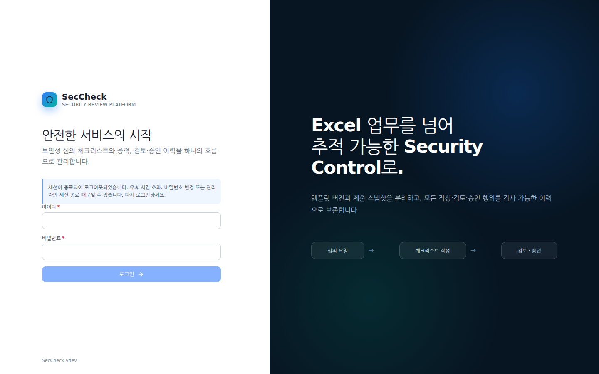

관리자가 만들어 준 계정으로 **처음** 로그인하면 비밀번호 변경 화면만 보입니다. 발급받은 값은 관리자도 아는 값이므로 본인만 아는 비밀번호로 바꾼 뒤에야 나머지 화면을 쓸 수 있습니다. 비밀번호는 12자 이상이어야 하고 흔한 비밀번호·아이디·서비스 이름이 들어가면 거절됩니다. 대문자·기호 조합은 요구하지 않으니 기억하기 쉬운 긴 문장을 쓰십시오.

### 2-2. 대시보드에서 `신규 심의 요청`

로그인하면 대시보드가 열립니다. 오른쪽 위의 `신규 심의 요청` 버튼(+ 아이콘)을 누르거나 왼쪽 메뉴의 `신규 심의 요청` 으로 갑니다.

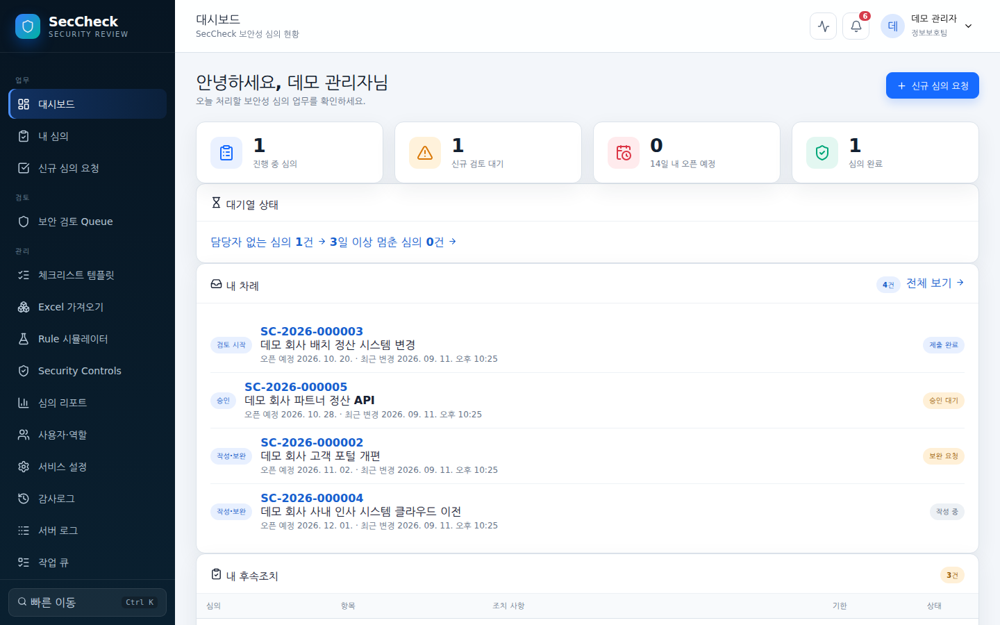

### 2-3. 서비스 정보와 적용 조건 입력

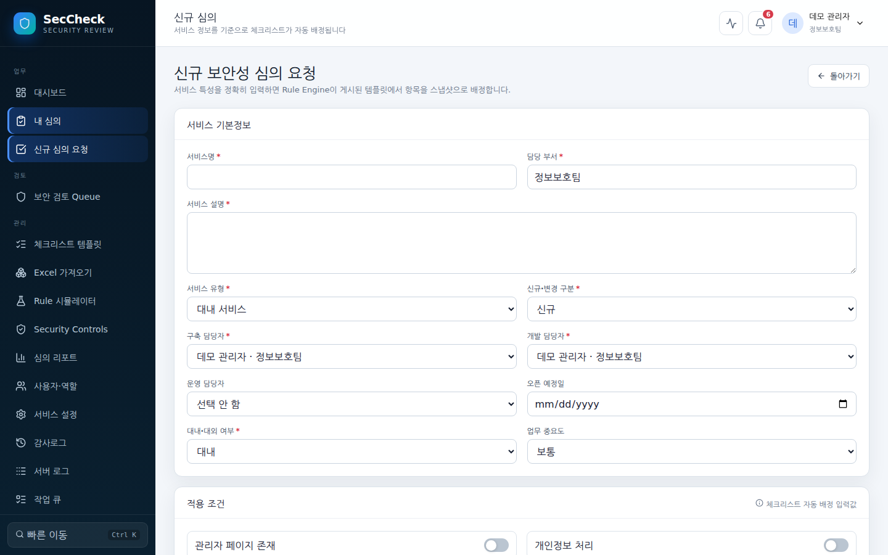

1. **서비스 기본정보**: 서비스명, 담당 부서, 설명, 서비스 유형(대내/대외/관리자/배치), 신규·변경 구분, 오픈 예정일, 구축·개발·운영 담당자.
2. **적용 조건**: 관리자 페이지 여부, 개인정보·신용정보 처리, 대외 고객 서비스, 클라우드·Docker·Kubernetes 사용, 외부 연계, 인터넷 접점.
3. 조건을 바꿀 때마다 화면 아래 **배정될 체크리스트 미리보기**가 즉시 갱신됩니다. `배정될 항목 N개 보기` 를 누르면 실제로 답하게 될 항목의 코드·보안요건·중요도·증적 필요 여부가 보이므로, 필요한 문서를 먼저 모아 두십시오.
4. `심의 생성 및 항목 배정` 을 누르면 오늘 게시된 템플릿에서 조건에 맞는 항목이 **스냅샷**으로 복사되어 심의가 만들어집니다. 이후 템플릿이 바뀌어도 이 심의의 항목은 바뀌지 않습니다.

### 2-4. 항목 작성

심의 상세가 열립니다. 왼쪽은 섹션 이동, 가운데는 항목 목록, 오른쪽은 선택한 항목의 점검 가이드와 작성 예시입니다.

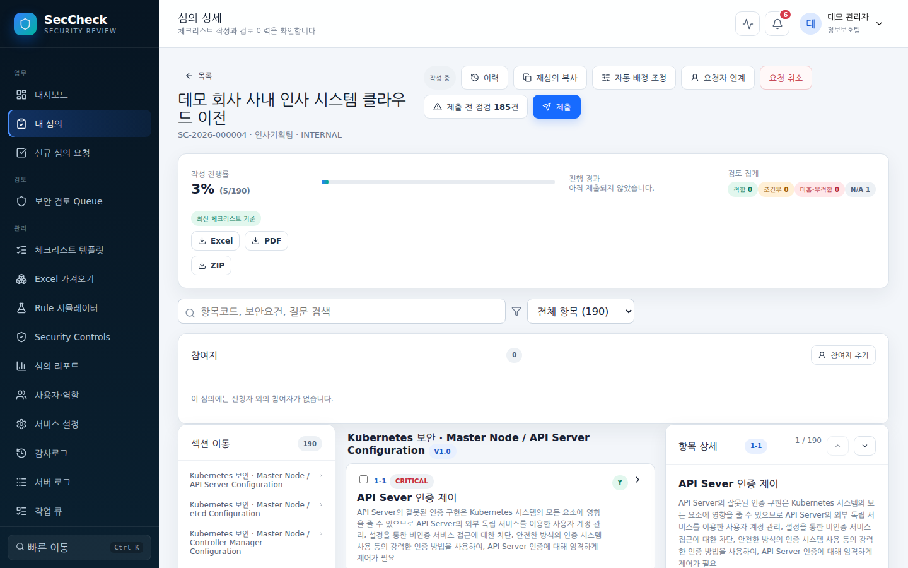

항목을 누르면 편집기가 펼쳐집니다.

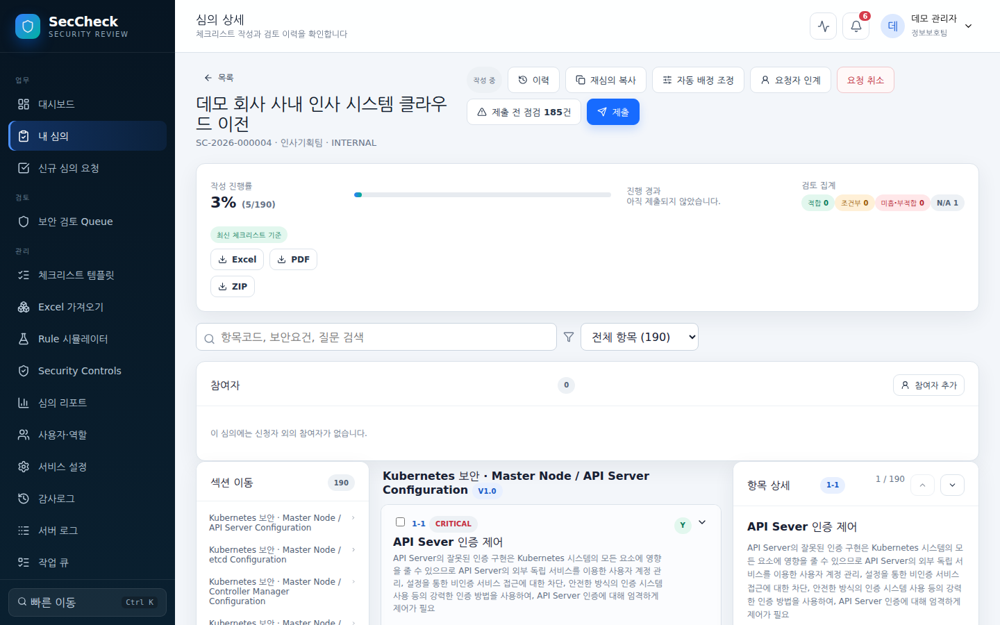

- **적용 여부**: `Y`(적용됨) · `N` · `N/A`. `N/A` 를 고르면 **N/A 사유**를 반드시 적어야 제출됩니다.
- **자체 판단**: `적합` 등 스스로의 평가.
- **현황 및 증적**: 어떻게 적용했는지. 긴 설정 파일이나 로그는 본문에 붙여넣지 말고 증적으로 첨부합니다.
- **증적 첨부**: 파일을 고르고 `암호화 업로드`. 여러 파일을 한 번에 고를 수 있고, 허용 확장자와 최대 크기는 파일 선택창 아래에 표시됩니다.
- 입력을 멈추면 약 1초 뒤 자동 저장되며 오른쪽 위에 상태가 보입니다. 아직 저장되지 않았으면 `저장되지 않은 변경` 으로 바뀌고, 그 상태에서 탭을 닫으려 하면 경고합니다. `지금 저장` 으로 즉시 저장할 수 있습니다.

### 2-5. `제출 전 점검` 후 `제출`

심의 상단의 `제출 전 점검 N건` 은 서버가 제출을 막게 될 항목을 미리 보여 줍니다. 항목 이름을 누르면 그 항목으로 이동합니다. 남은 것이 없으면 `제출 준비 완료` 로 바뀝니다.

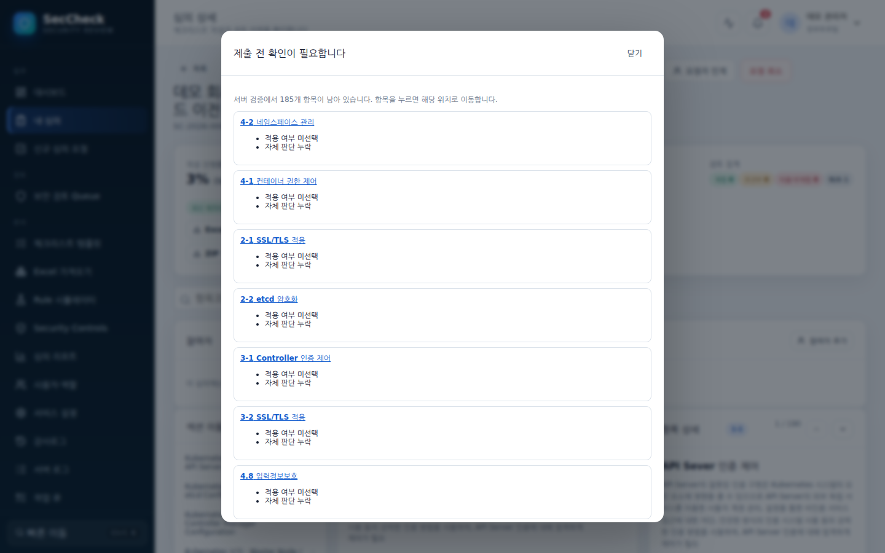

`제출` 을 누르면 심의는 `제출 완료` 상태가 되어 보안 담당자의 대기열에 들어갑니다. 여기까지가 첫 제출입니다.

---

## 3. 화면별 사용법

### 3-1. 대시보드

- **상단 4개 카드**: 진행 중 심의, 신규 검토 대기, 14일 내 오픈 예정, 심의 완료. 숫자를 누르면 같은 조건의 목록이 열립니다. 세는 범위는 `내 심의` 에서 열 수 있는 범위와 같습니다.
- **대기열 상태**: 담당자 없는 심의와 3일 이상 멈춘 심의. 각각 목록의 `담당자 없음`·`정체` 필터로 연결됩니다.
- **내 차례**: 지금 내가 처리해야 하는 심의만. 작성 중·보완 요청 받은 심의, 배정된 검토·승인 건이 역할에 따라 모입니다.
- **내 후속조치**: 여러 심의에 흩어진 후속조치를 기한과 함께 모읍니다. 마쳤으면 항목에서 `조치 완료 보고` 를 남깁니다.
- **내 담당 항목**: 나에게 배정된 항목이 심의별로 모이고, 심의번호를 누르면 `내 담당 항목` 필터가 켜진 채 열립니다.
- 상단 종 아이콘에 읽지 않은 알림 수가 표시되며 1분마다 갱신됩니다.
- **빠른 이동**: 어느 화면에서든 `Ctrl`+`K`(Mac 은 `⌘`+`K`) 또는 왼쪽 메뉴 맨 아래 `빠른 이동` 을 누르면 검색창이 열립니다. 아무것도 입력하지 않으면 내가 갈 수 있는 메뉴가 나열되고, 두 글자 이상 입력하면 심의번호·서비스명, 보안항목과 답변 내용, 증적 파일명이 한 번에 검색됩니다. 결과를 누르면 그 심의(항목이면 그 항목이 펼쳐진 채)로 이동합니다. 결과가 많으면 `더 많은 결과가 있습니다. 검색어를 좁혀 보세요.` 가 뜹니다.

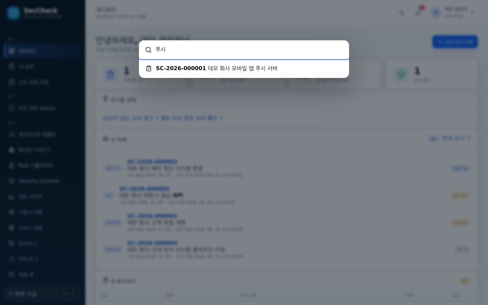

### 3-2. 내 심의 (심의 목록)

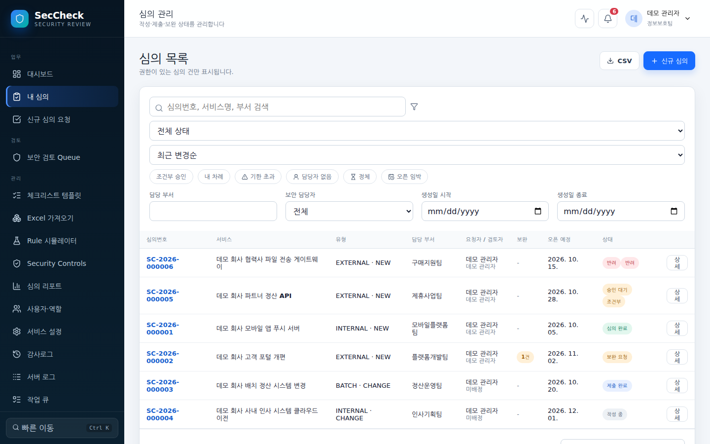

- **필터**: 상태(복수 선택), 최종 결과(`조건부 승인` 등), 검색어, 담당 부서, 보안 담당자, 생성일 범위, `내 차례`, `기한 초과`, `오픈 임박`, `담당자 없음`, `정체`.
- **정렬**: 최근 변경·생성일·오픈 예정일·심의번호·서비스명·상태.
- 목록은 페이지로 나뉘고 총건수가 함께 보이므로 오래된 심의가 사라지지 않습니다.
- `CSV` 내보내기는 현재 필터를 그대로 적용합니다.
- 상태의 뜻: `작성 중` → `제출 완료` → `검토 중` → (`보완 요청` → `재제출`) → `승인 대기` → `심의 완료` / `반려` → `종료`. 요청자가 취소하면 `취소`.

### 3-3. 신규 심의 요청

2-3 절의 순서대로 입력합니다. 자주 쓰는 순서:

1. 지난 심의가 있는 서비스라면 새로 만들지 말고 그 심의에서 `재심의 복사` 를 쓰십시오(4-3 절).
2. 보안 담당자·승인자를 직접 지정할 때는 **그 역할을 가진 활성 계정**만 고를 수 있고, 검토자와 승인자를 같은 사람으로, 또는 신청자 본인으로 지정할 수 없습니다. 지정하는 순간 어느 칸이 왜 안 되는지 알려 줍니다.

### 3-4. 심의 상세

상단에는 심의번호·서비스명·상태와 작성 진행률, 그리고 지금 상태에서 할 수 있는 버튼(`제출`, `제출 전 점검`, `이력`, `요청 취소`, `요청자 인계`, `재심의 복사`, 내보내기)이 있습니다. 검토 단계에서는 검토자에게 `검토 시작`·`검토 완료`·`검토 완료 전 점검` 이, 승인 단계에서는 승인자에게 `최종 승인`·`반려` 가 보입니다.

**항목 목록에서 할 수 있는 일**

- **필터**: `미작성`, `증적 누락`, `보완 요청`, `답변 변경됨`, `이월 답변`, `코멘트 있음`, `지적 항목`, `제출 불가`, `내 담당 항목`. 옆의 숫자는 남은 건수이며 서버의 제출 검증과 같은 규칙으로 셉니다.
- **섹션 이동**(왼쪽): 템플릿·섹션별로 바로 이동.
- **일괄 작업**: 항목 왼쪽 체크박스로 여러 개를 고르면 하단에 작업 바가 나타납니다. `일괄 작성` 은 같은 적용 여부와 공통 사유를 한 번에 채우며 기본은 **아직 작성하지 않은 항목만** 채웁니다(이미 쓴 답까지 바꾸려면 `덮어쓰기`). `담당자 배정` 은 답변은 두고 담당자만 지정합니다.
- **담당자**: 항목마다 담당자를 지정할 수 있고, 지정되면 그 사람에게 알림이 갑니다. 고를 수 있는 사람은 **이 심의에 참여 중인 사람**(요청자, 구축·개발·운영 담당자, 검토자, 승인자, 작성 가능 참여자)뿐입니다.
- **이 항목이 배정된 이유**: 항목 상세에서 누르면 이 서비스의 어떤 특성이 이 항목의 적용 조건을 만족시켰는지 조건별로 보여 줍니다. 관련 없다고 판단되면 이를 근거로 보안 담당자와 논의하십시오.
- **항목 상세**(오른쪽): 점검 가이드, 작성 예시, 관련 근거. 위·아래 버튼 또는 `Alt`+`↑`/`↓` 로 다음·이전 항목으로 이동하며 현재 순번 / 전체 건수(예: 2 / 210)가 함께 보입니다.

**항목 편집기에서 할 수 있는 일**

- **동시 편집**: 다른 사람이 같은 항목을 먼저 저장했으면 저장이 거부되고 누가 무엇을 저장했는지 보여 줍니다. `최신 내용 불러오기`(내 입력을 버림) 또는 `내 내용으로 덮어쓰기` 중에서 고릅니다.
- **증적 버전**: 같은 증적을 `새 버전` 으로 교체하면 이전 파일도 보관됩니다. `버전 이력` 에서 버전별 업로더·시각·크기·SHA-256 을 보고 이전 버전도 내려받습니다. 보존 기간이 지나 파기된 버전은 `파기됨` 으로 남습니다.
- **증적 검사 상태**: `검사 중` → `검사 완료`. 검사가 끝나기 전에는 내려받기와 제출이 제한됩니다. `악성코드 탐지` 된 증적은 즉시 삭제되고 업로더·요청자·검토자에게 알림이 갑니다.
- **이전 증적 가져오기**: 같은 서비스의 지난 심의에 같은 항목으로 붙어 있던 증적이 있으면 파일 이름과 함께 버튼이 나타납니다. 복사본은 별도 증적으로 저장됩니다.
- **코멘트**: 항목에 남긴 코멘트는 대화의 반대편(작성자↔검토자)에게 알림으로 갑니다.
- **입력 길이**: 서비스명 200자, 부서 100자, 설명·현황·조치 계획·N/A 사유·검토 의견·후속조치·최종 의견은 각 4,000자. 90%를 넘으면 남은 글자 수가 표시됩니다.

**심의 상단 카드**

- **참여자**: `참여자 추가` 로 사람을 더하고 `작성 가능`/`열람 전용` 을 고릅니다. `해제` 로 접근을 회수하면 그 사람에게 배정돼 있던 항목의 담당자가 비워지고 몇 건이 풀렸는지 알려 줍니다. 열람 전용 참여자에게는 입력란·업로드·제출 버튼이 아예 보이지 않습니다.

  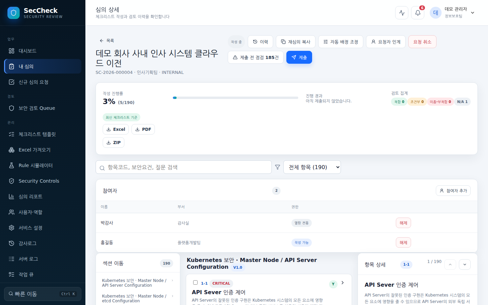

- **이 서비스의 지난 심의**: 같은 서비스의 이전 심의가 결과와 지적 건수와 함께 보입니다. 서비스 이름을 바꿔도 `재심의 복사` 로 이어진 관계로 이력이 이어집니다.
- **심의 결론**: 최종 결과·최종 의견, 승인자의 코멘트와 일시. 반려된 심의는 여기서 사유를 읽습니다.
- **심의 이력**: `이력` 버튼으로 생성·작성·업로드·제출·보완 요청·판정·승인이 수행자와 함께 시각순으로 보입니다.

### 3-5. 검토 중인 심의 (보안 담당자)

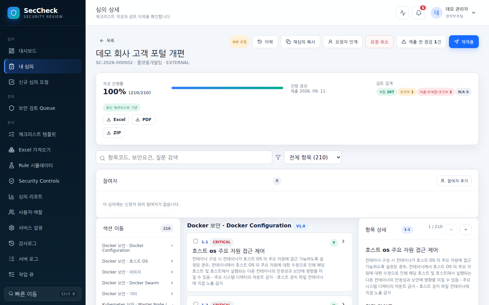

항목을 펼치면 아래에 `보안 담당자 검토` 영역이 있습니다.

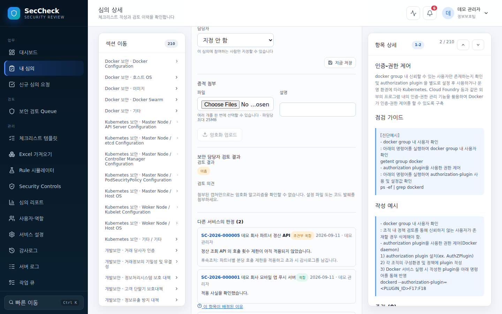

- **최종 적용 여부**: `작성자 판단 유지` 또는 `Y`/`N`/`N/A` 로 조정.
- **검토 결과**: `적합` · `조건부 적합` · `미흡` · `부적합` · `N/A 인정` · `재확인`.
- **증적 적정성**: `적정` · `일부 보완` · `부적정`.
- **검토 의견**, **후속조치**와 **조치 기한**. 후속조치를 적으면 기한이 필수입니다 — 기한이 없으면 아무도 독촉하지 않는 약속이 되기 때문입니다.
- `검토 저장` 으로 저장합니다. 같은 판정이 반복되면 항목을 여러 개 고른 뒤 `일괄 판정` 으로 처리합니다(이미 판정한 항목은 `덮어쓰기` 를 켜야 바뀝니다).
- **이전 심의 판정**: 같은 서비스의 지난 심의에서 이 항목이 어떻게 판정됐는지, 그때 첨부했던 증적 파일 이름이 함께 보입니다.
- **다른 서비스의 판정**: 같은 항목 코드를 다른 서비스에서 어떻게 판정했는지 최근 5건. 요청자에게는 보이지 않습니다.
- **판정 이후 바뀐 내용**: 판정 뒤에 답변이나 증적이 바뀐 항목에는 빨간 `판정 후 변경` 배지가 붙고, 판정 당시와 현재 답변을 나란히 보여 줍니다. 다시 읽고 `검토 저장` 을 누르면 해제됩니다.

### 3-6. 보안 검토 Queue

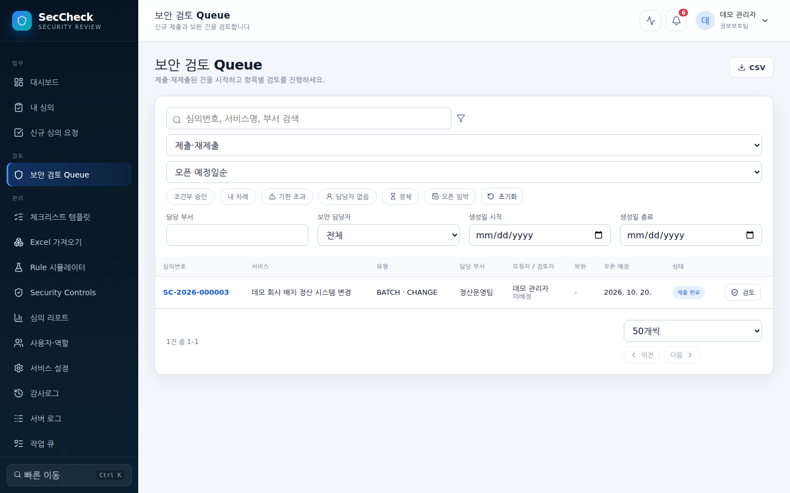

- `제출 완료`·`재제출` 된 심의를 열어 `검토 시작` 을 누르면 `검토 중` 으로 바뀌고 담당자가 본인으로 기록됩니다.
- 재제출 알림에는 **판정 이후 답변이나 증적이 바뀐 항목 수**가 함께 옵니다. 그 항목만 다시 보면 됩니다.
- 담당 검토자가 권한을 잃었거나 비활성화된 심의는 대기열에 다시 나타나고, 상세에 `담당 검토자 권한 없음` 표시와 `검토 이어받기` 버튼이 뜹니다.
- 본인이 신청한 심의는 본인이 검토할 수 없습니다(`SELF_REVIEW_FORBIDDEN`).

### 3-7. 알림

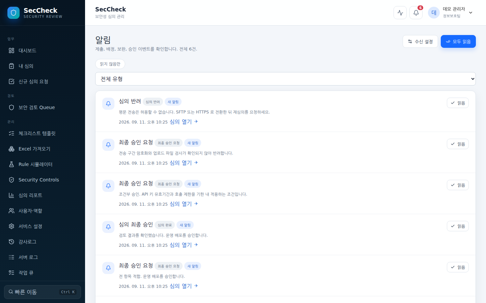

- `읽음`/`모두 읽음`, `읽지 않음만`, 유형 필터.
- 심의 전체에 대한 알림은 `심의 열기`, 항목 하나에 대한 알림은 `해당 항목 열기` 로 그 항목이 펼쳐진 채 열립니다. 어떤 알림에 어떤 버튼이 붙는지는 아래 표를 보십시오.
- `수신 설정` 에서 유형별로 이메일을 끄거나 **하루 한 번 요약**으로 바꿀 수 있습니다. 화면의 알림은 설정과 관계없이 항상 남습니다.

알림마다 `수신 설정` 과 유형 필터에 보이는 **유형 이름**과 종에 뜨는 **제목**이 다릅니다. 종에서 본 제목으로 유형을 찾거나, 유형을 끄기 전에 어떤 제목이 안 오게 되는지 확인할 때 이 표를 쓰십시오. 유형 옆의 설명은 `수신 설정` 화면의 문구 그대로이고, 괄호 안은 그 알림을 받는 역할입니다.

| 유형 (수신 설정의 이름) | 언제 오나 | 종에 뜨는 제목 | 열기 버튼 |
| :--- | :--- | :--- | :--- |
| 심의 제출·재제출 | 담당 심의가 제출되거나 재제출되었을 때 | `새 심의 제출` · `심의 재제출` | `심의 열기` |
| 심의 배정 | 심의 담당자로 배정되었을 때 | `심의 담당자 배정` | `심의 열기` |
| 심의 요청자 인계 | 다른 사람의 심의를 넘겨받았을 때 | `심의 요청자 인계` · `업무 인계`(관리자가 퇴직자 업무를 일괄 인계했을 때) | `심의 열기`(일괄 인계는 버튼 없음) |
| 보완 요청 | 작성한 항목에 보완 요청이 등록되었을 때 | `보완 요청` · `보완 요청 N건` · `반려 심의 보완 재개` | `해당 항목 열기` · `심의 열기`(여러 건 묶음·보완 재개) |
| 보완 조치 완료 | 요청한 보완이 조치되었을 때 | `보완 조치 완료` | `해당 항목 열기` |
| 보완 기한 임박·초과 | 보완 조치 기한이 다가오거나 지났을 때 | `보완 조치 기한 임박` · `보완 조치 기한 초과` | `심의 열기` |
| 최종 승인 요청 | 승인자로서 결재가 필요할 때 | `최종 승인 요청` | `심의 열기` |
| 심의 완료 | 심의가 승인되거나 검토 완료되었을 때 | `심의 검토 완료` · `심의 최종 승인` | `심의 열기` |
| 심의 반려 | 심의가 반려되었을 때 | `심의 반려` | `심의 열기` |
| 심의 취소 | 검토·승인 중이던 심의를 요청자가 취소했을 때 | `심의 취소` | `심의 열기` |
| 결재 요청 회수 | 요청된 최종 승인이 검토자에 의해 회수되었을 때 (승인자) | `결재 요청 회수` | `심의 열기` |
| 체크리스트 항목 배정 | 체크리스트 항목의 담당자로 지정되었을 때 | `체크리스트 항목 배정` | `해당 항목 열기` · `심의 열기`(여러 항목 일괄 배정) |
| 체크리스트 코멘트 | 담당 심의의 항목에 코멘트가 달렸을 때 | `체크리스트 코멘트` | `해당 항목 열기` |
| 증적 악성코드 탐지 | 업로드한 증적에서 악성코드가 발견되었을 때 | `증적 악성코드 탐지` | `해당 항목 열기`(업로더 본인에게 가는 알림은 버튼 없음) |
| 감사로그 무결성 실패 | 해시 체인 검증이 실패했을 때 (시스템 관리자) | `감사로그 체인 검증 실패` | `해당 감사 이벤트 열기`(이벤트를 특정할 수 없으면 `감사로그 열기`) |
| 후속조치 기한 | 판정과 함께 약속한 후속조치의 기한이 임박하거나 지났을 때 | `후속조치 기한 임박` · `후속조치 기한 초과` | `심의 열기` |
| 후속조치 이행 보고 | 담당 팀이 후속조치를 완료했다고 보고했을 때 (보안 담당자) | `후속조치 이행 보고` | `해당 항목 열기` |
| 후속조치 이행 확인 | 보고한 후속조치가 확인되어 종료되었을 때 | `후속조치 이행 확인` | `해당 항목 열기` |
| 작업 큐 정체 | 알림·검사 작업이 처리되지 않고 쌓일 때 (시스템 관리자) | `작업 큐가 처리되지 않고 있습니다` | `작업 큐 열기` |
| 작업 재시도 소진 | 재시도를 모두 소진해 중단된 작업이 있을 때 | `작업이 재시도를 모두 소진했습니다` | `작업 큐 열기` |
| API 키 만료 임박 | 발급한 API 키의 만료일이 일주일 안으로 다가왔을 때 | `API 키 만료 임박` | `API 키 열기` |
| API 키 폐기 | 관리자가 내 API 키를 폐기했을 때 | `API 키 폐기` | 없음 |
| 권한 계정 자동 잠금 | 권한 계정이 장기 미접속으로 잠겼을 때 (시스템 관리자) | `권한 계정 자동 잠금` | 없음 |
| 증적 무결성 확인 실패 | 저장된 증적이 사라졌거나 기록과 다를 때 (시스템 관리자) | `증적 무결성 확인 실패` | `시스템 정보 열기` |
| 심의 정체 | 담당한 심의가 며칠째 다음 단계로 넘어가지 않을 때 | `심의가 멈춰 있습니다` · `담당자 없는 심의가 대기 중입니다` | `심의 열기` |
| 오픈 예정일 임박 | 심의가 끝나지 않았는데 서비스 오픈 예정일이 다가왔을 때 | `오픈 예정일이 다가왔습니다` · `오픈 예정일이 지났습니다` | `심의 열기` |
| 저장 공간 부족 | 증적 볼륨의 남은 공간이 부족하거나 쓸 수 없을 때 | `증적 저장 공간이 부족합니다` · `증적 볼륨에 쓸 수 없습니다` | `시스템 정보 열기` |

### 3-8. 개인 프로필 · 계정 보안 · 개인 키 관리

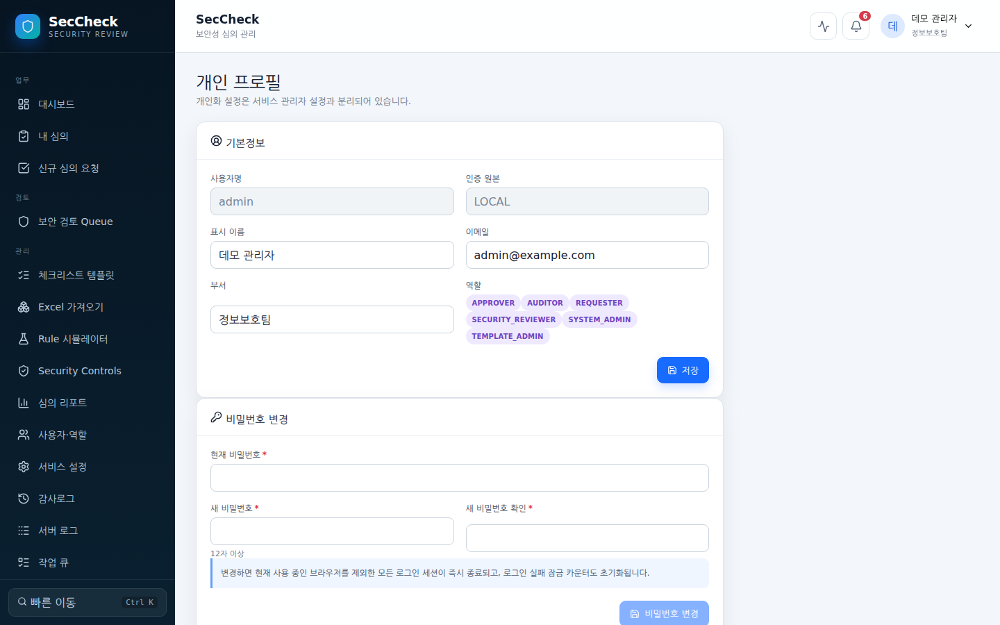

- `비밀번호 변경`: 현재 비밀번호 확인 후 12자 이상으로 변경. 바꾸면 **지금 쓰는 브라우저를 제외한 모든 세션이 종료**됩니다. SSO 계정에는 이 카드가 없습니다.

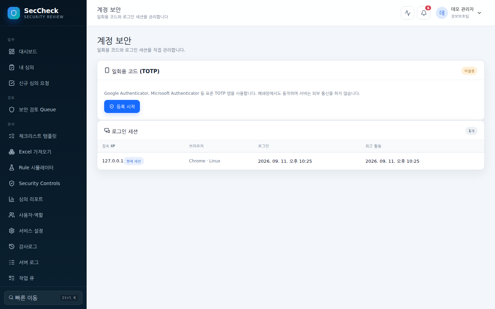

- **일회용 코드(2단계 인증)**: 화면의 비밀키를 인증 앱의 수동 입력에 붙여 넣고 6자리 코드로 활성화합니다. 활성화하면 다른 기기의 세션이 모두 종료되고, 이후 로그인 때 비밀번호와 6자리 코드를 함께 입력합니다. 기기를 잃어버렸다면 관리자에게 초기화를 요청하십시오.
- **로그인 세션**: 현재 로그인된 기기를 보고 개별 또는 일괄 종료합니다.

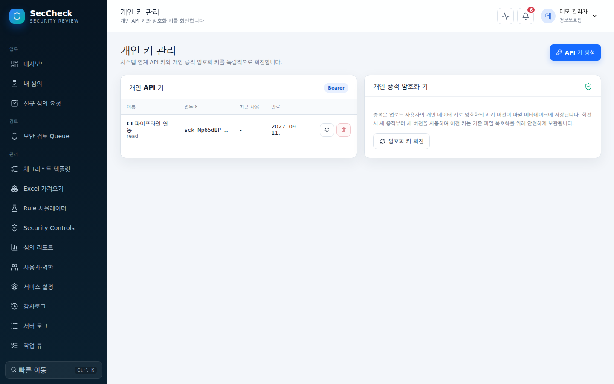

- **API 키**: 이름과 범위(`read` / `read:write`)를 정해 발급합니다. 토큰은 발급 순간에만 보이므로 바로 복사하십시오. 최대 유효기간은 관리자 정책을 따릅니다.
- **암호화 키 회전**: 본인 증적의 데이터 키를 새로 만듭니다.

### 3-9. 심의 리포트 (보안 담당자·승인자·감사자)

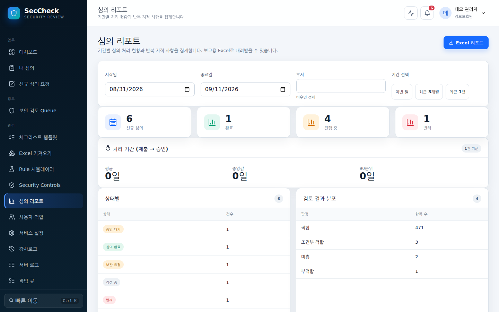

이번 달 / 최근 3개월 / 최근 1년과 부서로 범위를 정해 총괄, 처리 기간(평균·중앙값·90분위), 상태별·부서별, 검토 결과 분포, 반복 미흡 항목, 같은 서비스에서 반복된 지적, 미조치 항목(후속조치 등록부)을 봅니다. `Excel 리포트` 로 6개 시트 워크북을 내려받습니다.

---

## 4. 자주 하는 작업

### 4-1. 보완 요청에 답하고 재제출하기 (요청자)

1. 알림의 `해당 항목 열기` 또는 항목 필터 `보완 요청` 으로 주황색 `보완 요청` 배지가 붙은 항목을 엽니다.
2. 보완 사유와 `완료 예정일` 을 확인합니다. 기한 2일 전부터 담당자에게 알림이 가고, 지나면 목록에 지연으로 표시됩니다.
3. 답변을 고치고 증적을 추가한 뒤 `조치 내용` 을 적고 `조치 완료` 를 누릅니다.
4. 모든 보완 요청을 처리했으면 상단의 `재제출` 을 누릅니다. 검토자에게는 판정 이후 바뀐 항목 수와 함께 알림이 갑니다.

### 4-2. 보완을 요청하고 검토를 마치기 (보안 담당자)

1. 미흡한 항목에서 `보완 요청` 을 누르고 사유·`완료 예정일`·`조치 담당자` 를 지정합니다. 담당자는 이 심의의 참여자 중에서만 고를 수 있고, 비우면 요청자에게 갑니다. 같은 사유가 여러 항목에 걸치면 항목을 골라 `일괄 보완 요청`.
2. 요청자가 `조치 완료` 하면 항목에서 `이행 확인` 으로 닫습니다. 추가 보완이 필요하면 **새 보완 요청**을 냅니다.
3. `검토 완료 전 점검 N건` 으로 남은 것(미검토 · 미검증 보완 · 판정 후 변경)을 확인합니다. 항목 필터 `완료 불가` 로 같은 항목만 모아 볼 수 있습니다.
4. `검토 완료` 창은 판정 집계와 지적 항목으로 **최종 의견 초안**이 채워진 채 열리고, 심의 결과도 판정에 맞게 미리 골라져 있습니다(미흡·부적합이 있으면 반려, 조건부·후속조치가 있으면 조건부 승인). 고쳐 쓴 내용이 저장됩니다.
5. 반려할 때에도 모든 항목에 판정이 있어야 합니다.

### 4-3. 연 1회 재심의 만들기

지난 심의 상세에서 `재심의 복사` 를 누릅니다. 새 심의는 **오늘 게시된 템플릿**으로 구성되므로 복사 직후 오른쪽 아래 알림으로 복사된 답변 수(예: 107/107개 항목의 답변을 복사했습니다.), 신설되어 새로 써야 하는 항목 수, 현재 템플릿에 없어 제외된 항목 수를 알려 줍니다. 아직 다시 확인하지 않은 항목에는 보라색 `이월 답변` 표시가 남고 저장하면 사라집니다. 항목 필터 `이월 답변` 으로 남은 것만 모아 볼 수 있습니다. 증적은 자동으로 넘어오지 않으므로 항목마다 `이전 증적 가져오기` 를 쓰십시오.

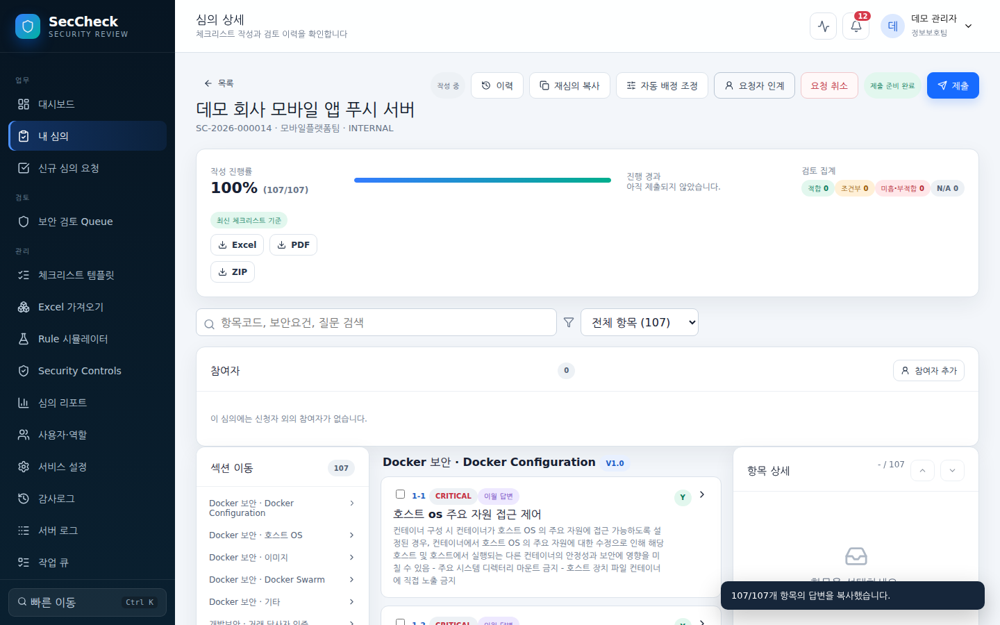

### 4-4. 최종 승인 또는 반려하기 (승인자)

관리자가 서비스 설정 `검토·승인` 탭에서 승인 프로세스를 켠 조직에서만 있는 단계입니다. 켜져 있으면 심의를 만들 때 **승인자를 지정해야 제출**되고, 보안 담당자가 `검토 완료` 를 누른 심의는 바로 끝나지 않고 `승인 대기` 가 되어 승인자의 대시보드 `내 차례` 와 알림(`최종 승인 요청`)에 나타납니다.

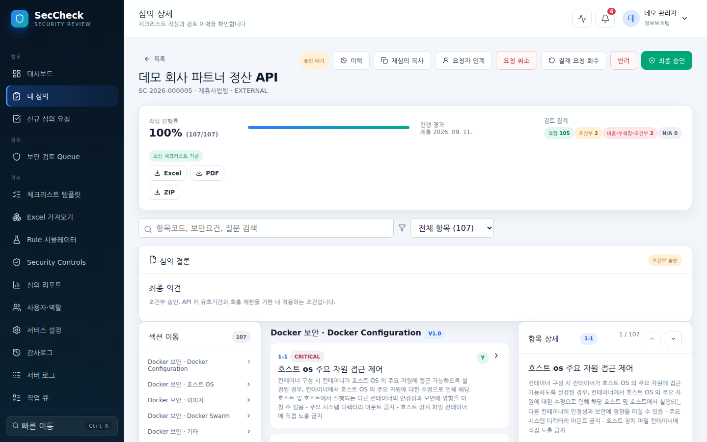

1. 심의를 열면 상단에 `반려` 와 `최종 승인` 이, 그 아래 **심의 결론** 카드에 보안 담당자의 심의 결과(`승인`·`조건부 승인`·`반려` 제안)와 최종 의견이 보입니다.
2. 항목 목록 아래 끝까지 내리면 **결재 전 확인** 카드가 있습니다. 지적 항목과 그 판정·의견, 승인하면 남게 되는 후속조치와 기한, 아직 확인되지 않은 보완 요청 수가 모여 있으므로 항목을 하나씩 열지 않아도 됩니다. 기한 없는 후속조치는 `기한 없음 · 알림이 가지 않습니다` 로 빨갛게 표시되니 결재 전에 기한을 요구하십시오.

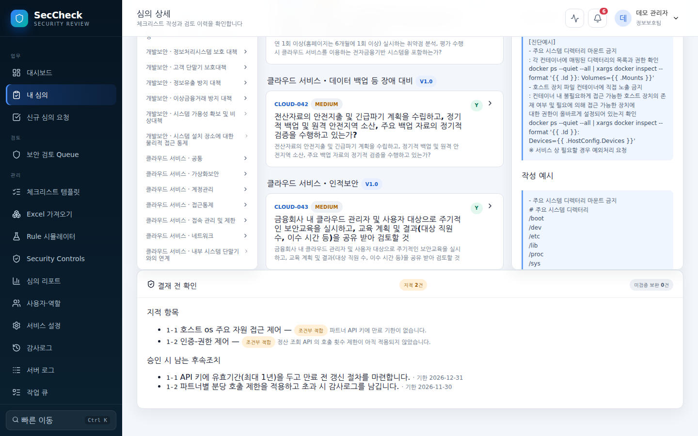

3. `최종 승인` 을 누르면 의견을 적는 창이 열립니다. 의견은 비워도 되지만, 적으면 심의 결론 카드에 승인자 이름·시각과 함께 남습니다.

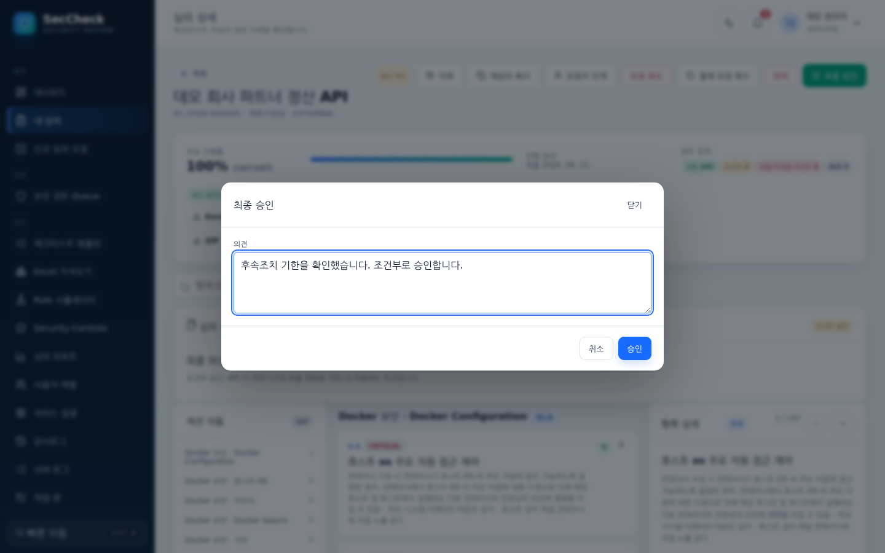

4. `반려` 도 같은 창에서 사유를 적고 확정합니다. 반려된 심의는 `반려` 상태가 되고 요청자에게 알림이 가며, 사유는 **심의 결론** 카드에 남습니다.

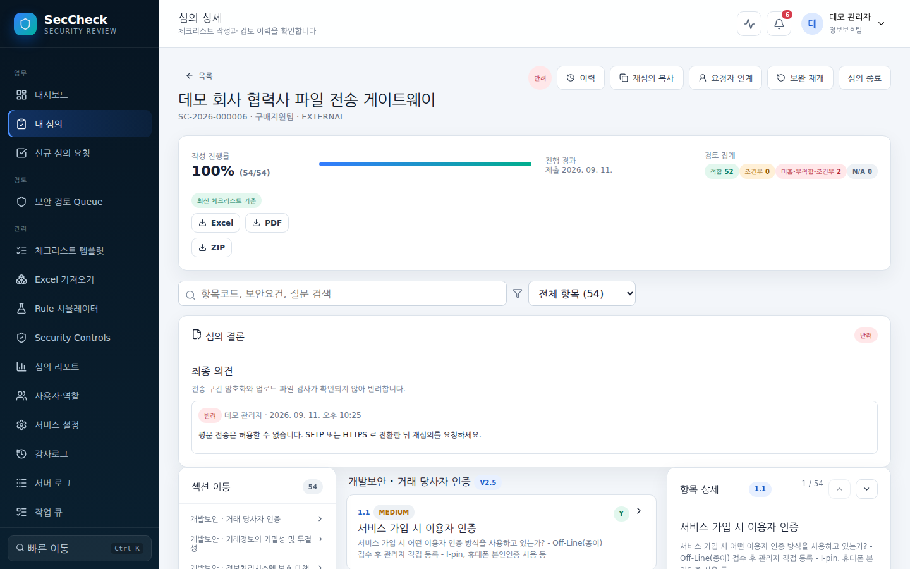

- 본인이 검토·판정한 심의는 본인이 승인할 수 없습니다(`SELF_APPROVAL_FORBIDDEN`). 지정된 승인자가 그 경우이거나 권한을 잃었으면 심의는 다른 승인자 모두에게 열립니다.
- 승인 대기 중에 최종 의견을 고치거나 판정을 바꿔야 하면, 담당 보안 담당자가 `결재 요청 회수` 로 사유를 적고 `검토 중` 으로 되돌립니다. 반려는 서비스에 대한 결정으로 기록되므로 검토자의 실수를 고치는 용도로 쓰지 마십시오.
- 반려된 심의를 다시 진행시키려면 담당 보안 담당자가 `보완 재개` 로 사유를 적어 `보완 요청` 상태로 되돌립니다. 요청자는 4-1 절대로 보완하고 재제출합니다. 승인·반려가 끝난 심의는 담당 보안 담당자가 `심의 종료` 로 닫습니다.

### 4-5. 후속조치 이행 보고하기

대시보드 `내 후속조치` 또는 항목에서 `조치 완료 보고` 로 조치 내용을 남깁니다. 보고된 항목은 `조치 보고됨` 이 되고, 담당 보안 담당자가 리포트의 미조치 항목에서 `이행 확인` 을 해야 종료됩니다. 기한 7일 전부터, 그리고 기한이 지난 뒤에는 요청자에게 알림이 갑니다.

### 4-6. 심의 결과 내보내기

심의 상세 상단의 내보내기에서 고릅니다.

| 형식 | 내용 |
| :--- | :--- |
| Excel (`.xlsx`) | 전 항목 체크리스트, 자체 판단, 검토 결과, `증적 목록` 시트(파일명·버전·SHA-256), 보완 요청 |
| PDF (`.pdf`) | 대외 제출용 심의 완료 증명서(A4). 항목별 증적과 해시 포함 |
| ZIP (`.zip`) | 보고서와 복호화된 전체 증적 파일 |

### 4-7. 담당자가 바뀌었을 때

- **심의 요청자 인계**: 심의 상단의 `요청자 인계` 를 누르면 `심의 요청자 인계` 창이 열리고, 다른 요청자에게 넘깁니다. 요청자 본인과 시스템 관리자가 할 수 있고, 그 심의의 검토자·승인자에게는 넘길 수 없습니다. 이후 알림과 취소 권한이 넘겨받은 사람에게 갑니다.
- **심의 취소**: 본인이 신청한 심의는 결정이 내려지기 전이라면 `요청 취소` 로 취소할 수 있습니다. 이미 제출한 심의를 취소할 때는 사유가 필요하며 검토자·승인자에게 전달됩니다. 승인·반려·종료된 심의는 취소할 수 없습니다.

---

## 5. 막혔을 때

| 화면에 보이는 메시지 | 뜻과 조치 |
| :--- | :--- |
| `아이디 또는 비밀번호가 올바르지 않습니다.` | 다시 입력합니다. 연속 실패 횟수가 정책(기본 5회)을 넘으면 계정이 잠깁니다. |
| `로그인 실패가 반복되어 계정이 잠겼습니다. N분 후 또는 관리자 잠금 해제 후 다시 시도하세요.` | 안내된 시간(기본 15분)을 기다리거나 **관리자에게 잠금 해제**를 요청합니다. |
| `로그인 시도가 너무 많습니다. 잠시 후 다시 시도하세요.` | 같은 네트워크에서 실패가 몰렸습니다. 잠시 뒤 다시 시도합니다. |
| `인증 앱의 6자리 코드를 입력하세요.` / `일회용 코드가 올바르지 않습니다.` | 2단계 인증이 켜진 계정입니다. 기기 시간이 정확한지 확인합니다. 기기를 잃었다면 **관리자에게 코드 초기화**를 요청합니다. |
| `관리자가 발급한 임시 비밀번호입니다. 먼저 비밀번호를 변경하세요.` | 비밀번호 변경 화면에서 본인만 아는 값으로 바꾸면 바로 정상 사용으로 돌아갑니다. |
| 비밀번호 변경 시 `WEAK_PASSWORD` 와 사유 | 12자 이상, 흔한 비밀번호·아이디·`seccheck` 미포함, 같은 문자 반복·연속 문자만으로 된 값 불가. |
| `제출 전 확인이 필요합니다` (누락 목록) | 목록의 항목을 눌러 이동해 적용 여부·자체 판단·N/A 사유·증적을 채웁니다. |
| `현재 상태에서는 제출할 수 없습니다.` | 작성 중·보완 요청 상태에서만 제출됩니다. 검토 중이면 검토자의 보완 요청을 기다립니다. |
| `허용되지 않은 확장자입니다: <확장자>` / `파일 내용과 확장자가 일치하지 않습니다` | 허용 확장자는 파일 선택창 아래에 표시됩니다. 확장자만 바꾼 파일은 거절됩니다. 필요한 형식이 없으면 **관리자에게 파일 보안 설정** 변경을 요청합니다. |
| 증적이 `검사 중` 에서 오래 머문다 | 악성코드 검사가 밀려 있습니다. 수 분 이상 계속되면 **관리자에게** 알립니다(작업 큐·ClamAV 연결 확인). |
| `다른 사용자가 이 항목을 먼저 저장했습니다.` | `최신 내용 불러오기` 또는 `내 내용으로 덮어쓰기` 를 고릅니다. |
| `본인이 신청한 심의는 본인이 검토할 수 없습니다.` | 다른 보안 담당자가 맡아야 합니다. 1인 운영이라면 관리자가 서비스 설정에서 본인 심의 처리를 허용할 수 있습니다. |
| `본인이 검토·판정한 심의는 본인이 최종 승인할 수 없습니다.` | 다른 승인자가 결재합니다. 심의는 다른 승인자에게 자동으로 열립니다. |
| 제출 전 점검에 `승인자` — `승인 프로세스가 활성화되어 승인자 배정이 필요합니다.` | 승인 절차가 켜진 설치입니다. 심의 정보에서 승인자 역할을 가진 사람을 지정한 뒤 제출합니다. |
| `승인 대기 중인 심의만, 그 심의의 담당 보안 담당자가 회수할 수 있습니다.` | `결재 요청 회수` 는 그 심의의 검토자만, 승인 대기 상태에서만 할 수 있습니다. 이미 결재됐다면 `재심의 복사` 또는 `보완 재개` 를 씁니다. |
| `반려된 심의만, 그 심의의 담당 보안 담당자가 다시 열 수 있습니다.` | `보완 재개` 는 반려된 심의를 그 심의의 검토자만 다시 열 수 있습니다. |
| `검토 중인 심의에서만 판정할 수 있습니다.` | 먼저 `검토 시작` 을 누릅니다. |
| 검토 완료가 `미검토 항목 N건`·`미검증 보완 요청 N건`·`검토 후 답변이 바뀐 항목 N건` 으로 거절 | `검토 완료 전 점검` 목록을 따라 남은 항목을 처리합니다. |
| `이미 결정된 심의는 취소할 수 없습니다.` | 승인·반려·종료된 심의는 기록입니다. 재심의가 필요하면 `재심의 복사` 를 씁니다. |
| 자동 로그아웃 경고(`계속 사용`) | 유휴 세션 정책이 켜진 설치입니다. 작성 중이면 먼저 저장하고 `계속 사용` 을 누릅니다. |

관리자에게 넘겨야 하는 일: 계정 잠금 해제, 임시 비밀번호 발급, 2단계 인증 초기화, 역할 부여, 허용 확장자·크기 변경, 증적 검사 정체, 승인자 변경(승인 대기 중인 심의).

---

## 6. 용어

| 용어 | 뜻 |
| :--- | :--- |
| 심의번호 | `SC-` 뒤에 연도와 여섯 자리 순번이 붙는 형식(예: SC-2026-000001). 연도별로 순서대로 발번됩니다. |
| 적용 조건 / Rule Engine | 서비스 특성(개인정보 처리, 클라우드 사용 등)으로 어떤 체크리스트 항목이 배정될지 정하는 규칙. |
| 스냅샷 | 심의를 만들 때 템플릿에서 복사된 항목. 이후 템플릿이 바뀌어도 심의는 그대로입니다. |
| 적용 여부 | 항목이 이 서비스에 해당하는지(`Y` / `N` / `N/A`). `N/A` 는 사유가 필요합니다. |
| 자체 판단 | 요청자가 스스로 매긴 평가. 보안 담당자의 **검토 결과**와는 별개입니다. |
| 증적 | 항목이 적용됐음을 보이는 파일. 암호화되어 저장되고 버전이 남습니다. |
| 보완 요청 | 검토자가 항목에 낸 수정 요구. 완료 예정일과 조치 담당자가 있습니다. |
| 후속조치 / 조치 기한 | 조건부로 통과시키며 약속한 일. 기한이 지나면 `기한 초과` 로 표시되고 알림이 갑니다. |
| 조건부 승인 | 후속조치를 전제로 통과한 심의 결과. |
| 이월 답변 | `재심의 복사` 로 가져온 뒤 아직 다시 확인하지 않은 답변. |
| 판정 후 변경 | 검토자가 판정한 뒤 답변이나 증적이 바뀐 항목. 다시 읽고 저장해야 검토가 끝납니다. |
| 내 차례 | 지금 내가 처리해야 하는 심의만 모은 목록. |
| 참여자 | 요청자 외에 심의에 접근할 수 있는 사람. `작성 가능` 또는 `열람 전용`. |
