# Vendra 사용자 가이드

- **대상**: 구매·조달 담당자, 계약·품질 담당자, 사외 공급업체 담당자
- **기준 버전**: v0.7.49
- **관련 문서**: [관리자 가이드](ADMIN_GUIDE.md) · [README](../README.md)

이 문서에 실린 화면은 모두 v0.7.49 를 실제로 띄워 1440x900 에서 찍은 것입니다.
등장하는 회사·사람·주소는 전부 지어낸 데모 데이터입니다.

---

## 1. 이 제품이 하는 일

Vendra 는 **공급업체 한 곳에 대해 알아야 할 것을 한 화면에 모아 두는** 시스템입니다.
그 업체가 지금 거래 가능한 상태인지, 어떤 계약이 살아 있는지, 지난 납품이 언제 얼마나
들어왔는지, 최근 평가 점수와 열려 있는 리스크가 무엇인지 — 흩어져 있으면 전화로
물어봐야 하는 것들을 등록부 하나에서 봅니다.

두 번째로, **구매 한 건이 시작해서 끝날 때까지의 경로**를 그대로 담습니다. 구매요청 →
견적요청(RFQ) 또는 제안요청(RFP) → 계약 → 발주 → 납품 → 검수 → Invoice → 지급까지
같은 목록 화면의 같은 조작으로 다룹니다. 금액·조직·리스크 등급 같은 조건에 걸리는 건은
관리자가 세워 둔 승인 단계를 밟고, 그 밖의 건은 상신 즉시 처리됩니다.

세 번째로, **공급업체가 직접 들어와 답하는 자리**가 있습니다. 사외 담당자는 별도의
공급업체 포털에서 자기 회사 몫만 봅니다 — 초대받은 견적에 응답하고, 발주를 확인하고,
납품과 Invoice 를 올리고, 자기 평가 결과를 읽습니다. 다른 회사의 정보는 서버에서
차단되므로 화면에 나타나지 않습니다.

---

## 2. 처음 5분

### 2.1 로그인

브라우저에서 관리자가 알려 준 주소(기본 `http://<서버>:8080`)를 엽니다.

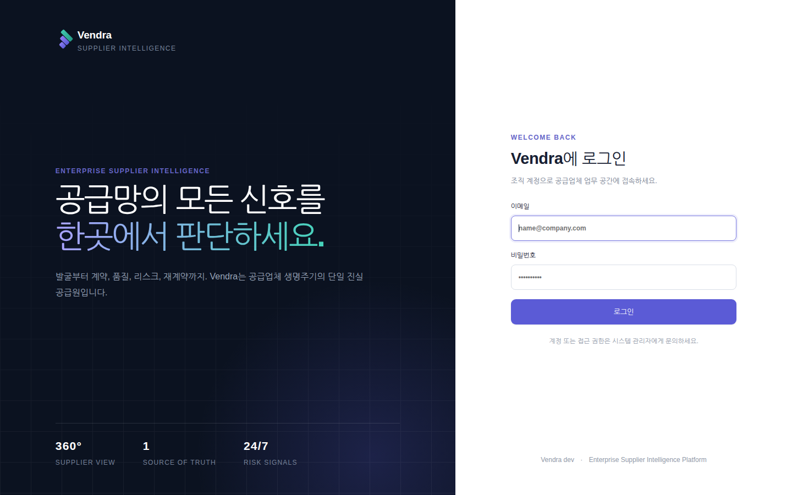

- 계정은 관리자가 만들어 줍니다. 이 화면에서 스스로 가입할 수는 없습니다.
- SSO(Keycloak)를 붙인 배포에서는 같은 화면에 SSO 로그인 단추가 함께 나옵니다. 관리자가
  자동 로그인을 켠 배포에서는 Keycloak 에 이미 로그인해 있으면 이 화면을 거치지 않고
  바로 들어갑니다. 직접 로그아웃한 뒤에는 자동으로 다시 로그인되지 않습니다.
- 공급업체 담당자는 초대 링크로 계정을 만든 뒤 같은 화면에서 로그인하며, 로그인하면
  내부 화면이 아니라 [공급업체 포털](#6-공급업체-포털-사외-담당자용)이 열립니다.

### 2.2 대시보드에서 오늘 볼 것을 고른다

로그인하면 대시보드가 열립니다.

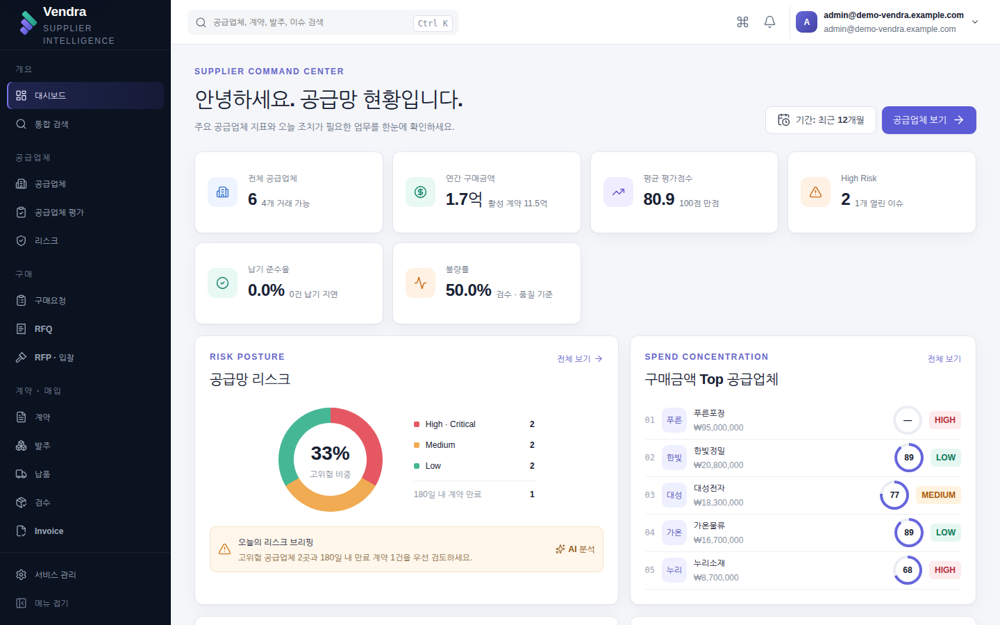

위쪽 카드는 등록부 전체의 요약입니다. 아래 **공급망 리스크** 도넛은 리스크 등급별 업체
수를, **구매금액 Top 공급업체** 는 지출이 몰린 순서를 보여 줍니다. 각 패널의 `전체 보기`
를 누르면 그 숫자를 만든 목록으로 바로 넘어갑니다.

### 2.3 업무 관제탑에서 처리할 것을 처리한다

왼쪽 메뉴 **내 업무 → 업무 관제탑**은 기한이 임박했거나 지난 업무를 한 줄로 세워 줍니다.

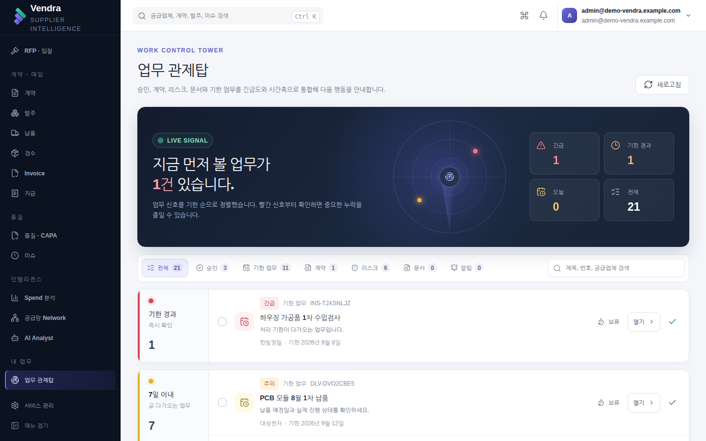

- 위쪽 탭(`전체` `승인` `기한 업무` `계약` `리스크` `문서` `알림`)으로 종류를 좁힙니다.
- 각 줄의 `열기`는 그 레코드의 상세로, 체크박스는 여러 건을 한꺼번에 처리할 때 씁니다.
- `보류`는 그 업무를 이 목록에서 잠시 내려 둡니다.

### 2.4 공급업체 한 곳을 열어 본다

**공급업체 → 공급업체** 목록에서 이름·사업자번호·공급업체 번호로 찾습니다.

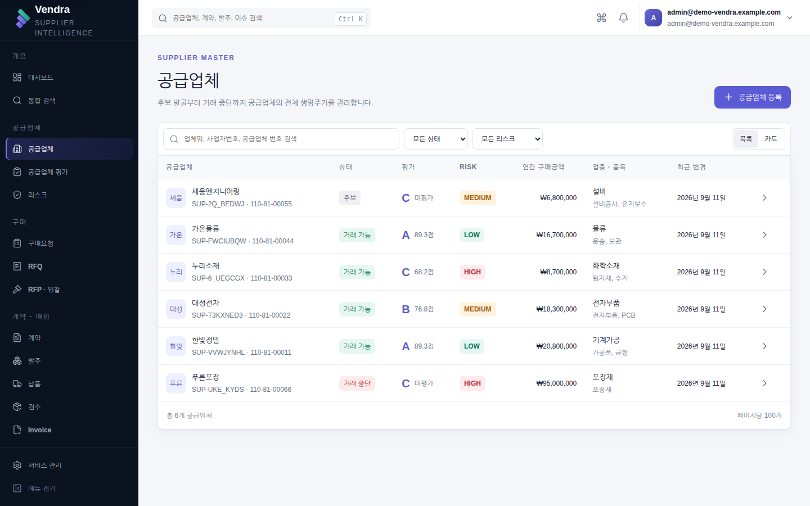

행을 누르면 Supplier 360 화면이 열립니다. 여기까지가 처음 5분입니다.

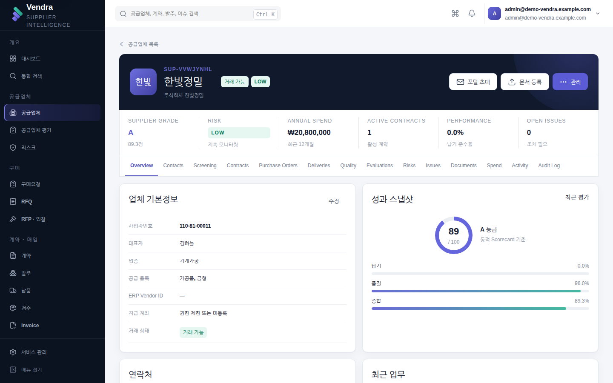

---

## 3. 화면별 사용법

### 3.1 공급업체 (Supplier 360)

윗줄의 여섯 지표(SUPPLIER GRADE · RISK · ANNUAL SPEND · ACTIVE CONTRACTS ·
PERFORMANCE · OPEN ISSUES)는 아래 탭들이 담고 있는 것을 요약한 값입니다.

탭은 `Overview` `Contacts` `Screening` `Contracts` `Purchase Orders` `Deliveries`
`Quality` `Evaluations` `Risks` `Issues` `Documents` `Spend` `Activity` `Audit Log`
입니다.

이 화면에서 할 수 있는 일:

- **업체 기본정보 수정** — `수정`을 눌러 업체명·법인명·사업자번호·법인번호·대표자·업종·
  공급업체 유형·공급 품목·거래 상태·등급·리스크 등급·거래 시작일·주소·전화·이메일·
  웹사이트·ERP Vendor ID·지급 계좌를 고칩니다.
- **포털 초대** — 오른쪽 위 `포털 초대`로 사외 담당자에게 가입 링크를 발급합니다.
  같은 모달에서 지금까지 발급한 초대의 상태(유효·사용됨·만료·회수됨)를 보고, 잘못 나간
  초대를 회수할 수 있습니다.
- **문서 등록** — `문서 등록`으로 사업자등록증·인증서·계약서를 올립니다. 파일마다
  SHA-256 체크섬과 다운로드 기록이 남습니다.
- **리스크 등록** — `Risks` 탭에서 유형·발생 가능성(0~10)·영향도(0~10)·등급을 적습니다.
  등급이 지금 값보다 높으면 업체의 RISK 배지가 따라 올라갑니다.
- **평가 입력** — `Evaluations` 탭에서 관리자가 정의한 항목별 점수를 매깁니다.
  총점과 등급은 가중치로 자동 계산되며, 항목을 하나라도 비우면 저장되지 않습니다.

### 3.2 통합 검색

**개요 → 통합 검색**은 공급업체·계약·PO·RFQ·RFP·문서·이슈·평가를 한 상자에서 찾습니다.
두 글자 이상 입력하면 결과가 나오고, 자기 데이터 범위 안의 것만 보입니다.

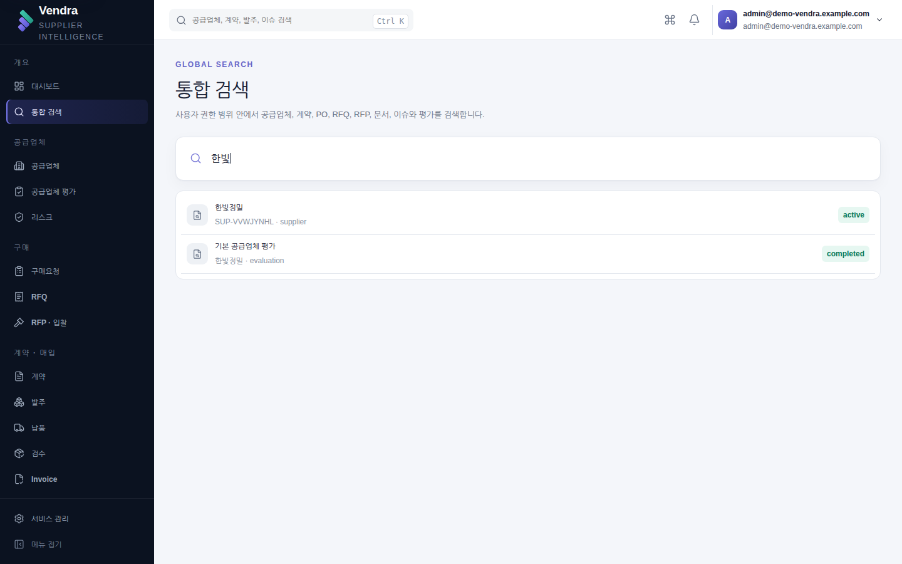

어느 화면에 있든 `Ctrl`/`⌘` + `K` 로 빠른 이동 창을 띄울 수도 있습니다.

### 3.3 구매요청 · RFQ · RFP

구매 한 건은 보통 **구매요청**에서 시작합니다.

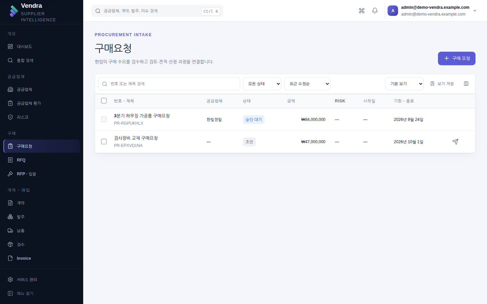

목록 화면의 조작은 열한 가지 업무 유형(구매요청·RFQ·RFP·계약·발주·납품·검수·품질·
이슈·Invoice·지급)에서 모두 같습니다.

- **등록** — 오른쪽 위 단추로 제목·공급업체·금액·기한·상세 항목을 채웁니다.
  입력 중인 내용은 자동 저장되므로 실수로 창을 닫아도 다시 열면 남아 있습니다.
- **필터·정렬·보기 저장** — 상태·공급업체·기간으로 좁힌 화면을 이름을 붙여 저장해 두면
  다음에 그 조합으로 바로 엽니다.
- **일괄 처리** — 체크박스로 여러 건을 골라 한 번에 상태를 바꿉니다.
- **상신** — `승인 요청`을 누르면 관리자가 세운 규칙에 걸리는지 확인해 승인 단계로
  보내거나, 걸리는 규칙이 없으면 그 자리에서 승인 처리합니다.

RFQ 는 여러 업체에게 같은 요청을 보내 견적을 받는 자리입니다.

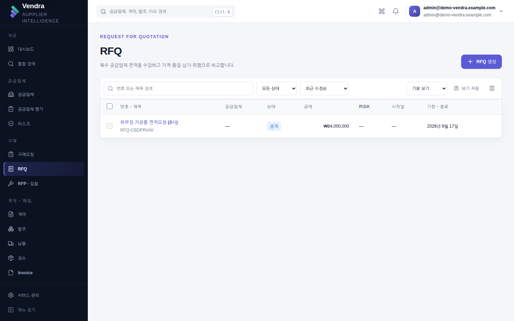

RFQ/RFP 의 행을 열면 **Strategic Sourcing Workspace** 가 나옵니다.

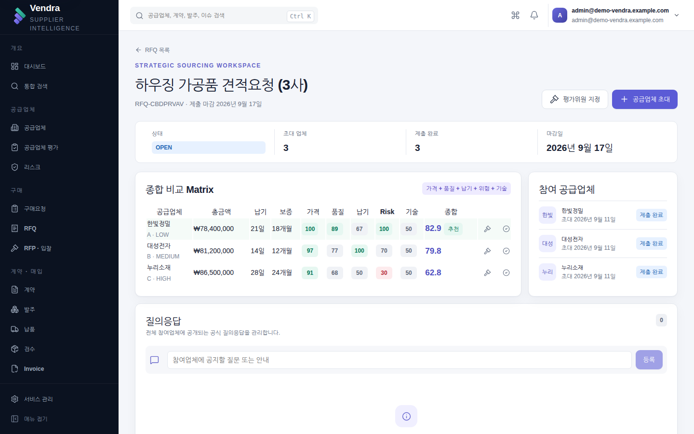

여기서 하는 일:

- `공급업체 초대` — 견적을 받을 업체를 고릅니다. 초대받은 업체에게만 포털에 나타납니다.
- **종합 비교 Matrix** — 제출된 견적을 가격·품질·납기·Risk·기술 다섯 축으로 점수화해
  세로로 세웁니다. 가격 점수는 제출된 견적 중 가장 낮은 금액을 100 으로 놓은 상대값,
  납기는 가장 짧은 일수를 100 으로 놓은 상대값입니다. 품질은 그 업체의 평가 점수,
  Risk 는 리스크 등급, 기술은 평가위원 점수의 평균입니다. 다섯 축의 가중치는 관리자가
  정합니다. **금액은 견적이 적어 낸 통화 그대로 비교되므로**, 서로 다른 통화의 견적이
  섞이면 가격 점수는 뜻이 달라집니다 — 한 요청에는 같은 통화로 받으세요.
- `평가위원 지정` — 기술 평가에 참여할 내부 담당자를 붙입니다.
- **질의응답** — 참여 업체 전체에 공개되는 공지·답변을 씁니다. 업체가 개별로 올린
  질문에도 여기서 답합니다.
- 행 오른쪽 체크 표시로 **낙찰(선정)** 합니다. 선정이 끝나면 그 견적은 더 이상 수정되지
  않습니다.

### 3.4 계약 · 발주 · 납품 · 검수 · Invoice · 지급

같은 목록 구조로 이어집니다. 각 화면은 앞 단계의 레코드를 부모로 걸어 둘 수 있어,
Supplier 360 의 탭에서 계약 → 발주 → 납품이 한 줄로 따라옵니다.

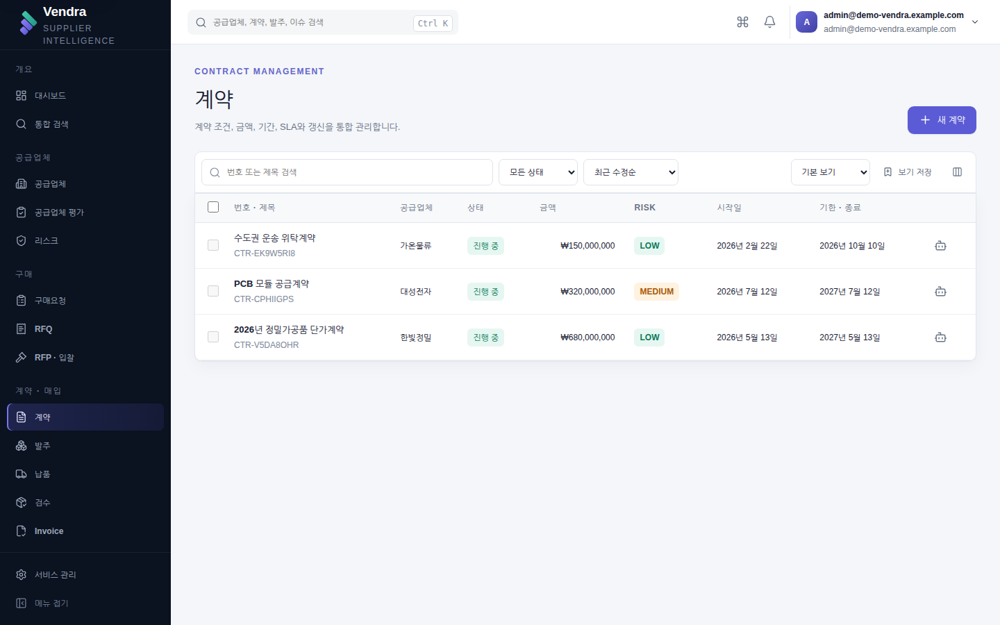

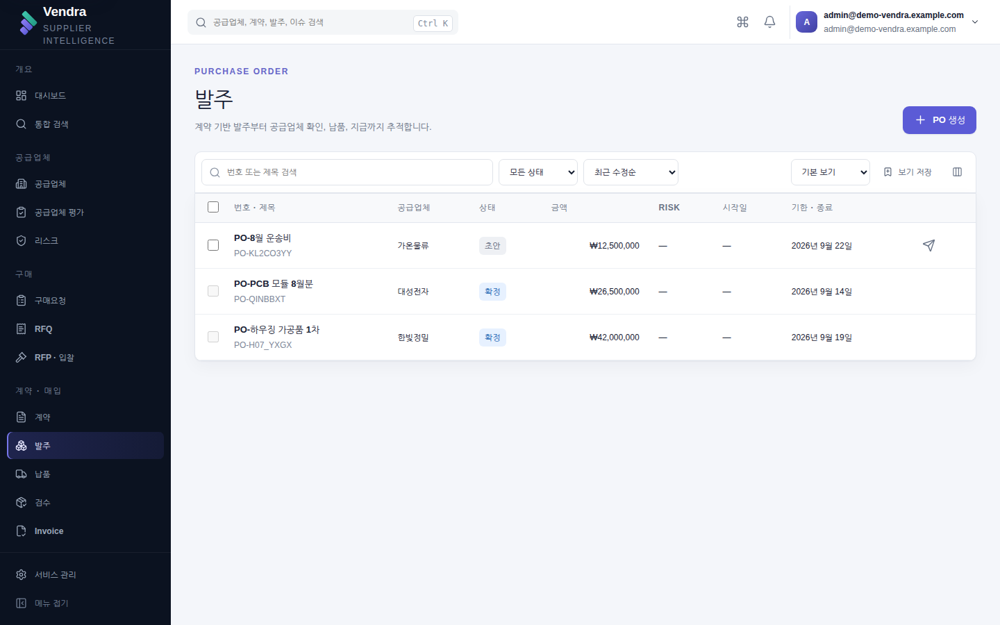

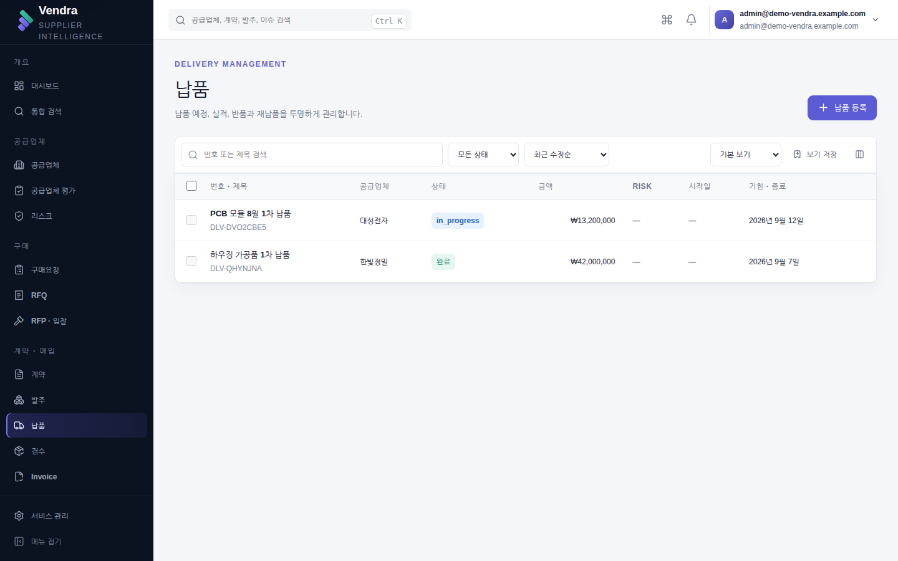

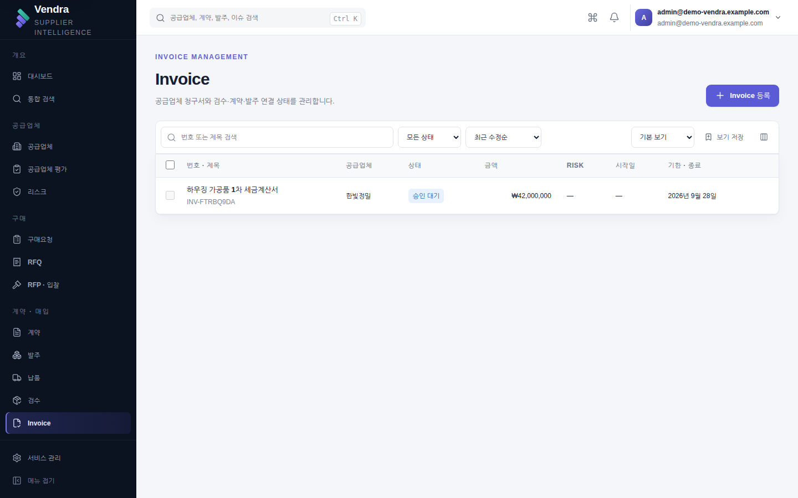

### 3.5 품질 · 이슈

품질 화면은 부적합(NCR)·불량·반품 건과 그 시정 조치를 담습니다.

### 3.6 공급업체 평가와 리스크

**공급업체 평가**는 업체별 평가를 한 목록에서 봅니다. 평가 항목과 가중치, 등급 기준은
관리자가 정합니다([관리자 가이드 4장](ADMIN_GUIDE.md#4-계정과-권한)).

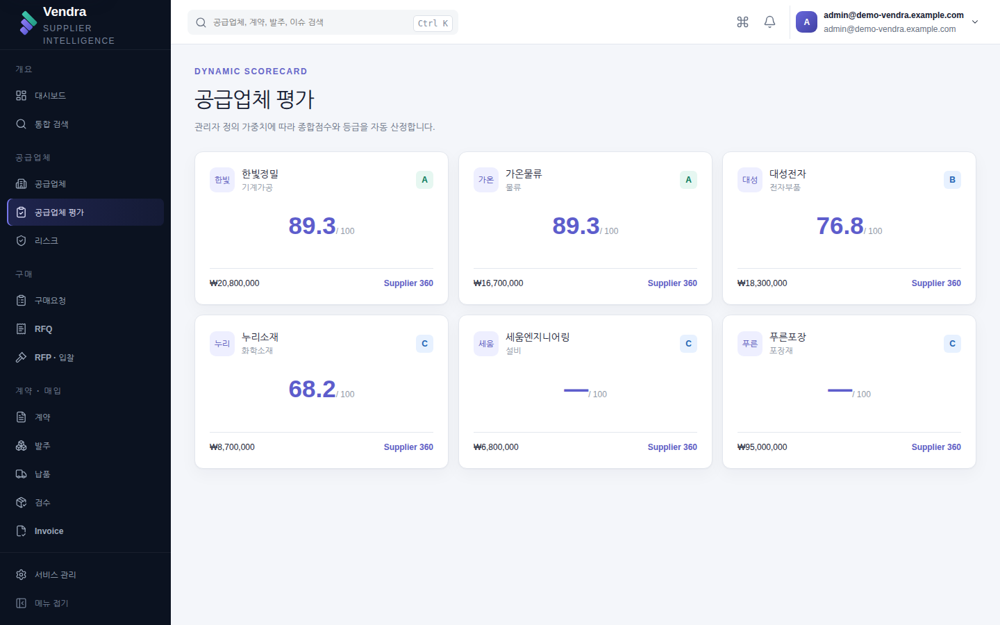

**리스크**는 열려 있는 위험을 심각도 순으로 봅니다. 점수는 발생 가능성 × 영향도입니다.

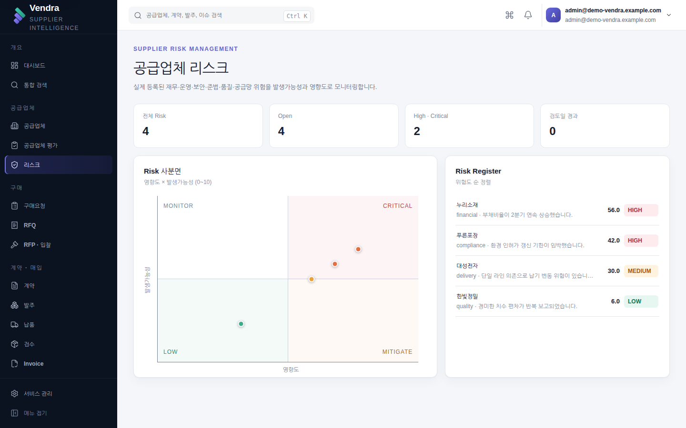

### 3.7 Spend 분석과 공급망 Network

**Spend 분석**은 기간을 정해 놓고 어디에 얼마를 썼는지 봅니다.

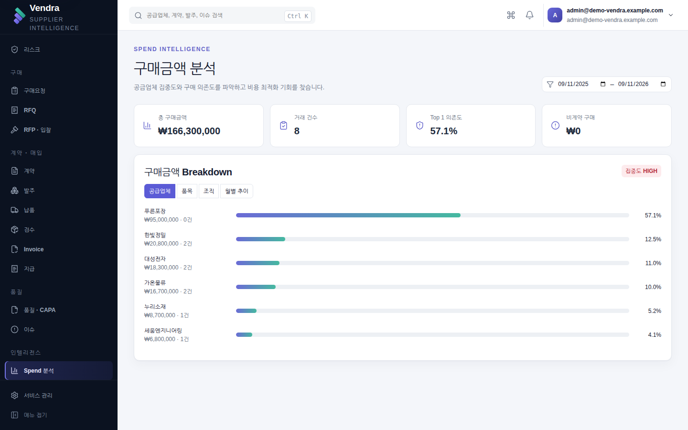

- `공급업체` `품목` `조직` `월별 추이` 네 가지로 나눠 봅니다.
- **Top 1 의존도**가 높으면 한 곳에 물량이 몰려 있다는 뜻입니다. 오른쪽 위 `집중도`
  배지가 그 상태를 요약합니다.
- **비계약 구매**는 계약 없이 나간 금액입니다.

**공급망 Network** 는 업체 사이의 하도급·물류 관계를 그림으로 봅니다. 1차 업체가
멈췄을 때 함께 멈추는 곳을 찾는 데 씁니다.

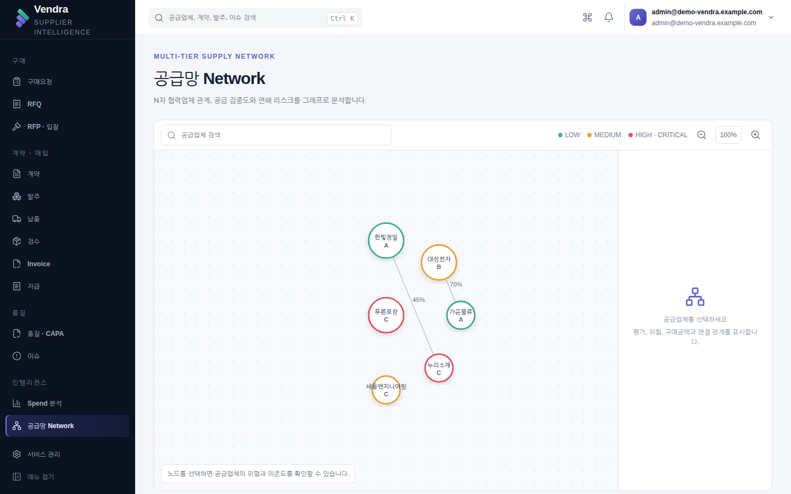

### 3.8 내 승인함

내가 승인할 차례인 건이 모입니다.

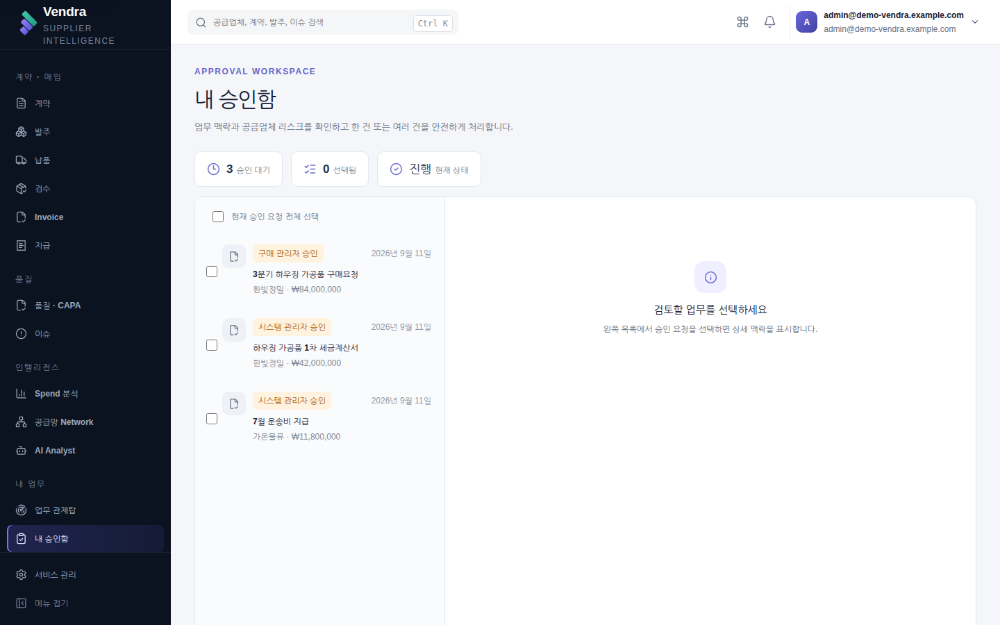

- 왼쪽 목록에서 한 건을 고르면 오른쪽에 업무 맥락과 그 공급업체의 리스크가 붙어 나옵니다.
- 체크박스로 여러 건을 골라 한꺼번에 승인·반려할 수 있습니다.
- 반려하면 기안자에게 돌아갑니다. 되돌아온 건은 고쳐서 다시 상신합니다.

### 3.9 AI Analyst

관리자가 AI 모델을 연결해 둔 배포에서만 답합니다. 왼쪽에서 업체를 고르면 그 업체로
범위를 좁히고, 고르지 않으면 전체 집계 질의로 처리합니다.

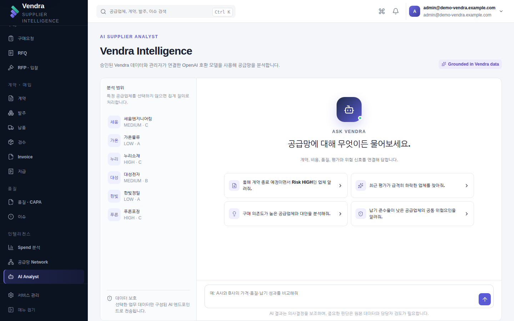

AI 답은 판단을 돕는 자료이지 결재 근거가 아닙니다. 화면 아래에도 그렇게 적혀 있습니다.

### 3.10 개인화 및 보안

오른쪽 위 계정 메뉴 → **개인화 및 키 관리**입니다.

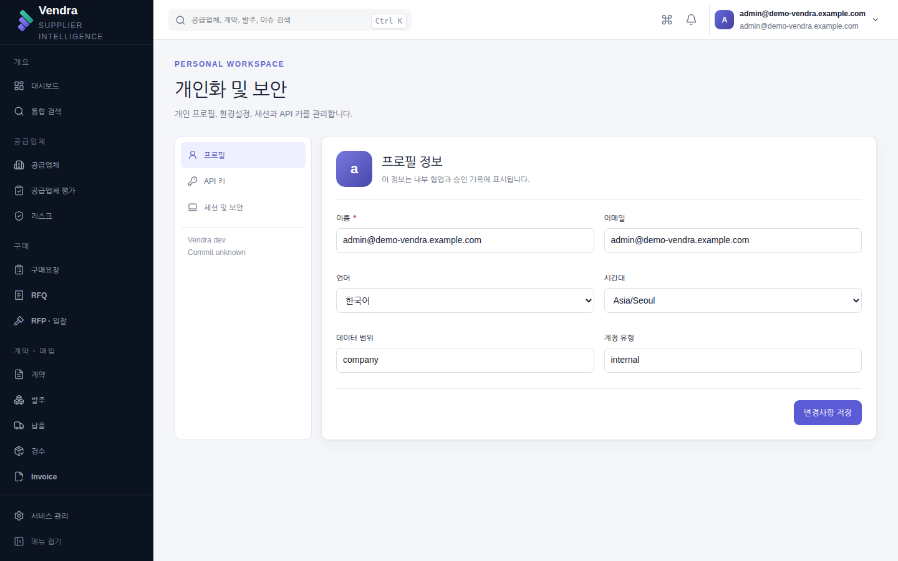

- **프로필** — 이름·언어·시간대를 바꿉니다. 이름은 승인 기록과 감사로그에 남는 이름입니다.
  데이터 범위와 계정 유형은 읽기 전용입니다 — 관리자가 정합니다.
- **API 키** — 개인 API/MCP 키를 발급합니다. 키는 `vnd_` 로 시작하고 **발급 직후 한 번만**
  보입니다. 만료 기간은 1~365일 사이에서 고르고, 부여할 수 있는 권한은 자기 권한 중
  읽기 권한뿐입니다. 목록에서 폐기하거나 한 번에 회전(재발급)할 수 있습니다.
- **세션 및 보안** — 비밀번호를 바꾸고, 지금 로그인되어 있는 다른 기기의 세션을 끊습니다.
  비밀번호를 바꾸면 다른 세션은 자동으로 폐기됩니다.

---

## 4. 자주 하는 작업

### 4.1 새 공급업체를 등록한다

1. **공급업체 → 공급업체 → `공급업체 등록`**.
2. 업체명과 사업자번호는 필수입니다. 나머지(대표자·업종·품목·연락처·거래 시작일)는
   아는 만큼 채웁니다.
3. 이름이 이미 등록된 업체와 비슷하면 저장 대신 **유사한 공급업체가 이미 등록되어
   있습니다** 가 뜨고 그 업체를 알려 줍니다. 같은 회사면 등록을 그만두고 기존 레코드를
   씁니다. 다른 회사면 이름을 구별되게 적습니다(법인 형태·지역 등).
4. 전화번호는 걸 수 있는 자릿수여야 하고, 웹사이트는 호스트만 적어도 됩니다
   (`hanbit.example.com` — `https://` 는 저장할 때 붙습니다).

### 4.2 견적을 받아 한 곳을 고른다

1. **구매 → RFQ → 등록**으로 요청을 만듭니다. 예상 금액과 제출 마감일을 정합니다.
   등록 폼의 금액은 원화(KRW)로 저장됩니다.
2. RFQ 를 열어 `공급업체 초대`로 받을 업체를 고릅니다.
3. 마감일까지 기다립니다. 업체가 포털에서 견적을 내면 참여 목록의 상태가 `제출 완료`
   로 바뀌고 비교 Matrix 에 줄이 생깁니다.
4. 필요하면 `평가위원 지정`으로 기술 점수를 받습니다.
5. 비교 Matrix 에서 한 곳을 선정합니다. 선정 뒤에는 그 RFQ 의 견적이 잠깁니다.

### 4.3 계약이 곧 만료되는 업체를 찾는다

대시보드 **공급망 리스크** 패널에 `180일 내 계약 만료` 건수가 있습니다. 목록으로 보려면
**계약** 화면에서 종료일로 정렬합니다. 업무 관제탑의 `계약` 탭에도 같은 건이 기한 순으로 올라옵니다.

### 4.4 한 업체에 얼마나 몰려 있는지 본다

**인텔리전스 → Spend 분석**에서 기간을 정하고 `공급업체` 탭을 봅니다. Top 1 의존도가
높으면 **공급망 Network** 에서 그 업체 뒤에 누가 있는지 확인합니다.

### 4.5 공급업체 담당자를 포털에 초대한다

1. Supplier 360 오른쪽 위 `포털 초대`.
2. 상대 이메일을 넣고 발급하면 **일회성 링크**가 한 번만 표시됩니다. 그 자리에서 복사해
   전달합니다.
3. 같은 모달의 발급 이력에서 상태를 확인합니다. 잘못된 주소로 나갔으면 `회수`를 누릅니다
   — 회수된 링크로는 가입할 수 없습니다.
4. 이미 가입에 쓰인 초대는 회수되지 않습니다. 그 계정을 막아야 한다면 관리자에게 계정
   비활성화를 요청합니다.

### 4.6 AI 도구(MCP)에 Vendra 를 연결한다

1. **개인화 및 키 관리 → API 키**에서 키를 발급합니다. 만료 기간을 짧게 잡고, 필요한
   읽기 권한만 고릅니다.
2. MCP 클라이언트에 `POST /mcp` 를 Streamable HTTP 엔드포인트로 등록하고,
   `Authorization: Bearer vnd_…` 헤더에 발급받은 키를 넣습니다.
3. 제공되는 도구는 **조회 전용** 열한 가지입니다. 어떤 도구도 데이터를 쓰지 않습니다.

| 도구 | 하는 일 |
|---|---|
| `search_suppliers` | 이름·사업자번호·공급업체 번호로 공급업체를 검색 |
| `get_supplier` | Supplier 360 핵심 정보를 조회 |
| `compare_suppliers` | 여러 공급업체의 비용·평가·위험·계약·이슈를 비교 |
| `get_supplier_risk` | 공급업체 리스크를 조회 |
| `get_supplier_score` | 평가 점수와 이력을 조회 |
| `search_contracts` | 계약을 검색 |
| `get_expiring_contracts` | 지정 일수 내 만료되는 계약을 조회 |
| `analyze_spend` | 공급업체별 지출과 의존도를 분석 |
| `search_purchase_orders` | 발주서를 검색 |
| `get_supplier_issues` | 공급업체 이슈를 조회 |
| `recommend_suppliers` | 품목·최소 점수·최대 위험 등급으로 후보를 추천 |

키에 담긴 권한 범위 안의 데이터만 답합니다. REST API 를 직접 쓰려면
`GET /api/v1/openapi.json` 에 OpenAPI 3.1 문서가 있습니다.

---

## 5. 막혔을 때

| 화면에 나오는 말 | 뜻과 할 일 |
|---|---|
| **이메일 또는 비밀번호가 올바르지 않습니다** | 둘 중 어느 쪽이 틀렸는지는 알려 주지 않습니다(계정이 있는지 없는지를 흘리지 않기 위해서입니다). 주소를 다시 확인하고, 비밀번호를 모르면 관리자에게 재설정을 요청하세요. |
| **로그인 시도가 너무 많습니다. N분 후에 다시 시도하세요** | 실패가 쌓여 계정 또는 접속 위치가 잠겼습니다. 적힌 시간만큼 기다립니다. 본인이 시도한 적 없다면 관리자에게 알리세요 — 감사로그에 남아 있습니다. |
| **로그인이 필요합니다** | 세션이 만료됐습니다. 다시 로그인하면 보던 화면으로 돌아갑니다. |
| **일시적으로 로그인을 처리할 수 없습니다. 잠시 후 다시 시도하세요** | 서버가 데이터베이스에 닿지 못하는 상태입니다. 잠시 뒤에도 같으면 관리자에게 알리세요. |
| **`<권한>` 권한이 필요합니다** | 그 화면·조작에 필요한 권한이 계정에 없습니다. 관리자에게 그 권한 이름을 그대로 전달해 요청하세요. |
| **데이터 접근 범위를 벗어났습니다** | 권한은 있지만 그 레코드가 내 조직·담당 범위 밖입니다. 담당자에게 넘겨받거나 관리자에게 범위 조정을 요청하세요. |
| **유사한 공급업체가 이미 등록되어 있습니다** | 같은 회사일 가능성이 큽니다. 알려 준 업체를 열어 확인하고, 정말 다른 회사면 구별되는 이름으로 등록하세요. |
| **이미 등록된 사업자번호입니다** | 그 번호로 등록된 업체가 이미 있습니다. 번호를 잘못 친 것이 아니라면 기존 레코드를 쓰세요. |
| **제출 마감일이 지났습니다** | RFQ/RFP 의 마감이 지나 초대·응답이 닫혔습니다. 마감일을 늘리거나 새 요청을 냅니다. |
| **선정이 완료되어 응답을 수정할 수 없습니다** | 그 견적 건은 낙찰이 끝났습니다. 조건을 바꾸려면 새 RFQ 를 냅니다. |
| **점수가 없는 평가 항목이 있습니다: …** | 나열된 항목을 채워야 저장됩니다. 빈 항목을 0점으로 저장하지 않는 것은 의도된 동작입니다. |
| **API 키에 부여할 읽기 권한이 없습니다** | 계정에 읽기 권한이 하나도 없어 키를 만들 수 없습니다. 관리자에게 권한을 요청하세요. |
| **현재 사용자 권한을 초과하는 API 키 scope는 부여할 수 없습니다** | 자기가 가진 권한 밖의 범위를 키에 담을 수 없습니다. 목록에서 제안하는 것만 고르세요. |

관리자에게 넘겨야 하는 것: 계정 생성·비활성화, 비밀번호 재설정, 권한과 데이터 범위 조정,
승인 규칙 변경, 평가 항목·가중치 변경, AI/SSO/저장소 연동. 모두
[관리자 가이드](ADMIN_GUIDE.md)에 있습니다.

---

## 6. 공급업체 포털 (사외 담당자용)

공급업체 계정으로 로그인하면 내부 화면 대신 포털이 열립니다. 보이는 것은 **자기 회사에
연결된 레코드뿐**입니다 — 다른 회사의 견적·계약·가격은 서버에서 걸러집니다.

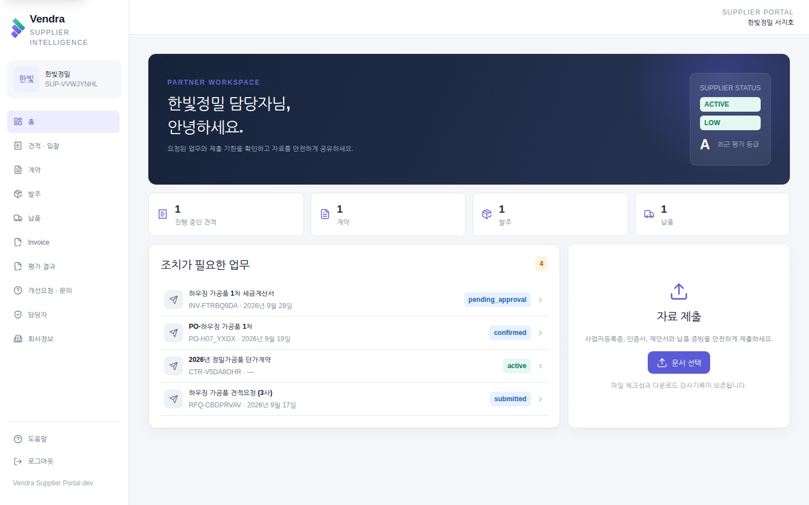

왼쪽 메뉴는 `홈` `견적 · 입찰` `계약` `발주` `납품` `Invoice` `평가 결과`
`개선요청 · 문의` `담당자` `회사정보` 입니다.

### 6.1 견적을 낸다

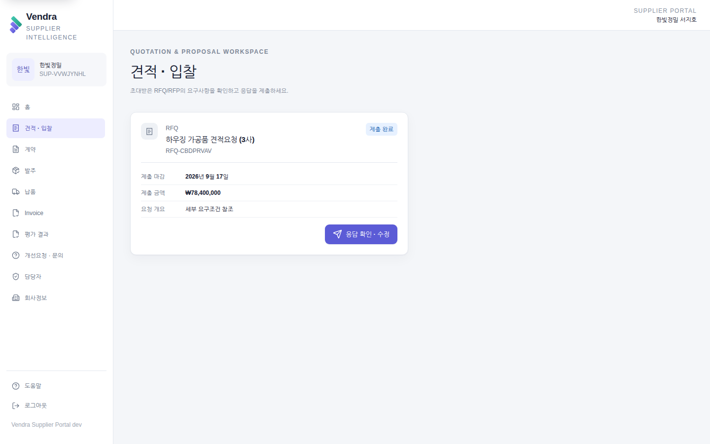

1. `견적 · 입찰`에서 초대받은 건을 엽니다.
2. `응답 확인 · 수정`으로 총금액·통화(KRW·USD·EUR·JPY)·납기(일)·보증 기간·견적 유효일과
   상업 조건을 적습니다. 비교표의 가격 점수는 금액을 그대로 비교하므로, 구매 담당자가
   지정한 통화가 있으면 그 통화로 내세요.
3. 임시 저장했다가 마감 전에 고칠 수 있습니다. 제출을 마치면 상태가 `제출 완료`가 됩니다.
4. 궁금한 점은 같은 화면에서 구매 담당자에게 질문합니다. 전체 공지로 답이 오면 모든
   참여 업체가 같은 답을 봅니다.
5. 참여하지 않기로 했으면 그 자리에서 거절할 수 있습니다.

### 6.2 발주를 확인하고 납품·Invoice 를 올린다

- `발주` 에서 받은 발주를 **확인**합니다. 확인하면 구매 쪽 화면의 상태가 바뀝니다.
- `계약` 에서 받은 계약도 같은 방식으로 확인합니다.
- `납품` 과 `Invoice` 는 포털에서 직접 등록합니다. 등록한 건은 구매 담당자의 목록과
  업무 관제탑에 나타납니다.
- `회사정보`·`담당자` 에서 연락처와 담당자를 스스로 고칠 수 있습니다. 사업자번호처럼
  법적 정보는 내부 확인을 거칩니다.
- 자료 제출은 홈 오른쪽 `문서 선택`으로 합니다. 올린 파일은 체크섬과 다운로드 기록이
  남습니다.

---

## 7. 용어

| 화면의 말 | 뜻 |
|---|---|
| **Supplier 360** | 한 공급업체에 대한 모든 것을 모아 놓은 상세 화면 |
| **거래 가능 / 후보 / 거래 중단** | 공급업체의 거래 상태. `후보`는 아직 심사 중, `거래 중단`은 새 발주를 내지 않는 상태 |
| **Grade (S/A/B/C/D)** | 평가 총점이 관리자 정의 등급 기준에 따라 매겨진 등급 |
| **RISK (LOW/MEDIUM/HIGH/CRITICAL)** | 그 업체에 열려 있는 리스크 중 가장 높은 등급 |
| **Data Scope (데이터 범위)** | 계정이 볼 수 있는 범위. `company`(전사) · `division`·`department`(같은 조직) · `own`(본인 담당) |
| **RFQ / RFP** | 견적요청 / 제안요청. RFQ 는 가격 중심, RFP 는 제안 내용까지 평가 |
| **낙찰(선정)** | 비교 Matrix 에서 한 곳을 고르는 것. 이후 그 건의 견적은 잠김 |
| **상신 / 승인 요청** | 업무를 승인 절차에 올리는 것. 걸리는 규칙이 없으면 즉시 승인 |
| **반려 / 반송** | 승인자가 되돌려 보낸 상태. 고쳐서 다시 상신 |
| **NCR** | 부적합 보고(Non-Conformance Report). 품질 화면에서 다룸 |
| **CAPA** | 시정 및 예방 조치(Corrective And Preventive Action) |
| **Spend** | 실제로 나간 구매금액. 계약 금액이 아니라 거래 기록의 합 |
| **Top 1 의존도** | 전체 구매금액에서 가장 큰 한 업체가 차지하는 비율 |
| **비계약 구매** | 계약에 묶이지 않은 채 나간 구매금액 |
| **Personal Key** | `vnd_` 로 시작하는 개인 API/MCP 키. 발급 직후 한 번만 표시됨 |
| **MCP** | AI 도구가 Vendra 를 조회 전용으로 읽는 연결 방식 |
