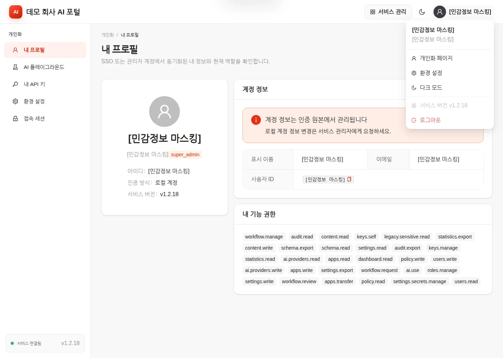
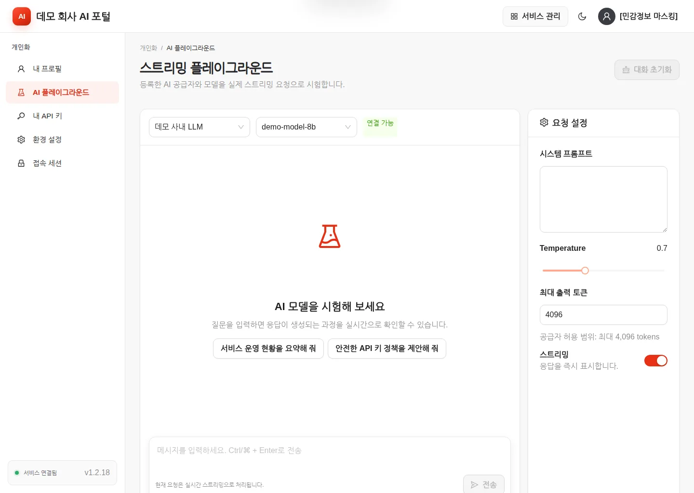
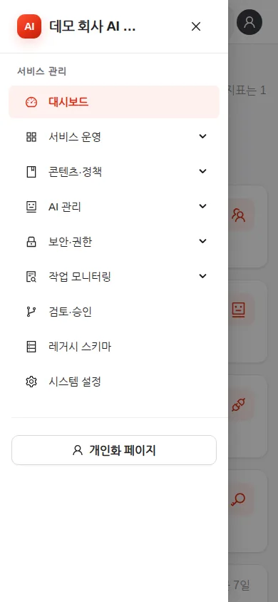
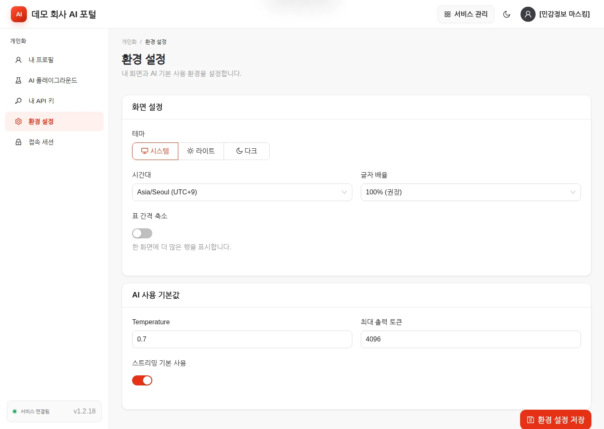
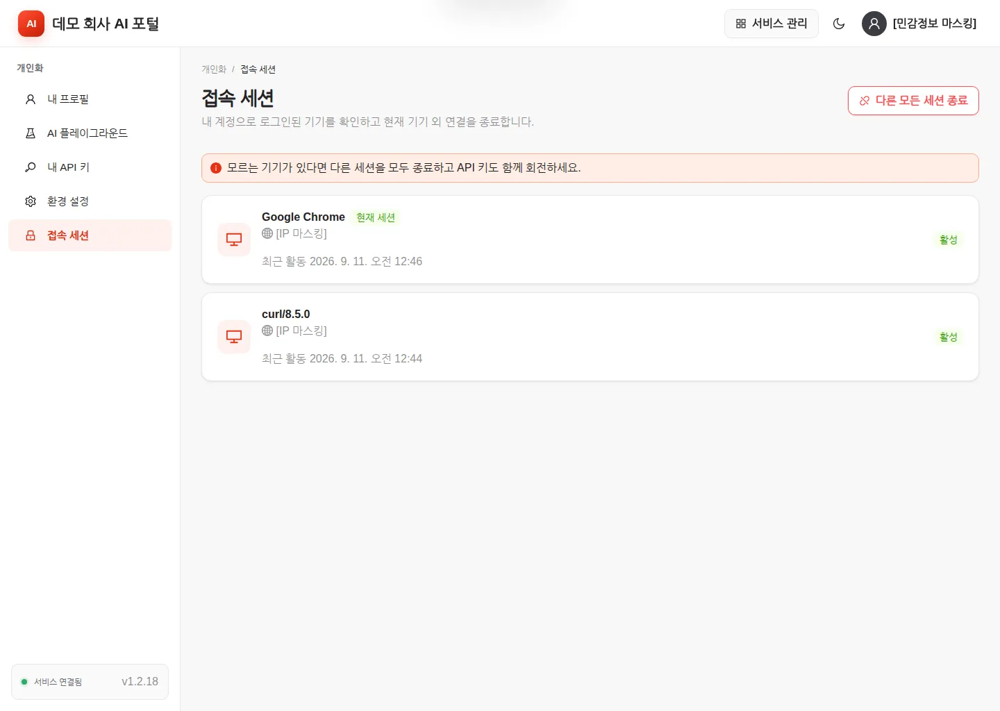
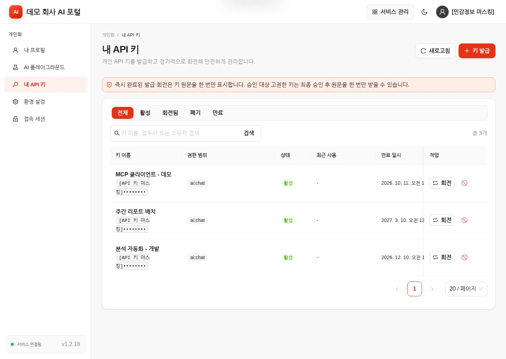

# ai-admin 사용자 가이드

`v1.2.20` 화면을 기준으로 작성했습니다. 이 문서는 ai-admin 화면을 **쓰는 사람**을 위한 것입니다.
서비스를 설치하고 지키는 일은 [관리자 가이드](ADMIN_GUIDE.md)에 있습니다.

이 문서의 화면 캡처는 합성 데이터로 채운 실제 ai-admin 화면을 1440×1024에서 찍은 것입니다.
사람 이름·아이디·이메일·IP·키 원문 자리에 보이는 `[민감정보 마스킹]`, `[표 데이터 마스킹]`,
`[API 키 마스킹]` 표시는 캡처 도구가 가린 부분이며, 실제 화면에는 해당 값이 그대로 보입니다.

---

## 1. 이 제품이 하는 일

ai-admin은 사내 AI 서비스와 기존 AI Portal 데이터를 한 화면에서 다루는 관리 서비스입니다.
어떤 AI 공급자와 모델을 쓸지, 누가 무엇을 할 수 있는지, 어떤 작업에 팀장 검토를 붙일지를
정하고, 그 결과를 감사 기록으로 남깁니다. 인터넷이 없는 폐쇄망에서 단일 컨테이너로 돕니다.

화면은 두 영역으로 나뉩니다. **서비스 관리**는 조직 전체를 다루는 영역이고, **개인화**는
내 계정에만 해당하는 영역입니다. 상단 오른쪽의 **개인화 / 서비스 관리** 버튼으로 오갑니다.

읽는 사람에 따라 쓰는 영역이 다릅니다.

| 이런 사람이라면 | 주로 보는 곳 |
| --- | --- |
| AI를 업무에 쓰는 일반 사용자 | 개인화 — 내 프로필, AI 플레이그라운드, 내 API 키, 환경 설정, 접속 세션 |
| 팀장·검토자 | 위 항목 + 서비스 관리 → **검토·승인** |
| 운영 담당자 | 서비스 관리 전반 (자세한 내용은 [관리자 가이드](ADMIN_GUIDE.md)) |

권한이 없는 메뉴는 화면에 아예 나타나지 않습니다. 필요한 메뉴가 보이지 않으면 지어내지 말고
관리자에게 "어떤 업무를 위해 어떤 화면이 필요한지"를 전달하세요.

---

## 2. 처음 5분

로그인부터 AI 응답을 직접 받아 보는 데까지 한 번에 따라 할 수 있는 길입니다.

### 2.1 로그인

브라우저에서 관리자가 알려 준 서비스 주소를 엽니다.


- **로컬 계정**: 아이디와 비밀번호를 입력하고 **로그인**을 누릅니다.
- **아이디 저장**: 체크하면 아이디만 브라우저에 보관합니다. 비밀번호는 저장하지 않습니다.
- **Keycloak SSO로 로그인**: 관리자가 SSO를 켠 경우에만 이 버튼이 함께 보입니다.
- 카드 아래에 서비스 이름과 버전(`v1.2.20`)이 표시됩니다. 관리자가 안내한 버전과 다르면 알려 주세요.

로그인하면 내 권한으로 볼 수 있는 첫 화면으로 이동합니다. 관리 권한이 없으면 **내 프로필**이
첫 화면이 됩니다.

### 2.2 내 프로필 확인



**개인화 → 내 프로필**에서 아이디, 표시 이름, 이메일, 인증 방식(로컬 계정 / SSO), 역할과
**내 기능 권한**을 확인합니다. 계정 정보는 인증 원본에서 관리되므로 이 화면에서는 바꿀 수
없고, 변경이 필요하면 서비스 관리자에게 요청합니다.

오른쪽 위 프로필 아이콘을 누르면 **개인화 페이지 / 환경 설정 / 다크 모드 / 서비스 버전 /
로그아웃**이 나옵니다. 버전은 여기서도 다시 확인할 수 있습니다.

### 2.3 AI 응답 받아 보기

**개인화 → AI 플레이그라운드**로 이동합니다.



1. 왼쪽 위에서 **공급자**와 **모델**을 고릅니다. 옆의 **연결 가능** 표시로 상태를 확인합니다.
2. 필요하면 오른쪽 **요청 설정**에서 시스템 프롬프트, Temperature, 최대 출력 토큰, 스트리밍을 조정합니다.
3. 아래 입력창에 질문을 쓰고 **전송**(또는 `Ctrl`/`⌘` + `Enter`)을 누릅니다.
4. 스트리밍이 켜져 있으면 응답이 생성되는 대로 이어 붙습니다.

첫 응답을 받았다면 준비가 끝난 것입니다.

---

## 3. 화면별 사용법

### 3.1 공통 조작

- 상단 **개인화 / 서비스 관리** 버튼으로 영역을 전환합니다.
- 상단 해/달 버튼으로 라이트·다크 모드를 바꿉니다.
- 현재 메뉴는 주소(URL)에 남습니다. 새로고침하거나 주소를 공유해도 같은 화면으로 돌아옵니다.
- 표가 넓으면 표 영역을 가로로 스크롤합니다. 왼쪽 메뉴가 길면 메뉴 영역만 스크롤되고 본문 위치는 유지됩니다.
- 왼쪽 아래에 **서비스 연결됨** 표시와 버전이 항상 보입니다.

작은 화면에서는 왼쪽 위 메뉴 버튼이 사이드바를 엽니다.



### 3.2 환경 설정

**개인화 → 환경 설정**입니다. 저장은 아래쪽 **환경 설정 저장** 버튼으로 합니다.



**화면 설정**

| 항목 | 하는 일 |
| --- | --- |
| 테마 | 시스템 / 라이트 / 다크 중 선택 |
| 시간대 | 화면의 날짜·시각 기준. `Asia/Seoul (UTC+9)` 또는 `UTC` |
| 글자 배율 | 90% / 100%(권장) / 110% / 120% / 130% |
| 표 간격 축소 | 켜면 한 화면에 더 많은 행을 표시 |

**AI 사용 기본값**

| 항목 | 하는 일 |
| --- | --- |
| Temperature | 플레이그라운드 요청의 기본 Temperature |
| 최대 출력 토큰 | 요청 하나가 받을 수 있는 기본 출력 토큰 상한 |
| 스트리밍 기본 사용 | 켜면 응답을 생성되는 즉시 표시 |

최대 출력 토큰은 1 이상만 넣을 수 있고, 실제 요청은 고른 공급자가 허용하는 범위까지만
반영됩니다. 저장이 거부되면 그 요청의 다른 설정도 함께 바뀌지 않으니, 값을 고쳐 다시
저장하세요.

### 3.3 접속 세션

**개인화 → 접속 세션**에서 내 계정으로 로그인된 기기를 확인합니다.



- 기기마다 브라우저, 접속 IP, 최근 활동 시각과 상태가 보입니다.
- 지금 쓰고 있는 기기에는 **현재 세션** 표시가 붙습니다.
- 모르는 기기가 있으면 **다른 모든 세션 종료**를 실행합니다. 현재 세션은 유지됩니다.
  화면 안내대로 API 키도 함께 회전하고, 관리자에게 알리세요.

### 3.4 내 API 키

API나 MCP로 AI를 호출할 권한(`keys.self`)이 있으면 **개인화 → 내 API 키**가 보입니다.



발급 절차

1. 오른쪽 위 **키 발급**을 누릅니다. **API 키 발급** 창이 열립니다.
2. **키 이름**에 사용처가 드러나는 이름을 씁니다(예: `분석 자동화 - 개발`).
3. **권한 범위**에서 관리자가 개인 선택을 허용한 scope 중 필요한 것만 고릅니다. 화면 안내대로 최소 권한만 고르세요.
4. **만료 기간(일)**을 정합니다. `0`을 넣으면 만료되지 않습니다.
5. **발급**을 누르고, 화면에 한 번 표시되는 **키 원문**을 즉시 복사해 조직의 비밀값 보관소에 넣습니다.

목록 위의 안내대로, 즉시 완료된 발급·회전은 원문을 **한 번만** 표시합니다. 창을 닫으면 다시
볼 수 없습니다. 고권한 키에 승인 절차가 걸려 있으면 최종 승인 후에 원문을 한 번 받습니다.

- **회전**: 새 원문을 발급합니다. 일반 키는 기존 키가 즉시 폐기되고, 승인 정책이 걸린 고권한 키는 최종 승인 후에 기존 키가 폐기되며 새 원문을 한 번 받습니다. 자동화 쪽 비밀값을 새 값으로 바꾼 뒤 호출이 되는지 확인하세요.
- **폐기**(빨간 금지 아이콘): 키를 무효화합니다. 폐기 후에는 되돌릴 수 없습니다. 더 쓰지 않는 키, 담당자가 바뀐 키, 노출이 의심되는 키에 씁니다.
- 목록 위 **전체 / 활성 / 회전됨 / 폐기 / 만료** 탭으로 상태별로 걸러 봅니다.

키 원문을 셸 기록, 소스 코드, 문서, 화면 캡처에 남기지 마세요.

### 3.5 AI 플레이그라운드

**개인화 → AI 플레이그라운드**(관리자는 **AI 관리 → 스트리밍 플레이그라운드**)에서 등록된
공급자와 모델을 실제 스트리밍 요청으로 시험합니다.


- 오른쪽 **요청 설정**의 최대 출력 토큰 아래에 그 공급자가 허용하는 범위가 표시됩니다. 그 값을 넘기지 마세요.
- **대화 초기화**로 지금까지의 대화를 지웁니다.
- 업무상 비밀이나 개인정보는 승인된 모델·망·정책에서만 입력합니다.

플레이그라운드는 연결과 응답을 확인하는 도구입니다. 결과가 정확하거나 안전하다는 보장은
아니므로 중요한 판단에는 별도 검토를 두세요.

### 3.6 검토·승인

관리자가 승인 절차를 켠 작업은 즉시 실행되지 않고 **대기** 상태의 요청이 됩니다.
검토 권한(`workflow.review`)이 있으면 **서비스 관리 → 검토·승인**에서 처리합니다.


- **승인 대기** 탭 옆의 숫자가 처리할 요청 수입니다.
- 각 행에 요청 제목, 정책 코드(예: `general_review`), 요청자, 상태, 요청 일시가 나옵니다.
- **승인** 또는 **반려**를 누릅니다. 반려할 때는 사유를 남깁니다.
- 여러 단계로 설정된 정책은 마지막 단계까지 승인되어야 반영됩니다.

요청을 올린 쪽에서는 반려 사유를 확인하고 내용을 고쳐 다시 올립니다. 관리자가 그 작업의
승인 절차를 꺼 두면 승인 단계 없이 바로 처리됩니다.

---

## 4. 자주 하는 작업

### 4.1 자동화에서 AI를 부를 키 만들기

1. **개인화 → 내 API 키 → 키 발급**으로 키를 만들고 원문을 비밀값 보관소에 넣습니다.
2. OpenAI 호환 형식으로 호출합니다. 모델 이름은 관리자가 등록한 값을 씁니다.

```bash
curl https://ai-portal.example.com/v1/chat/completions \
  -H 'Authorization: Bearer aia_REPLACE_ME' \
  -H 'Content-Type: application/json' \
  -d '{
    "model": "demo-model-8b",
    "messages": [{"role": "user", "content": "이번 주 처리 현황을 요약해 주세요."}],
    "stream": true
  }'
```

쓸 수 있는 모델 목록은 `GET /v1/models`로 확인합니다. 요청·응답 형식은 [REST·AI API 문서](api.md),
MCP 클라이언트 설정은 [MCP 문서](mcp.md)에 있습니다.

### 4.2 노출이 의심되는 키 정리하기

1. **개인화 → 접속 세션**에서 모르는 기기가 있는지 확인하고, 있으면 **다른 모든 세션 종료**를 실행합니다.
2. **개인화 → 내 API 키**에서 해당 키를 **회전**합니다. 기존 원문은 즉시 무효가 됩니다.
3. 자동화 쪽 비밀값을 새 원문으로 바꾸고 호출이 되는지 확인합니다.
4. 더 쓰지 않을 키는 **폐기**합니다.
5. 관리자에게 알립니다. 발급·회전·폐기는 모두 감사 로그에 남습니다.

### 4.3 담당자가 바뀔 때

1. 넘겨받는 사람이 자기 이름으로 새 키를 발급합니다.
2. 자동화가 새 키로 도는 것을 확인합니다.
3. 이전 담당자의 키를 **폐기**합니다.

키를 사람 사이에 공유하지 말고, 소유자가 바뀌면 새로 발급하세요.

### 4.4 화면 글자가 작을 때

**개인화 → 환경 설정 → 글자 배율**을 올리고 **환경 설정 저장**을 누릅니다. 표에 행이 적게
보이는 것이 불편하면 **표 간격 축소**를 함께 켭니다.

---

## 5. 막혔을 때

화면에 그대로 나오는 문구와, 그때 하면 되는 일입니다.

### 로그인·접속

| 화면에 보이는 것 | 뜻과 조치 |
| --- | --- |
| **서비스에 연결할 수 없습니다** + **다시 시도** | 자격 증명 문제가 아니라 서비스가 응답하지 못한 상태입니다. **다시 시도**를 누르고, 반복되면 관리자에게 알립니다. |
| 로그인 화면으로 자꾸 돌아감 | 세션이 만료됐거나 종료됐습니다. 다시 로그인하고, 계속 반복되면 관리자에게 시각 동기화·쿠키 정책·세션 시간 확인을 요청합니다. |
| **페이지를 찾을 수 없습니다** | 주소가 바뀌었거나 접근할 수 없는 화면입니다. **홈으로 이동**을 누릅니다. |
| 필요한 메뉴가 안 보임 | 역할에 그 권한이 없습니다. **내 프로필 → 내 기능 권한**을 확인하고 관리자에게 필요한 업무와 화면 이름을 전달합니다. |

### SSO(Keycloak) 로그인

SSO 로그인이 실패하면 로그인 화면에 문구와 함께 **처리 단계**, **추적 ID**가 표시됩니다.
관리자에게 문의할 때 이 두 값을 그대로 전달하면 원인을 훨씬 빨리 찾을 수 있습니다.

| 화면에 보이는 문구 | 조치 |
| --- | --- |
| SSO 로그인 상태가 올바르지 않거나 만료되었습니다. | 로그인 화면을 새로 열어 처음부터 다시 시도합니다. |
| SSO 로그인을 시작한 브라우저에서 다시 시도해 주세요. | 로그인을 시작한 그 브라우저·창에서 다시 시도합니다. |
| SSO 로그인 처리가 혼잡합니다. 잠시 후 다시 시작해 주세요. | 잠시 기다렸다가 다시 시도합니다. |
| Keycloak에서 로그인이 완료되지 않았습니다. | Keycloak 화면에서 로그인을 끝까지 마칩니다. |
| SSO 설정 또는 Keycloak 연결 상태를 확인해 주세요. | 사용자가 할 수 있는 일이 없습니다. 관리자에게 전달합니다. |
| SSO 사용자 계정을 준비하지 못했습니다. 관리자에게 문의해 주세요. | 계정이나 역할 매핑 문제입니다. 관리자에게 전달합니다. |
| SSO 사용자 계정을 준비하는 중 서비스에 연결하지 못했습니다. 잠시 후 다시 시도해 주세요. | 일시적인 연결 문제입니다. 잠시 후 다시 시도하고, 반복되면 관리자에게 알립니다. |
| SSO 사용자 세션을 만들지 못했습니다. 계정 상태를 확인해 주세요. | 계정 상태 문제입니다. 관리자에게 전달합니다. |
| SSO 사용자 세션을 만드는 중 서비스에 연결하지 못했습니다. 잠시 후 다시 시도해 주세요. | 잠시 후 다시 시도하고, 반복되면 관리자에게 알립니다. |

### AI 요청

| 상황 | 조치 |
| --- | --- |
| **AI 응답이 완료되기 전에 연결이 끊어졌습니다.** | 답변이 도중에 끊긴 것입니다. 이미 받은 부분은 화면에 남습니다. 완결된 답변이 아니므로 그대로 쓰지 말고 다시 요청하세요. 반복되면 관리자에게 알립니다. |
| 400으로 거부됨 | 요청이 너무 길거나 모델 이름이 허용 목록에 없습니다. 입력을 줄이거나 **공급자·모델** 선택을 다시 확인합니다. |
| 401 | 키 원문이 잘못됐거나 회전·폐기·만료된 키입니다. **내 API 키**에서 상태를 확인합니다. |
| 403 | 역할 권한 또는 키의 권한 범위(scope)가 부족합니다. 관리자에게 필요한 scope를 요청합니다. |
| 502 / 503 | 고른 공급자나 내부망 연결 문제입니다. 관리자에게 공급자 상태 확인을 요청합니다. |

### 키·승인

| 상황 | 조치 |
| --- | --- |
| 발급 화면을 닫아 키 원문을 놓침 | 원문은 다시 볼 수 없습니다. 그 키를 **회전**하거나 **폐기**하고 새로 발급합니다. |
| 원하는 scope가 선택 목록에 없음 | 관리자가 개인 선택을 허용하지 않은 관리자 전용 scope입니다. 관리자에게 요청합니다. |
| 요청이 **대기** 상태에서 멈춰 있음 | 검토자의 승인을 기다리는 중입니다. 정책이 여러 단계면 마지막 단계까지 필요합니다. |
| 반려됨 | 반려 사유를 확인하고 내용을 고쳐 다시 올립니다. |

---

## 6. 용어

| 화면에 나오는 말 | 뜻 |
| --- | --- |
| 서비스 관리 / 개인화 | 조직 전체를 다루는 영역과 내 계정만 다루는 영역 |
| 공급자 | AI 모델을 제공하는 내부망 엔드포인트. 관리자가 등록합니다 |
| 모델 | 그 공급자가 제공하는 모델 이름 (예: `demo-model-8b`) |
| 스트리밍 | 답변을 다 만든 뒤가 아니라 생성되는 대로 화면에 이어 붙이는 방식 |
| 토큰 | AI가 글을 세는 단위. 컨텍스트·최대 출력 한도가 이 단위로 정해집니다 |
| 권한 범위 (scope) | API 키 하나가 할 수 있는 일의 범위 (예: `ai:chat`) |
| 회전 | 같은 키 항목에 새 원문을 발급하고 기존 원문을 무효화하는 것 |
| 폐기 | 키를 되돌릴 수 없게 무효화하는 것 |
| 역할 | 권한 묶음. `super_admin`·`admin`·`team_lead`·`user`가 기본입니다 |
| 검토·승인 | 지정한 작업에 팀장 검토 단계를 붙이는 절차 |
| 레거시 | ai-admin 이전부터 있던 AI Portal의 데이터와 화면 |
| 감사 로그 | 로그인·권한·키·설정·승인 변경이 남는 기록 |

---

## 함께 보기

- [관리자 가이드](ADMIN_GUIDE.md) — 설치, 설정, 권한, 운영, 장애 대응
- [REST·AI API](api.md) — 요청·응답 형식과 오류 코드
- [MCP](mcp.md) — MCP 클라이언트 연결
- [운영 가이드](operations.md) — 배포와 점검 절차
