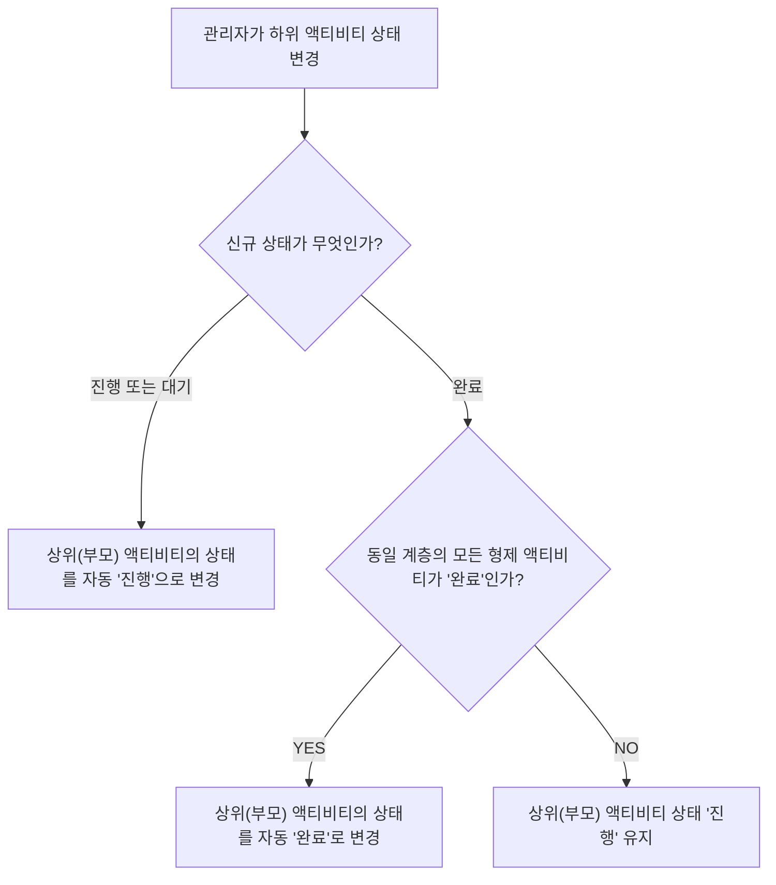

# ⚙️ KCB Cutover Dashboard - 관리자 가이드 (Admin Guide)

본 가이드는 KCB 재해복구(DR) 모의훈련 및 Cutover 작업의 **통제관, PMO, 시스템 총괄 관리자**를 위한 대시보드 제어 및 운용 가이드 문서입니다.

---

## 📑 목차
1. [관리자 콘솔 개요 및 접속](#1-관리자-콘솔-개요-및-접속)
2. [관리자 인증 및 보안 설정](#2-관리자-인증-및-보안-설정)
3. [액티비티 상태 제어 (Status Management)](#3-액티비티-상태-제어-status-management)
   - [상태 변경 연동 규칙 (Automatic Cascade Rules)](#31-상태-변경-연동-규칙-automatic-cascade-rules)
4. [액티비티 편집 기능 (CRUD & Reorder)](#4-액티비티-편집-기능-crud--reorder)
   - [액티비티 추가 및 하위 항목 생성](#41-액티비티-추가-및-하위-항목-생성)
   - [제목 및 예정 시간 수정](#42-제목-및-예정-시간-수정)
   - [순서 이동 및 삭제](#43-순서-이동-및-삭제)
5. [activity.json 일괄 업로드](#5-activityjson-일괄-업로드)
6. [데이터 백업 및 복구 관리](#6-데이터-백업-및-복구-관리)
7. [문제 해결 및 트러블슈팅 (Troubleshooting)](#7-문제-해결-및-트러블슈팅-troubleshooting)

---

## 1. 관리자 콘솔 개요 및 접속

관리자 콘솔(`Admin Console`)은 Cutover 모의훈련 동안 각 단계별 작업의 진행 상황을 직접 업데이트하고, 신규 작업을 추가하거나 일정을 변경할 수 있는 전용 컨트롤 뷰입니다.

- **관리자 접속 URL**: `http://<서버-IP>:3000/admin`
- **권장 디바이스**: 데스크톱 PC, 노트북 (트리 조작 및 텍스트 편집 편의성)

---

## 2. 관리자 인증 및 보안 설정

### 2.1 관리자 로그인
1. `/admin` 경로 접속 시 딥블루톤의 관리자 전용 인증 화면이 출력됩니다.
2. **관리자 비밀번호**(`NEXT_PUBLIC_ADMIN_PASSWORD`)를 입력합니다. (기본값: `admin1234`)
3. 로그인 성공 시 인증 쿠키(`cutover_admin`)가 생성되어 세션이 유지됩니다.

> [!CAUTION]  
> 관리자 권한은 전체 훈련 상태를 직접 수정할 수 있으므로, 통제관 및 지정된 담당자 외에게 비밀번호가 유출되지 않도록 주의하십시오.

---

## 3. 액티비티 상태 제어 (Status Management)

관리자 콘솔에서는 각 액티비티 항목 옆의 **상태 배지**를 클릭하거나 드롭다운을 통해 작업 상태를 즉시 변경할 수 있습니다.

```
[대기] ──(클릭)──> [진행] ──(클릭)──> [완료]
  │                                    ▲
  └───────────────(지연 발생)──────────┘ (지연 처리 가능)
```

### 3.1 상태 변경 연동 규칙 (Automatic Cascade Rules)

KCB Cutover Dashboard는 사람의 실수를 방지하고 계층 구조 간 일관성을 유지하기 위해 **스마트 트리 캐스케이딩 엔진**이 내장되어 있습니다.



1. **하위 작업 `진행` 시**: 상위 부모 작업이 `대기` 상태였다면 자동으로 `진행` 상태로 변경됩니다.
2. **하위 작업 `완료` 시**: 부모 항목 아래의 모든 하위(자식) 작업이 `완료`로 변경되는 순간, 부모 항목도 자동으로 `완료` 처리됩니다.
3. **상위 작업 직접 변경 시**: 상위 작업 상태를 `완료`로 변경하면, 포함된 모든 하위 작업도 일괄 `완료` 처리됩니다.

---

## 4. 액티비티 편집 기능 (CRUD & Reorder)

관리자 화면에서는 트리 항목 마우스 호버 시 편집 툴바가 노출됩니다.

### 4.1 액티비티 추가 및 하위 항목 생성
- **루트 액티비티 추가**: 목록 하단의 `+ 새 루트 액티비티 추가` 버튼 클릭
- **하위(자식) 액티비티 추가**: 대상 액티비티의 `+` 버튼 클릭 (자동으로 1레벨 아래 하위 항목 생성)

### 4.2 제목 및 예정 시간 수정
- 액티비티 항목의 **시간 필드** 또는 **제목 필드**를 클릭하면 즉시 편집 모드로 전환됩니다.
- 수정 후 엔터(`Enter`) 키를 누르거나 외부를 클릭하면 변경 사항이 서버로 즉시 저장됩니다.

### 4.3 순서 이동 및 삭제
- **위/아래 이동 (`▲ / ▼`)**: 동일 계층 내에서 작업의 우선순위 및 순서를 변경합니다.
- **삭제 (`🗑️`)**: 해당 액티비티 및 포함된 모든 하위 액티비티를 삭제합니다. (확인 팝업창 노출)

---

## 5. activity.json 일괄 업로드

관리자 화면의 **activity.json 업로드** 카드에서 JSON 파일을 선택하거나 끌어놓은 뒤 **상황판에 반영**을 누릅니다. 파일 크기는 최대 2MB이며, 반영 전 확인 창이 표시됩니다.

기본 파일 구조는 다음과 같습니다.

```json
{
  "dashboardTitle": "2026 재해복구 모의훈련 대시보드",
  "activities": [
    {
      "id": "1",
      "parentId": null,
      "level": 1,
      "time": "21:00 ~ 21:10",
      "title": "[Task#1] 서비스 중지",
      "status": "대기"
    }
  ]
}
```

- 필수 최상위 필드: `activities` 배열
- 액티비티 필수 필드: `id`, `parentId`, `level`, `time`, `title`, `status`
- 상태값: `대기`, `진행`, `지연`, `완료` (`진행중`은 `진행`으로 자동 변환)
- 루트 항목: `parentId`는 `null`, `level`은 `1`
- 하위 항목: `parentId`가 가리키는 부모가 반드시 존재하고 `level`은 부모보다 1 커야 함
- `dashboardTitle`이 없으면 현재 상황판 제목을 유지하며, 방문자 수 역시 항상 유지됨

업로드가 실패하면 화면에 `activities[3].status` 같은 정확한 오류 경로와 원인이 함께 표시됩니다. JSON 문법 위치, 필수 필드, 중복 ID, 존재하지 않는 부모 ID, level 불일치, 순환 참조, 허용되지 않은 상태값을 한 번에 최대 50건까지 확인할 수 있습니다. 검증에 실패한 파일은 현재 상황판에 전혀 반영되지 않습니다.

## 6. 데이터 백업 및 복구 관리

대시보드의 데이터는 서버 내 JSON 데이터 파일 또는 지정된 S3 버킷에 실시간 기록됩니다.

- **현재 데이터 파일**: 프로젝트 루트의 `data/activity.json`
- **업로드 직전 자동 백업**: 프로젝트 루트의 `data/activity.backup.json`
- **수동 백업 방법**:
  ```bash
  # 데이터 파일 복사 백업
  cp data/activity.json data/activity-manual-backup-$(date +%Y%m%d_%H%M%S).json
  ```
- **Docker 운영**: `/app/data`를 볼륨으로 마운트해야 컨테이너를 교체해도 업로드 데이터가 유지됩니다.
- **초기 데이터 리셋**: `data/activity.json` 파일이 없으면 빈 상황판 데이터가 자동 생성됩니다.

## 7. 문제 해결 및 트러블슈팅 (Troubleshooting)

> [!WARNING]  
> **상황 1: 관리자 로그인 폼에서 비밀번호 오류가 계속 발생함**  
> - `.env.local` 또는 Docker 실행 환경 변수 `NEXT_PUBLIC_ADMIN_PASSWORD` 설정을 확인하십시오.
> - 서버 재시작 후 브라우저 쿠키를 삭제하고 재접속하십시오.

> [!WARNING]  
> **상황 2: 상태 변경 시 화면 반영이 지연되는 현상**  
> - 서버 로그를 통해 API 반응속도(`PUT /api/activities`)를 점검하십시오.
> - Docker 컨테이너 메모리 제한 및 CPU 사용량을 확인하십시오.

> [!WARNING]
> **상황 3: activity.json 업로드가 거부됨**
> - 관리자 화면에 표시된 오류 경로와 상세 원인을 먼저 확인하십시오.
> - 세션 만료 오류라면 관리자 비밀번호로 다시 로그인하십시오.
> - 저장 오류라면 `data` 디렉토리의 쓰기 권한과 디스크 여유 공간을 확인하십시오.
