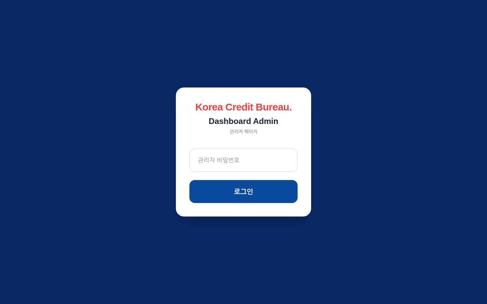
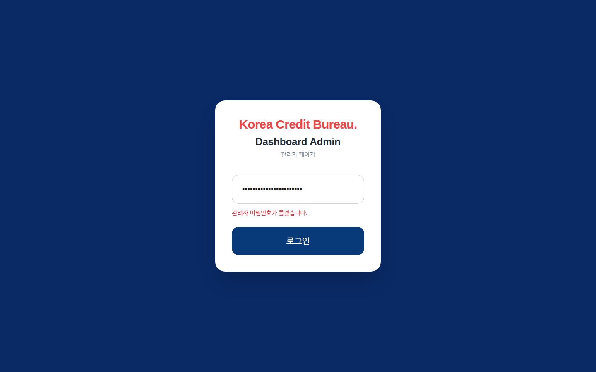
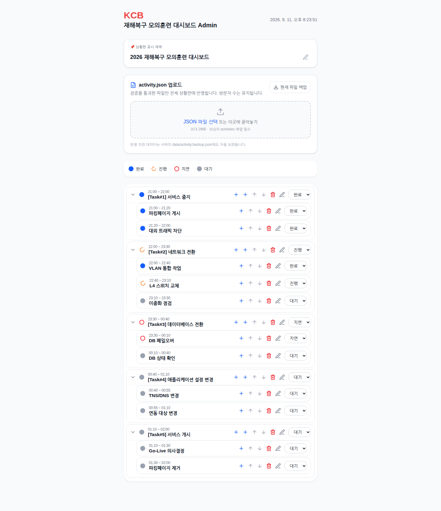
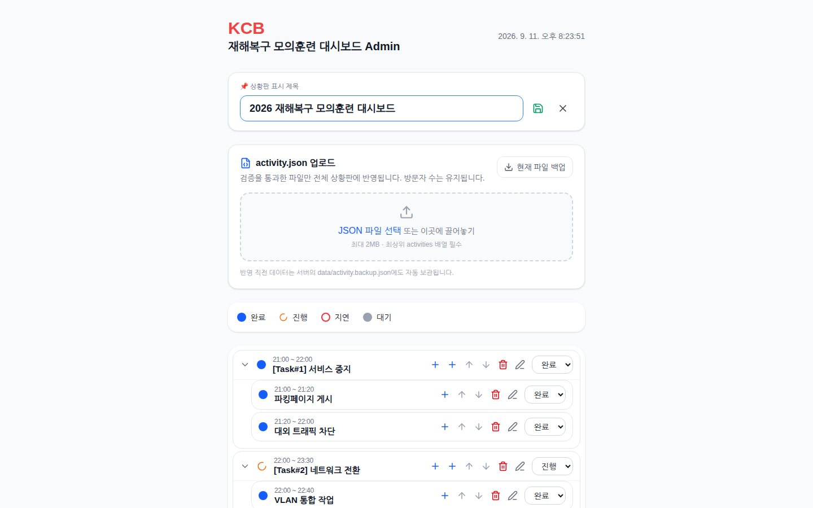
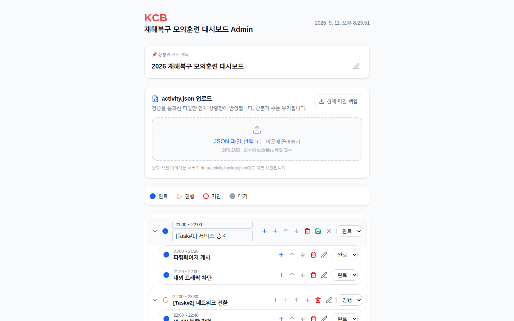
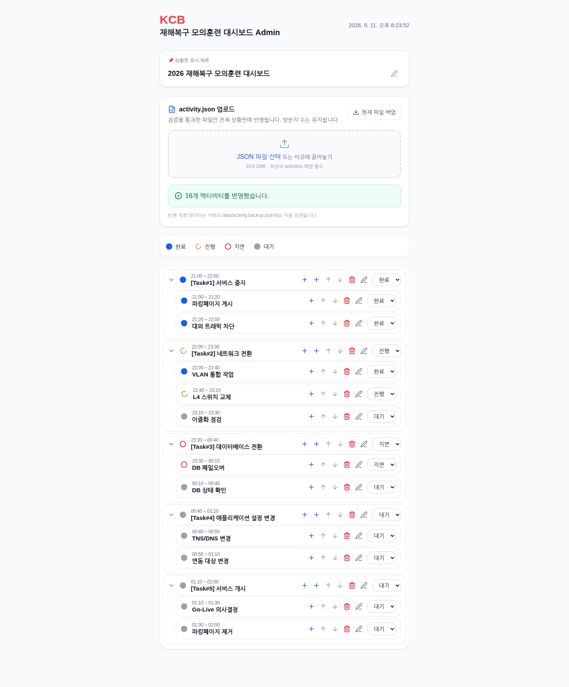

# KCB Cutover Dashboard 관리자 가이드

이 문서는 상황판을 **띄워 놓고 지키는 사람**(훈련 통제관, PMO, 시스템 관리자)을 위한 가이드입니다. 상황판을 보기만 하는 사람은 [사용자 가이드](USER_GUIDE.md)를 보십시오. 화면의 구성과 상태 아이콘 설명은 사용자 가이드와 겹치므로 여기서는 반복하지 않습니다.

- 버전: v1.3.0
- 관리자 화면: `http://<서버-주소>:3000/admin`
- 저장소 개요·기술 스택: [README](../README.md)

---

## 1. 구성 요소

컨테이너 하나로 동작하며 외부 의존 서비스가 없습니다.

| 구성 요소 | 내용 |
|---|---|
| `cutover-app` 컨테이너 | Next.js 16 standalone 서버(Node.js 22, Alpine). 상황판 화면 3개(`/`, `/pc`, `/admin`)와 API를 함께 제공합니다. 컨테이너 안에서는 `nextjs`(uid 1001) 계정으로 실행됩니다. |
| 데이터 파일 | `/app/data/activity.json` 하나. 작업 목록·상황판 제목·방문자 수·마지막 갱신 시각이 들어 있습니다. 파일이 없으면 첫 요청 때 빈 상황판으로 자동 생성됩니다. |
| 백업 파일 | `/app/data/activity.backup.json`. 관리자가 `activity.json`을 업로드할 때 직전 파일이 자동으로 복사됩니다(한 세대만 보관). |
| 브라우저 | 사용자 화면은 `/api/activities`를 주기적으로 읽습니다(`/` 10초, `/pc` 2초, `/admin` 1초). 관리자 화면은 `PUT /api/activities`, `POST /api/activities/import`로 씁니다. |

주고받는 것은 HTTP 하나뿐입니다. 데이터베이스·메시지 큐·외부 API를 쓰지 않습니다. 저장소에 `lib/s3.ts`(AWS S3 저장 코드)와 `amplify.yml`이 남아 있으나 **현재 어떤 라우트도 이 코드를 사용하지 않습니다** — S3 관련 환경 변수를 설정해도 아무 일도 일어나지 않습니다.

---

## 2. 설치

폐쇄망 배포를 기준으로 씁니다. 인터넷이 되는 PC에서 이미지를 만들어 파일로 옮기고, 서버에서 불러와 띄웁니다. 저장소에는 `Dockerfile`만 있고 compose 파일은 없으므로 `docker run`으로 띄웁니다.

### 2.1 필요한 자원

| 항목 | 값 |
|---|---|
| 포트 | `3000/tcp` (컨테이너 내부 고정, 호스트 포트는 자유) |
| 볼륨 | `/app/data` — 데이터·백업 파일. 반드시 볼륨으로 잡아야 컨테이너를 교체해도 상황판이 남습니다. |
| 자원 | Node 프로세스 하나. 1 vCPU / 512 MB 이상이면 충분합니다(권장값이며 코드가 강제하지 않습니다). |

### 2.2 이미지 만들기 (인터넷 가능 환경)

```bash
git clone https://github.com/hkjang/cutover.git
cd cutover
git checkout v1.3.0

docker build -t cutover:v1.3.0 .
docker save cutover:v1.3.0 | gzip > cutover-v1.3.0.tar.gz
```

`cutover-v1.3.0.tar.gz`를 서버로 옮깁니다.

### 2.3 서버에서 띄우기 (폐쇄망)

```bash
docker load -i cutover-v1.3.0.tar.gz

docker run -d \
  --name cutover-app \
  --restart always \
  -p 3000:3000 \
  -e ADMIN_PASSWORD='<관리자-비밀번호>' \
  -e USER_PASSWORD='<사용자-비밀번호>' \
  -e AUTH_SECRET='<32자-이상-임의-문자열>' \
  -v cutover-data:/app/data \
  cutover:v1.3.0
```

세 환경 변수는 **반드시 직접 정하십시오.** 이미지에는 빌드 시점의 기본값(`NEXT_PUBLIC_ADMIN_PASSWORD=admin1234`, `NEXT_PUBLIC_USER_PASSWORD=1234`)이 박혀 있어서 `ADMIN_PASSWORD`·`USER_PASSWORD`를 주지 않으면 그 값으로 로그인됩니다(3장, 7장 참고).

`AUTH_SECRET`은 다음처럼 만듭니다.

```bash
openssl rand -hex 32
```

### 2.4 첫 확인

```bash
# 상황판 데이터 API — 200 과 JSON 이 오면 정상
curl -s http://localhost:3000/api/activities | head -c 200

# 관리자 로그인 — 200 과 Set-Cookie: cutover_admin_session=... 이 오면 정상
curl -s -i -X POST http://localhost:3000/api/auth/login \
  -H 'Content-Type: application/json' \
  -d '{"pw":"<관리자-비밀번호>","role":"admin"}' | grep -iE '^HTTP|set-cookie'
```

처음 띄우면 `activity.json`이 빈 상황판(`activities: []`)으로 만들어집니다. 브라우저에서 `http://<서버-주소>:3000/admin`에 접속해 관리자 비밀번호로 로그인한 뒤, 5.2절의 방법으로 작업 목록(`activity.json`)을 올리면 상황판이 채워집니다. 별도의 관리자 계정 생성 절차는 없습니다 — 관리자는 비밀번호 하나로 구분됩니다.

> **HTTPS 없이 운영할 때 반드시 읽으십시오.** 운영 이미지(`NODE_ENV=production`)는 관리자 세션 쿠키에 `Secure` 속성을 붙입니다. 브라우저는 `http://localhost`·`http://127.0.0.1`를 제외한 **평문 HTTP 주소에서는 이 쿠키를 저장하지 않으므로**, `http://192.168.x.x:3000/admin`처럼 접속하면 로그인 직후 콘솔은 보이지만 상태 변경이 모두 `401`로 거부되고 새로고침하면 다시 로그인 화면이 나옵니다. 관리자 화면은 **HTTPS(리버스 프록시 종단)** 또는 서버 로컬 브라우저(`localhost`)에서 쓰십시오. 사용자 화면(`/`, `/pc`)은 이 영향을 받지 않습니다. (`lib/adminSession.ts`, `app/api/auth/login/route.ts` — `secure: process.env.NODE_ENV === 'production'`)

### 2.5 개발 서버로 띄우기 (선택)

Docker 없이 로컬에서 볼 때는 README의 [로컬 개발 환경 실행](../README.md#1-로컬-개발-환경-실행)을 따릅니다. `.env.local`에 같은 세 변수를 넣고 `npm run dev`로 띄우면 `http://localhost:3000`입니다. 개발 서버는 `secure` 쿠키를 쓰지 않습니다.

---

## 3. 설정

환경 변수 전수입니다. 코드에서 읽는 것만 적었습니다(`lib/adminSession.ts`, `lib/activityData.ts`, `app/api/**`, `Dockerfile`).

| 이름 | 기본값 | 필수 | 설명 |
|---|---|---|---|
| `ADMIN_PASSWORD` | 없음 → `NEXT_PUBLIC_ADMIN_PASSWORD`로 대체 | **예** | 관리자(`/admin`) 로그인 비밀번호. 실행 시점에 읽으므로 `docker run -e`로 넘깁니다. 두 값이 모두 비어 있으면 관리자 로그인이 항상 실패합니다. |
| `USER_PASSWORD` | 없음 → `NEXT_PUBLIC_USER_PASSWORD`로 대체 | **예** | 사용자(`/`, `/pc`) 로그인 비밀번호. 비어 있으면 사용자 로그인이 항상 실패합니다. |
| `AUTH_SECRET` | 없음 → `ADMIN_PASSWORD` 값으로 대체 | 권장 | 관리자 세션 쿠키 서명(HMAC-SHA256) 키. 지정하지 않으면 관리자 비밀번호가 서명 키를 겸합니다. 바꾸면 기존 관리자 세션이 모두 무효화됩니다. |
| `NEXT_PUBLIC_ADMIN_PASSWORD` | `admin1234` (Dockerfile 빌드 시) | 아니오 | `ADMIN_PASSWORD`가 없을 때의 대체값. **빌드 시점에 번들에 박히므로** 실행 시 `-e`로 넘겨도 바뀌지 않습니다. 하위 호환용이며 `ADMIN_PASSWORD`를 쓰십시오. |
| `NEXT_PUBLIC_USER_PASSWORD` | `1234` (Dockerfile 빌드 시) | 아니오 | 위와 같은 성격의 사용자 비밀번호 대체값. |
| `ACTIVITY_DATA_FILE` | `<작업 디렉터리>/data/activity.json` (컨테이너에서는 `/app/data/activity.json`) | 아니오 | 상황판 데이터 파일 경로. 백업 파일은 같은 폴더에 `<이름>.backup.json`으로 만들어집니다. e2e·캡처 스크립트가 격리용으로 씁니다. |
| `PORT` | `3000` | 아니오 | 서버 포트(Next.js standalone). |
| `HOSTNAME` | `0.0.0.0` (Dockerfile) | 아니오 | 바인드 주소. |
| `NODE_ENV` | `production` (Dockerfile) | 아니오 | `production`이면 관리자 세션 쿠키에 `Secure`가 붙습니다(2.4절). |
| `NEXT_TELEMETRY_DISABLED` | `1` (Dockerfile) | 아니오 | Next.js 원격 측정 비활성화. 폐쇄망에서는 켜 두십시오. |
| `MY_AWS_REGION`, `MY_AWS_ACCESS_KEY_ID`, `MY_AWS_SECRET_ACCESS_KEY`, `S3_BUCKET_NAME` | 없음 | 아니오 | `lib/s3.ts`에서만 참조하며 **현재 어떤 라우트도 사용하지 않습니다.** 설정할 필요가 없습니다. |
| `MAIL_CONFIG_FILE`, `MAIL_DELIVERIES_FILE` | `ACTIVITY_DATA_FILE`과 같은 폴더의 `mail.json`, `mail-deliveries.json` | 아니오 | 메일 알림 설정과 발송 기록 파일 경로(9장). |
| `PLAYWRIGHT_CHROMIUM_PATH` | 없음 | 아니오 | 개발용. e2e·화면 캡처 때 쓸 Chrome 실행 파일 경로. |
| `GUIDE_SHOT_ADMIN_PASSWORD`, `GUIDE_SHOT_USER_PASSWORD`, `GUIDE_SHOT_AUTH_SECRET` | 없음 | 아니오 | 개발용. 가이드 화면 캡처 스크립트(`npm run screenshots:guide`)가 자체 서버를 띄울 때 쓰는 일회용 값. 앞의 둘이 없으면 스크립트가 시작하지 않습니다. |

비밀값 예시는 모두 가짜입니다. 실제 값은 배포 서버의 실행 명령이나 오케스트레이터의 시크릿에만 두고 저장소에 커밋하지 마십시오(`.gitignore`가 `.env*`를 제외합니다).

### 3.1 데이터 파일 형식

`activity.json`은 5.2절의 업로드 파일과 같은 구조에 `lastUpdated`, `visitorCount`가 더 붙습니다.

```json
{
  "activities": [
    { "id": "1", "parentId": null, "level": 1, "time": "21:00 ~ 22:00", "title": "[Task#1] 서비스 중지", "status": "완료" },
    { "id": "1-1", "parentId": "1", "level": 2, "time": "21:00 ~ 21:20", "title": "파킹페이지 게시", "status": "완료" }
  ],
  "dashboardTitle": "2026 재해복구 모의훈련 대시보드",
  "visitorCount": 0,
  "lastUpdated": "2026-09-11T11:14:00.000Z"
}
```

---

## 4. 계정과 권한

역할은 둘뿐이고, 각각 비밀번호 하나로 구분됩니다. 사용자 이름·계정 목록·역할 부여 화면은 없습니다.

| 역할 | 들어가는 곳 | 할 수 있는 일 | 인증 방식 |
|---|---|---|---|
| 사용자 | `/`, `/pc` | 상황판 보기 | `USER_PASSWORD`. 성공하면 브라우저가 `cutover_user` 쿠키(7일)를 스스로 저장합니다. 서버는 이 쿠키를 검사하지 않으며, `GET /api/activities`는 인증 없이 열려 있습니다(7장). |
| 관리자 | `/admin` | 상황판 제목 변경, 작업 상태 변경, 작업 추가·수정·이동·삭제, `activity.json` 업로드·다운로드 | `ADMIN_PASSWORD`. 성공하면 서버가 서명된 HttpOnly 쿠키 `cutover_admin_session`(7일)을 내려주고, 모든 쓰기 API가 이 쿠키를 검증합니다. 화면 표시용으로 `cutover_admin` 쿠키도 함께 저장됩니다. |

### 4.1 관리자 로그인

`/admin`을 열면 관리자 전용 로그인 화면이 나옵니다. **관리자 비밀번호**를 넣고 **로그인**(또는 Enter)을 누릅니다.



틀리면 입력란 아래에 `관리자 비밀번호가 틀렸습니다.`가 표시됩니다.



로그아웃 버튼은 없습니다. 세션은 7일 뒤 만료되며, 그 전에 끝내려면 브라우저에서 이 사이트의 쿠키를 지우거나 `AUTH_SECRET`을 바꿔 모든 세션을 무효화합니다(`DELETE /api/auth/session`도 있으나 화면에서 부르지 않습니다).

### 4.2 관리자 콘솔

로그인하면 위에서부터 **상황판 표시 제목**, **activity.json 업로드**, 범례, 작업 트리가 나옵니다. 트리는 항상 전부 펼쳐져 있고 각 행 오른쪽에 편집 도구가 붙어 있습니다.



행 오른쪽 도구는 왼쪽부터 다음 순서입니다(마우스를 올리면 이름이 뜹니다).

| 도구 | 이름 | 하는 일 |
|---|---|---|
| `+` | 하위 추가 | 이 작업 아래에 `새 액티비티`(시간 `미정`, 상태 `대기`)를 만듭니다. |
| `+` (상위 작업에만) | 같은 레벨 추가 | 맨 아래에 새 상위 작업을 만듭니다. |
| `↑` `↓` | 위로 이동 / 아래로 이동 | 같은 부모 안에서 순서를 바꿉니다. |
| 🗑 | (삭제) | 이 작업과 하위 작업을 지웁니다. 확인 창이 뜹니다 — 현재 버전에서는 확인 창이 **두 번** 연속으로 뜨며, 두 번째 창에는 소속 상위 작업의 제목이 표시됩니다. 둘 다 확인해야 지워집니다. |
| ✎ | (편집) | 시간과 제목을 인라인으로 고칩니다(4.4절). |
| 드롭다운 | 상태 | `대기` `진행` `지연` `완료` 중 하나를 고르면 즉시 저장됩니다(4.3절). |

### 4.3 상태 바꾸기와 연동 규칙

행 오른쪽 드롭다운에서 상태를 고르면 바로 저장되고, 사용자 화면에는 갱신 주기(`/` 10초, `/pc` 2초) 안에 반영됩니다. 이때 다음 규칙이 자동으로 적용됩니다(`app/admin/page.tsx`).

1. **아래로**: 고른 작업과 그 **하위 작업 전부**가 같은 상태가 됩니다. 상위 작업을 `완료`로 바꾸면 세부 작업도 모두 `완료`가 됩니다.
2. **위로, 진행/대기일 때**: 세부 작업을 `진행` 또는 `대기`로 바꾸면 바로 위 상위 작업이 `진행`이 됩니다.
3. **위로, 완료일 때**: 세부 작업을 `완료`로 바꿨을 때 같은 부모 아래 형제가 모두 `완료`면 상위 작업도 `완료`가 됩니다. 하나라도 남아 있으면 상위 작업은 그대로입니다.
4. `지연`은 위로 전파되지 않습니다. 상위 작업을 `지연`으로 보이게 하려면 상위 작업의 드롭다운에서 직접 고릅니다.

규칙은 바로 위 한 단계까지만 올라갑니다. 3단계 이상 트리에서는 중간 단계만 바뀝니다.

> 규칙 1의 "하위 작업 전부"는 **ID가 `<부모ID>-`로 시작하는 항목**을 하위로 봅니다. 화면에서 `하위 추가`로 만든 항목은 자동으로 이 규칙을 따르지만, 업로드한 `activity.json`의 ID가 이 규칙을 따르지 않으면(예: 부모 `A`, 자식 `x1`) 상위 상태 변경이 그 자식에게 내려가지 않습니다. 삭제(🗑)도 같은 규칙으로 하위를 찾습니다 — 6장의 "삭제해도 항목이 사라지지 않음" 항목을 보십시오.

### 4.4 제목·시간 편집

**상황판 제목**: 제목 카드의 ✎(제목 수정)를 누르면 입력란이 열립니다. Enter 또는 💾(저장)로 저장, ✕(취소)로 닫습니다. 100자 이하여야 하며, 넘기면 저장되지 않은 채 편집만 닫힙니다.



**작업의 시간·제목**: 행의 ✎를 누르면 시간(위)과 제목(아래) 입력란이 열립니다. 💾로 저장, ✕로 취소합니다. 이 입력란에서는 Enter가 저장이 아니므로 반드시 💾를 누르십시오. 시간은 100자, 제목은 300자 이하이며 비워 둘 수 없습니다.



---

## 5. 운영

### 5.1 상태 점검

| 확인 | 명령 / 위치 | 정상 |
|---|---|---|
| 서버 응답 | `curl -s -o /dev/null -w '%{http_code}' http://localhost:3000/api/activities` | `200`. 데이터 파일을 못 읽으면 `500`과 함께 본문에 `"error":"저장된 상황판 데이터를 읽지 못했습니다."` |
| 컨테이너 | `docker ps --filter name=cutover-app` | `Up` |
| 로그 | `docker logs -f cutover-app` | 요청마다 줄이 찍히지는 않습니다. 오류만 6장의 문구로 남습니다. |
| 데이터 파일 | `docker exec cutover-app ls -l /app/data` | `activity.json` (업로드 후에는 `activity.backup.json`도) |

### 5.2 작업 목록 올리기 (`activity.json` 업로드)

훈련 전 작업 목록을 한 번에 넣거나 통째로 바꿀 때 씁니다.

1. 관리자 콘솔의 **activity.json 업로드** 카드에서 **JSON 파일 선택**을 누르거나 파일을 끌어놓습니다. 파일명·크기와 `n개 액티비티 감지`가 표시됩니다.
2. **상황판에 반영**을 누르고 확인 창(`n개 액티비티로 현재 상황판을 교체하시겠습니까?`)에서 확인합니다.
3. 성공하면 `n개 액티비티를 반영했습니다.`가 뜨고 트리가 바로 바뀝니다. 파일에 `진행중`이 있었다면 `'진행중' n건을 '진행'으로 변환했습니다.`가 덧붙습니다.



파일 규칙(`lib/activityData.ts` `validateActivityImport`):

| 항목 | 규칙 |
|---|---|
| 파일 | 확장자 `.json`, 2 MB 이하, 비어 있지 않음. 최상위는 `activities` 배열을 가진 객체. |
| `dashboardTitle` | 선택. 비어 있지 않은 100자 이하 문자열. 없으면 현재 제목 유지. |
| `activities[]` | 최대 5,000개. 각 항목 필수 필드: `id`(120자 이하), `parentId`(`null` 또는 문자열), `level`(1~50 정수), `time`(100자 이하), `title`(300자 이하), `status`. |
| `status` | `대기` `진행` `지연` `완료`. `진행중`은 `진행`으로 자동 변환. |
| 계층 | `parentId: null`이면 `level: 1`. 아니면 부모가 파일 안에 있어야 하고 `level`은 부모보다 정확히 1 커야 함. 중복 `id`, 자기 자신을 부모로 지정, 순환 참조 금지. |
| 유지되는 것 | `visitorCount`는 항상 유지. `dashboardTitle`은 파일에 없을 때만 유지. |

실패하면 빨간 상자에 원인이 경로별로 최대 50건까지 나오고, 상황판은 **전혀 바뀌지 않습니다.**

![업로드 실패 — activities[3].status 처럼 경로와 원인이 항목별로 나온다](assets/guide/admin-import-error.png)

### 5.3 백업

| 방법 | 내용 |
|---|---|
| 화면에서 내려받기 | 업로드 카드의 **현재 파일 백업** 버튼. 브라우저가 `activity-backup-<시각>.json`을 내려받습니다. 훈련 시작 전·후에 한 번씩 눌러 두십시오. |
| 자동 백업 | 업로드 성공 직전 파일이 `/app/data/activity.backup.json`으로 복사됩니다. 한 세대만 남으므로 두 번 올리면 첫 번째는 사라집니다. |
| 서버에서 복사 | `docker cp cutover-app:/app/data/activity.json ./activity-$(date +%Y%m%d_%H%M%S).json` |
| 볼륨 통째로 | `docker run --rm -v cutover-data:/data -v "$PWD":/backup alpine tar czf /backup/cutover-data.tar.gz -C /data .` |

### 5.4 복구

내려받아 둔 파일은 5.2절 방식으로 **업로드**하면 됩니다(다운로드 파일에 든 `lastUpdated`·`visitorCount` 필드는 검증에서 무시됩니다). 서버에서 직접 되돌리려면:

```bash
docker cp ./activity-20260911_210000.json cutover-app:/app/data/activity.json
# docker cp 는 root 소유로 넣으므로 실행 계정(uid 1001)에게 돌려준다
docker exec -u root cutover-app chown 1001:1001 /app/data/activity.json
```

서버는 요청마다 파일을 다시 읽으므로 재시작이 필요 없습니다. 자동 백업으로 되돌릴 때는 `docker exec cutover-app cp /app/data/activity.backup.json /app/data/activity.json`.

### 5.5 업그레이드와 되돌리기

데이터 파일 형식은 버전 간에 같으므로 볼륨을 그대로 물려줍니다.

```bash
# 0. 백업 (5.3절)
docker cp cutover-app:/app/data/activity.json ./activity-before-upgrade.json

# 1. 새 이미지 반입
docker load -i cutover-v1.4.0.tar.gz

# 2. 교체 — 같은 볼륨, 같은 환경 변수
docker stop cutover-app && docker rm cutover-app
docker run -d --name cutover-app --restart always -p 3000:3000 \
  -e ADMIN_PASSWORD='<관리자-비밀번호>' -e USER_PASSWORD='<사용자-비밀번호>' -e AUTH_SECRET='<기존과-같은-값>' \
  -v cutover-data:/app/data cutover:v1.4.0

# 3. 확인
curl -s -o /dev/null -w '%{http_code}\n' http://localhost:3000/api/activities
```

되돌릴 때는 2번에서 이미지 태그만 이전 버전(`cutover:v1.3.0`)으로 바꿔 다시 실행합니다. `AUTH_SECRET`을 같은 값으로 주면 관리자가 다시 로그인하지 않아도 됩니다.

### 5.6 API 참고

관리자 화면이 부르는 API입니다. 메서드는 `app/api/**/route.ts`에서 확인했습니다. 🔒는 관리자 세션 쿠키가 필요합니다.

| 메서드 | 경로 | 하는 일 |
|---|---|---|
| `GET` | `/api/activities` | 상황판 데이터 전체. 인증 없음. |
| `PUT` 🔒 | `/api/activities` | 상태 변경·편집·추가·이동·삭제·제목 변경. 본문에 `activities` 배열, 또는 `action`(`add`/`delete`/`move`), 또는 `dashboardTitle`. 저장 전 5.2절과 같은 검증을 거칩니다. |
| `POST` 🔒 | `/api/activities/import` | `multipart/form-data`의 `file` 필드로 `activity.json` 업로드. 성공 시 자동 백업. |
| `POST` 🔒 | `/api/activities/reset-visitor` | `visitorCount`를 0으로. 화면에 버튼은 없고, 현재 코드는 방문자 수를 올리지도 않습니다. |
| `POST` | `/api/auth/login` | `{"pw":"...","role":"admin"|"user"}`. 관리자면 세션 쿠키 발급. |
| `GET` | `/api/auth/session` | 관리자 세션 유효 여부(`200`/`401`). |
| `DELETE` | `/api/auth/session` | 관리자 세션 쿠키 삭제(로그아웃). 화면에서는 부르지 않습니다. |
| `GET`/`PUT` 🔒 | `/api/mail` | 메일 알림 설정 조회·저장(9장). 비밀번호는 돌려주지 않습니다. |
| `POST` 🔒 | `/api/mail/test` | 시험 발송. |
| `GET` 🔒 | `/api/mail/deliveries` | 발송 기록. |

### 5.7 가이드 화면 다시 찍기 (개발자용)

이 문서의 그림은 `npm run screenshots:guide`로 찍습니다. 스크립트는 `scripts/guide-screenshots/`에 있으며, e2e와 같은 방식으로 **격리된 데이터 파일**(`test-results/guide-screenshots/`)과 자체 dev 서버(포트 3200)를 써서 운영 배포나 `data/activity.json`을 건드리지 않습니다. 비밀번호는 일회용 값을 환경 변수로 넘깁니다.

```bash
GUIDE_SHOT_ADMIN_PASSWORD="$(openssl rand -hex 8)" \
GUIDE_SHOT_USER_PASSWORD="$(openssl rand -hex 8)" \
PLAYWRIGHT_CHROMIUM_PATH=/usr/bin/google-chrome \
npm run screenshots:guide
```

결과는 `docs/assets/guide/*.png`에 덮어써집니다.

---

## 6. 장애 대응

| 증상 | 확인할 곳 | 조치 |
|---|---|---|
| 관리자 로그인 직후 콘솔은 보이는데 상태 변경이 반영되지 않고, 새로고침하면 다시 로그인 화면 | 브라우저 주소가 `http://<IP>`(평문 HTTP, localhost 아님)인지. 개발자 도구 → Application → Cookies에 `cutover_admin_session`이 없음. | 2.4절의 `Secure` 쿠키 제약입니다. HTTPS로 접속하거나 서버 로컬 브라우저에서 `http://localhost:3000/admin`을 씁니다. |
| `관리자 비밀번호가 틀렸습니다.` | `docker inspect cutover-app --format '{{.Config.Env}}'`에 `ADMIN_PASSWORD`가 있는지 | 없으면 이미지 기본값 `admin1234`가 유효합니다. 실행 명령에 `-e ADMIN_PASSWORD`를 넣어 다시 띄웁니다. |
| `관리자 인증 설정을 확인해 주세요.` (로그인 시) | 로그: `Admin session could not be created because no signing secret is configured.` | `ADMIN_PASSWORD`와 `AUTH_SECRET`이 모두 비어 있습니다. 둘 중 하나(둘 다 권장)를 설정합니다. |
| `관리자 인증이 만료되었습니다. 다시 로그인해 주세요.` | 7일이 지났거나 `AUTH_SECRET`이 바뀌었거나 위의 `Secure` 쿠키 문제 | 다시 로그인합니다. 반복되면 첫 번째 행을 확인합니다. |
| 사용자 화면에 `데이터 로딩 중 오류가 발생했습니다.` | 로그: `GET /api/activities failed: ...` | `activity.json`이 깨졌거나 권한이 없습니다. `docker exec cutover-app cat /app/data/activity.json | head`로 JSON인지 확인하고, 아니면 5.4절로 복구합니다. 파일을 삭제하면 빈 상황판으로 재생성됩니다. |
| 업로드 시 `검증은 완료되었지만 서버에 activity.json을 저장하지 못했습니다.` | 로그: `POST /api/activities/import failed: ...` (보통 `EACCES` 또는 `ENOSPC`) | `/app/data`가 `nextjs`(uid 1001) 소유인지, 디스크가 찼는지 확인합니다. 호스트 경로를 바인드 마운트했다면 `chown -R 1001:1001 <경로>`. |
| 업로드 시 `JSON 문법이 올바르지 않습니다.` + `n행 m열 부근의 JSON 문법을 확인해 주세요.` | 파일의 해당 위치 | 파일을 고쳐 다시 올립니다. 상황판은 바뀌지 않았습니다. |
| 업로드 시 `activity.json 데이터 형식이 올바르지 않습니다.` | 빨간 상자의 `activities[n].필드` 목록 | 5.2절 규칙대로 고칩니다. 50건이 넘으면 `오류가 너무 많아 n개 항목은 생략했습니다.`가 붙습니다. |
| 업로드 시 `파일 크기는 2MB 이하여야 합니다.` (HTTP 413) | 파일 크기 | 5,000개 이하로 나누거나 불필요한 공백을 줄입니다. |
| 🗑로 삭제해도 항목이 사라지지 않음 (오류 표시 없음) | 로그: `PUT /api/activities failed` 는 없고, 응답이 `400 INVALID_DATA`(`부모 id "..."가 activities에 존재하지 않습니다.`) | 지운 항목의 하위 ID가 `<부모ID>-`로 시작하지 않아 하위가 고아로 남고 검증에 걸린 경우입니다. 하위 항목을 먼저 지우거나, 5.3절로 내려받아 파일에서 정리한 뒤 다시 올립니다. |
| 상황판이 갱신되지 않음 | `curl http://localhost:3000/api/activities`가 응답하는지, `docker logs`에 오류가 있는지 | 서버가 멈췄으면 `docker restart cutover-app`. 컨테이너가 반복 재시작하면 `docker logs --tail 50`으로 시작 오류(`EADDRINUSE` 등)를 봅니다. |
| 컨테이너 시작 실패 `listen EADDRINUSE: address already in use 0.0.0.0:3000` | `ss -ltnp | grep 3000` | 다른 프로세스가 포트를 잡고 있습니다. `-p 3001:3000`처럼 호스트 포트를 바꿉니다. |

로그는 컨테이너 표준 출력(`docker logs`)뿐이며 파일로 남기지 않습니다. 보관이 필요하면 Docker 로깅 드라이버(`--log-opt max-size=10m --log-opt max-file=5`)로 회전시키십시오.

---

## 7. 보안

**바꿔야 하는 기본값**

- `ADMIN_PASSWORD`, `USER_PASSWORD`: 이미지에 박힌 `admin1234`/`1234`는 저장소에 공개되어 있습니다. 반드시 실행 시 덮어씁니다.
- `AUTH_SECRET`: 지정하지 않으면 관리자 비밀번호가 쿠키 서명 키를 겸합니다. 별도 임의 문자열로 두십시오.

**열면 안 되는 것**

- `3000/tcp`를 인터넷에 직접 노출하지 마십시오. `GET /api/activities`는 **인증 없이** 작업 목록 전체를 내려주며, 사용자 로그인(`cutover_user`)은 브라우저 쪽 표시용 문턱일 뿐 서버가 검사하지 않습니다. 사내망·VPN 안에서만 쓰거나 리버스 프록시에서 접근을 제한합니다.
- `next.config.ts`는 `/api/*`에 `Access-Control-Allow-Origin: *`를 붙입니다. 쓰기 API는 `SameSite=strict` 쿠키로 보호되지만, 읽기 API는 어느 사이트에서든 호출할 수 있습니다.

**인증 연동**

- SSO·LDAP·OAuth 연동은 없습니다. 비밀번호 두 개가 전부이며, 훈련 참여자 전체가 같은 사용자 비밀번호를 공유합니다. 훈련이 끝나면 비밀번호를 바꿔 다시 띄우십시오.
- 관리자 세션은 HttpOnly·SameSite=strict·(운영에서) Secure 쿠키이며 7일간 유효합니다. 운영 관리자 접속은 HTTPS로 종단하는 리버스 프록시 뒤에 두는 것을 권장합니다(2.4절).
- 로그인 실패 횟수 제한(레이트 리밋)이 없습니다. 외부 노출을 막는 것으로 대신합니다.

**데이터**

- `activity.json`에는 작업명과 시간만 들어갑니다. 개인정보를 제목에 적지 마십시오 — 사용자 화면과 인증 없는 API로 모두 보입니다.

## 8. 방문 추적 스크립트 설정

관리자 화면의 **방문 추적 스크립트** 카드에서 상황판에 방문 추적 도구를 붙일 수 있습니다. **기본값은 꺼짐**이며, 새로 설치한 서버는 켜기 전까지 아무것도 달라지지 않습니다. 설정은 서버의 `data/tracking.json`에 저장되므로 수집 서버 주소가 바뀌어도 재배포 없이 화면에서 고치면 됩니다. 저장한 설정은 다음 페이지 열람부터 바로 반영됩니다.

### 8.1 콘텐츠 보안 정책(CSP)과 nonce

이 대시보드의 모든 화면에는 콘텐츠 보안 정책이 붙습니다. 스크립트는 **앱 자신의 오리진**과 **요청마다 새로 만드는 nonce** 를 단 것만 실행됩니다.

```
script-src 'self' 'nonce-<요청마다 다른 값>'
```

그래서 추적 스니펫을 HTML에 그냥 붙여 넣으면 브라우저가 조용히 차단하고 화면에는 아무 표시도 나지 않습니다. 이 카드로 설정하면 앱이 다음을 대신합니다.

1. 요청마다 nonce 를 만들어 스니펫의 **모든 `<script>` 태그**에 붙이고, 같은 값을 `script-src` 에 넣습니다.
2. 스니펫 안에 적힌 `http(s)` 주소(로더 주소, 수집 endpoint, 픽셀 주소)를 읽어 `script-src` · `connect-src` · `img-src` 에 더합니다.
3. 추적이 켜진 동안에만 `report-uri` 를 정책에 넣어, 브라우저가 막은 요청을 신고받아 화면에 보여 줍니다(7.4).

정책은 `'unsafe-inline'` 으로 풀지 않습니다. 한 번 풀면 앱의 모든 인라인 스크립트가 함께 허용되고, 추적을 끈 뒤에도 정책은 느슨한 채로 남기 때문입니다. **추적을 끄면 정책은 원래대로(앱 오리진 + nonce) 좁아집니다.** `/api/*` 와 `/momento/*` 같은 비화면 경로에는 스니펫이 붙지 않고 정책도 `default-src 'none'` 으로 더 좁습니다.

> [!NOTE]
> `style-src` 에는 `'unsafe-inline'` 이 있습니다. 상황판이 React 인라인 스타일(`style=`)을 쓰기 때문이며, 스타일은 스크립트가 아니므로 위 원칙과 무관합니다.

### 8.2 설정 항목

| 항목 | 뜻 |
|---|---|
| 추적 사용 (`enabled`) | 꺼짐이 기본값입니다. 켜야 스니펫이 붙습니다. |
| 수집 도구 (`provider`) | `momento` · `ga4` · `gtm` · `matomo` · `custom` · `none` |
| `momento_url` · `momento_site_id` | Momento 수집기 주소와 사이트 ID |
| `momento_proxy` | 같은 오리진 프록시(`/momento/*`) 사용 여부. 기본 켜짐 (7.3) |
| `measurement_id` | GA4 측정 ID(`G-…`) 또는 GTM 컨테이너 ID(`GTM-…`) |
| `matomo_url` · `matomo_site_id` | Matomo 주소와 사이트 ID |
| `custom_snippet` | 붙여 넣은 추적 코드. **8KB 제한**, `<script>` 태그만 삽입되며 `<noscript>` 등은 무시됩니다 |
| `allowed_hosts` | 스니펫에서 자동으로 읽지 못한 출처를 손으로 더하는 자리. `https://host[:port]` 또는 `https://*.domain` 모양만 허용되며 쉼표·줄바꿈으로 구분 |
| 관리 화면에서도 추적 (`include_admin`) | 기본 아니오. `/admin` 은 방문자 데이터가 아니므로 켜야만 붙습니다 |
| 삽입 위치 (`placement`) | `head` 또는 `body` 끝 |

저장하면 서버가 값을 검증합니다. 켜져 있을 때 선택한 도구의 필수값이 비어 있거나, 주소가 `http(s)` 로 시작하지 않거나, `allowed_hosts` 모양이 틀리면 `allowed_hosts: "…" 는 https://host[:port] … 모양이어야 합니다` 같은 이유가 화면에 표시되고 저장되지 않습니다. 카드 하단의 **정책에 더해지는 출처** 줄에서 현재 설정으로 정책에 들어가는 외부 출처를 미리 볼 수 있습니다.

같은 설정은 API 로도 다룰 수 있습니다(관리자 세션 필요).

| 메서드 | 경로 | 설명 |
|---|---|---|
| `GET` | `/api/tracking` | 현재 설정, 정책에 더해지는 출처, 삽입될 스크립트 목록 |
| `PUT` | `/api/tracking` | 설정 저장(검증 실패 시 400 과 `details`) |
| `GET` | `/api/tracking/violations` | 정책이 막은 출처 목록 |
| `DELETE` | `/api/tracking/violations` | 목록 비우기 |
| `POST` | `/api/csp-report` | 브라우저의 위반 신고 수신(인증 없음, 추적이 꺼져 있으면 기록하지 않음) |

파일 위치는 `TRACKING_CONFIG_FILE` 환경 변수로 바꿀 수 있고, 지정하지 않으면 `ACTIVITY_DATA_FILE` 과 같은 디렉토리의 `tracking.json` 입니다. Docker 에서는 `/app/data` 볼륨에 함께 보관됩니다.

### 8.3 Momento 연결 (권장)

Momento 는 사내 자체 호스팅 수집기라 데이터가 밖으로 나가지 않는 유일한 선택지이므로 목록의 첫 자리에 있습니다.

1. **추적 사용**을 켜고 수집 도구에서 **Momento** 를 고릅니다.
2. `momento_url` 에 수집기 주소(예: `https://momento.corp.example`), `momento_site_id` 에 이 대시보드의 사이트 ID 를 넣습니다. 환경(`data-environment`)은 기본 `prd` 입니다.
3. **같은 오리진 프록시 사용**은 켜 둡니다(기본). 이 경우 브라우저는 `/momento/tracker.js` 만 부르고, 앱 서버가 `/momento/*` 요청을 수집기로 넘깁니다. 외부 출처가 정책에 아예 등장하지 않으므로 CSP 를 손볼 일이 없고, 방문자 PC 에서 수집기가 직접 닿지 않는 망에서도 동작합니다(앱 서버 → 수집기 경로만 열려 있으면 됩니다).
4. **설정 저장**을 누른 뒤 상황판(`/` 또는 `/pc`)을 한 번 열어 Momento 쪽에 방문이 들어오는지 확인합니다.

삽입되는 태그는 다음과 같습니다(nonce 는 요청마다 다릅니다).

```html
<script async src="/momento/tracker.js" nonce="…"
        data-site-id="<momento_site_id>" data-environment="prd"
        data-contract-version="1" data-endpoint="/momento"></script>
```

프록시를 끄면 `src` 가 `<momento_url>/tracker.js` 가 되고 수집기 출처가 `script-src` · `connect-src` · `img-src` 에 더해집니다.

### 8.4 정책이 막은 출처 확인과 허용

추적이 켜져 있으면 카드 아래에 **정책이 막은 출처** 목록이 나타납니다(5초마다 갱신). 브라우저가 정책 때문에 차단한 요청을 `report-uri` 로 신고하면 앱이 **출처와 지시어**(`script-src`, `connect-src`, `img-src` …)를 기억합니다. 같은 차단이 페이지마다 반복되므로 횟수가 아니라 서로 다른 출처만 최대 100개까지 메모리에 보관하며, 서버를 재시작하면 비워집니다.

- 막힌 출처 옆의 **허용 목록에 추가**를 누르면 `allowed_hosts` 에 들어가 바로 저장되고, 다음 페이지 열람부터 허용됩니다.
- 현재 설정이 이미 허용하는 출처는 **이미 허용됨**으로 표시됩니다.
- 스니펫을 고친 뒤에는 휴지통 아이콘으로 목록을 비우고 상황판을 다시 열어 아직 막히는 것이 있는지 확인합니다.
- 브라우저 확장이나 `data:` URL 처럼 http 출처가 아닌 것은 허용할 수도 없고 쓸모도 없어 기록하지 않습니다.


---

## 9. 메일 알림 설정 (SMTP 릴레이)

관리자 화면의 **메일 알림 (SMTP 릴레이)** 카드에서 상황판의 변화를 사내 SMTP 릴레이로 보낼 수 있습니다. **기본값은 꺼짐**이며, 새로 설치한 서버는 켜기 전까지 아무것도 달라지지 않습니다(설정 파일도 만들지 않습니다). 설정은 서버의 `data/mail.json`에, 발송 기록은 `data/mail-deliveries.json`에 저장됩니다. 사내 메일 표준(MAIL-STANDARD)을 따르며 설정 키 이름은 다른 사내 서비스(kanpic 등)와 같습니다.

### 9.1 어떤 일이 메일로 가는가

기준은 하나입니다 — **이 메일이 오지 않으면 누군가 손해를 보거나 화면을 계속 새로고침한다.** 제목·시간 편집, 항목 추가·삭제·이동, `activity.json` 업로드처럼 단순히 "무언가 바뀐" 것은 보내지 않습니다.

| 이벤트 | 스위치 | 언제 |
|---|---|---|
| `activity.delayed` | `mail.notify_activity_delayed` | 어떤 단계든 작업이 **지연**으로 바뀔 때. 실패로 멈춘 것이므로 통제관과 후속 작업 팀이 바로 알아야 합니다. |
| `activity.delay_cleared` | `mail.notify_delay_cleared` | 지연이던 작업이 다시 **진행** 또는 **완료**가 될 때. 지연 메일을 받고 기다리던 사람이 화면을 그만 새로고침하게 합니다(대기로 되돌린 것은 취소로 보고 보내지 않습니다). |
| `task.completed` | `mail.notify_task_completed` | **최상위 작업**(Task)이 완료될 때. 다음 Task 를 맡은 팀의 차례가 됐다는 신호입니다. 하위 항목 완료는 보내지 않습니다. |
| `drill.completed` | `mail.notify_drill_completed` | 모든 최상위 작업이 완료될 때. 서비스 개시 결정을 기다리는 모두에게 갑니다. |
| `test` | 없음 | 카드의 **시험 메일 보내기**. |

관리자 콘솔의 한 번의 조작은 연동 규칙(4.3절) 때문에 여러 항목을 한꺼번에 바꿉니다. 그렇게 생긴 변화는 **한 통으로 묶여** 나가며, 가장 급한 것(지연 > 훈련 완료 > 작업 완료 > 지연 해소)이 제목이 되고 나머지는 `외 n건`으로 접힙니다. 메일 본문에는 바뀐 항목의 제목·시간·상태만 들어갑니다.

발송은 **응답이 나간 뒤 배경에서** 합니다. 릴레이가 느리거나 죽어 있어도 상태 클릭은 평소처럼 즉시 끝나고, 실패는 발송 기록에만 남습니다. 연결이 거부되면 2초 뒤 한 번 더 시도합니다.

### 9.2 설정 항목

| 키 | 기본값 | 뜻 |
|---|---|---|
| `mail.enabled` | `false` | 꺼짐이 기본. 관리자가 켭니다. 켜려면 `smtp_host` 와 `from_address` 가 있어야 저장됩니다. |
| `mail.smtp_host` | — | 사내 릴레이 주소. 폐쇄망에서는 `postra` 를 가리키면 알림이 밖으로 나가지 않습니다. |
| `mail.smtp_port` | `25` | 사내 릴레이는 대개 25. `465` 에 `auto` 면 처음부터 TLS 로 붙습니다. |
| `mail.security` | `auto` | `auto` · `none` · `starttls` · `tls`. `auto` 는 서버가 STARTTLS 를 알리면 올리고 아니면 평문으로 보냅니다. |
| `mail.skip_tls_verify` | `false` | 사내 인증서가 사설일 때만 켭니다. |
| `mail.username` · `mail.password` | 빈 값 | 인증 없는 릴레이가 흔하므로 **선택 사항**. 사용자 이름이 비어 있으면 서버가 AUTH 를 알려도 인증하지 않습니다. PLAIN · LOGIN 을 지원합니다. |
| `mail.from_address` · `mail.from_name` | — · `Cutover 상황판` | 보내는 사람. EHLO 이름은 보내는 주소의 도메인을 씁니다. |
| `mail.base_url` | — | 메일 속 **바로 열기** 링크가 가리킬 이 앱의 주소(예: `http://cutover.corp.example:3000`). 비우면 링크를 넣지 않습니다. |
| `mail.timeout_seconds` | `10` | 연결·응답 제한 시간(1~120). |
| `mail.recipients` | — | 받는 사람 명부. 쉼표·줄바꿈으로 구분, 최대 50명. 이 앱에는 개인 계정이 없으므로(관리자·사용자 공용 비밀번호뿐) 계정에서 주소를 찾는 대신 **상황실 배포 목록**을 그대로 적습니다. 관리자 콘솔을 조작하는 사람 자신의 주소는 넣지 않는 편이 조용합니다. |
| `mail.notify_activity_delayed` 등 | `true` | 9.1절의 이벤트별 스위치. |

파일에는 `mail.` 접두사 없이 같은 이름으로 저장됩니다(`data/mail.json` 의 `smtp_host` 등). 파일 위치는 `MAIL_CONFIG_FILE` · `MAIL_DELIVERIES_FILE` 환경 변수로 바꿀 수 있고, 지정하지 않으면 `ACTIVITY_DATA_FILE` 과 같은 디렉토리입니다. Docker 에서는 `/app/data` 볼륨에 함께 보관됩니다.

> [!IMPORTANT]
> **SMTP 비밀번호는 되읽히지 않습니다.** 설정 API(`GET /api/mail`)는 `password` 를 돌려주지 않고 `password_set` 으로 "설정됨" 여부만 알립니다. 화면에서도 **설정됨**만 보이며, 바꿀 때만 새 값을 입력하고 지울 때는 **지우기**를 체크합니다. 로그와 발송 기록, 오류 문장에도 비밀번호는 들어가지 않습니다. 파일 `data/mail.json` 에는 평문으로 저장되므로 볼륨 권한(`nextjs`, uid 1001 전용)을 유지하십시오.

### 9.3 시험 발송과 발송 기록

릴레이 설정은 한 번에 맞는 일이 드뭅니다. 저장한 뒤 카드 아래 **시험 발송**에 자기 주소를 넣고 **시험 메일 보내기**를 누르면 저장된 설정으로 실제 한 통을 보내고 결과를 그 자리에서 보여 줍니다(이것만은 요청이 발송을 기다립니다). 실패하면 릴레이가 돌려준 이유(`RCPT TO 실패: 550 …`, `SMTP 연결 실패 (…): ECONNREFUSED` 등)가 그대로 표시됩니다. 저장하지 않은 변경은 시험에 쓰이지 않으므로 단추가 꺼져 있으면 먼저 저장하십시오.

**최근 발송 기록**에는 시도마다 — 언제, 어떤 이벤트로, 누구에게, 어떤 제목으로, 성공했는지(`성공` / `실패` / `대기`), 몇 번 시도했는지, 실패 이유 — 가 남습니다. 성공도 남기므로 "메일이 안 왔다"는 문의에 답할 수 있습니다. **본문은 기록하지 않습니다.** 기록은 최근 500건을 보관하며 서버를 재시작해도 남습니다.

같은 것을 API 로도 다룰 수 있습니다(관리자 세션 필요).

| 메서드 | 경로 | 설명 |
|---|---|---|
| `GET` | `/api/mail` | 현재 설정(`password` 없음, `password_set` 만) |
| `PUT` | `/api/mail` | 설정 저장. `password` 가 없거나 빈 문자열이면 기존 값 유지, `password_clear: true` 면 삭제. 검증 실패 시 400 과 `details` |
| `POST` | `/api/mail/test` | `{"recipient":"me@corp.example"}` 로 시험 발송. 성공 200, 꺼져 있거나 설정 부족 409, 릴레이 오류 502 |
| `GET` | `/api/mail/deliveries?limit=50&status=failed` | 발송 기록(최신순, 최대 200건)과 상태별 집계 |

### 9.4 자주 겪는 문제

| 증상 | 조치 |
|---|---|
| 기록에 `릴레이 주소(mail.smtp_host)가 비어 있습니다.` / `받는 사람(mail.recipients)이 비어 있습니다.` | 켜져 있지만 설정이 모자란 상태입니다. 해당 값을 채우고 저장합니다. |
| `SMTP 연결 실패 (…): connect ECONNREFUSED` 또는 `연결 시간 초과` | 앱 서버에서 릴레이 포트가 열려 있는지 확인합니다(`docker exec cutover-app nc -zv <호스트> 25`). 방화벽 규칙은 앱 서버 → 릴레이 방향입니다. |
| `서버가 인증을 지원하지 않습니다.` | 사내 릴레이는 대개 인증이 없습니다. 사용자 이름을 비우고 저장합니다. |
| `RCPT TO 실패: 550` / `MAIL FROM 실패` | 릴레이가 그 주소를 받지 않습니다. 보내는 주소가 릴레이가 허용하는 도메인인지, 받는 주소가 맞는지 확인합니다. |
| 메일이 너무 많이 온다 | 9.1절의 이벤트 스위치를 종류별로 끕니다. 특히 `지연 해소`는 지연이 잦은 훈련에서 절반을 차지합니다. |
