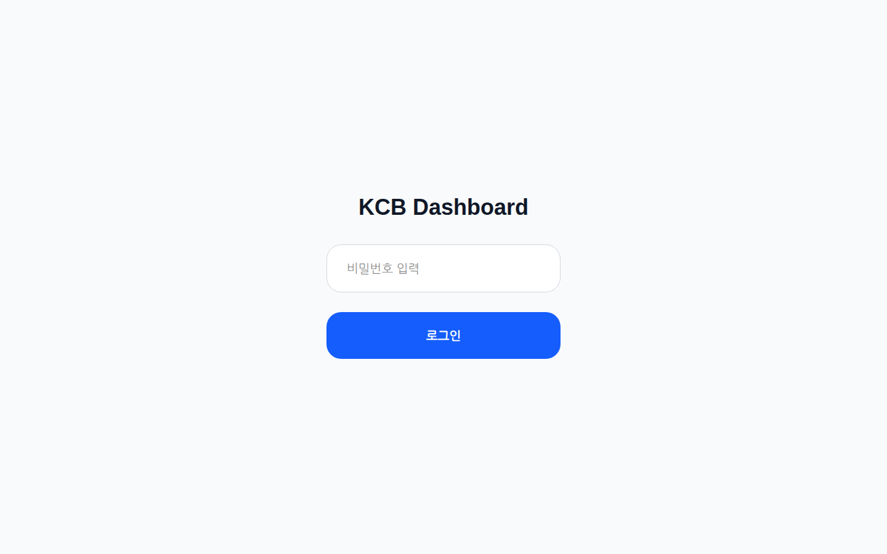
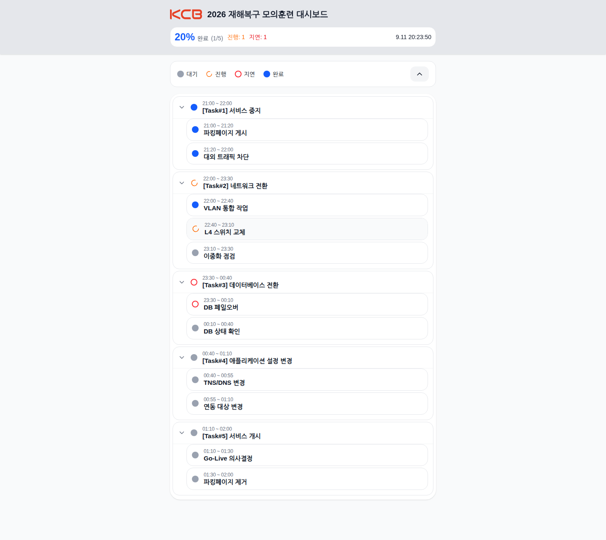
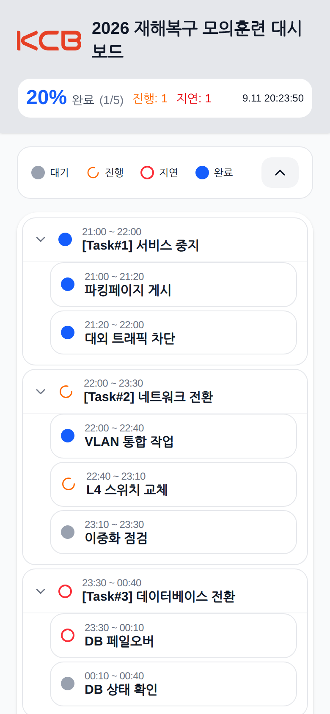
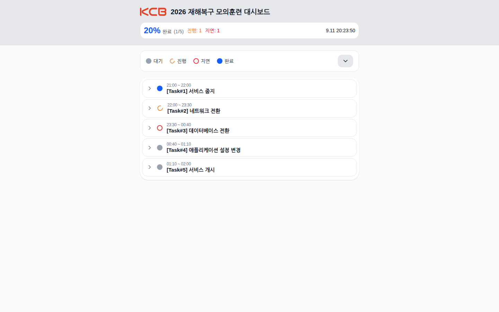
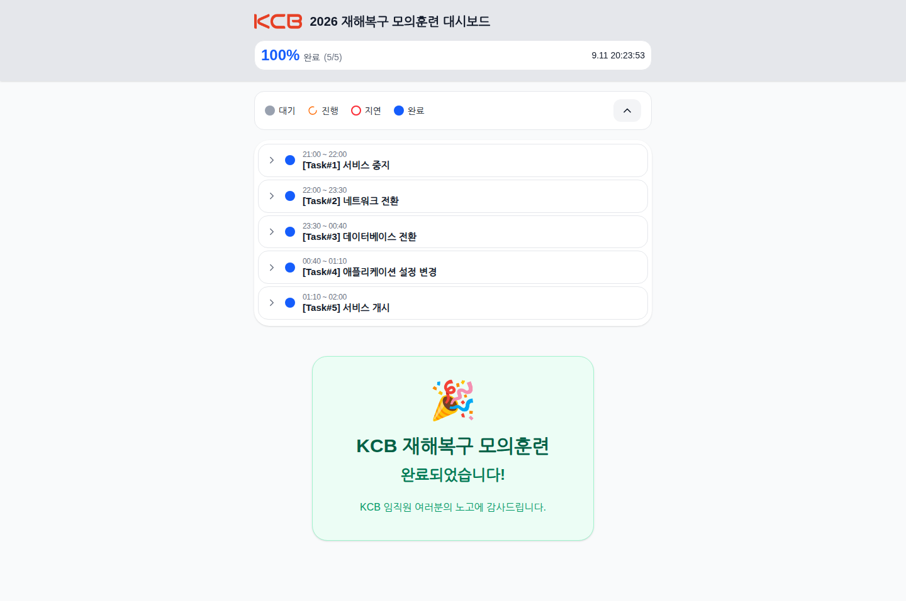
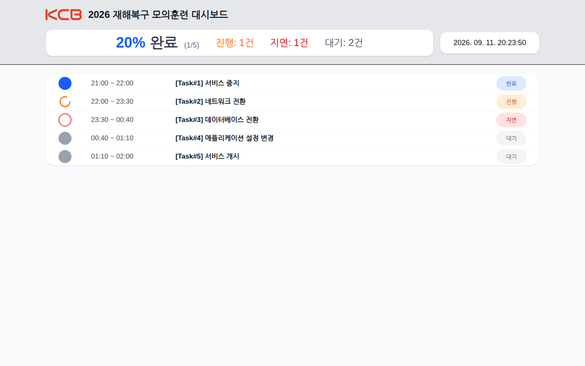

# KCB Cutover Dashboard 사용자 가이드

이 문서는 재해복구(DR) 모의훈련·Cutover 작업 중 상황판을 **보는 사람**(현장 작업자, 모니터링 담당자, 상황실 참여자)을 위한 가이드입니다. 상황판을 띄우고 지키는 사람(통제관·시스템 관리자)은 [관리자 가이드](ADMIN_GUIDE.md)를 보십시오.

- 버전: v1.3.0
- 접속 주소: `http://<서버-주소>:3000` (상황실에서 안내한 주소)
- 권장 브라우저: Chrome, Edge, Safari 최신 버전 (스마트폰·태블릿·PC·대형 모니터 모두 지원)

---

## 1. 이 제품이 하는 일

KCB Cutover Dashboard는 재해복구 모의훈련이나 시스템 전환(Cutover) 작업 중 **각 작업이 지금 어디까지 왔는지**를 한 화면에서 보여 주는 실시간 상황판입니다. 통제관이 관리자 화면에서 작업 상태를 바꾸면, 상황판을 보고 있는 모든 사람의 화면이 몇 초 안에 같은 상태로 바뀝니다. 전화나 메신저로 "지금 어느 단계예요?"를 묻고 답하는 일을 대신합니다.

작업은 `[Task#1] 서비스 중지` 같은 **상위 작업**과 그 아래 **세부 작업**의 두 단계 트리로 정리되고, 각 작업은 `대기`·`진행`·`지연`·`완료` 네 가지 상태 중 하나를 가집니다. 상단에는 상위 작업 기준 완료율(%)과 진행·지연 건수, 현재 시각(한국 표준시)이 항상 고정되어 있습니다.

화면은 두 가지입니다. 스마트폰과 일반 PC에서 보는 **모바일/표준 상황판(`/`)**, 그리고 상황실 대형 모니터용으로 글자를 키운 **PC 전광판(`/pc`)**. 두 화면 모두 보기 전용이며, 상태를 바꾸는 일은 관리자 화면(`/admin`)에서만 합니다.

---

## 2. 처음 5분

로그인해서 현재 진행 상황을 확인하기까지의 길입니다.

### 2.1 접속하고 로그인하기

1. 브라우저에서 상황실이 안내한 주소(예: `http://<서버-주소>:3000`)를 엽니다.
2. **비밀번호 입력**란에 상황실에서 받은 사용자 비밀번호를 넣고 **로그인**을 누릅니다.

비밀번호가 틀리면 `비밀번호가 틀렸습니다.` 알림이 뜹니다. 비밀번호는 통제관에게 확인하십시오(이 문서에는 적혀 있지 않습니다).

한 번 로그인하면 같은 브라우저에서 **7일 동안** 다시 묻지 않습니다. 다른 기기나 시크릿 창에서는 다시 로그인해야 합니다.

### 2.2 현재 상황 읽기

로그인이 끝나면 바로 상황판이 뜹니다.

- **20% 완료 (1/5)**: 상위 작업 5개 중 1개가 완료됐다는 뜻입니다. 세부 작업 수는 여기에 들어가지 않습니다.
- **진행: 1 / 지연: 1**: 지금 진행 중인 상위 작업 수와 지연된 상위 작업 수입니다.
- **9.11 20:14:42**: 한국 표준시 기준 현재 시각. 1초마다 갱신됩니다.
- 트리에서 주황색 회전 아이콘(`진행`)과 빨간 테두리 원(`지연`)을 먼저 찾으면 지금 손이 가 있는 곳과 막힌 곳이 보입니다.

여기까지가 첫 5분입니다. 화면은 자동으로 갱신되므로 새로고침할 필요가 없습니다.

---

## 3. 화면별 사용법

### 3.1 모바일/표준 상황판 (`/`)

스마트폰·태블릿·PC 어디서나 쓰는 기본 화면입니다. 폭이 좁은 기기에서는 같은 내용이 세로로 쌓입니다.

**화면 구성**

| 영역 | 내용 |
|---|---|
| 상단 고정 헤더 | 로고, 상황판 제목, 완료율(%)·완료 건수·진행·지연 건수, 현재 시각. 스크롤해도 항상 보입니다. |
| 범례 줄 | `대기` `진행` `지연` `완료` 아이콘 설명과 오른쪽의 전체 접기/펼치기 버튼(`︿` / `﹀`) |
| 작업 트리 | 상위 작업 카드 안에 세부 작업이 들여쓰기로 들어 있습니다. 각 항목은 예정 시간, 제목, 상태 아이콘을 보여 줍니다. |
| 완료 카드 | 모든 작업이 `완료`가 되면 트리 아래에 자동으로 나타납니다. |

**할 수 있는 일**

- **한 작업만 접기/펼치기**: 상위 작업 카드(또는 왼쪽의 `﹀`/`〉` 화살표)를 누릅니다.
- **전부 접기/펼치기**: 범례 줄 오른쪽 끝 버튼을 누릅니다. 접으면 상위 작업 5개만 남아 한눈에 들어옵니다.

- **훈련 완료 확인**: 모든 작업이 완료되면 헤더의 진행·지연 건수가 사라지고 `100% 완료`, 트리는 자동으로 접히며 아래에 완료 카드가 뜹니다.

**갱신 주기**: 이 화면은 **10초마다** 서버에서 최신 상태를 가져옵니다. 관리자가 바꾼 상태가 최대 10초 뒤에 반영됩니다. 시계는 서버와 무관하게 1초마다 움직입니다.

### 3.2 PC 전광판 (`/pc`)

상황실 대형 모니터·프로젝터용 화면입니다. 주소 끝에 `/pc`를 붙여 엽니다(예: `http://<서버-주소>:3000/pc`). 로그인은 3.1과 같고, 한 번 로그인하면 `/`와 `/pc`를 오가도 다시 묻지 않습니다.

- **상위 작업만** 한 줄씩 보여 줍니다. 세부 작업은 나오지 않으며 접기/펼치기도 없습니다.
- 헤더에 `완료율`, `진행`·`지연`·`대기` 건수, 연·월·일이 포함된 시계(`2026. 09. 11. 20:15:06`)가 큰 글자로 나옵니다.
- 오른쪽 상태 배지 색: 파랑 `완료`, 주황 `진행`, 빨강 `지연`, 회색 `대기`.
- **갱신 주기는 2초**입니다. 상황실 모니터는 이 화면을 띄워 두면 됩니다.

### 3.3 상태 아이콘

| 상태 | 아이콘 | 뜻 |
|---|---|---|
| `대기` | 회색 원 | 아직 시작하지 않은 작업 |
| `진행` | 주황색 회전 아이콘 | 지금 하고 있는 작업 |
| `지연` | 빨간 테두리만 있는 원 | 예정 시간을 넘겼거나 문제가 생긴 작업 |
| `완료` | 파란 원 | 끝난 작업 |

상위 작업의 상태는 통제관이 세부 작업 상태를 바꿀 때 자동으로 따라갑니다(세부 작업 하나가 `진행`이 되면 상위도 `진행`, 세부 작업이 모두 `완료`가 되면 상위도 `완료`). 규칙의 자세한 내용은 [관리자 가이드 4.3](ADMIN_GUIDE.md#43-상태-바꾸기와-연동-규칙)에 있습니다.

---

## 4. 자주 하는 작업

### 지금 어느 작업이 진행 중인지 확인하기
헤더의 `진행: n`을 보고, 트리에서 주황색 회전 아이콘을 찾습니다. 전체 접기 버튼을 누르면 상위 작업 5개만 남아 더 빨리 찾을 수 있습니다.

### 지연된 작업이 있는지 확인하기
헤더의 `지연: n`이 0이 아니면 트리에서 빨간 테두리 원을 찾습니다. 상위 작업이 `지연`이면 그 카드를 펼쳐 어느 세부 작업이 지연인지 봅니다.

### 상황실 모니터에 띄우기
브라우저에서 `/pc`를 열고 로그인한 뒤 전체 화면(F11)으로 둡니다. 2초마다 자동 갱신되므로 손댈 일이 없습니다. 브라우저 절전이나 화면 보호기가 켜지지 않게 PC 설정을 확인하십시오.

### 다른 기기에서 보기
같은 주소를 열고 같은 사용자 비밀번호로 로그인합니다. 기기마다 한 번씩 로그인이 필요합니다.

### 작업 상태를 바꾸고 싶을 때
이 화면에서는 바꿀 수 없습니다. 통제관(관리자)에게 요청하십시오. 관리자는 [관리자 가이드 4장](ADMIN_GUIDE.md#4-계정과-권한)의 방법으로 바꿉니다.

---

## 5. 막혔을 때

| 보이는 것 | 뜻 | 할 일 |
|---|---|---|
| `비밀번호가 틀렸습니다.` 알림 | 사용자 비밀번호가 다릅니다. | 통제관에게 현재 비밀번호를 확인합니다. 관리자 비밀번호는 이 화면에서 쓸 수 없습니다. |
| 로그인 후에도 `비밀번호 입력` 화면이 다시 뜸 | 브라우저가 쿠키를 저장하지 못했습니다(시크릿 창, 쿠키 차단). | 일반 창에서 열거나 이 사이트의 쿠키를 허용합니다. |
| `데이터 로딩 중 오류가 발생했습니다.` | 서버에서 상황판 데이터를 읽지 못했습니다. | 잠시 뒤 새로고침합니다. 계속되면 **관리자에게 알립니다**([관리자 가이드 6장](ADMIN_GUIDE.md#6-장애-대응)). |
| 작업이 하나도 없는 빈 상황판 | 관리자가 아직 작업 목록을 올리지 않았습니다. | 관리자에게 `activity.json` 업로드를 요청합니다. |
| 화면이 갱신되지 않는 것 같음 | 네트워크가 끊겼거나 서버가 멈췄습니다. | 헤더의 시계가 움직이면 브라우저는 정상입니다. 새로고침해도 같으면 관리자에게 알립니다. `/`는 10초, `/pc`는 2초 간격으로 갱신되므로 그 정도 지연은 정상입니다. |
| 완료율이 세부 작업과 맞지 않음 | 완료율은 **상위 작업** 기준입니다. | 정상 동작입니다. 세부 작업이 다 끝나야 상위 작업이 완료로 바뀝니다. |

---

## 6. 용어

| 용어 | 뜻 |
|---|---|
| 상황판 / 대시보드 | 이 화면 전체. 관리자가 붙인 제목(예: `2026 재해복구 모의훈련 대시보드`)이 헤더에 나옵니다. |
| 액티비티 | 트리의 항목 하나. 상위 작업(Task)과 세부 작업 모두 액티비티입니다. |
| 상위 작업 / 루트 | 트리 맨 바깥 카드. 완료율과 진행·지연 건수는 이 단위로 셉니다. |
| 세부 작업 / 하위 | 상위 작업 카드 안에 들여쓰기된 항목. |
| Cutover | 기존 시스템에서 새 시스템(또는 DR 시스템)으로 서비스를 전환하는 작업. |
| 전광판 | `/pc` 화면. 상황실 대형 모니터용. |
