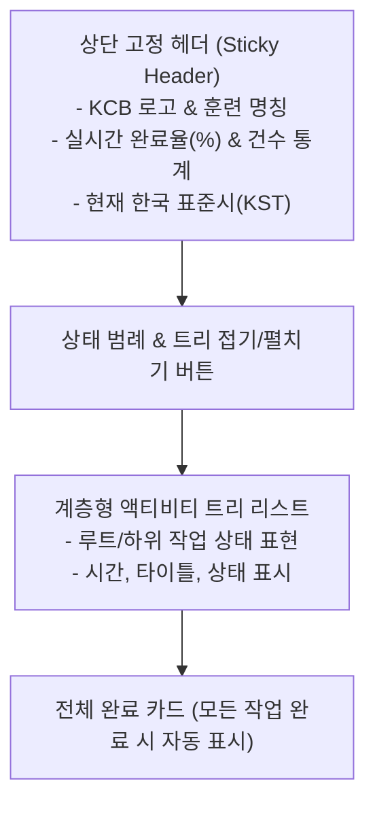

# 📖 KCB Cutover Dashboard - 사용자 가이드 (User Guide)

본 가이드는 KCB 재해복구(DR) 모의훈련 및 Cutover 작업에 참여하는 **일반 사용자, 현장 작업자 및 모니터링 담당자**를 위한 가이드 문서입니다.

---

## 📑 목차
1. [시스템 소개 및 접속 안내](#1-시스템-소개-및-접속-안내)
2. [사용자 로그인](#2-사용자-로그인)
3. [화면 구성 및 모드 안내](#3-화면-구성-및-모드-안내)
   - [모바일/표준 모니터링 뷰 (`/`)](#31-모바일표준-모니터링-뷰-)
   - [관제상황실 전광판 뷰 (`/pc`)](#32-관제상황실-전광판-뷰-pc)
4. [작업 상태 및 상태별 인디케이터](#4-작업-상태-및-상태별-인디케이터)
5. [실시간 동기화 및 인터랙션](#5-실시간-동기화-및-인터랙션)
6. [자주 묻는 질문 (FAQ)](#6-자주-묻는-질문-faq)

---

## 1. 시스템 소개 및 접속 안내

KCB Cutover Dashboard는 재해복구 모의훈련 중 각 시스템별/단계별 전환 작업의 진행 상황을 실시간으로 확인하고 공유할 수 있도록 제작된 웹 모니터링 시스템입니다.

- **접속 URL**: `http://<서버-IP>:3000` (상황실 및 안내된 주소)
- **권장 브라우저**: Google Chrome, Microsoft Edge, Safari (최신 버전)
- **지원 디바이스**: 스마트폰(iOS/Android), 태블릿, PC, 종합 관제 모니터

---

## 2. 사용자 로그인

보안을 위해 대시보드 접속 시 로그인 화면이 출력됩니다.

 *(참고용 브랜드 로고)*

> [!NOTE]  
> **일반 사용자 비밀번호**: `1234` (운영 환경에 따라 변경될 수 있음)

1. 브라우저에서 대시보드 주소 접속
2. 비밀번호 입력란에 지정된 **사용자 비밀번호** 입력
3. `로그인` 버튼 클릭
4. 로그인 성공 시 인증 쿠키(`cutover_user`)가 7일간 유지되며, 이후 재접속 시 자동으로 대시보드로 이동합니다.

---

## 3. 화면 구성 및 모드 안내

### 3.1 모바일/표준 모니터링 뷰 (`/`)

모바일 단말기 및 현장 작업자의 휴대용 디바이스에 최적화된 컴팩트한 계층형 뷰입니다.

- **상단 고정 영역**: 스크롤을 내리더라도 실시간 진행률(%), 진행/지연/완료 건수, 시계가 항상 화면 상단에 고정 표시됩니다.
- **트리 펼침/접힘 (`▲ / ▼`)**: 오른쪽 상단 화살표 버튼을 통해 모든 계층 구조를 한꺼번에 접거나 펼칠 수 있습니다.

---

### 3.2 관제상황실 전광판 뷰 (`/pc`)

종합상황실(War-room) 대형 모니터 및 프로젝터에 최적화된 시인성이 높은 대형 뷰입니다.

- **접속 경로**: `http://<서버-IP>:3000/pc`
- **특징**:
  - 대형 텍스트 및 고대비 색상으로 멀리서도 한눈에 확인 가능
  - 초단위 실시간 시계 탑재
  - 2초 간격 SWR 자동 동기화로 브라우저 수동 새로고침 불필요

---

## 4. 작업 상태 및 상태별 인디케이터

모든 Cutover 액티비티는 아래의 4가지 상태로 명확히 구분되어 직관적으로 표시됩니다.

| 상태 | 표시 아이콘/색상 | 의미 및 설명 |
| :--- | :--- | :--- |
| **대기** | ⚪ 회색 원형 (`bg-gray-400`) | 아직 시작되지 않은 예비/후속 작업 |
| **진행** | 🟠 주황색 애니메이션 스피너 (`Loader2 animate-spin`) | 현재 작업이 활발히 진행 중인 상태 |
| **지연** | 🔴 빨간색 테두리 원형 (`border-red-500`) | 예정 시간을 초과하거나 장애 발생으로 지연 중인 작업 |
| **완료** | 🔵 파란색 원형 (`bg-blue-600`) | 정상적으로 검증 완료된 작업 |

> [!IMPORTANT]  
> **상태 캐스케이딩 법칙**:
> - 하위 작업이 하나라도 `진행` 상태가 되면, 상위(부모) 작업도 자동으로 `진행`으로 변경됩니다.
> - 하위 작업이 모두 `완료`되어야만 상위 작업이 `완료` 상태로 자동 업데이트됩니다.

---

## 5. 실시간 동기화 및 인터랙션

1. **자동 갱신 (Auto-refresh)**:
   - 별도의 `F5` 새로고침 버튼을 누르지 않아도 관리자가 상태를 변경하면 2초 이내에 모니터링 화면에 즉시 반영됩니다.
2. **훈련 완료 알림**:
   - 모든 루트 액티비티가 `완료` 상태가 되면, 화면 하단에 🎉 **훈련 완료 축하 카드**가 자동으로 표시됩니다.

---

## 6. 자주 묻는 질문 (FAQ)

> [!TIP]  
> **Q1. 화면이 갱신되지 않는 것 같아요.**  
> 네트워크 연결 상태를 확인해주십시오. 연결이 정상이라면 대시보드가 2초 간격으로 서버와 통신하여 자동으로 데이터를 최신 상태로 유지합니다.

> [!TIP]  
> **Q2. 비밀번호를 잊어버렸습니다.**  
> 훈련 통제관 또는 관리자 담당자에게 문의하여 `NEXT_PUBLIC_USER_PASSWORD` 정보를 확인하십시오.

> [!TIP]  
> **Q3. 모바일 화면에서 트리가 너무 길어서 보기 불편합니다.**  
> 상단 범례 우측의 **접기 버튼(`▲`)**을 누르면 최상위 항목만 요약되어 깔끔하게 확인하실 수 있습니다.
