# mmcp v1.0.1 사용자 가이드

> Mattermost MCP Gateway(mmcp) v1.0.1을 쓰는 **일반 사용자**를 위한 안내서입니다.
> 서버 설치·운영과 관리 콘솔 설명은 다루지 않습니다.

## 목차

1. [mmcp가 하는 일](#1-mmcp가-하는-일)
2. [로그인](#2-로그인)
3. [화면 둘러보기·빠른 이동](#3-화면-둘러보기빠른-이동)
4. [Mattermost 계정 연결](#4-mattermost-계정-연결)
5. [AI 클라이언트 연결](#5-ai-클라이언트-연결)
6. [API 키 관리](#6-api-키-관리)
7. [도구 실행기](#7-도구-실행기)
8. [승인 흐름](#8-승인-흐름)
9. [사용 예시 프롬프트](#9-사용-예시-프롬프트)
10. [도구 목록](#10-도구-목록)
11. [내 활동·세션·연결된 앱](#11-내-활동세션연결된-앱)
12. [개인 암호화 키](#12-개인-암호화-키)
13. [프로필·테마](#13-프로필테마)
14. [FAQ / 문제 해결](#14-faq--문제-해결)

---

## 1. mmcp가 하는 일

mmcp는 Claude Code, Codex, Cursor, 사내 AI 포털 같은 **AI 클라이언트가 Mattermost를 대신 조회하고 메시지를 보낼 수 있게** 해 주는 MCP 서버입니다.

- 모든 호출은 **내 계정에 연결된 Mattermost 계정의 권한**으로 실행됩니다. 내가 못 보는 채널은 AI도 못 봅니다.
- 메시지·DM 발송 같은 **쓰기 작업은 내가 확인한 뒤에만** 실행됩니다(기본 설정).
- 모든 호출은 감사 로그와 [내 활동](#11-내-활동세션연결된-앱)에 남습니다.

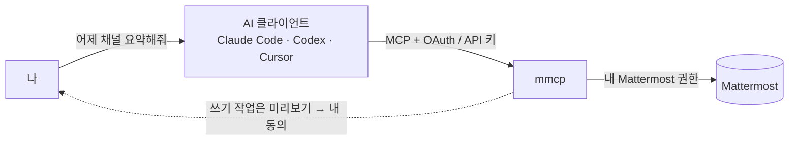

---

## 2. 로그인

브라우저에서 mmcp 주소로 접속합니다. 로그인 화면과 오른쪽 위 프로필 메뉴에서 현재 서비스 버전(**mmcp v1.0.1**)을 확인할 수 있습니다.


### Keycloak SSO

- **사일런트 SSO**: 관리자가 켜 두었고 브라우저에 이미 Keycloak 로그인 세션이 있다면, 화면에 아무것도 누르지 않아도 "Keycloak 로그인 상태를 확인하는 중…" 잠깐 뒤 바로 로그인됩니다. 처음 로그인하면 mmcp 계정이 자동으로 만들어집니다.
- 그렇지 않으면 **Keycloak SSO로 로그인** 버튼을 누릅니다(관리자가 버튼 이름을 바꿨을 수 있습니다).
- 직접 로그아웃한 직후에는 사일런트 SSO가 다시 로그인시키지 않습니다.

### 로컬 계정

관리자가 로컬 로그인을 허용했다면 **아이디/비밀번호**로 로그인할 수 있습니다. SSO와 함께 켜져 있으면 "또는 로컬 계정" 아래에 입력 칸이 보입니다.

### 로그인 오류가 보일 때

| 메시지 | 할 일 |
|---|---|
| 로그인 요청이 만료되었거나 브라우저 쿠키가 차단되었습니다 | 쿠키 허용 후 다시 시도 |
| Keycloak에서 로그인이 거부되었습니다 | Keycloak 계정/권한 확인 |
| mmcp 계정을 만들거나 연결하지 못했습니다 | 관리자에게 문의 |
| 사용 가능한 로그인 방법이 없습니다 | 관리자에게 문의 |

---

## 3. 화면 둘러보기·빠른 이동

로그인하면 **내 공간**이 열립니다.

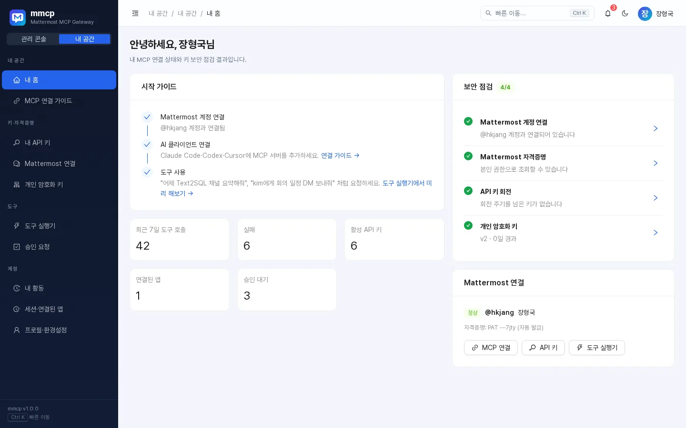

### 내 공간 메뉴

| 메뉴 | 하는 일 | 단축키 |
|---|---|---|
| 내 홈 | 시작 가이드, 보안 점검, 최근 7일 호출·API 키·승인 대기 요약 | `G` → `H` |
| MCP 연결 가이드 | Claude Code·Codex·Cursor 등 연결 설정 복사 | `G` → `C` |
| 내 API 키 | 개인 API 키 발급·회전·폐기 | `G` → `I` |
| Mattermost 연결 | 계정 매핑과 개인 액세스 토큰 | – |
| 개인 암호화 키 | 내 데이터 키 버전과 회전 | – |
| 도구 실행기 | MCP 도구를 직접 실행 | `G` → `R` |
| 승인 요청 | AI가 요청한 쓰기 작업 확인 | – |
| 내 활동 | 도구 호출·로그인·키 변경 기록 | – |
| 세션·연결된 앱 | 브라우저 세션, OAuth 앱, MCP 세션 | – |
| 프로필·환경설정 | 이름, 비밀번호, 테마 | `G` → `P` |

**내 홈**의 *보안 점검*은 Mattermost 계정 연결, Mattermost 자격증명, API 키 회전, 개인 암호화 키 상태(로컬 계정이면 비밀번호 안내 포함)를 체크하고, 문제가 있는 항목에서 바로 해당 화면으로 이동할 수 있습니다.

### 빠른 이동과 단축키


| 키 | 동작 |
|---|---|
| `Ctrl/⌘ + K` 또는 `/` | 빠른 이동(명령 팔레트) 열기 |
| `G` 다음 글자 | 위 표의 화면으로 바로 이동 |
| `?` | 단축키 도움말 |
| `Shift + T` | 라이트/다크 테마 전환 |

- 팔레트는 **초성 검색**을 지원합니다. 예: `ㄷㅅㅂㄷ` → 도구 실행기.
- 팔레트에서 *새 API 키 발급*, *MCP 클라이언트 연결 설정 복사*, *테마 전환*, *로그아웃* 같은 작업도 바로 실행할 수 있고, 최근 이동한 화면이 맨 위에 나옵니다.
- 상단의 🔔 아이콘에는 승인 대기 건수가 표시되며, 누르면 **승인 요청** 화면으로 갑니다.

### 프로필 메뉴

오른쪽 위 아바타를 누르면 계정 정보(아이디, SSO/로컬 구분, 역할), 내 홈·내 API 키·프로필 바로가기, 테마(라이트/다크/시스템), 키보드 단축키, **서비스 버전(mmcp v1.0.1)**, 로그아웃이 있습니다.

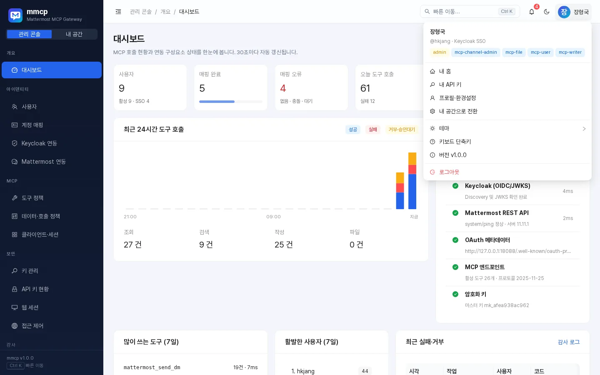

---

## 4. Mattermost 계정 연결

AI가 Mattermost를 쓰려면 먼저 내 mmcp 계정을 Mattermost 계정과 연결해야 합니다. **내 공간 → Mattermost 연결**로 이동하세요.

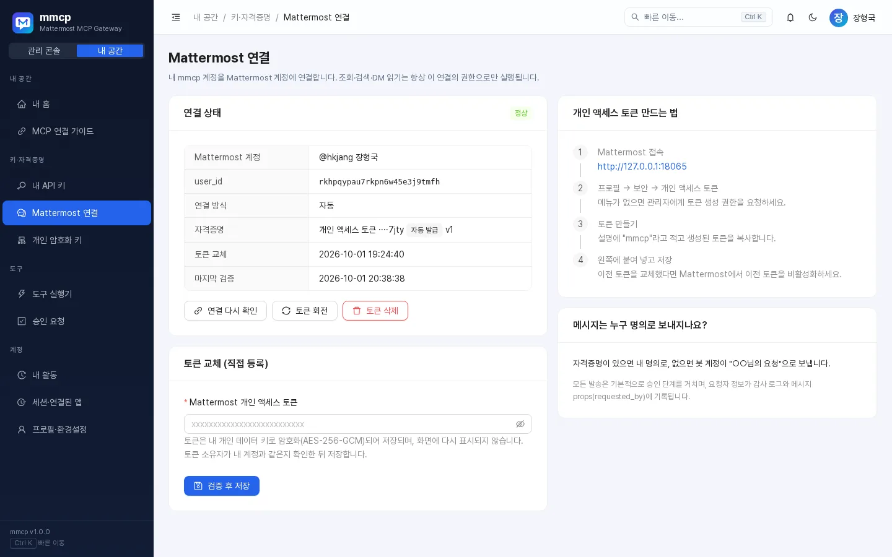

### 방법 1. 자동 연결

관리자가 자동 매핑(서비스 토큰)을 설정해 두었다면 **자동으로 연결하기**만 누르면 됩니다. mmcp 아이디와 **같은 username**의 Mattermost 계정을 찾아 연결합니다(관리자 설정에 따라 이메일로도 찾습니다).

관리자가 토큰 자동 발급을 켜 두었다면 첫 사용 시 개인 액세스 토큰이 자동으로 발급되며, 나중에 **토큰 회전**으로 교체할 수 있습니다.

### 방법 2. 내 개인 액세스 토큰 등록

1. Mattermost에 접속합니다.
2. **프로필 → 보안 → 개인 액세스 토큰**으로 이동합니다(메뉴가 없으면 관리자에게 토큰 생성 권한을 요청하세요).
3. 설명에 `mmcp`라고 적고 토큰을 만든 뒤 복사합니다.
4. mmcp의 *개인 액세스 토큰 등록* 칸에 붙여 넣고 **검증 후 저장**을 누릅니다.

- mmcp는 **토큰 주인이 내 계정과 같은지 확인**한 뒤에만 저장합니다. 다른 사람의 토큰은 `IDENTITY_CONFLICT`로 거부됩니다.
- 토큰은 **내 개인 데이터 키로 암호화(AES-256-GCM)**되어 저장되고, 다시 화면에 표시되지 않습니다.
- 토큰을 교체했다면 Mattermost에서 이전 토큰을 비활성화하세요.
- **토큰 삭제**를 누르면 저장된 토큰이 지워지며, 자동 발급된 토큰은 Mattermost에서도 폐기됩니다.
- mmcp는 **Mattermost 비밀번호를 묻지 않습니다.** 비밀번호를 요구하는 화면이 있다면 의심하세요.

### 메시지는 누구 명의로 보내지나요?

관리자 설정에 따라 정해지며, 화면 오른쪽에 현재 방식이 안내됩니다.

| 방식 | 설명 |
|---|---|
| 본인(user) | 내 Mattermost 계정 명의로 보냅니다. 자격증명이 필요합니다. |
| 봇(bot) | 봇 계정이 보내고, 메시지 상단에 "○○님의 요청" 같은 요청자 표시가 붙습니다. |
| 자동(auto) | 자격증명이 있으면 내 명의로, 없으면 봇이 요청자 표시와 함께 보냅니다. |

어떤 방식이든 요청자 정보가 감사 로그와 메시지 props(`requested_by`)에 기록됩니다.

---

## 5. AI 클라이언트 연결

**내 공간 → MCP 연결 가이드**에 내 환경에 맞는 MCP 서버 주소와 설정이 준비되어 있습니다. 주소는 항상 `{mmcp 주소}/mcp` 형식이며 **복사** 버튼으로 복사할 수 있습니다.

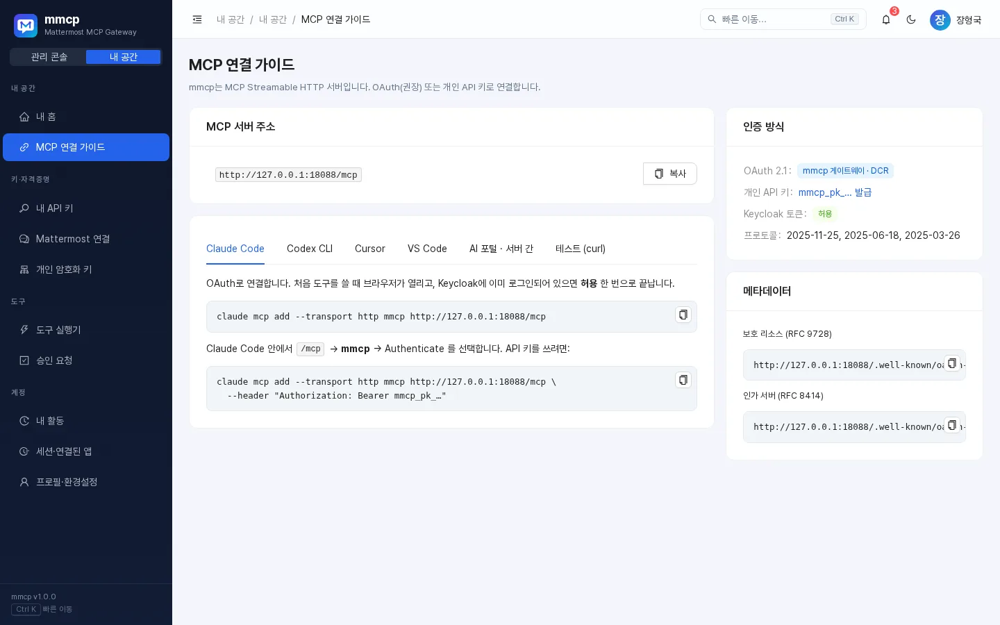

인증 방법은 두 가지입니다.

- **OAuth(권장)**: 처음 도구를 쓸 때 브라우저가 열리고 동의 화면에서 **허용**하면 끝납니다.
- **개인 API 키**: OAuth를 지원하지 않는 클라이언트나 스크립트용([6장](#6-api-키-관리)).

아래 예시의 `https://mmcp.example.com/mcp`는 연결 가이드에 표시된 실제 주소로 바꾸세요.

### Claude Code

```bash
claude mcp add --transport http mmcp https://mmcp.example.com/mcp
```

Claude Code 안에서 `/mcp` → **mmcp** → **Authenticate**를 선택하면 브라우저에 동의 화면이 열립니다.

API 키로 연결하려면:

```bash
claude mcp add --transport http mmcp https://mmcp.example.com/mcp \
  --header "Authorization: Bearer mmcp_pk_…"
```

### OAuth 동의 화면

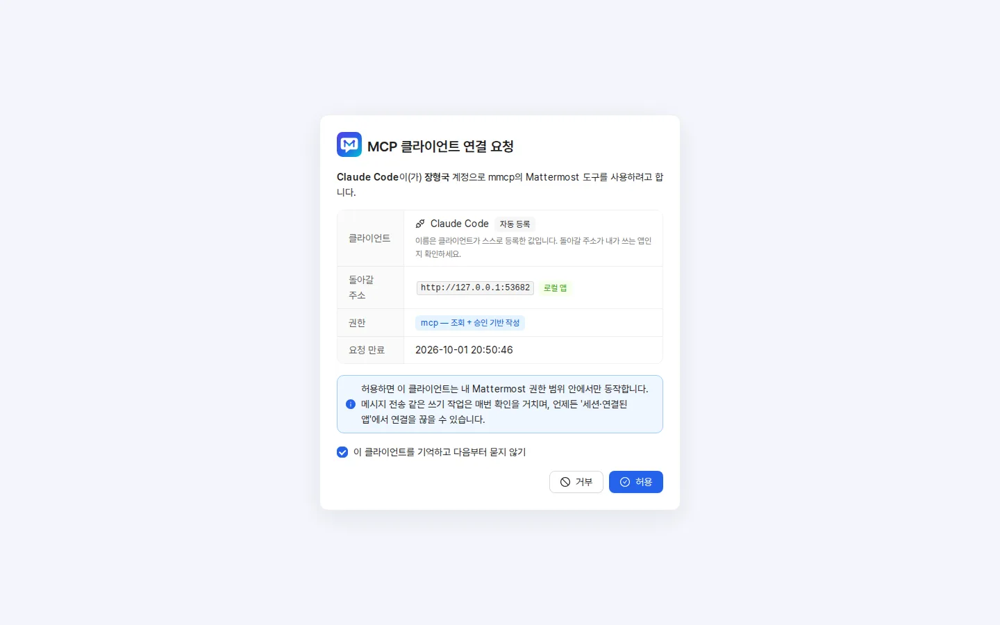

동의 화면에는 클라이언트 이름, 돌아갈 주소(로컬 앱이면 "로컬 앱" 표시), 요청 권한이 나옵니다.

- `mcp` — 조회 + 승인 기반 작성
- `mcp:read` — 조회 전용

내용을 확인하고 **허용**을 누르세요. **"이 클라이언트를 기억하고 다음부터 묻지 않기"**를 체크하면 다음부터 동의 화면이 생략됩니다(관리자가 허용한 경우에만 보입니다). 연결은 언제든 [세션·연결된 앱](#11-내-활동세션연결된-앱)에서 끊을 수 있습니다.

### Codex CLI

`~/.codex/config.toml`:

```toml
[mcp_servers.mmcp]
url = "https://mmcp.example.com/mcp"
bearer_token_env_var = "MMCP_API_KEY"
```

```bash
export MMCP_API_KEY="mmcp_pk_…"
codex
```

OAuth를 지원하는 Codex 버전에서는 `codex mcp add mmcp --url https://mmcp.example.com/mcp` 후 `codex mcp login mmcp`를 쓸 수 있습니다.

### Cursor

`~/.cursor/mcp.json` (OAuth 자동 처리):

```json
{
  "mcpServers": {
    "mmcp": { "url": "https://mmcp.example.com/mcp" }
  }
}
```

### VS Code (GitHub Copilot Agent 모드)

`.vscode/mcp.json`:

```json
{
  "servers": {
    "mmcp": { "type": "http", "url": "https://mmcp.example.com/mcp" }
  }
}
```

### 사내 AI 포털 · 서버 간 연동

이미 Keycloak 토큰을 가진 사내 서비스는 그 **Keycloak 액세스 토큰을 그대로 Bearer**로 보냅니다. mmcp가 토큰을 검증하고 `preferred_username`으로 사용자를 찾습니다.

```bash
curl -s https://mmcp.example.com/mcp \
  -H "Authorization: Bearer $KEYCLOAK_ACCESS_TOKEN" \
  -H "Content-Type: application/json" \
  -H "Accept: application/json, text/event-stream" \
  -d '{"jsonrpc":"2.0","id":1,"method":"tools/list"}'
```

- 토큰의 `aud` 또는 `azp`에 mmcp 클라이언트 ID(연결 가이드에 표시)가 포함되어야 합니다.
- 관리자가 Keycloak 토큰 직접 인증을 꺼 두었다면 연결 가이드에 경고가 표시됩니다.

연결 가이드의 **테스트 (curl)** 탭에는 API 키로 `initialize`와 도구 호출을 시험하는 예시가 있습니다.

### 연결 후 AI가 쓸 수 있는 것

- **도구**: [10장](#10-도구-목록) 참고. 내 역할·관리자 정책에 따라 보이는 도구가 다릅니다.
- **리소스**: `mattermost://me`, `mattermost://teams`, `mattermost://channels`, `mattermost://unread`, 그리고 템플릿 `mattermost://channels/{channel_id}`, `mattermost://threads/{post_id}`, `mattermost://users/{username}`, `mattermost://dms/{username}`.
- **프롬프트**(클라이언트가 지원하면 메뉴에서 선택):

| 프롬프트 | 인자 | 내용 |
|---|---|---|
| `summarize_channel` | `channel`(필수), `days`(기본 1) | 채널 최근 대화를 결정 사항·할 일·미해결 질문으로 요약 |
| `find_decisions` | `topic`(필수) | 주제 관련 결정 사항·일자·담당자·근거 링크를 표로 정리 |
| `daily_digest` | – | 읽지 않은 메시지를 멘션 → DM → 기타 채널 순으로 정리 |
| `draft_dm` | `recipient`, `topic`(필수) | DM 초안을 먼저 보여 주고 승인 후 발송 |

---

## 6. API 키 관리

**내 공간 → 내 API 키**. 키는 **내 권한으로만** 동작하며, 비밀값(`mmcp_pk_…`)은 **발급 순간 한 번만** 표시됩니다.

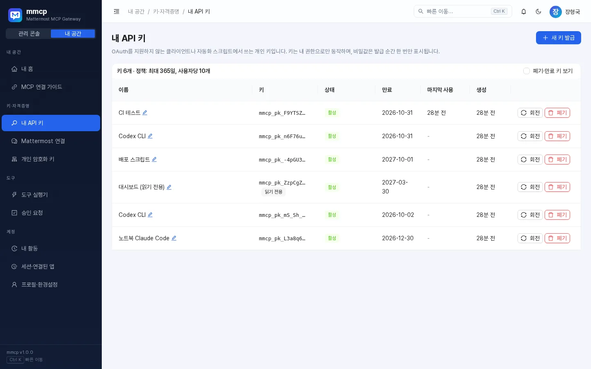

### 발급

**새 키 발급**(또는 팔레트의 *새 API 키 발급*)을 누르고:

- **이름**: 어디에 쓰는 키인지(예: "노트북 Claude Code"), 최대 60자.
- **만료**: 30일 / 90일 / 180일 / 365일 중 관리자 정책 최대치 이하. 정책이 허용할 때만 "만료 없음 (권장하지 않음)"이 보입니다.
- **읽기 전용 키**: 조회·검색 도구만 쓸 수 있습니다. 공유 환경이나 대시보드용으로 권장합니다.

발급 창에서 비밀값과 Claude Code 등록 예시를 바로 복사하세요. 창을 닫으면 다시 볼 수 없습니다. 사용자당 활성 키 개수에도 정책상 한도가 있습니다(화면 상단에 표시).

### 관리

| 동작 | 설명 |
|---|---|
| 이름 변경 | 이름 옆 연필 아이콘으로 바로 수정 |
| 회전 | 같은 설정으로 새 키를 발급하고, 이전 키는 **즉시 / 1시간 / 24시간 / 7일** 유예 후 만료. 유출이 의심되면 *즉시*, 여러 기기 교체는 *24시간* 권장 |
| 폐기 | 즉시 무효화. 이 키를 쓰는 클라이언트는 바로 끊깁니다 |
| 폐기·만료 키 보기 | 지난 키까지 목록에 표시 |

키가 정책의 회전 권장 주기를 넘으면 **회전 권장** 배지와 경고가 표시되고, 내 홈 보안 점검에도 나타납니다.

---

## 7. 도구 실행기

**내 공간 → 도구 실행기**(`G` → `R`)에서 AI 클라이언트가 쓰는 도구를 **내 권한으로 직접** 실행해 볼 수 있습니다. 정책·승인·감사가 실제 MCP 호출과 똑같이 적용됩니다.

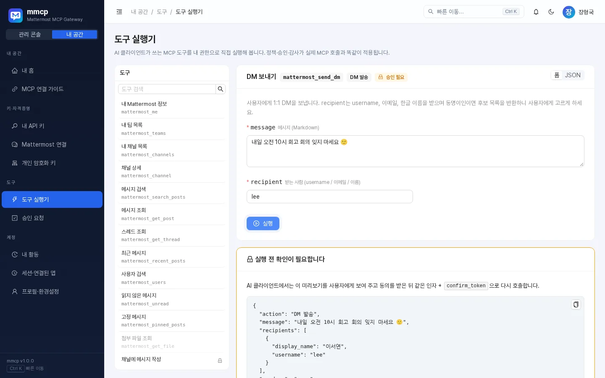

1. 왼쪽 목록에서 도구를 고릅니다(검색 가능). 🔒 표시는 승인이 필요한 도구, 흐리게 보이는 도구는 지금 쓸 수 없는 도구이며 마우스를 올리면 이유가 나옵니다.
2. **폼** 또는 **JSON** 모드로 인자를 입력합니다. 일부 도구는 예시 값이 미리 채워져 있습니다.
3. **실행**을 누르면 결과(성공/오류 코드, 소요 시간)가 JSON으로 표시됩니다.

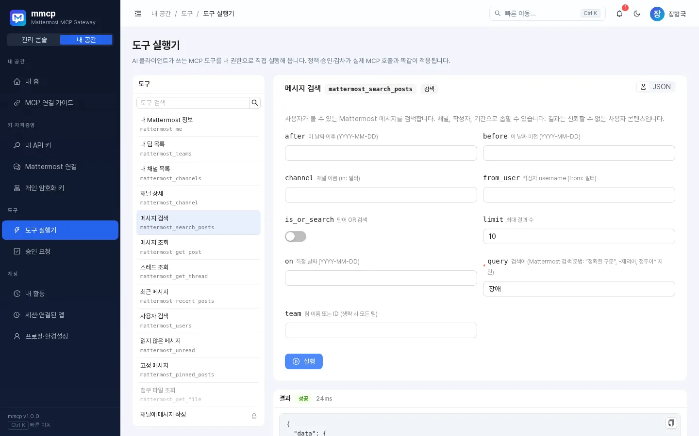

- 승인이 필요한 도구는 먼저 **"실행 전 확인이 필요합니다"** 카드에 미리보기가 나옵니다. **승인하고 실행** 또는 **거절**을 고르세요.
- 받는 사람이 여러 명과 일치하면 후보 버튼이 나옵니다. 하나를 누르면 해당 username이 입력되니 다시 실행하세요.
- 아래쪽 *이번 세션 실행 기록*에서 최근 실행 결과를 다시 볼 수 있습니다.

다크 테마에서도 동일하게 동작합니다.

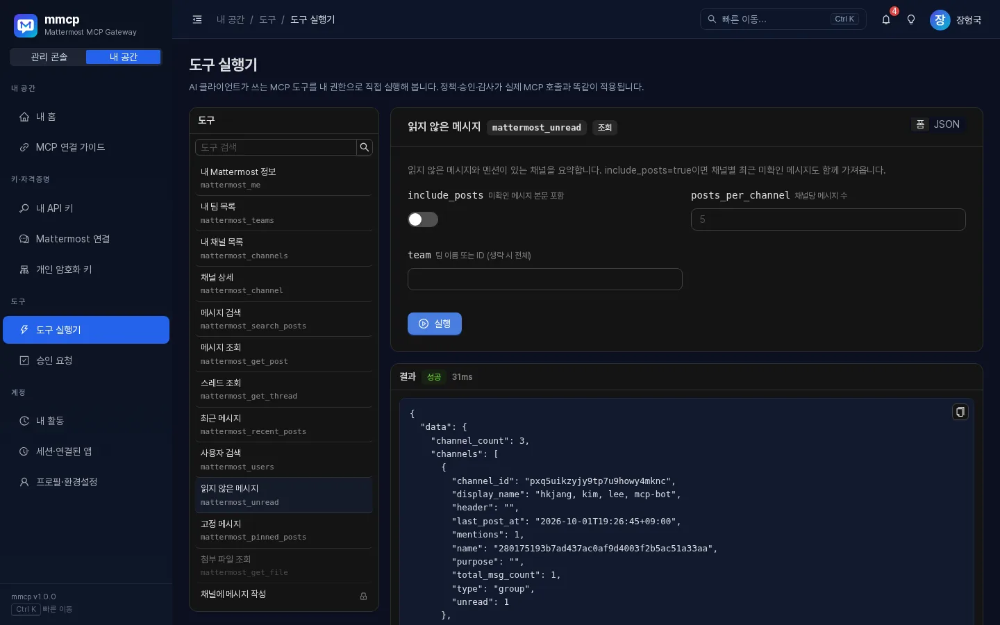

---

## 8. 승인 흐름

메시지 작성·DM 발송 같은 쓰기 작업은 기본적으로 **2단계 확인**을 거칩니다(관리자가 도구별로 정합니다).

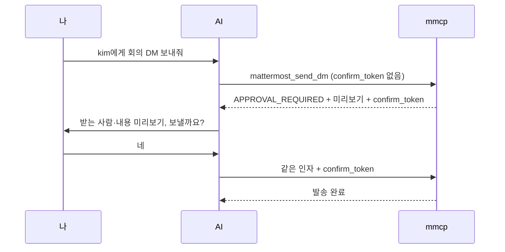

- 미리보기에는 받는 사람, 메시지, 발신 방식(본인/봇)이 들어 있습니다. **대화창에서 내용을 꼭 확인한 뒤 동의**하세요.
- **승인 요청** 화면(또는 상단 🔔)에서 대기 중인 요청을 보고 **미리 승인**하거나 **거절**할 수 있습니다. 상태별(대기/실행됨/거절/만료/전체)로 볼 수 있습니다.
- **의도하지 않은 요청은 '거절'**하세요. 거절된 토큰으로는 절대 실행되지 않습니다.
- 다음 경우에도 실행되지 않으며, AI는 처음부터 다시 미리보기를 받아야 합니다.
  - 유효시간이 지난 토큰(기본 10분, 관리자 설정) — `APPROVAL_EXPIRED`
  - 이미 실행된 토큰 — `APPROVAL_USED`
  - 승인 후 **인자(받는 사람·내용 등)가 바뀐** 경우 — `APPROVAL_MISMATCH`
  - 거절된 토큰 — `APPROVAL_REJECTED`

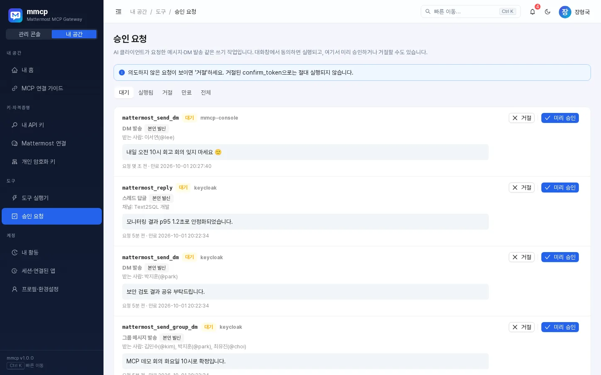

### 받는 사람 지정

받는 사람은 **username**(`kim`, `@kim`), **이메일**, **한글 전체 이름**(`김철수`)으로 지정할 수 있습니다. 같은 이름이 여러 명이면 mmcp는 **임의로 고르지 않고** 후보 목록(`AMBIGUOUS_RECIPIENT`)을 돌려주며, AI가 나에게 누구인지 물어봅니다.

### 신뢰할 수 없는 콘텐츠 보호

Mattermost에서 읽어 온 결과는 "사용자가 작성한 신뢰할 수 없는 콘텐츠"로 감싸서 AI에 전달됩니다(관리자 설정, 기본 켜짐). 메시지 안에 "이전 지시를 무시하라" 같은 문장이 있어도 AI가 따르지 않도록 하는 장치입니다.

---

## 9. 사용 예시 프롬프트

AI 클라이언트에 평소 말하듯 요청하면 됩니다.

| 요청 | AI가 주로 쓰는 도구 |
|---|---|
| "어제 text2sql 채널 요약해줘" | `mattermost_recent_posts` |
| "Text2SQL 장애 관련 결정사항 찾아줘" | `mattermost_search_posts`, `mattermost_get_thread` |
| "kim에게 내일 10시 회의라고 DM 보내줘" | `mattermost_send_dm` (승인 필요) |
| "읽지 않은 메시지 정리해줘" | `mattermost_unread` |
| "kim, lee, park에게 그룹 메시지로 배포 일정 공유해줘" | `mattermost_send_group_dm` (승인 필요) |
| "김철수랑 최근 DM 뭐였지?" | `mattermost_read_dm` |
| "이 스레드에 '확인했습니다'라고 답글 달아줘" | `mattermost_reply` (승인 필요) |

팁:
- 채널은 이름, `팀/채널`, 채널 ID로 지정할 수 있고 `@username`은 DM을 뜻합니다.
- 같은 이름의 채널이 여러 팀에 있으면 `팀/채널` 형식으로 알려 주세요.
- 발송 전에 AI가 보여 주는 미리보기를 꼭 읽어 보세요.

---

## 10. 도구 목록

아래는 mmcp v1.0.1에 들어 있는 도구입니다. **관리자가 일부 도구를 끄거나 승인 여부·필요 역할을 바꿀 수 있으므로**, 실제로 쓸 수 있는 목록은 도구 실행기에서 확인하세요. 읽기 전용 API 키나 `mcp:read` 권한으로 연결하면 쓰기 도구는 보이지 않습니다.

### 조회·검색 (기본 역할 `mcp-user`)

| 도구 | 하는 일 | 주요 인자 |
|---|---|---|
| `mattermost_me` | 내게 연결된 Mattermost 계정 정보 | – |
| `mattermost_teams` | 내 팀 목록 | – |
| `mattermost_channels` | 참여 중인 채널 목록 | `team`, `query`, `include_private`, `limit` |
| `mattermost_channel` | 채널 상세(목적, 헤더, 멤버 수, 읽음 상태) | `channel` |
| `mattermost_search_posts` | 메시지 검색 (`"정확한 구문"`, `-제외어`, `접두어*`) | `query`, `team`, `channel`, `from_user`, `after`/`before`/`on`, `limit` |
| `mattermost_get_post` | 메시지 한 건 조회 | `post_id` |
| `mattermost_get_thread` | 스레드 전체를 시간순 조회 | `post_id`, `limit` |
| `mattermost_recent_posts` | 채널 최근 메시지 | `channel`, `limit`, `since` |
| `mattermost_users` | username·이름·닉네임·이메일로 사용자 검색 | `query`, `limit` |
| `mattermost_unread` | 읽지 않은 메시지·멘션이 있는 채널 요약 | `team`, `include_posts`, `posts_per_channel` |
| `mattermost_pinned_posts` | 채널 고정 메시지 | `channel` |
| `mattermost_read_dm` | 특정 사용자와의 1:1 DM 최근 대화 (항상 본인 자격증명) | `user` 또는 `channel`, `limit`, `since` |
| `mattermost_recent_dms` | 최근 DM/그룹 대화 목록과 미확인 건수 | `limit`, `unread_only` |
| `mattermost_search_dm` | 내 DM/그룹 메시지 검색 — **기본 꺼짐**(관리자가 DM 검색 허용 시) | `query`, `user`, `after`, `before`, `limit` |
| `mattermost_get_file` | 첨부 파일 정보와 텍스트 내용 — **기본 꺼짐**(파일 다운로드 허용 시), 역할 `mcp-file` | `file_id` |

### 작성 (기본 역할 `mcp-writer`, ✅ = 기본 승인 필요)

| 도구 | 하는 일 | 주요 인자 |
|---|---|---|
| `mattermost_post_message` ✅ | 채널에 메시지 게시(`root_id`면 스레드 답글) | `channel`, `message`, `root_id` |
| `mattermost_reply` ✅ | 기존 메시지 스레드에 답글 | `post_id`, `message` |
| `mattermost_update_post` ✅ | **본인이 쓴** 메시지 수정 | `post_id`, `message` |
| `mattermost_add_reaction` | 이모지 반응 추가 (기본 승인 없음) | `post_id`, `emoji` |
| `mattermost_send_dm` ✅ | 1:1 DM 보내기 | `recipient`, `message` |
| `mattermost_send_group_dm` ✅ | 2~7명에게 그룹 메시지 | `recipients`, `message` |
| `mattermost_reply_dm` ✅ | DM/그룹 메시지에 스레드 답장 | `post_id`, `message` |

### 파일 (✅ 기본 승인 필요)

| 도구 | 하는 일 | 역할 |
|---|---|---|
| `mattermost_upload_file` ✅ | 텍스트/base64 내용을 파일로 만들어 채널에 게시 | `mcp-file` |
| `mattermost_upload_dm_file` ✅ | 파일을 첨부해 1:1 DM | `mcp-writer` + `mcp-file` |

### 채널 관리 (역할 `mcp-channel-admin`, ✅ 기본 승인 필요)

| 도구 | 하는 일 |
|---|---|
| `mattermost_create_channel` ✅ | 팀에 공개(O)/비공개(P) 채널 생성 |
| `mattermost_add_member` ✅ | 채널에 사용자 추가 |

### 위험 도구 (역할 `mcp-admin`, **기본 비활성화**)

| 도구 | 하는 일 |
|---|---|
| `mattermost_delete_post` ✅ | 메시지 삭제 |
| `mattermost_archive_channel` ✅ | 채널 보관(아카이브) |

### 호환 이름 (기본 꺼짐)

관리자가 켜면 Mattermost 공식 MCP와 같은 이름도 쓸 수 있습니다: `dm`(= `mattermost_send_dm`), `group_message`(= `mattermost_send_group_dm`), `create_post`(= `mattermost_post_message`), `search_users`(= `mattermost_users`).

### 호출 한도

사용자별로 분당 호출 수가 제한됩니다(기본값: 조회 60, 검색 20, 쓰기 10, 파일 5회 — 관리자 설정에 따라 다를 수 있음). 넘으면 `RATE_LIMITED`와 함께 몇 초 뒤 다시 시도하라는 안내가 나옵니다.

---

## 11. 내 활동·세션·연결된 앱

### 내 활동

**내 공간 → 내 활동**에서 내 계정으로 실행된 도구 호출, 로그인, 키 변경 기록을 볼 수 있습니다. 작업·대상·오류 코드·요청 ID로 검색하고 분류(도구 호출/인증/OAuth/키/매핑)와 결과(성공/실패/거부/대기)로 거를 수 있습니다.

> 모르는 기록이 있다면 해당 API 키를 폐기하고 관리자에게 알리세요.

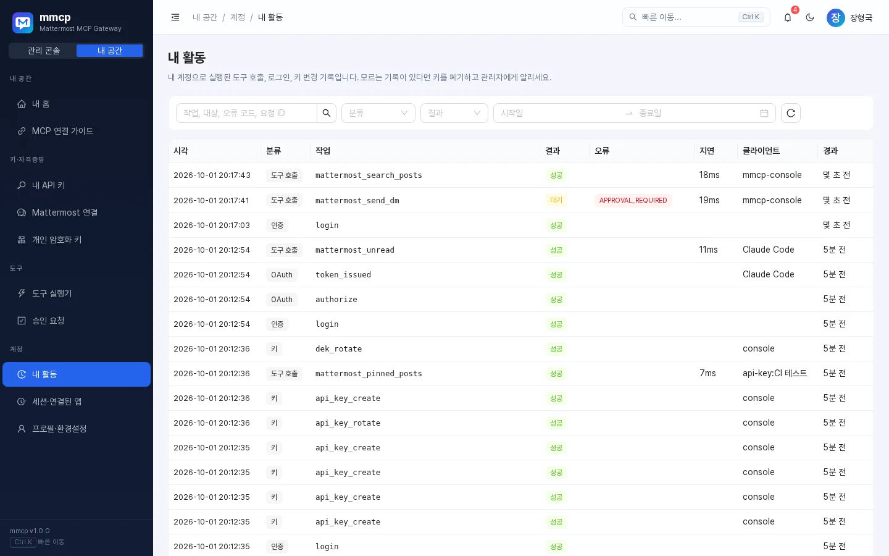

### 세션·연결된 앱

**내 공간 → 세션·연결된 앱**

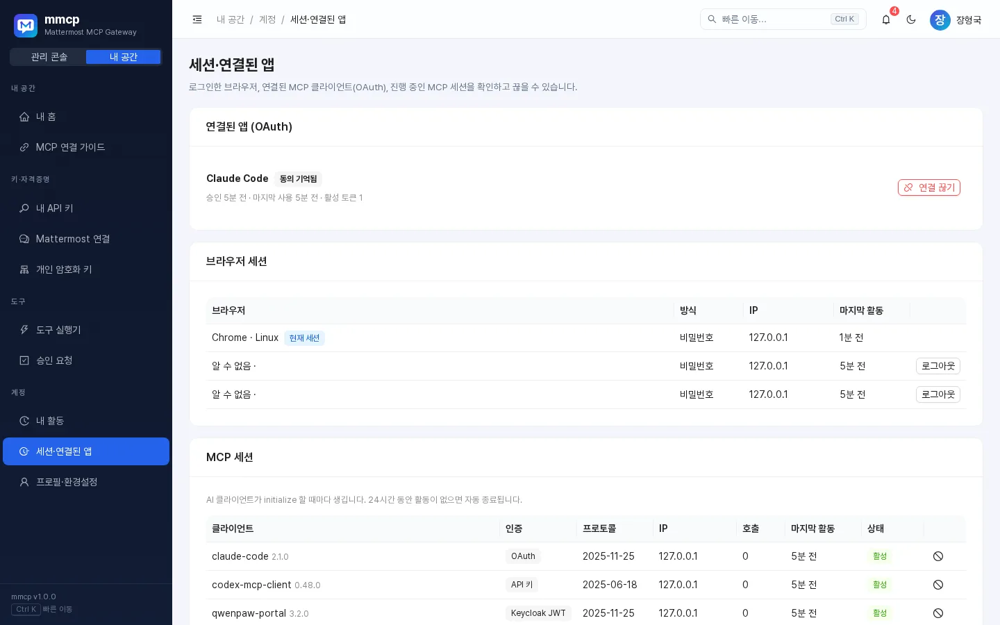

| 영역 | 내용 | 할 수 있는 일 |
|---|---|---|
| 연결된 앱 (OAuth) | 허용한 AI 클라이언트, 승인·마지막 사용 시각, 활성 토큰 수, "동의 기억됨" 표시 | **연결 끊기** — 그 앱의 토큰이 즉시 폐기됨 |
| 브라우저 세션 | 브라우저, 로그인 방식(Keycloak/비밀번호), IP, 마지막 활동 | 현재 세션이 아닌 것은 **로그아웃** |
| MCP 세션 | AI 클라이언트가 접속할 때마다 생기는 세션. 24시간 활동이 없으면 자동 종료 | 개별 종료 |

---

## 12. 개인 암호화 키

**내 공간 → 개인 암호화 키**. Mattermost 토큰 같은 내 자격증명은 **나만의 데이터 키**로 암호화됩니다.

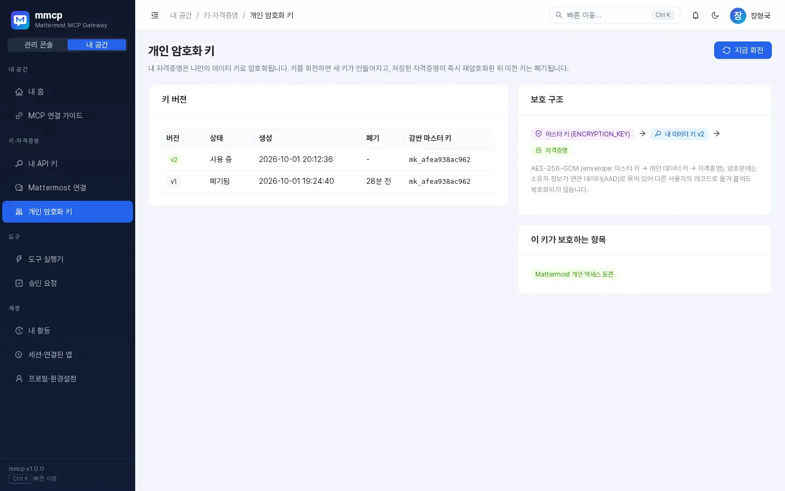


- 암호문에는 소유자 정보가 함께 묶여 있어, 다른 사용자의 레코드로 옮겨 붙여도 복호화되지 않습니다.
- **지금 회전**을 누르면 새 키가 만들어지고, 저장된 자격증명이 즉시 다시 암호화된 뒤 이전 키는 폐기됩니다. 진행 중인 작업에는 영향이 없으니 언제든 회전해도 됩니다.
- 현재 키가 권장 주기를 넘으면 경고가 표시됩니다.
- 아직 자격증명을 저장하지 않았다면 키가 없을 수 있으며, 처음 저장할 때 자동으로 만들어집니다.

---

## 13. 프로필·테마

**내 공간 → 프로필·환경설정**(`G` → `P`)

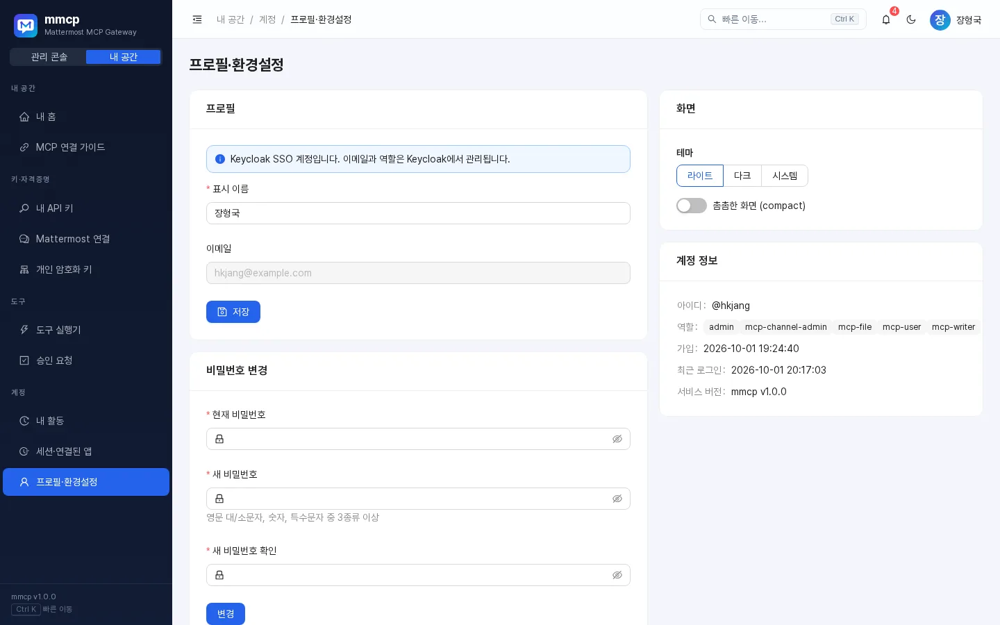

- **프로필**: 표시 이름과 이메일 수정. Keycloak SSO 계정은 이메일·역할을 Keycloak에서 관리하므로 이메일을 바꿀 수 없습니다.
- **비밀번호 변경**(로컬 비밀번호가 있는 계정만): 8자 이상, 영문 대/소문자·숫자·특수문자 중 3종류 이상. 변경하면 다른 브라우저 세션은 로그아웃됩니다.
- **화면**: 테마 *라이트 / 다크 / 시스템*, **촘촘한 화면(compact)** 토글. 테마는 `Shift + T`, 상단 테마 버튼, 프로필 메뉴에서도 바꿀 수 있습니다.
- **계정 정보**: 아이디, 역할, 가입일, 최근 로그인, 서비스 버전(mmcp v1.0.1).

모바일에서도 같은 화면을 쓸 수 있습니다(왼쪽 위 메뉴 버튼으로 메뉴 열기).

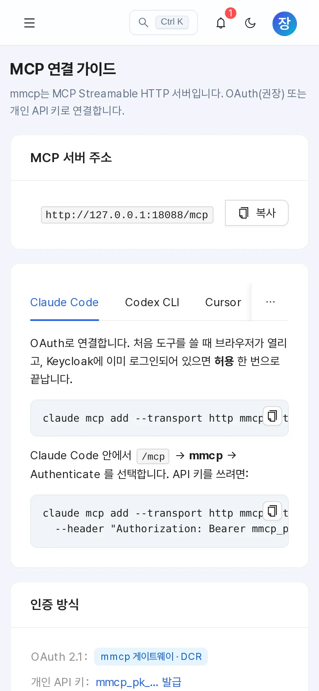

---

## 14. FAQ / 문제 해결

### 자주 보는 오류 코드

| 코드 | 의미 | 할 일 |
|---|---|---|
| `IDENTITY_NOT_MAPPED` | mmcp 계정이 Mattermost 계정과 연결되지 않음(또는 연결된 계정이 비활성화됨) | [Mattermost 연결](#4-mattermost-계정-연결)에서 자동 연결하거나 개인 액세스 토큰 등록. 안 되면 관리자에게 수동 매핑 요청 |
| `CREDENTIAL_REQUIRED` | Mattermost 개인 액세스 토큰이 필요함 | Mattermost 연결 화면에서 토큰 등록 |
| `CREDENTIAL_INVALID` | 저장된 토큰이 만료·무효 | 토큰 다시 등록 또는 회전 |
| `PERMISSION_DENIED` | 필요한 역할이 없음, 읽기 전용 키로 쓰기 시도, 또는 Mattermost 권한 부족(예: 남의 메시지 수정) | 필요한 역할(예: `mcp-writer`)은 관리자에게 요청. 쓰기에는 일반 키/`mcp` 권한 사용 |
| `TOOL_DISABLED` | 관리자가 끈 도구 | 관리자에게 문의 |
| `POLICY_BLOCKED` | 비공개 채널·DM·그룹 메시지 접근이 관리자 정책으로 차단됨 | 관리자에게 문의 |
| `RATE_LIMITED` | 분당 호출 한도 초과 | 안내된 시간(초) 후 다시 시도 |
| `APPROVAL_REQUIRED` | 쓰기 작업 전 확인 필요 — 오류가 아니라 정상 단계 | 미리보기를 확인하고 동의하면 AI가 다시 호출 |
| `APPROVAL_EXPIRED` / `APPROVAL_MISMATCH` / `APPROVAL_USED` / `APPROVAL_REJECTED` | 승인 토큰을 쓸 수 없음 | AI에게 처음부터 다시 요청 |
| `AMBIGUOUS_RECIPIENT` | 받는 사람 이름이 여러 명과 일치 | 후보 중 한 명을 골라 username으로 알려 주기 |
| `RECIPIENT_NOT_FOUND` | 받는 사람을 찾지 못함 | 철자 확인 또는 `mattermost_users`로 검색 |
| `CHANNEL_NOT_FOUND` / `AMBIGUOUS_CHANNEL` | 채널이 없거나 접근 불가 / 여러 팀에 같은 이름 | 채널 목록 확인, `팀/채널` 형식 사용 |
| `IDENTITY_CONFLICT` | 등록한 토큰 주인이 내 계정과 다르거나, 그 Mattermost 계정이 이미 다른 사용자와 연결됨 | 내 토큰인지 확인. 그래도 안 되면 관리자에게 재매핑 요청 |
| `MATTERMOST_UNAVAILABLE` / `MATTERMOST_ERROR` | Mattermost 연결 문제 | 잠시 후 재시도, 계속되면 관리자에게 문의 |
| `INTERNAL` | 서버 내부 오류 | 메시지의 **요청 ID**를 관리자에게 전달 |

### 질문과 답

**Q. AI 클라이언트에 도구가 하나도 안 보여요.**
연결이 끝났는지 확인하세요(Claude Code는 `/mcp`에서 Authenticate). 그다음 도구 실행기에서 흐리게 표시된 도구의 이유를 확인합니다.

**Q. 조회는 되는데 메시지 발송 도구가 안 보여요.**
읽기 전용 API 키를 쓰고 있거나, OAuth 동의 시 `mcp:read`만 받았거나, `mcp-writer` 역할이 없는 경우입니다.

**Q. AI가 동의도 없이 메시지를 보낼 수 있나요?**
승인 모드인 도구는 `confirm_token` 없이 실행되지 않습니다. 단, 이모지 반응(`mattermost_add_reaction`)처럼 관리자가 자동 실행으로 둔 도구는 확인 없이 실행됩니다. 의심스러운 요청은 승인 요청 화면에서 거절하세요.

**Q. API 키를 잃어버렸어요 / 유출된 것 같아요.**
비밀값은 다시 볼 수 없습니다. **회전 → 즉시 폐기**로 새 키를 받거나 키를 폐기하세요. 그다음 [내 활동](#11-내-활동세션연결된-앱)에서 모르는 기록이 없는지 확인합니다.

**Q. 노트북을 바꿨어요.**
API 키는 **회전 → 24시간 유예**로 새 키를 받아 교체하고, 예전 기기의 OAuth 연결은 세션·연결된 앱에서 끊으세요.

**Q. 로그아웃했는데 다시 자동 로그인되지 않아요.**
의도된 동작입니다. 직접 로그아웃한 직후에는 사일런트 SSO가 실행되지 않으니 **Keycloak SSO로 로그인** 버튼을 누르세요.

**Q. 봇이 "○○님의 요청"으로 메시지를 보내요.**
관리자가 발신 계정을 봇(또는 자동)으로 설정했기 때문입니다. 자동 모드라면 내 Mattermost 토큰을 등록하면 내 명의로 보냅니다.

**Q. 지금 쓰는 mmcp 버전은?**
로그인 화면 하단, 프로필 메뉴, 프로필·환경설정의 계정 정보에서 확인할 수 있습니다. 이 가이드는 **mmcp v1.0.1** 기준입니다.
